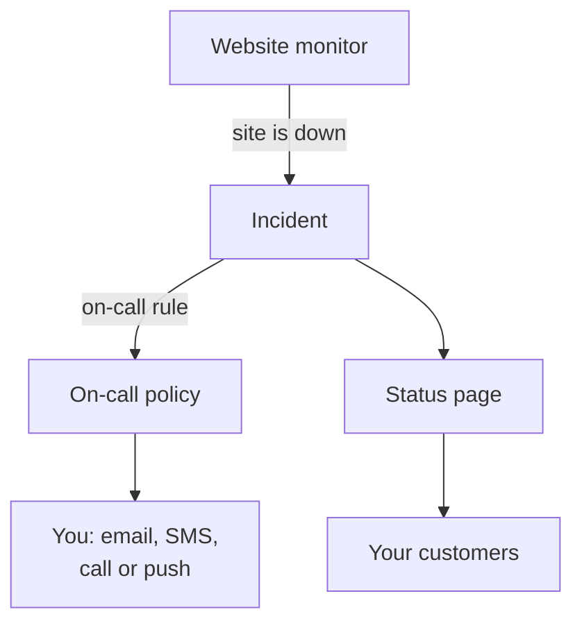

# Quickstart

This guide takes you from a new account to a working setup in about fifteen minutes: a monitor that checks your website every five minutes, an on-call policy that pages you when the site goes down, and a status page that tells your customers. It follows the **Welcome to OneUptime 👋** checklist on your project's Home page.

## Before you begin

- **An account.** On OneUptime Cloud, sign up at [oneuptime.com](https://oneuptime.com/accounts/register) and open the link in the email it sends you. On your own installation, open it in your browser and sign up: the first account becomes the master admin. To install one, see [Docker Compose](/docs/installation/docker-compose).
- **A website to watch.** Any address that answers over HTTP or HTTPS, such as your company's home page.

## Create a project

Everything in OneUptime lives in a project: your monitors, incidents, on-call policies, status pages and the people who work on them.

:::steps
### Start a new project

The first time you sign in, OneUptime shows **No projects**. Click **Create New Project**. If someone already invited you to a project, accept the invitation on the same page instead.

### Name it

Enter a **Project Name**, such as your company's name. On OneUptime Cloud, the next step asks you to pick a plan.

### Create it

Click **Create Project**. Your project's Home page opens, with the **Welcome to OneUptime 👋** checklist at the top.
:::

## Monitor your website

:::steps
### Open Create Monitor

In the checklist, click **Create your first monitor**. You can also open **Monitors** from the **Products** menu and click **Create Monitor**.

### Pick Website

Under **Monitor Type**, pick **Website**. Enter a **Name**, such as `Website`, and click **Next**.

### Enter the address

Enter the full address of your site in **Website URL**, such as `https://example.com`. OneUptime adds the criteria for you: the monitor goes **Offline** and declares an incident when the site does not answer, or answers with an error. Click **Next**.

### Create the monitor

Keep the selected **Probes** and the **Monitoring Interval** of **Every 5 Minutes**, and click **Create Monitor**. The monitor's page opens, and the probes start checking your site.
:::

To try the check before you save, click **Test Monitor** on the second step. Every other monitor type is described in [Creating a Monitor](/docs/monitor/create-monitor).

## Get paged when it goes down

As it is, an incident with no owners is emailed to the project's owners, and that includes you. To be paged until someone responds, create an on-call policy and have every incident page it.

:::steps
### Create an on-call policy

In the checklist, click **Set up an on-call policy**, or open **On-Call Duty** from the **Products** menu. Click **Create On-Call Policy** and enter a **Name**. Under **Who gets paged first?**, click **Add responder** and pick yourself. Click **Create On-Call Policy**.

### Page it for every incident

Open **Incidents** from the **Products** menu, expand **Rules** in the side menu and choose **On-Call Rules**. Click **Create Incident On-Call Rule** and enter a **Name**. Leave every criteria empty, so the rule matches every incident, and pick your policy under **On-Call Duty Policies**. Click **Create Incident On-Call Rule**.

### Choose how you are reached

Your sign-in email is already a way to reach you. To be texted or called too, open **User Settings** in the bar under the top bar, go to **Notification Methods** and, on the **Direct Contact** tab, add your number under **Phone Numbers for SMS Notifications** or **Phone Numbers for Call Notifications**. Click **Verify** and enter the code OneUptime sends you. A verified number is used for on-call pages straight away.
:::

> [!NOTE]
> SMS and phone calls are off in a new project. A project owner, a Billing Admin or someone with Manage Billing turns them on in the **Notification Channels** card, under **Project Settings → Notifications → Notification Settings**.

For more levels, rotations and how long each level waits, see [Escalation Rules](/docs/on-call/escalation-rules) and [On-Call Schedules](/docs/on-call/schedules).

## Publish a status page

:::steps
### Create the status page

In the checklist, click **Publish a status page**, or open **Status Pages** from the **Products** menu. Click **Create Status Page**, enter a **Name**, such as `Acme Status`, and click **Create Status Page**.

### Add your monitor

Open the new status page. In its side menu, under **Resources**, choose **Monitors**; it reads **Resources** in projects with monitor groups turned on. Click **Add Monitor**, pick your website monitor and click **Add Monitor**. The row shows the monitor's name to visitors; change it under **Display Name** if you like.

### Open the page

Choose **Overview** in the side menu. The **Status Page Preview URL** card links to your status page: open it, and your website is listed as operational.
:::

A new status page is public: anyone with its address can open it. To give it your own domain, logo and colors, see [Status Page Branding & Domains](/docs/status-pages/branding-and-domains).

## Invite your team

In the checklist, click **Invite your team**, or open **Users** from the **Products** menu, under **Settings**. Click **Invite User**, enter their **Email**, and pick a **Team**: the members team is picked to start with. Click **Invite**. OneUptime emails them the invitation, and the team decides what they can do. See [Users, Teams & Permissions](/docs/permissions/index).

## Try it out

Declare a test incident to see the whole chain work.

:::steps
### Declare a test incident

Open **Incidents** and click **Declare Incident**. Enter a **Title**, such as `Test incident`, pick an **Incident Severity** and click **Next**. Under **Monitors**, pick your website monitor, so the incident shows on your status page. Click **Next** until you reach the summary, then click **Declare Incident**.

### Watch it happen

Within a minute or two, your on-call policy pages you, and the incident shows on your status page.

### Resolve it

On the incident's page, click **Resolve**. The paging stops, and the incident leaves your status page.
:::

> [!WARNING]
> Anyone who opens your status page sees the test incident until you resolve it. Run the test before you share the page's address.

## Troubleshooting

:::details I was not paged
Open the incident and choose **On-Call Executions** in its side menu: it shows whether your policy ran, and whom it paged. If it did not run, check that your on-call rule is enabled and names the policy. If it ran, check that your methods under **User Settings → Notification Methods** are verified.
:::

:::details The incident is not on my status page
A status page shows an incident when one of the incident's monitors is on the page. Check that the incident lists your monitor under its affected resources, and that the monitor is on the status page.
:::

:::details The monitor says it is offline, but my site works
Open the monitor and check what the probes received. See the troubleshooting section of [Website Monitor](/docs/monitor/website-monitor).
:::

## Next steps

:::cards
- [Core Concepts](/docs/introduction/core-concepts): The ideas behind what you just set up.
- [On-Call Schedules](/docs/on-call/schedules): Share being on call with your team.
- [Status Page Branding & Domains](/docs/status-pages/branding-and-domains): Make the status page your own.
- [OpenTelemetry](/docs/telemetry/open-telemetry): Send logs, metrics and traces from your apps.
:::
