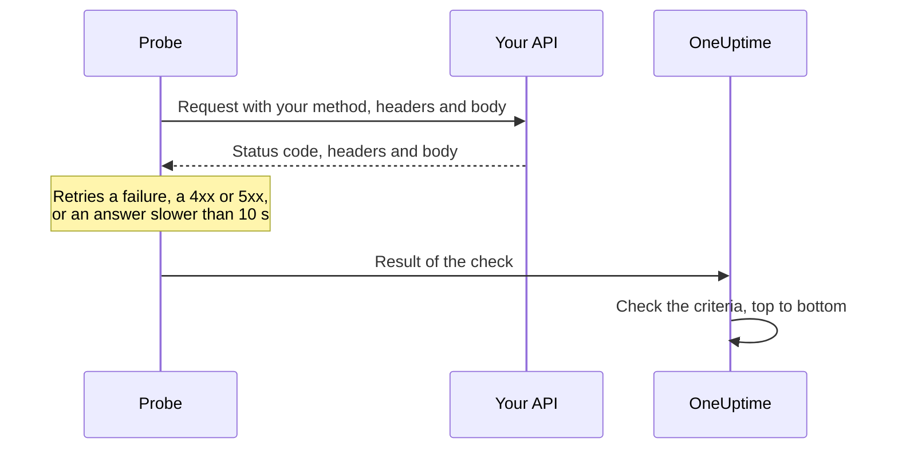

# API Monitor

An API monitor calls an HTTP endpoint on a schedule, with the method, headers and body you choose, and checks what comes back: the status code, the response time, the headers and the body. Use it for REST, JSON and GraphQL endpoints, health checks, and any call your users depend on.

:::cards
- [Create the monitor](#create-an-api-monitor): Six steps in the dashboard.
- [Configuration options](#configuration-options): Method, headers, body, redirects, certificates, timeouts and retries.
- [Monitoring criteria](#monitoring-criteria): What counts as up or down, out of the box.
- [Troubleshooting](#troubleshooting): When a check fails that should pass.
:::

## How it works

On each check, a probe sends the request, follows any redirects, and records the status code, the response time, the headers and the body. A request that fails, times out, answers with a `4xx` or `5xx` status, or takes longer than 10 seconds is tried again, up to the number of retries you allow. OneUptime then runs the result through the monitor's criteria.



A probe that has lost its own network connection reports no result, so it cannot mark your API offline.

## Before you begin

- **A role that can create monitors**: Project Owner, Project Admin, Project Member, Monitor Admin or Monitor Member, or a custom role with the Create Monitor permission.
- **A probe that can reach the API.** Your project's default probes are picked for every new monitor. If a firewall sits in front of the API, allow [OneUptime Cloud's probe IP addresses](/docs/configuration/ip-addresses). An API on a private network needs a [custom probe](/docs/probe/custom-probe) inside that network, allowed to reach private addresses: see [Private Network Access](/docs/self-hosted/private-network-access).
- **Credentials as monitor secrets.** If the API needs a key or a token, store it as a [monitor secret](/docs/monitor/monitor-secrets) first, so the monitor only holds a reference to it.

## Create an API monitor

:::steps
### Start a new monitor

Go to **Monitors** and click **Create Monitor**. Under **Monitor Type**, pick **API**.

### Name it

Enter a **Name**, such as `Orders API`, then click **Next**.

### Enter the request

In **API URL**, enter the endpoint's full URL, such as `https://api.example.com/health`. Pick the **API Request Type** (**GET** unless you change it). To add headers or a body, open **More fields** and fill in **Request Headers** and **Request Body (in JSON)**.

### Test it

Click **Test Monitor**, pick a probe under **Select Probe** and click **Run Test**. **Monitor Test Result** shows what the API answered.

### Review the criteria

**Monitor Criteria** starts with the [default criteria](#default-criteria): offline when the API does not answer or answers with an error, online on any `2xx` or `3xx` status. To check what the API returns as well, add a filter, then click **Next**.

### Pick probes and create

Keep or change the **Probes** and the **Monitoring Interval** (it starts at **Every 5 Minutes**), then click **Create Monitor**. The monitor's page opens.
:::

## Configuration options

### API URL

The endpoint to call, as a full URL with its scheme, such as `https://api.example.com/v1/health`. You can put a [monitor secret](/docs/monitor/monitor-secrets) in the URL as `{{monitorSecrets.NAME}}`.

### Dynamic URL placeholders

When a CDN or a caching proxy sits in front of the API, a probe can be answered from the cache instead of your server. To get past the cache, add a placeholder to the URL; the probe replaces it with a new value on every check.

| Placeholder | Replaced with | Example value |
| --- | --- | --- |
| `{{timestamp}}` | The current Unix time, in seconds | `1719500000` |
| `{{random}}` | A random, unique string of 32 hexadecimal characters | `3f2b8c1d9e7a4b6c8d0e1f2a3b4c5d6e` |

A URL with a placeholder:

```text
https://api.example.com/health?cb={{timestamp}}
```

What the probe requests on two checks five minutes apart:

```text
https://api.example.com/health?cb=1719500000
https://api.example.com/health?cb=1719500300
```

Use `{{random}}` the same way: `https://api.example.com/health?nocache={{random}}`.

### API Request Type

The HTTP method to send. **GET** is the default; the others are **POST**, **PUT**, **PATCH**, **DELETE** and **HEAD**. If a **HEAD** request is answered with a `4xx` or `5xx` status, the probe repeats it as a `GET`.

### More fields

These settings are folded under **More fields**. The folded header lists them and shows which ones you changed.

| Field | Default | What it does |
| --- | --- | --- |
| **Request Headers** | None | Headers to send, as name and value pairs. Click **Add Request Header** for each one. |
| **Request Body (in JSON)** | None | A JSON object to send as the body, usually with **POST**, **PUT** or **PATCH**. It must be valid JSON. |
| **Do not follow redirects** | Off | Judge the first response instead of following redirects. See [below](#do-not-follow-redirects). |
| **Allow self-signed certificates** | Off | Skip TLS certificate validation for the monitor's own host name. |
| **Use client certificate (mTLS)** | Off | Present a client certificate and private key. See [Client certificate (mTLS)](#client-certificate-mtls). |
| **Request Timeout (seconds)** | `60` | How long to wait for each attempt. The maximum is 60 seconds. |
| **Retries on Failure** | Probe default, usually `3` | How many times to retry a failed attempt. The maximum is 3. See [Retries and timeouts](#retries-and-timeouts). |

Request headers and the request body can use [monitor secrets](/docs/monitor/monitor-secrets), for example a header `Authorization` with the value `Bearer {{monitorSecrets.ApiKey}}`.

#### Do Not Follow Redirects

By default, the probe follows redirects (`301`, `302`, `303`, `307` and `308`), up to 10 of them, and judges the response it ends on. Turn on **Do not follow redirects** to judge the redirect response itself instead. The [default criteria](#default-criteria) count a redirect response as online.

When it follows a redirect:

- A `303`, or a `301` or `302` answering a `POST`, turns the request into a `GET` without a body, as browsers do.
- Your request headers go only to the URL's own origin (the same scheme, host and port). A redirect to another origin is sent without them.
- A redirect to another origin fails the check if the request still has a body, or a method other than `GET` or `HEAD`.
- **Allow self-signed certificates** follows redirects that stay on the monitor's own host name. A redirect to another host name is verified as usual.

#### Client certificate (mTLS)

If the API requires mutual TLS, turn on **Use client certificate (mTLS)** and fill in:

| Field | What to enter |
| --- | --- |
| **Client Certificate (PEM)** | The PEM-encoded client certificate to present. |
| **Client Private Key (PEM)** | The matching PEM-encoded private key. |
| **Client Private Key Passphrase** | Optional. The passphrase, only if the private key is encrypted. |

This is the equivalent of curl's `--cert` and `--key` flags:

```bash
curl --cert client.crt --key client.key https://api.example.com/health
```

To keep the key out of the monitor's settings, store the certificate and key as [monitor secrets](/docs/monitor/monitor-secrets) and enter `{{monitorSecrets.NAME}}` in these fields. Secrets are filled in on the server, and their values never appear in the dashboard.

The client certificate is only presented while the request stays on the URL's origin. After a redirect to another origin, the probe continues without it.

#### Retries and timeouts

**Retries on Failure** counts retries _after_ the first attempt, so `0` runs the check once and `2` runs it up to three times. Left blank, it uses the probe's default: 3, unless the probe's `PROBE_MONITOR_RETRY_LIMIT` says otherwise. The probe waits one second between attempts, and every attempt gets the full **Request Timeout (seconds)**.

These failures are retried: connection errors, timeouts, `4xx` and `5xx` responses, and responses slower than 10 seconds. These are not, because trying again cannot change them: an invalid or blocked URL, more than 10 redirects, and a response larger than 512 KiB.

## Monitoring Criteria

Criteria decide when the API counts as online, degraded or offline, and whether that declares an incident or creates an alert. Each criteria checks one or more filters:

| Filter | Conditions | What it checks |
| --- | --- | --- |
| **Is Online** | **True**, **False** | Whether the API answered at all, whatever the status code. |
| **Response Status Code** | **Equal To**, **Not Equal To**, **Greater Than**, **Less Than**, **Greater Than Or Equal To**, **Less Than Or Equal To** | The HTTP status code. |
| **Response Time (in ms)** | **Greater Than**, **Less Than**, **Greater Than Or Equal To**, **Less Than Or Equal To** | How long the request took, redirects included. |
| **Response Body** | **Contains**, **Not Contains** | Text in the response body. The match is case-sensitive. |
| **Response Header** | **Contains**, **Not Contains** | Whether the response has a header with this name. Enter the name in lowercase, such as `x-request-id`. |
| **Response Header Value** | **Contains**, **Not Contains** | Whether a header has exactly this value, compared in lowercase, such as `application/json`. |
| **JavaScript Expression** | **Evaluates To True** | An expression over the response. See [JavaScript Expressions](/docs/monitor/javascript-expression). |
| **Is Request Timeout** | **True**, **False** | Whether the request timed out on every attempt. |

A JSON response is checked in its compact form, with no spaces between keys and values. To find `"status": "ok"` with **Response Body**, enter `"status":"ok"`.

**Add Criteria** adds a criteria that is already named after its filter, for example _Response Time (in ms) is above 3000_. The name changes with the filters until you type a name of your own. A description is optional: to add one, open the criteria's **Settings**.

With two or more filters, **Match Condition** decides whether **All** of them or **Any** one must match. A criteria's **Actions** decide what it does: change the monitor status, create an alert, declare an incident, or any of these.

### Default Criteria

A new API monitor starts with two criteria, so it works without changing anything:

- **Offline** — the API does not answer, or answers with a status code of `400` or above (or below `200`). The monitor is marked **Offline** and an incident is created. The incident resolves itself when the API is back.
- **Online** — the API answers with any `2xx` or `3xx` status code, such as `200`, `201`, `202` or `204`. The monitor is marked **Operational**.

In the criteria list they are named after the monitor: _Check if (name) is offline_ and _Check if (name) is online_.

So an endpoint that answers `201 Created` or `204 No Content` counts as up. If only one status code means healthy for you, change both criteria on the monitor's **Configuration → Criteria** page: for example **Response Status Code** / **Equal To** / `200` in the online criteria and **Not Equal To** / `200` in the offline one, in place of the two status code filters each has. To check what the API returns as well, add a **Response Body** or **JavaScript Expression** filter to the offline criteria.

Criteria are checked from top to bottom, and the first one that matches decides what happens.

When none of them matches, the monitor falls back to its default status: **Operational**, unless you pick another under **More fields**, below the criteria. The folded **More fields** header shows which status that is.

Monitors created before OneUptime changed these defaults keep the criteria they were created with, which count only `200` as online. Monitors created through the API or Terraform use the criteria you send.

### Evaluating over a period of time

**Evaluate this criteria over a period of time** is a checkbox under a filter, offered for **Is Online**, **Response Status Code** and **Response Time (in ms)**. Turn it on to judge a window of past checks instead of the latest one: pick an aggregate under **Evaluate** and a window, from 2 to 60 minutes, under **For the last (in minutes)**.

| Aggregate | Matches when |
| --- | --- |
| **Average**, **Sum**, **Maximum Value**, **Minimum Value** | That figure, over the window, meets the condition. Numeric filters only. |
| **All Values** | Every check in the window meets the condition. |
| **Any Value** | At least one check in the window meets the condition. |

**All Values** only matches once the window is genuinely covered by data. A monitor that has just been created, or one whose checks stopped being recorded, does not have enough history to say anything about the last N minutes, so the criteria waits rather than matching on the one reading it does have. **Any Value** is the setting for "tell me the moment a single check breaches" and still fires immediately.

**If No Data** decides what happens while the window cannot back the criteria:

| Option | What happens | Use it for |
| --- | --- | --- |
| **Ignore** (default) | The criteria does not match. | Ordinary threshold alerting. |
| **Trigger** | The missing data counts as the problem. | Checks where silence is itself a failure. |
| **Treat As Zero** | The window is compared as a single zero. | Counters where no events genuinely means zero. |

### Example criteria

| Goal | Filter | Condition | Value |
| --- | --- | --- | --- |
| Mark the API degraded when it is slow | **Response Time (in ms)** | **Greater Than** | `1000` |
| Offline when the health check reports a problem | **Response Body** | **Not Contains** | `"status":"ok"` |
| The same, read from the parsed JSON | **JavaScript Expression** | **Evaluates To True** | `"{{responseBody.status}}" !== "ok"` |
| Accept only `201` from a `POST` | **Response Status Code** | **Equal To** | `201` |

## Troubleshooting

:::details The API answers my requests, but the monitor is offline
The probe got a different answer than you. The incident's root cause, and **Monitoring Logs** on the monitor, show what the probe saw. Check that the probe sends what the API expects: the method, the `Authorization` header, the body. A firewall or a rate limiter in front of the API may also block the probes: allow [OneUptime Cloud's probe IP addresses](/docs/configuration/ip-addresses).
:::

:::details The monitor sends `{{monitorSecrets.NAME}}` literally
The monitor cannot use the secret, or the name does not match. See [Monitor Secrets](/docs/monitor/monitor-secrets) for who can use a secret.
:::

:::details The check fails with "unsafe cross-origin redirect"
The API redirected a request with a body, or with a method other than `GET` or `HEAD`, to another origin, and the probe does not forward those. Point the monitor at the URL the API redirects to, or turn on **Do not follow redirects** and check the redirect itself.
:::

:::details The check fails with "Remote response exceeded the allowed size."
The probe reads at most 512 KiB of a response, and this one is larger. Call an endpoint that returns less, for example with a smaller page size.
:::

## Next steps

:::cards
- [JavaScript Expressions](/docs/monitor/javascript-expression): Check fields deep inside a JSON response.
- [Monitor Secrets](/docs/monitor/monitor-secrets): Keep API keys and tokens out of monitor settings.
- [Website Monitor](/docs/monitor/website-monitor): Check a web page instead of an endpoint.
- [Incident & Alert Templating](/docs/monitor/incident-alert-templating): Put response details into incident and alert titles.
:::
