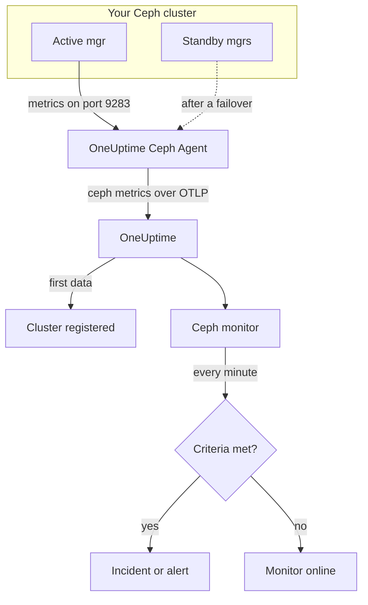

# Ceph Monitor

A Ceph monitor watches one Ceph cluster — its health, health checks, monitor quorum, OSDs, pools and placement groups — and tells you the moment health degrades, an OSD goes down, or capacity runs short. It reads the `ceph_*` metrics the Ceph mgr `prometheus` module exports, collected by the OneUptime Ceph Agent, so nothing is probed from outside.

:::cards
- [Create the monitor](#create-a-ceph-monitor): Six steps in the dashboard.
- [Templates](#pre-built-alert-templates): 23 ready-made alerts for health, OSDs, placement groups and capacity.
- [Health checks](#health-check-series): Alert on any Ceph health check by name.
- [Metrics](#collected-metrics): Every `ceph_*` series the monitor can alert on.
:::

## How it works

The Ceph mgr `prometheus` module serves the cluster's metrics on port 9283. The OneUptime Ceph Agent scrapes every mgr daemon every 30 seconds — the active one answers, the standbys return nothing until they take over — keeps Ceph's own labels (`ceph_daemon`, `pool_id`) and sends the metrics to OneUptime over OTLP, stamped with the cluster's name, `ceph.cluster.name`. The first data registers the cluster.

A Ceph monitor is tied to one cluster. Every minute it runs its query over that cluster's metrics and compares the result with its criteria.



## Before you begin

- **Enable the mgr `prometheus` module** on the cluster:

  ```bash
  ceph mgr module enable prometheus
  ```

- **Install the Ceph Agent** on a machine that can reach every mgr daemon on port 9283, and list all of them in `CEPH_MGR_ENDPOINTS`. The [Ceph Agent guide](/docs/telemetry/ceph) covers the install.
- **Check the cluster is registered.** It appears under **Products → Infrastructure → Ceph → All Clusters**, named after the agent's `CEPH_CLUSTER_NAME`, about a minute after the first scrape.
- **For health-check alerts**, run Ceph Quincy or later. Older releases do not export `ceph_health_detail`.

## Create a Ceph monitor

:::steps
### Start a new monitor

Go to **Monitors** and click **Create Monitor**.

### Pick Ceph

Under **Monitor Type**, click **More monitor types** and pick **Ceph** under **Infrastructure**, or type `ceph` in the search box. Enter a **Name** — it is used in incident and alert titles — and click **Next**.

### Choose the cluster

Under **Ceph Monitor Configuration**, pick the cluster from **Ceph Cluster**. Every cluster that has sent data is in the list.

### Choose what to watch

Pick one of the three tabs:

- **Quick Setup** — click a [template](#pre-built-alert-templates). It sets the metrics, filters, aggregation, time range and thresholds, and replaces the criteria below with its own. You can still change the **Time Range**.
- **Custom Metric** — pick one metric from **Ceph Metric**, then set **Aggregation** and **Time Range**. **OSD** and **Pool ID** narrow it to one daemon or pool.
- **Advanced** — build queries and formulas yourself under **Select Metrics**, for example a used-capacity ratio from `ceph_cluster_total_used_bytes / ceph_cluster_total_bytes`. Use **Group by** `ceph_daemon` or `pool_id` to judge each daemon or pool on its own.

### Check the criteria

Open each criteria under **Monitor Criteria** and check its **Metric**, **Aggregation**, **Condition** and **Threshold**. A template fills these in. With **Custom Metric** or **Advanced**, the monitor starts with the [default criteria](#default-criteria), which only notice a metric dropping to zero, so set your own threshold.

### Create the monitor

Click **Create Monitor**. OneUptime opens the monitor's page and evaluates it every minute. Incidents and alerts it raises are also listed on the cluster's **Incidents** and **Alerts** pages.
:::

> [!TIP]
> To set up several templates at once, open the cluster from **Products → Infrastructure → Ceph** and go to **Recommendations**. Pick the templates you want, choose who is paged, and OneUptime creates one monitor per template.

## Monitor settings

| Field | Tab | What it does |
| --- | --- | --- |
| **Ceph Cluster** | All | Required. Scopes every query to `resource.ceph.cluster.name`. |
| **OSD** | Custom Metric, Advanced | Optional. Exact match on the `ceph_daemon` label, for example `osd.3`. |
| **Pool ID** | Custom Metric, Advanced | Optional. Exact match on the `pool_id` label, for example `2`. |
| **Ceph Metric** | Custom Metric | One metric from the [catalog](#collected-metrics). |
| **Aggregation** | Custom Metric | How samples are combined: **Average**, **Maximum**, **Minimum**, **Sum** or **Count**. Starts at the metric's usual aggregation. |
| **Time Range** | All | The rolling window the query reads, from **Past 1 Minute** to **Past 365 Days**. A new monitor starts at **Past 1 Minute**; templates set their own. |
| **Select Metrics** | Advanced | The query builder: **Metric**, **Aggregate by**, **Filter by attributes**, **Group by**, plus **Add Metric** and **Add Formula** to combine queries. |

Pool data series carry only the `pool_id` label: the pool's name exists solely on `ceph_pool_metadata`. Filter and group pool series by `pool_id`, and look the name up in `ceph_pool_metadata` when you need it.

### Health-check series

`ceph_health_detail` exports **one series per active health check**, labeled `name` (for example `OSD_NEARFULL` or `RECENT_CRASH`) and `severity`. A series exists only while its check fires, so no series means healthy. To alert on any Ceph health check, filter on its `name`, fire on **Maximum** above `0`, and recover at `0` with **If No Data** set to **Treat As Zero** — exactly how the health-check templates are built. `ceph_daemon_health_metrics` works the same way per daemon, keyed by a `type` label (for example `SLOW_OPS`) and `ceph_daemon`.

## Pre-built Alert Templates

**Quick Setup** offers 23 templates covering cluster health, OSDs, placement groups and capacity. Each builds a complete monitor — queries, label filters, a group-by, a criteria that fires and one that recovers. Thresholds are starting points you can edit.

Templates read the past 5 minutes unless the table says otherwise. A criteria fires only when the condition holds for every minute of its window, and a threshold criteria recovers 10% past its threshold so a value hovering at the line does not flap. **Severity** is the label the picker shows; the incident and alert a template creates start on your project's most severe incident and alert severity.

### Cluster health

| Template | Severity | Watches | Fires when | Recovers when |
| --- | --- | --- | --- | --- |
| Cluster Health Error | Critical | `ceph_health_status`, Max, past 1 minute | 2 or more: `HEALTH_ERR` | Below 1.8: `HEALTH_WARN` or better |
| Cluster Health Warning | Warning | `ceph_health_status`, Max | 1 or more: `HEALTH_WARN` or worse | Below 0.9: `HEALTH_OK` |
| Monitor Quorum Degraded | Critical | `ceph_mon_quorum_status`, Min per `ceph_daemon`, past 1 minute | A monitor drops below 1, out of quorum. One incident per monitor | Back at 1 |
| Slow Operations | Warning | `ceph_healthcheck_slow_ops`, Max | Above 0: the cluster's `SLOW_OPS` check is active | At 0 |
| Daemon Slow Operations | Warning | `ceph_daemon_health_metrics` for `type = SLOW_OPS`, Max per `ceph_daemon` | Above 0. One incident per OSD or monitor | The series clears |
| Daemon Crash | Critical | `ceph_health_detail` for `name = RECENT_CRASH`, Max | The check is active: unarchived daemon crashes exist. The mgr has no `ceph_crash_*` metric, so this is the only crash signal | The crashes are archived |
| Monitor Clock Skew | Warning | `ceph_health_detail` for `name = MON_CLOCK_SKEW`, Max | The check is active: monitor clocks drift past the allowed skew (default 0.05 s) | The check clears |
| Monitor Disk Critically Low | Critical | `ceph_health_detail` for `name = MON_DISK_CRIT`, Max | The check is active: a monitor's database disk is below 5% free (the default) | The check clears |
| Monitor Disk Space Low | Warning | `ceph_health_detail` for `name = MON_DISK_LOW`, Max | The check is active: below 30% free (the default) | The check clears |

### OSD

| Template | Severity | Watches | Fires when | Recovers when |
| --- | --- | --- | --- | --- |
| OSD Down | Critical | `ceph_osd_up`, Min per `ceph_daemon` | An OSD drops below 1. One incident per OSD | Back at 1 |
| OSD Out | Warning | `ceph_osd_in`, Min per `ceph_daemon` | An OSD drops below 1: marked out of the data distribution | Back at 1 |
| OSD High Latency | Warning | `ceph_osd_apply_latency_ms`, Avg per `ceph_daemon` | Above 100 ms. One incident per OSD | At or below 90 ms |
| OSD Slow Heartbeats | Warning | `ceph_health_detail` for `name = OSD_SLOW_PING_TIME_FRONT` and `name = OSD_SLOW_PING_TIME_BACK`, Max | Either check is active: heartbeats on the public or cluster network are slow. The mgr exports no ping-time gauge | Both checks clear |

### Placement groups

| Template | Severity | Watches | Fires when | Recovers when |
| --- | --- | --- | --- | --- |
| Inactive Placement Groups | Critical | `ceph_pg_total` − `ceph_pg_active`, Max per `pool_id` | Above 0: PGs cannot serve I/O, so client requests to them hang. One incident per pool | At 0 |
| Degraded Placement Groups | Warning | `ceph_pg_degraded`, Max per `pool_id` | Above 0: objects have fewer replicas than configured | At 0 |
| Undersized Placement Groups | Warning | `ceph_pg_undersized`, Max per `pool_id` | Above 0: PGs map to fewer OSDs than their replica count | At 0 |
| Damaged Placement Groups | Critical | `ceph_health_detail` for `name = PG_DAMAGED` and `name = OSD_SCRUB_ERRORS`, Max | Either check is active: scrubbing found damage or read errors | Both checks clear |

### Capacity

| Template | Severity | Watches | Fires when | Recovers when |
| --- | --- | --- | --- | --- |
| Cluster Near Full | Warning | `ceph_cluster_total_used_bytes` ÷ `ceph_cluster_total_bytes` × 100 | Above 85%, Ceph's default nearfull ratio | At or below 76.5% |
| Cluster Full | Critical | The same ratio | Above 95%, Ceph's default full ratio, where writes stop cluster-wide | At or below 85.5% |
| Pool Near Full | Warning | `ceph_pool_stored` ÷ (`ceph_pool_stored` + `ceph_pool_max_avail`) × 100, per `pool_id` | Above 85% of what the pool can hold. One incident per pool | At or below 76.5% |
| OSD Nearfull | Warning | `ceph_health_detail` for `name = OSD_NEARFULL`, Max | The check is active: an OSD passed the nearfull threshold (default 85%). Single OSDs fill long before the cluster average does | The check clears |
| OSD Backfillfull | Warning | `ceph_health_detail` for `name = OSD_BACKFILLFULL`, Max | The check is active: backfill onto the OSD is refused (default 90%), stalling recovery | The check clears |
| OSD Full | Critical | `ceph_health_detail` for `name = OSD_FULL`, Max, past 1 minute | The check is active: an OSD reached the full threshold (default 95%) and writes are refused | The check clears |

- **Down and quorum templates use Minimum**, so one down OSD or one monitor out of quorum trips them instead of being hidden by the healthy majority.
- **Count and health-check templates use Maximum**, so one bad scrape is enough.
- **PG and pool series are per pool**: there is no cluster-wide gauge, so those templates group by `pool_id` and open one incident per pool.
- **Capacity ratios** take the **Sum** of both sides. Both come from the same mgr scrape, so the result is a true percentage. **Inactive Placement Groups** uses **Maximum** per pool instead, because a sum would add up scrapes in a subtraction.
- **Health-check templates** recover when the check clears: their recovery criteria count a missing series as 0.

Some alerts have no template. PG imbalance needs cross-series statistics criteria cannot compute. Capacity forecasting needs a growth fit, which the cluster's dashboard draws instead. Disk failure prediction and scrub staleness have no mgr metric, and NVMe-oF, RBD mirroring and cephadm need other exporters.

## Collected Metrics

The agent scrapes every mgr daemon every 30 seconds and keeps Ceph's own labels, so per-daemon series carry `ceph_daemon` (`osd.3`, `mon.a`) and per-pool series carry `pool_id`.

### Cluster health

| Metric | Unit | Description |
| --- | --- | --- |
| `ceph_health_status` | — | Overall health: 0 = `HEALTH_OK`, 1 = `HEALTH_WARN`, 2 = `HEALTH_ERR`. |
| `ceph_health_detail` | count | One series per **active** health check, labeled `name` and `severity`. Quincy and later only. |
| `ceph_healthcheck_slow_ops` | count | Slow OSD and monitor operations reported by the `SLOW_OPS` check. |
| `ceph_daemon_health_metrics` | count | Per-daemon health metrics, keyed by `type` (for example `SLOW_OPS`) and `ceph_daemon`. |
| `ceph_mon_quorum_status` | count | 1 when the monitor is in quorum, per `ceph_daemon` (for example `mon.a`). |
| `ceph_mon_metadata` | count | Monitor metadata, always 1. Sum it to count monitors. |
| `ceph_cluster_total_bytes` | bytes | Total raw capacity. |
| `ceph_cluster_total_used_bytes` | bytes | Raw capacity in use. |

### OSD

| Metric | Unit | Description |
| --- | --- | --- |
| `ceph_osd_up` | count | 1 when the OSD is up, per `ceph_daemon` (for example `osd.3`). |
| `ceph_osd_in` | count | 1 when the OSD is in the data distribution. |
| `ceph_osd_apply_latency_ms` | ms | Time to apply an operation to the backing store. |
| `ceph_osd_commit_latency_ms` | ms | Time to commit an operation to the journal or WAL. |
| `ceph_osd_stat_bytes` | bytes | Raw capacity of the OSD's device. |
| `ceph_osd_stat_bytes_used` | bytes | Raw bytes used on the OSD. Compare with the total to spot uneven or nearly full OSDs. |
| `ceph_osd_numpg` | count | Placement groups on the OSD. |
| `ceph_osd_metadata` | count | OSD metadata (hostname, device class, version), always 1. Sum it to count OSDs. |

### Pool

| Metric | Unit | Description |
| --- | --- | --- |
| `ceph_pool_stored` | bytes | User data stored in the pool. |
| `ceph_pool_max_avail` | bytes | Bytes still writable to the pool, given its replication or erasure-coding profile. |
| `ceph_pool_objects` | count | Objects in the pool. |
| `ceph_pool_rd` | ops | Read operations on the pool. A lifetime counter. |
| `ceph_pool_wr` | ops | Write operations on the pool. A lifetime counter. |
| `ceph_pool_rd_bytes` | bytes | Bytes read from the pool. A lifetime counter. |
| `ceph_pool_wr_bytes` | bytes | Bytes written to the pool. A lifetime counter. |
| `ceph_pool_metadata` | count | Pool metadata, always 1 — the only series that maps `pool_id` to a name. |

### Placement groups

Every `ceph_pg_*` series is per pool, labeled `pool_id`; sum across pools for a cluster-wide count.

| Metric | Unit | Description |
| --- | --- | --- |
| `ceph_pg_total` | count | Placement groups in the pool. |
| `ceph_pg_active` | count | PGs that are `active`, able to serve I/O. |
| `ceph_pg_clean` | count | PGs that are `clean`, fully replicated. |
| `ceph_pg_degraded` | count | PGs that are `degraded`. |
| `ceph_pg_undersized` | count | PGs that are `undersized`. |
| `ceph_num_objects_degraded` | count | Objects with fewer replicas than configured. |
| `ceph_num_objects_misplaced` | count | Objects not where CRUSH wants them. The data is safe; only the placement is wrong. |

## Monitoring criteria

A criteria compares one of the monitor's queries or formulas with a threshold. A Ceph monitor's criteria have no **Filter Type**: every rule checks the metric value, with these fields.

| Field | What it does |
| --- | --- |
| **Metric** | The query or formula to check, by its variable name. |
| **Aggregation** | How the values in the window become one answer: **Average**, **Sum**, **Maximum Value**, **Minimum Value**, **All Values** (every value must match) or **Any Value** (one is enough). |
| **Condition** | **Greater Than**, **Less Than**, **Greater Than Or Equal To**, **Less Than Or Equal To** or **Equal To** — or an anomaly condition: **Anomalously High**, **Anomalously Low** or **Anomalous**. |
| **Threshold** | The value to compare with. A unit list sits beside it when the metric has a unit. Not shown for anomaly conditions. |
| **Sensitivity** | Anomaly conditions only. **Low** (4σ), **Medium** (3σ, the default) or **High** (2σ). |
| **Baseline Window** | Anomaly conditions only. 14 days (the default), 28, 60 or 90 days of history. |
| **If No Data** | Under **More fields**. What happens when the window has no samples: **Ignore** (the default), **Treat As Zero** or **Trigger**. |

Anomaly conditions compare each value with the same hour of the week in the baseline. They stay in a "Learning" state, and raise nothing, until the baseline window holds enough history.

Each criteria also says what to do when it matches: change the monitor status, create an alert, or declare an incident. Criteria are checked from top to bottom, and the first one that matches decides.

### Default criteria

A monitor you do not build from a template starts with two criteria:

| Order | Criteria | Matches when | Then |
| --- | --- | --- | --- |
| 1 | Check if _monitor name_ is offline | Any value of the first query is `0` | Marks the monitor **Offline** and declares the incident "_monitor name_ is offline", which resolves itself when the monitor recovers. |
| 2 | Check if _monitor name_ is online | Any value is above `0` | Marks the monitor **Operational**. |

These defaults suit few Ceph metrics: `ceph_health_status` is 0 when the cluster is healthy. Pick a template, or set your own criteria.

> [!IMPORTANT]
> Silence matches neither criteria: a cluster that stops sending data leaves the monitor as it was. To be told when data stops, set **If No Data** to **Trigger** on a criteria.

## Troubleshooting

:::details The cluster is not in the Ceph Cluster list
Clusters register themselves from the agent's data. Check that the agent is running and shipping data (see the [Ceph Agent guide](/docs/telemetry/ceph)), and that `CEPH_CLUSTER_NAME` is set.
:::

:::details Metrics stopped after a mgr failover
The agent has to scrape **every** mgr daemon, not only the active one: standbys return nothing until they take over. List every mgr in `CEPH_MGR_ENDPOINTS`.
:::

:::details ceph_health_status is 1 but nothing fires
Check that the criteria uses **Greater Than Or Equal To** `1`, not **Greater Than**, and that the monitor's **Time Range** covers at least one 30-second scrape.
:::

:::details Health-check templates never fire
The templates that watch `ceph_health_detail` — Daemon Crash, Monitor Clock Skew, OSD Nearfull, OSD Backfillfull, OSD Full, the two monitor-disk templates, Damaged Placement Groups and OSD Slow Heartbeats — need the mgr `prometheus` module from Quincy or later. While a check is active, confirm the series exists:

```bash
curl http://ACTIVE_MGR:9283/metrics | grep ceph_health_detail
```

Health-check series, `ceph_daemon_health_metrics` included, exist only while a check fires, so finding none while the cluster is healthy is expected.
:::

:::details Counters like ceph_pool_wr_bytes only ever grow
Pool I/O series are lifetime counters, and criteria compare raw values: there is no rate operator, and **Convert to per-second rate** in the query builder only changes the chart. Chart them as a rate, or alert on their growth with a formula, such as a **Maximum** query minus a **Minimum** query of the same counter.
:::

## Next steps

:::cards
- [Ceph Agent](/docs/telemetry/ceph): Install and upgrade the agent this monitor reads.
- [Proxmox Monitor](/docs/monitor/proxmox-monitor): Watch the Proxmox VE cluster that uses the storage.
- [Storage Array Monitor](/docs/monitor/storage-array-monitor): The same kind of monitor for Pure Storage arrays.
- [Incidents](/docs/incidents/index): What happens after a criteria declares an incident.
:::
