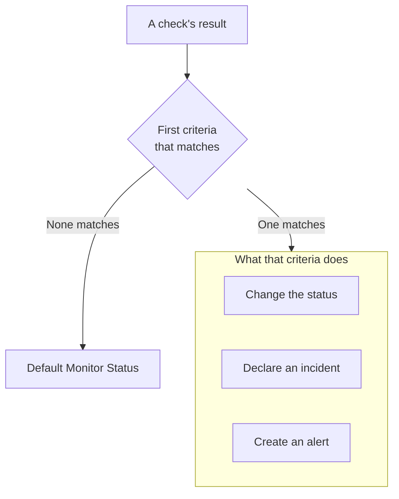

# Creating a Monitor

A monitor checks something you run, such as a website, an API, a host or a Kubernetes cluster, and tells you when it stops working. **Create Monitor** asks what to monitor first, then what to check, then how often. Everything but the type, the name and what to check starts with defaults that suit most monitors.

> [!NOTE]
> To create a monitor you need the Project Owner, Project Admin, Project Member, Monitor Admin or Monitor Member role, or a custom role with the Create Monitor permission.

## Monitor Info

The first step asks what to monitor and what to call it.

:::steps
### Open Create Monitor

Go to **Monitors** and click **Create Monitor**. The form opens on its first step, **Monitor Info**.

### Pick the monitor type

The first question is the **Monitor Type**: what do you want to monitor?

- The six types most people create come first: **Website**, **API**, **Ping**, **Port**, **SSL Certificate** and **Incoming Request**, for heartbeats from cron jobs and webhooks.
- **More monitor types** lists every other type under its category, such as **Infrastructure** (Kubernetes, Docker, Host) and **Telemetry** (Logs, Metrics, Traces). **Manual**, a monitor whose status you set yourself, is under **Other**.
- Or type in the search box. It knows the words you already use, such as `k8s`, `postgres`, `heartbeat` or `tls`, and **Enter** picks the first match.

The type you pick shrinks to one line. Click **Change** to pick another; press **Escape** while choosing to keep the type you had.

### Name the monitor

Fill in the **Name**. It is used in alerts and incident titles. **Description** and **Labels** are optional and wait under **More fields**.

A **Manual** monitor needs nothing more, so **Create Monitor** is on this step. For any other type, click **Next**.
:::

## Criteria

The second step asks what to check, and decides what counts as a problem.

:::steps
### Enter what to check

This step opens on what to check. For a website, that is its URL, with an example in the box; other types ask for a host, a query, a cluster or a log filter. Settings most monitors never change, such as timeouts and retries, are folded under **More fields**.

For a monitor that probes check, **Test Monitor** runs the check once before you save it: pick a probe under **Select Probe** and click **Run Test**. The answer opens in **Monitor Test Result**.

### Review the criteria

Below it, **Monitor Criteria** decide when the monitor changes status, declares an incident or creates an alert. A new monitor starts with criteria that suit most monitors, each folded to one line that says what it checks and what it does. A new website monitor, for example, is marked offline and declares an incident when the site does not answer or answers with an error status code.

Click a criteria to open and change it. **Add Criteria** adds one, open and ready to fill in. To change the order, drag a criteria by the handle on its left.

### Go to the next step

Click **Next**. Nothing on this step is marked as missing until you click **Next**.
:::

### How criteria are evaluated

Each check's result goes through the criteria from top to bottom, and the first one that matches decides what happens. That criteria can change the monitor's status, declare an incident, create an alert, or any mix of the three. When none matches, the monitor shows its **Default Monitor Status**, set under **More fields** below the criteria (**Operational** unless you pick another).

Incidents and alerts set to resolve automatically, as the default criteria's are, resolve themselves once their criteria stops matching. A monitor checked by more than one probe changes only when its probes agree: by default, every probe that is turned on and connected must reach the same result. To require fewer, set **Probe Agreement** on the monitor's **Configuration → Probes & Interval** page.

## Probes & Interval

Monitors that probes check end with this step: Website, API, Ping, IP, Port, SSL Certificate, DNS, DNSSEC, Domain, SQL Query, Database Health, Synthetic Monitor, Custom JavaScript Code and External Status Page. **Probes** are the machines that run the checks, and your project's default probes start selected. The **Monitoring Interval** starts at **Every 5 Minutes**.

:::steps
### Choose the probes

Keep the selected **Probes**, or pick others. A monitor with no probes is never checked. To check something on a private network, run a [custom probe](/docs/probe/custom-probe) inside that network and pick it here.

### Choose how often to check

Pick a **Monitoring Interval**, from **Every Minute** to **Every Week**. Synthetic Monitor, Custom JavaScript Code and SSL Certificate monitors are offered intervals of 5 minutes or longer.

### Create the monitor

Click **Create Monitor**. The new monitor's page opens. To change its probes or its interval later, open **Configuration → Probes & Interval** on that page.
:::

Every other type except Manual is created from the **Criteria** step.

## Starting from a template or a link

A monitor template, and the links that create a monitor elsewhere in OneUptime (on a metric chart, a network device or a detection rule), open **Create Monitor** with the type picked and the rest filled in. Click **Change** to pick a different type. A template's own form uses the same type picker: see [Monitor Templates](/docs/monitor/monitor-templates).

Each monitor type has its own page with its settings, its default criteria and examples. Good places to go next:

:::cards
- [Website Monitor](/docs/monitor/website-monitor): Check that a page loads, and what it answers.
- [API Monitor](/docs/monitor/api-monitor): Call an endpoint with a method, headers and a body.
- [Monitor Templates](/docs/monitor/monitor-templates): Create many monitors from one configuration and keep them in step.
- [Incidents](/docs/incidents/index): What happens after a monitor declares an incident.
:::
