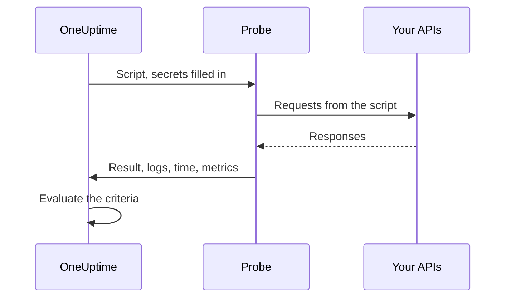

# Custom Code Monitor

A Custom Code monitor runs a JavaScript script you write, from a probe, on a schedule. Use it for checks the other monitor types cannot express — a login followed by an authenticated API call, a multi-step transaction, or a value you compute from several responses. If the script throws, the check fails; what it returns is there for your criteria and your incident templates.

:::cards
- [Create the monitor](#create-a-custom-code-monitor): Write a script and pick the probes that run it.
- [Write the script](#write-the-script): A runnable multi-step API check to start from.
- [Use secrets](#using-monitor-secrets): Keep passwords and tokens out of the script.
- [Capture custom metrics](#custom-metrics): Chart any number your script computes.
:::

## How it works

On every check, a probe runs your script in an isolated JavaScript sandbox, with your monitor secrets already filled in. The script calls whatever it needs, then returns a result or throws an error. The probe reports the result, the script's log messages, how long it ran and any metrics it captured, and OneUptime evaluates your criteria against them.



The sandbox is not Node.js: there is no `require`, `process`, `fetch` or file system, only the [modules listed below](#modules-available-in-the-script).

## Before you begin

- A **probe** that can reach every endpoint the script calls. Use a [custom probe](/docs/probe/custom-probe) for endpoints inside your network.
- To call a private address (such as `10.0.0.5`), the probe must allow it: set `PROBE_ALLOW_PRIVATE_NETWORK_MONITORS=true` on that probe. Loopback, link-local and cloud metadata addresses are always refused. See [Private Network Access](/docs/self-hosted/private-network-access).
- Any password, API key or token the script needs, stored as a [monitor secret](/docs/monitor/monitor-secrets).

## Create a custom code monitor

:::steps
### Start a new monitor

Go to **Monitors** and click **Create Monitor**. Under **Monitor Type**, click **More monitor types** and pick **Custom JavaScript Code** under **Synthetic Monitoring**, or type `script` in the search box. Enter a **Name**, then click **Next**.

### Add the script

Write your script in the **JavaScript Code** editor. Start from the [example below](#write-the-script).

### Test it

Click **Test Monitor** to run the script once from a probe, and check its result.

### Review the criteria

The monitor starts with two criteria: it is offline, and declares an incident, when the script fails, and online when it does not. Change them or add your own — see [Criteria](#criteria) — then click **Next**.

### Pick probes and create

Select the **Probes** that can reach your endpoints and a **Monitoring Interval** — custom code monitors are offered every 5 minutes or longer — then click **Create Monitor**.
:::

## Write the script

The script is the body of an `async` function: you can `await` at the top level, `return` a result, and `throw` to fail the check. This example logs in, calls an endpoint with the token it got back, and fails if the response is not what it expects:

```javascript title="Custom code monitor script"
// 1. Log in. axios rejects a 4xx or 5xx response, which fails the check.
const login = await axios.post("https://api.example.com/v1/login", {
  username: "monitoring@example.com",
  password: "{{monitorSecrets.ApiPassword}}",
});

// 2. Call an endpoint that needs the token.
const orders = await axios.get("https://api.example.com/v1/orders?limit=10", {
  headers: { Authorization: `Bearer ${login.data.token}` },
  timeout: 10000,
});

// 3. Fail the check when the data is wrong, not only when the request fails.
if (!Array.isArray(orders.data.items)) {
  throw new Error("The orders endpoint returned no items");
}

console.log(`Fetched ${orders.data.items.length} orders`);

// 4. Return what the criteria and incident templates should see.
return {
  data: orders.data.items.length,
};
```

| To | Do this | What OneUptime records |
| --- | --- | --- |
| Report a result | `return { data: ... }` with any JSON value | The **Result**. Only the `data` property is kept: `return 5` records no result. |
| Fail the check | `throw new Error("...")` | The **Script Error**, which the default criteria turn into an incident. |
| Leave a trace | `console.log(...)` | The **Log Messages**, up to 1,000 per run. |

To see a run, open the monitor's **Overview**: the **Monitor Summary** card shows the probe, the execution time and the error, and **Show More Details** shows the result, the script error and the log messages. **Monitoring Logs** has the same summary for earlier checks.

> [!NOTE]
> `axios` in this sandbox does not follow redirects, and its requests do not go through a proxy configured on the probe. Request the final URL.

## Using Monitor Secrets

Reference a secret as `{{monitorSecrets.NAME}}` anywhere in the script. OneUptime replaces the reference with the secret's value, as plain text, before the script reaches the probe. So wrap a secret in quotes to use it as a string, and leave it bare to use it as a number or a boolean:

```javascript
// Used as a string: wrap it in quotes.
const apiKey = "{{monitorSecrets.ApiKey}}";

// Used as a number or a boolean: leave it bare.
const retryLimit = {{monitorSecrets.RetryLimit}};
const verbose = {{monitorSecrets.Verbose}};

// Check the secret was filled in without logging the secret itself.
console.log(apiKey.length > 0);
```

A secret value that contains a quote character breaks the string around it. A reference the monitor cannot use is left in the script as written. To create a secret and choose which monitors can use it, see [Monitor Secrets](/docs/monitor/monitor-secrets).

## Custom Metrics

You can capture custom metrics from your script with the `oneuptime.captureMetric()` function. These metrics are stored in OneUptime and can be charted on dashboards using the Metric Explorer.

```javascript
oneuptime.captureMetric(name, value, attributes);
```

| Parameter | Type | Description |
| --- | --- | --- |
| `name` | string, required | The metric name (e.g. `"api.response.time"`). It is stored with a `custom.monitor.` prefix automatically. |
| `value` | number, required | The numeric metric value. A value that is not a number is ignored. |
| `attributes` | object, optional | Key-value pairs for additional context. String, number and boolean values are recorded (numbers and booleans are stored as text, because metric attributes are dimensions rather than measurements). Values of any other type are ignored. |

### Example

```javascript
const response = await axios.get("https://api.example.com/health");

// Capture a simple metric
oneuptime.captureMetric("api.response.time", response.data.latency);

// Capture a metric with attributes
oneuptime.captureMetric("api.queue.depth", response.data.queueDepth, {
  region: "us-east-1",
  environment: "production",
});

return {
  data: response.data,
};
```

Once captured, these metrics appear in the Metric Explorer under names like `custom.monitor.api.response.time`, and on the monitor's **Metrics** page under **Custom Metrics**. OneUptime adds the monitor and the probe to every datapoint, so you can chart them, alert on them, and filter by monitor, probe, or any custom attributes you provided.

### Limits

| Limit | Value | Past the limit |
| --- | --- | --- |
| Metrics per script execution | 100 | Further calls are ignored. |
| Metric name length | 200 characters | The name is cut. |
| Attributes per metric | 50 | Further attributes are dropped. |
| Attribute key length | 200 characters | The key is cut. |
| Attribute value length | 1000 characters | The value is cut. |

### Reserved attribute keys

Some attribute names are OneUptime's own, and a script cannot write them. If your script sets one, the attribute is dropped — the metric itself is still recorded — and a warning naming the key is written to the OneUptime server logs. They are:

- The monitor's identity: `monitorId`, `projectId`, `monitorName`, `probeName`, `probeId`, `isCustomMetric`.
- Anything in the `oneuptime.` or `resource.` namespaces — these carry the identifiers OneUptime stamps at ingest.
- Resource identity attributes: `service.name`, `host.name`, `k8s.cluster.name`, `iot.fleet.name`, `proxmox.cluster.name`, `vmware.vcenter.name`, `ceph.cluster.name`, `storage.array.name` and `docker.swarm.cluster.name`.

These names are not just labels — OneUptime reads them back as a claim about which resource a datapoint belongs to. A metric tagged `service.name: payments-api` would show up on that service's Metrics tab, and if you later built a metric monitor grouped by `service.name`, its alerts would be linked to that service, would page that service's owners, and would fall silent during a maintenance window on it. To associate a monitor with a service or host, use the monitor's own labels instead.

## Criteria

A Custom Code monitor's criteria can check:

| Filter type | What it checks | Filter conditions |
| --- | --- | --- |
| **Error** | The error the script threw, if any. | Contains, Not Contains, Equal To, Not Equal To, Is Empty, Is Not Empty |
| **Result Value** | The `data` the script returned. Compared as a number when it is one. | The same, plus Greater Than, Less Than, Greater Than Or Equal To, Less Than Or Equal To, True and False |
| **Execution Time (in ms)** | How long the script ran. | Numeric comparisons |

The defaults mark the monitor online when **Error** is empty, and offline — with an incident that resolves itself when the script succeeds again — when it is not. In incident and alert templates, the run is available as `{{result}}`, `{{scriptError}}`, `{{logMessages}}` and `{{executionTimeInMs}}`: see [Incident & Alert Dynamic Templating](/docs/monitor/incident-alert-templating).

### Alerting on the returned data

Whatever the script returns as `data` is the monitor's **Result Value**, and a criteria can compare it — for example _Result Value is Equal To `UP`_.

When `data` is an object or an array, fill in **Field Path (Optional)** on the Result Value filter to compare one field of it instead of the whole value. Use dots for nested fields and `[n]` for array items:

```javascript
const response = await axios.get("https://api.example.com/health");

return {
  data: {
    status: response.data.status, // "UP"
    cpu_busy_percent: response.data.cpu, // 42
    healthy: response.data.healthy, // true
    checks: response.data.checks, // [{ name: "db", latency: 12 }]
  },
};
```

| Field Path | Compares | Example condition |
| --- | --- | --- |
| `status` | `"UP"` | Not Equal To `UP` |
| `cpu_busy_percent` | `42` | Greater Than `90` |
| `healthy` | `true` | False |
| `checks[0].latency` | `12` | Greater Than `500` |

Add one filter per field you want to check; each can have its own condition and value.

- Leave the field path empty to compare the whole value, as for a script that returns a single number or string.
- Greater Than, Less Than and the other number conditions only match a number, so return a field as `42`, not `"42"`. True and False only match a boolean.
- A field that is not in the returned data — a missing key, or an array index past the end — compares as empty: **Is Empty** matches it, and no other condition does.
- A field whose name contains a dot cannot be addressed by a path.
- In Terraform, the filter's `custom_code_monitor_options` sets the field path: see [Monitor Steps](/docs/terraform/monitor-steps#comparing-one-field-of-a-scripts-result).

## Modules available in the script

| Name | What it is |
| --- | --- |
| `axios` | A promise-based HTTP client: call `axios(...)`, or `axios.get`, `post`, `put`, `patch`, `delete`, `head`, `options`, `request` and `create`. Request and response sizes are limited (10 MB each), redirects are not followed, and a probe's proxy is not used. |
| `crypto` | `createHash` and `createHmac` (call `update()` once, then `digest()`), `randomBytes`, `randomInt` and `randomUUID`. It is not Node.js's `crypto` module: there are no ciphers or signatures. |
| `http`, `https` | Only their `Agent` class, to pass to `axios` — for example `httpsAgent: new https.Agent({ rejectUnauthorized: false })`. There is no `request` or `get`. |
| `console.log` | Logs data for debugging. Only `console.log` exists; `console.error` and the others do not. |
| `oneuptime.captureMetric` | Captures a custom metric. See [Custom Metrics](#custom-metrics). |
| `setTimeout`, `clearTimeout`, `sleep(ms)` | Wait inside the script. A delay never runs past the script's timeout. |

## Things to consider

- **Timeout.** A script that runs longer than 60 seconds is stopped and the check fails with "Script execution timed out". On a self-hosted probe, `PROBE_CUSTOM_CODE_MONITOR_SCRIPT_TIMEOUT_IN_MS` changes the limit.
- **Memory.** Each run gets its own sandbox with a 128 MB memory limit.
- **Redirects.** `axios` does not follow them, so a URL that redirects fails the request. Use the final URL.

## Troubleshooting

:::details The check fails with "Script execution timed out"
The script ran longer than the time limit. Give each request its own `timeout` (in milliseconds) so a slow endpoint fails fast, with an error that names it.
:::

:::details A request fails with a 301 or 302 status
`axios` here does not follow redirects. Change the URL to the address it redirects to.
:::

:::details A request to an internal address is refused
The probe does not allow private network addresses. Set `PROBE_ALLOW_PRIVATE_NETWORK_MONITORS=true` on a probe inside your network and run the monitor from it — see [Private Network Access](/docs/self-hosted/private-network-access).
:::

:::details A secret is not filled in
The monitor cannot use the secret, or the name in the reference does not match the secret's name exactly. See [Monitor Secrets](/docs/monitor/monitor-secrets).
:::

## Next steps

:::cards
- [Synthetic Monitor](/docs/monitor/synthetic-monitor): Drive a real browser instead of calling APIs.
- [Monitor Secrets](/docs/monitor/monitor-secrets): Store the credentials your script uses.
- [Incident & Alert Dynamic Templating](/docs/monitor/incident-alert-templating): Put the script's result and logs into incidents.
:::
