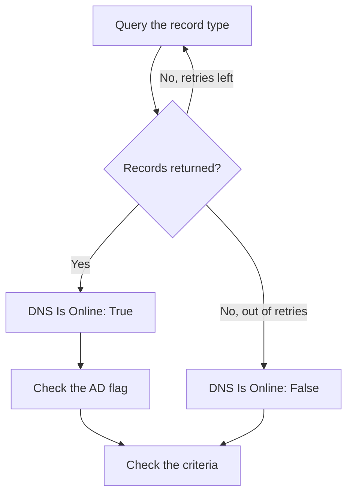

# DNS Monitor

A DNS monitor queries a DNS record on a schedule and checks the answer: that the name resolves, how fast, and what the records say. Use it to catch a DNS outage, a record that changed or disappeared, or a slow resolver, before users notice.

:::cards
- [Create the monitor](#create-a-dns-monitor): Six steps in the dashboard.
- [Configuration options](#configuration-options): The name, the record type and the DNS server.
- [Monitoring criteria](#monitoring-criteria): Resolution, records, response time and DNSSEC.
- [Troubleshooting](#troubleshooting): When the monitor and `dig` disagree.
:::

## How it works

On each check, a probe asks a DNS server for one record type of one name, such as the `A` records of `example.com`. The name is online when the server answers with at least one record of that type. A query that fails, times out or returns no record is tried again, up to the number of retries you set. The probe then asks a validating resolver whether the answer carries DNSSEC's authenticated-data (AD) flag, and OneUptime runs the result through the monitor's criteria.



A probe that has lost its own network connection reports no result, so it cannot mark your DNS offline.

## Before you begin

- **A role that can create monitors**: Project Owner, Project Admin, Project Member, Monitor Admin or Monitor Member, or a custom role with the Create Monitor permission.
- **A probe that can reach the DNS server.** Your project's default probes are picked for every new monitor. To query a DNS server on a private network, such as an internal resolver, use a [custom probe](/docs/probe/custom-probe) inside that network.

## Create a DNS monitor

:::steps
### Start a new monitor

Go to **Monitors** and click **Create Monitor**. Under **Monitor Type**, click **More monitor types** and pick **DNS** under **DNS Monitoring**.

### Name it

Enter a **Name**, such as `example.com A records`, then click **Next**.

### Enter the query

Enter the **Domain Name** to query, such as `example.com`, and pick its **Record Type**. To query a particular server, enter it in **DNS Server (Optional)**; leave it empty to use the probe's own resolver.

### Test it

Click **Test Monitor**, pick a probe under **Select Probe** and click **Run Test**. **Monitor Test Result** shows the records the probe got back.

### Review the criteria

**Monitor Criteria** starts with the [default criteria](#default-criteria): offline when the name does not resolve, online when it does. To check what the records say, add a **DNS Record Value** filter, then click **Next**.

### Pick probes and create

Keep or change the **Probes** and the **Monitoring Interval** (it starts at **Every 5 Minutes**), then click **Create Monitor**. The monitor's page opens.
:::

## Configuration options

| Field | Default | What to enter |
| --- | --- | --- |
| **Domain Name** | None | The name to query, such as `example.com` or `_sip._tcp.example.com`. For a `PTR` record, the reverse name, such as `34.216.184.93.in-addr.arpa`. |
| **Record Type** | `A` | The record type to query. See [Record types](#record-types). |
| **DNS Server (Optional)** | The probe's resolver | A DNS server to query instead, such as `8.8.8.8` or `ns1.example.com`. |
| **Port** (under **More fields**) | `53` | The port of the server in **DNS Server (Optional)**. |
| **Timeout (ms)** (under **More fields**) | `5000` | How long to wait for an answer, in milliseconds. |
| **Retries** (under **More fields**) | `3` | Retries after the first attempt fails. `0` means a single attempt. |

### Record types

A **DNS Record Value** criteria compares your text with each record as the probe writes it, so match this format:

| Record type | What it holds | Value format, for criteria |
| --- | --- | --- |
| `A` | IPv4 addresses | `93.184.216.34` |
| `AAAA` | IPv6 addresses | `2606:2800:220:1:248:1893:25c8:1946` |
| `CNAME` | The name this one is an alias of | `example.net` |
| `MX` | Mail servers | `10 mail.example.com` (priority, then the server) |
| `NS` | Name servers | `ns1.example.com` |
| `TXT` | Text, such as SPF and verification records | `v=spf1 include:_spf.example.com ~all` |
| `SOA` | The zone's start of authority | `ns1.example.com hostmaster.example.com 2024010101 7200 3600 1209600 3600` (server, contact, serial, refresh, retry, expire, minimum TTL) |
| `PTR` | The name an address points back to (reverse DNS) | `server1.example.com` |
| `SRV` | Services | `10 5 5060 sip.example.com` (priority, weight, port, target) |
| `CAA` | The certificate authorities allowed to issue for the name | `0 letsencrypt.org` (flag, then the authority) |

A `TXT` record split into several strings is joined into one value.

## Monitoring Criteria

Criteria decide when the name counts as online, degraded or offline, and whether that declares an incident or creates an alert. Each criteria checks one or more filters:

| Filter | Conditions | What it checks |
| --- | --- | --- |
| **DNS Is Online** | **True**, **False** | Whether the query returned at least one record of the type. |
| **DNS Response Time (in ms)** | **Greater Than**, **Less Than**, **Greater Than Or Equal To**, **Less Than Or Equal To** | How long the query took. |
| **DNS Record Exists** | **True**, **False** | Whether any record of the type came back. |
| **DNS Record Value** | **Contains**, **Not Contains**, **Starts With**, **Ends With**, **Equal To**, **Not Equal To** | The records' values. The filter matches when any one record matches. |
| **DNSSEC Is Valid** | **True**, **False** | Whether a validating resolver sets the AD flag on the answer. |

**DNS Record Value** matches when _any_ of the records matches. With several `A` records, **Equal To** `93.184.216.34` matches when one of them is that address, and **Not Equal To** matches when one of them is not.

**DNSSEC Is Valid** asks the server in **DNS Server (Optional)**, or Google Public DNS (`8.8.8.8`) when that is empty, so the server you set should be one that validates DNSSEC. The filter has no value, and matches neither way, when the probe cannot run that check. For a full check of a signed zone, use a [DNSSEC monitor](/docs/monitor/dnssec-monitor).

With two or more filters, **Match Condition** decides whether **All** of them or **Any** one must match. A criteria's **Actions** decide what it does: change the monitor status, create an alert, declare an incident, or any of these.

### Default Criteria

A new DNS monitor starts with two criteria:

- **Offline** — the name does not resolve, or has no record of the type, after every retry. The monitor is marked **Offline** and an incident called "_monitor name_ is offline" is created. The incident resolves itself when the name resolves again.
- **Online** — the name resolves. The monitor is marked **Operational**.

Criteria are checked from top to bottom, and the first one that matches decides what happens. When none matches, the monitor shows its default status: **Operational**, unless you pick another under **More fields**, below the criteria.

### Evaluating over a period of time

**Evaluate this criteria over a period of time** is a checkbox under a filter, offered for **DNS Is Online** and **DNS Response Time (in ms)**. Turn it on to judge a window of past checks instead of the latest one: pick an aggregate under **Evaluate** and a window, from 2 to 60 minutes, under **For the last (in minutes)**.

| Aggregate | Matches when |
| --- | --- |
| **Average**, **Sum**, **Maximum Value**, **Minimum Value** | That figure, over the window, meets the condition. **DNS Response Time (in ms)** only. |
| **All Values** | Every check in the window meets the condition. |
| **Any Value** | At least one check in the window meets the condition. |

**All Values** only matches once the window is genuinely covered by data. A monitor that has just been created, or one whose checks stopped being recorded, does not have enough history to say anything about the last N minutes, so the criteria waits rather than matching on the one reading it does have. **Any Value** is the setting for "tell me the moment a single check breaches" and still fires immediately.

**If No Data** decides what happens while the window cannot back the criteria:

| Option | What happens | Use it for |
| --- | --- | --- |
| **Ignore** (default) | The criteria does not match. | Ordinary threshold alerting. |
| **Trigger** | The missing data counts as the problem. | Checks where silence is itself a failure. |
| **Treat As Zero** | The window is compared as a single zero. | Counters where no events genuinely means zero. |

### Example criteria

| Goal | Filter | Condition | Value |
| --- | --- | --- | --- |
| Offline when the name stops resolving | **DNS Is Online** | **False** | — |
| Alert when a name's single `A` record changes | **DNS Record Value** | **Not Equal To** | `93.184.216.34` |
| Alert when an `MX` record points outside your domain | **DNS Record Value** | **Not Contains** | `example.com` |
| Mark DNS degraded when it is slow | **DNS Response Time (in ms)** | **Greater Than** | `500` |
| Alert when DNSSEC validation fails | **DNSSEC Is Valid** | **False** | — |

## Troubleshooting

:::details The monitor says offline, but the name resolves for me
The probe asked a different server, or for a different record type. Check **Record Type**: a name with only a `CNAME`, or only `AAAA` records, has no `A` record. Compare with `dig` against the same server:

```bash
dig @8.8.8.8 example.com A
```
:::

:::details A Not Equal To criteria fires although the right address is there
**DNS Record Value** matches when any one record matches. With several records, **Not Equal To** fires as soon as one of them differs. To check that one particular value is among the records, rely on the order of the criteria, since the first match wins:

1. Keep the default offline criteria at the top: **DNS Is Online** / **False**.
2. Below it, add a criteria with **DNS Record Value** / **Equal To** / the value you expect, that marks the monitor **Operational**.
3. Below that, add a criteria with **DNS Is Online** / **True**, that marks the monitor **Offline** and declares an incident. It only matches answers that do not have the value.
:::

:::details DNSSEC Is Valid never matches
The server in **DNS Server (Optional)** does not validate DNSSEC, so it never sets the AD flag, or the probe could not run the check. Leave the field empty to validate with `8.8.8.8`, or use a [DNSSEC monitor](/docs/monitor/dnssec-monitor).
:::

## Next steps

:::cards
- [DNSSEC Monitor](/docs/monitor/dnssec-monitor): Validate a signed zone's chain of trust.
- [Domain Monitor](/docs/monitor/domain-monitor): Watch the domain's registration and expiry.
- [Custom Probes](/docs/probe/custom-probe): Query internal DNS servers from your own network.
- [Incidents](/docs/incidents/index): What happens after the monitor declares one.
:::
