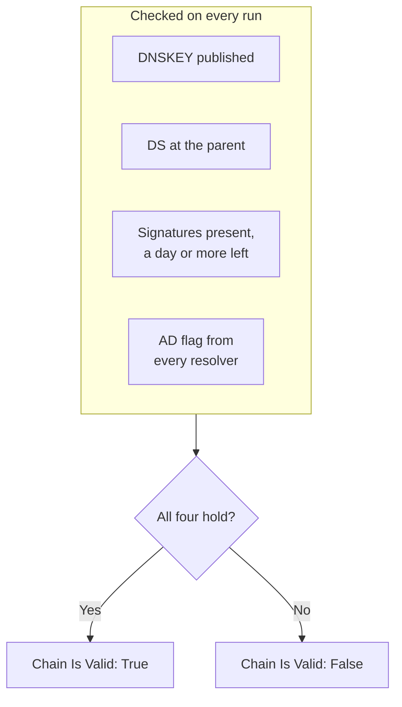

# DNSSEC Monitor

A DNSSEC monitor checks that a signed DNS zone still validates: that it publishes its keys, that its parent zone vouches for it, that its signatures have not expired, and that validating resolvers accept it. Use it to catch a broken chain of trust before resolvers start answering `SERVFAIL` for your domain.

:::cards
- [Create the monitor](#create-a-dnssec-monitor): Six steps in the dashboard.
- [What is checked](#how-it-works): The checks behind a valid chain.
- [Monitoring criteria](#monitoring-criteria): Chain validity, keys, DS records, signatures, resolvers and nameservers.
- [Best practices](#best-practices): Thresholds and resolvers that work.
:::

## How it works

On each check, a probe runs a set of DNS queries against the zone:

| Query | Asked of | Tells you |
| --- | --- | --- |
| `DNSKEY` | The first resolver in **Resolvers** | Whether the zone publishes its signing keys. |
| `DS` | The first resolver in **Resolvers** | Whether the parent zone publishes a delegation signer record for the zone. |
| `SOA`, with DNSSEC records | The first resolver in **Resolvers** | Whether the zone's records are signed (the `RRSIG` that signs its `SOA` record), and when the soonest signature expires. |
| `A`, with DNSSEC validation | Every resolver in **Resolvers** | Whether each validating resolver accepts the zone, which it shows with the authenticated-data (AD) flag. |
| `NS`, then `SOA` | The first resolver, then each authoritative nameserver it names | Whether every nameserver serves the same SOA serial. Only when **Check Nameserver Consistency** is on. |

Validating resolvers check the chain of trust from the root down, so the AD flag tells you the whole chain holds. The chain counts as valid when all of these hold:

A signature with less than a day left already counts as broken, so you hear about it up to a day before resolvers start rejecting the zone. A check that finds the chain broken, or the nameservers out of step, is run again a second later, up to the number of retries you set, before OneUptime runs the result through the monitor's criteria. All the queries of one attempt share a deadline of three times the **Timeout (ms)**; an attempt that runs out of time reports a timeout, not a verdict about the zone.

## Before you begin

- **A role that can create monitors**: Project Owner, Project Admin, Project Member, Monitor Admin or Monitor Member, or a custom role with the Create Monitor permission.
- **A signed zone.** The zone must be signed, and its DS record published at the parent through your registrar.
- **Outbound DNS from the probe** to the resolvers you list and, for the nameserver consistency check, to the zone's authoritative nameservers. Your project's default probes are picked for every new monitor.

## Create a DNSSEC monitor

:::steps
### Start a new monitor

Go to **Monitors** and click **Create Monitor**. Under **Monitor Type**, click **More monitor types** and pick **DNSSEC** under **DNS Monitoring**.

### Name it

Enter a **Name**, such as `example.com DNSSEC`, then click **Next**.

### Enter the zone

In **Zone (Domain Name)**, enter the zone to validate, such as `example.com`. Keep the default **Resolvers**, or list your own, separated by commas. Leave **Check Nameserver Consistency** on unless your network blocks DNS to arbitrary servers.

### Test it

Click **Test Monitor**, pick a probe under **Select Probe** and click **Run Test**. **Monitor Test Result** shows what each check found.

### Review the criteria

**Monitor Criteria** starts with the [default criteria](#default-criteria): offline when the chain is broken, online when it is valid. To be warned before signatures expire, add a criteria (see [Best practices](#best-practices)), then click **Next**.

### Pick probes and create

Keep or change the **Probes** and the **Monitoring Interval** (it starts at **Every 5 Minutes**), then click **Create Monitor**. The monitor's page opens.
:::

## Configuration options

| Field | Default | What to enter |
| --- | --- | --- |
| **Zone (Domain Name)** | None | The zone to validate, such as `example.com`. |
| **Resolvers** | `1.1.1.1, 8.8.8.8, 9.9.9.9` | Validating resolvers to query, separated by commas. Every one must return the AD flag for the chain to count as valid. |
| **Check Nameserver Consistency** | On | Query each authoritative nameserver directly and compare their SOA serials. Turn it off if your network blocks outbound DNS to arbitrary servers. |
| **Signature Expiry Warning (days)** (under **More fields**) | `7` | Saved with the monitor. The **DNSSEC Signature Expires In Days** filter uses the value you give it in the criteria, so set your threshold there. |
| **Timeout (ms)** (under **More fields**) | `10000` | How long to wait for each DNS query, in milliseconds. One attempt may take up to three times this long in all. |
| **Retries** (under **More fields**) | `3` | Retries after the first attempt fails. `0` means a single attempt. |

## Monitoring Criteria

Criteria decide when the zone counts as online, degraded or offline, and whether that declares an incident or creates an alert. Each criteria checks one or more filters:

| Filter | Conditions | What it checks |
| --- | --- | --- |
| **DNSSEC Chain Is Valid** | **True**, **False** | All four checks above hold: keys published, DS at the parent, signatures present with a day or more left, and the AD flag from every resolver. |
| **DNSSEC DNSKEY Record Exists** | **True**, **False** | The zone publishes at least one DNSKEY record. |
| **DNSSEC DS Record Exists At Parent** | **True**, **False** | The parent zone publishes a DS record for the zone. |
| **DNSSEC Signature Expires In Days** | **Greater Than**, **Less Than**, **Greater Than Or Equal To**, **Less Than Or Equal To** | Whole days until the soonest signature (RRSIG) expires. |
| **DNSSEC Resolver Consensus (AD Flag)** | **True**, **False** | Every resolver in **Resolvers** returns the AD flag. |
| **DNSSEC Nameservers Are Consistent** | **True**, **False** | Every authoritative nameserver answers with the same SOA serial. Always **True** while **Check Nameserver Consistency** is off. |

With two or more filters, **Match Condition** decides whether **All** of them or **Any** one must match. A criteria's **Actions** decide what it does: change the monitor status, create an alert, declare an incident, or any of these.

### Default Criteria

A new DNSSEC monitor starts with two criteria:

- **Chain is broken** — **DNSSEC Chain Is Valid** is **False**. The monitor is marked **Offline** and an incident called "_monitor name_ DNSSEC chain is broken" is created. The incident resolves itself once the chain is valid again.
- **Chain is valid** — the monitor is marked **Operational**.

Criteria are checked from top to bottom, and the first one that matches decides what happens. When none matches, the monitor shows its default status: **Operational**, unless you pick another under **More fields**, below the criteria.

The defaults do not watch signature expiry or nameserver consistency on their own. Add criteria for them, as below.

### Example criteria

| Goal | Filter | Condition | Value |
| --- | --- | --- | --- |
| Offline when the chain is broken (a default) | **DNSSEC Chain Is Valid** | **False** | — |
| Warn before signatures expire | **DNSSEC Signature Expires In Days** | **Less Than** | `7` |
| Catch a delegation that lost its DS record | **DNSSEC DS Record Exists At Parent** | **False** | — |
| Catch resolvers that disagree | **DNSSEC Resolver Consensus (AD Flag)** | **False** | — |
| Catch nameservers out of step | **DNSSEC Nameservers Are Consistent** | **False** | — |

## Best Practices

1. **Pick resolvers that are always reachable.** Every resolver must return the AD flag for the chain to count as valid, so a resolver the probe cannot reach fails the check once retries run out. The defaults, `1.1.1.1`, `8.8.8.8` and `9.9.9.9`, are run by three different operators, which also catches a zone that validates on one resolver but not another.
2. **Warn before signatures expire.** Signers re-sign a zone before its signatures run out, so a signature close to expiry means re-signing has stopped. Add a criteria with **DNSSEC Signature Expires In Days** / **Less Than** / `7` that creates an alert, and a second one at `2` that declares an incident. Drag both above the criteria that marks the chain valid, with the `2`-day one first, because the first criteria that matches wins. Pick thresholds lower than the time your signer normally leaves on a signature before it re-signs, so they stay quiet while re-signing works.
3. **Monitor every signed zone.** Include the apex domain, signed subdomains, and any zone delegated to a different operator.
4. **Keep the nameserver consistency check on,** and add a criteria for it. It catches a secondary that stopped transferring from the primary, which DNSSEC validation alone can miss.

## Troubleshooting

:::details The chain is reported broken, but the zone validates with `dig`
One of the resolvers in **Resolvers** did not return the AD flag: it was unreachable from the probe, or it does not validate DNSSEC. The **Resolver Checks** table, in **Monitor Test Result** and in each check's summary, shows every resolver's answer and error. Remove resolvers the probe cannot reach, and list only validating ones.
:::

:::details Nameservers are reported inconsistent right after a change
Secondaries can lag the primary for a while after the zone changes. The **Nameserver Consistency** table in the check's summary shows each nameserver's SOA serial. If one stays behind, that secondary has stopped transferring. If every nameserver shows an error, the probe may be blocked from querying them directly: turn off **Check Nameserver Consistency**.
:::

:::details The check reports a timeout
All the queries of one attempt share three times the **Timeout (ms)**. A slow or unreachable resolver uses that up; remove it from **Resolvers**, or raise the timeout.
:::

## Next steps

:::cards
- [DNS Monitor](/docs/monitor/dns-monitor): Check that a name resolves, and what its records say.
- [Domain Monitor](/docs/monitor/domain-monitor): Watch the domain's registration and expiry.
- [SSL Certificate Monitor](/docs/monitor/ssl-certificate-monitor): Watch the certificates served on the domain.
- [Incidents](/docs/incidents/index): What happens after the monitor declares one.
:::
