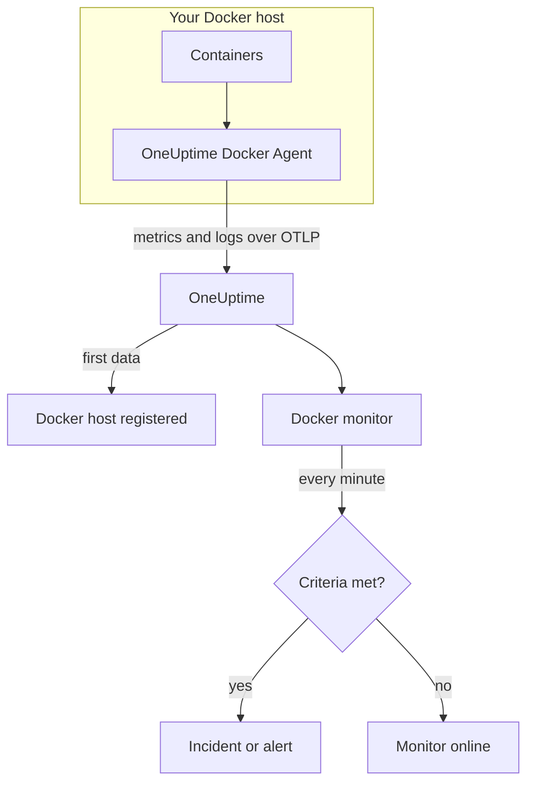

# Docker Monitor

A Docker monitor watches the containers on one Docker host and tells you when a container runs hot, runs out of memory, or crash-loops. It reads the metrics the OneUptime Docker Agent sends from the host, so nothing is probed from outside: install the agent, then create the monitor from a template or your own query.

:::cards
- [Create the monitor](#create-a-docker-monitor): Six steps in the dashboard.
- [Templates](#pre-built-alert-templates): Six ready-made alerts, one incident per container.
- [Metrics](#collected-metrics): What the agent collects, and what each metric means.
- [Logs](#collected-logs): Container logs, and the log driver they need.
:::

## How it works

The OneUptime Docker Agent runs as a container on the host. Every 30 seconds it reads container stats from the Docker Engine API, tails the containers' log files, and sends both to OneUptime over OTLP. The first data from a host registers it in OneUptime.

A Docker monitor is tied to one host. Every minute it runs its query over that host's container metrics and compares the result with its criteria.



## Before you begin

- **Install the Docker Agent** on the host. The [Docker Agent guide](/docs/telemetry/docker-host) covers installing, upgrading and checking it.
- **Check the host is registered.** It appears under **Products → Infrastructure → Docker → All Hosts**, named after the agent's `DOCKER_HOST_NAME`, once its first data arrives.
- **For container logs**, run the containers with Docker's `json-file` log driver. See [Log driver requirement](#log-driver-requirement).

## Create a Docker monitor

:::steps
### Start a new monitor

Go to **Monitors** and click **Create Monitor**.

### Pick Docker Container

Under **Monitor Type**, click **More monitor types** and pick **Docker Container** under **Infrastructure**, or type `docker` in the search box. Enter a **Name** — it is used in incident and alert titles — and click **Next**.

### Choose the host

Under **Docker Monitor Configuration**, pick the host from **Docker Host**. Every host that has sent data is in the list.

### Choose what to watch

Pick one of the three tabs:

- **Quick Setup** — click a [template](#pre-built-alert-templates). It sets the metric, aggregation, time range and thresholds, and replaces the criteria below with its own. You can still change the **Time Range**.
- **Custom Metric** — pick one metric from **Docker Metric**, then set **Aggregation** and **Time Range**. **Container Name** and **Container Image** narrow it to some containers.
- **Advanced** — build queries and formulas yourself under **Select Metrics**. Use **Group by** `resource.container.name` to judge each container on its own.

### Check the criteria

Open each criteria under **Monitor Criteria** and check its **Metric**, **Aggregation**, **Condition** and **Threshold**. A template fills these in. With **Custom Metric** or **Advanced**, the monitor starts with the [default criteria](#default-criteria), which only notice a metric dropping to zero, so set your own threshold.

### Create the monitor

Click **Create Monitor**. OneUptime opens the monitor's page and evaluates it every minute. Incidents and alerts it raises are also listed on the host's **Incidents** and **Alerts** pages.
:::

> [!TIP]
> To set up several templates at once, open the host from **Products → Infrastructure → Docker** and go to **Recommendations**. Pick the templates you want, choose who is paged, and OneUptime creates one monitor per template.

## Monitor settings

| Field | Tab | What it does |
| --- | --- | --- |
| **Docker Host** | All | Required. Scopes every query to the host's `resource.host.name`. OneUptime also adds `resource.container.runtime = docker` to every query. |
| **Docker Metric** | Custom Metric | One metric from the agent's catalog, grouped as CPU, memory, network, block I/O and container. |
| **Container Name** | Custom Metric, Advanced | Optional. Exact match on `resource.container.name`, for example `my-container`. |
| **Container Image** | Custom Metric, Advanced | Optional. Exact match on `resource.container.image.name`, for example `nginx:latest`. |
| **Aggregation** | Custom Metric | How samples are combined: **Average**, **Maximum**, **Minimum**, **Sum** or **Count**. Starts at the metric's usual aggregation. |
| **Time Range** | All | The rolling window the query reads, from **Past 1 Minute** to **Past 365 Days**. A new monitor starts at **Past 1 Minute**; templates set their own. |
| **Select Metrics** | Advanced | The query builder: **Metric**, **Aggregate by**, **Filter by attributes**, **Group by**, plus **Add Metric** and **Add Formula** to combine queries. |

## Pre-built Alert Templates

**Quick Setup** offers six templates. Each builds a complete monitor: a query grouped by `resource.container.name`, a criteria that fires and one that recovers. Every container is judged on its own, so one busy container does not hide another, and each breaching container gets its own incident and alert. Thresholds are starting points you can edit.

Unless the table says otherwise, a criteria fires only when the condition holds for every minute of its window, and recovers 10% past the threshold so a value hovering at the line does not flap.

| Template | Severity | Watches | Fires when | Recovers when |
| --- | --- | --- | --- | --- |
| High Container CPU Usage | Warning | `container.cpu.utilization`, Max per container, past 5 minutes | Above 80 (% of one core) | At or below 72 |
| High Container Memory Usage | Warning | `container.memory.percent`, Max per container, past 5 minutes | Above 85% | At or below 76.5% |
| Container Restart Loop | Critical | Growth of `container.restarts` per container, past 15 minutes | More than 3 restarts in the window (Sum) | 2.7 or fewer |
| Container CPU Throttling | Warning | Growth of `container.cpu.throttling_data.throttled_time` in ms per container, past 5 minutes | More than 1000 ms in the window (Sum) | 900 ms or less |
| High Container Process Count | Warning | `container.pids.count`, Max per container, past 5 minutes | Above 2000 | At or below 1800 |
| Container Down (Low Uptime) | Critical | `container.uptime`, Min per container, past 1 minute | Equal to 0 | Above 0 |

**Severity** is the label the picker shows. The incident and alert a template creates start on your project's most severe incident and alert severity; change them in the criteria.

> [!NOTE]
> `container.cpu.utilization` is the number `docker stats` prints: 100% is one full CPU core, not the whole host, so a container using two cores reads 200. On a multi-core host the 80 threshold is a CPU budget, not a share of the machine.

> [!NOTE]
> `container.memory.percent` divides by the container's memory limit when one is set, and by the **host's** total memory when it is not. Check whether the container was started with `--memory` before you treat a breach as an imminent out-of-memory kill.

> [!WARNING]
> `container.restarts` and `container.cpu.throttling_data.throttled_time` only ever grow, so those two templates alert on how much they grew in the window: a Maximum and a Minimum query per minute, subtracted by a formula and summed. At the agent's 30-second scrape that sees about half the real activity, and the thresholds already allow for it. If you raise the agent's `collection_interval` to 60 seconds or more, each minute holds one sample and both templates stop alerting.

> [!CAUTION]
> **Container Down (Low Uptime)** cannot catch a container that stops and stays stopped. The agent only reports running containers, so a stopped container sends no data at all and its uptime never reads 0. For a service that must stay up, also watch what it serves — for example with an [API Monitor](/docs/monitor/api-monitor).

## Collected Metrics

The agent uses the OpenTelemetry `docker_stats` receiver against the Docker socket, every 30 seconds. Each container's metrics carry its identity as resource attributes: `resource.container.name`, `resource.container.image.name`, `resource.container.id`, `resource.container.runtime` (`docker`) and `resource.host.name`.

### CPU

| Metric | Description |
| --- | --- |
| `container.cpu.utilization` | CPU utilization, where 100% is one full CPU core (the `docker stats` CPU% column). |
| `container.cpu.usage.total` | CPU time used since the container started, in nanoseconds. A lifetime counter. |
| `container.cpu.throttling_data.throttled_time` | Nanoseconds the container has been throttled by its CPU limit since it started. A lifetime counter. |
| `container.cpu.throttling_data.throttled_periods` | Throttling periods since the container started. A lifetime counter. |

### Memory

| Metric | Description |
| --- | --- |
| `container.memory.usage.total` | Memory in use, in bytes. |
| `container.memory.usage.limit` | Memory limit, in bytes. |
| `container.memory.percent` | Memory use as a percentage of the container's limit, or of the host's total memory when the container has no limit. |

### Network

| Metric | Description |
| --- | --- |
| `container.network.io.usage.rx_bytes` | Bytes received. A lifetime counter. |
| `container.network.io.usage.tx_bytes` | Bytes sent. A lifetime counter. |

### Block I/O

| Metric | Description |
| --- | --- |
| `container.blockio.io_service_bytes_recursive.read` | Bytes read from block devices. |
| `container.blockio.io_service_bytes_recursive.write` | Bytes written to block devices. |

### Container

| Metric | Description |
| --- | --- |
| `container.uptime` | Seconds since the container started. Only running containers report it. |
| `container.restarts` | Times the container has restarted since it was created. A lifetime counter. |
| `container.pids.count` | Tasks in the container. The cgroup pids controller counts threads as well as processes. |

The **Docker Metric** list also offers `container.cpu.usage.percpu`, `container.memory.rss`, `container.memory.cache` and the network packet counters. The shipped agent configuration does not turn these on, so check the host's **Metrics** page before you build on them. `container.cpu.throttling_data.throttled_periods` is not in the list; query it from **Advanced**.

## Monitoring criteria

A criteria compares one of the monitor's queries or formulas with a threshold. A Docker monitor's criteria have no **Filter Type**: every rule checks the metric value, with these fields.

| Field | What it does |
| --- | --- |
| **Metric** | The query or formula to check, by its variable name. |
| **Aggregation** | How the values in the window become one answer: **Average**, **Sum**, **Maximum Value**, **Minimum Value**, **All Values** (every value must match) or **Any Value** (one is enough). |
| **Condition** | **Greater Than**, **Less Than**, **Greater Than Or Equal To**, **Less Than Or Equal To** or **Equal To** — or an anomaly condition: **Anomalously High**, **Anomalously Low** or **Anomalous**. |
| **Threshold** | The value to compare with. A unit list sits beside it when the metric has a unit. Not shown for anomaly conditions. |
| **Sensitivity** | Anomaly conditions only. **Low** (4σ), **Medium** (3σ, the default) or **High** (2σ). |
| **Baseline Window** | Anomaly conditions only. 14 days (the default), 28, 60 or 90 days of history. |
| **If No Data** | Under **More fields**. What happens when the window has no samples: **Ignore** (the default), **Treat As Zero** or **Trigger**. |

Anomaly conditions compare each value with the same hour of the week in the baseline. They stay in a "Learning" state, and raise nothing, until the baseline window holds enough history.

Each criteria also says what to do when it matches: change the monitor status, create an alert, or declare an incident. Criteria are checked from top to bottom, and the first one that matches decides.

### Default criteria

A monitor you do not build from a template starts with two criteria:

| Order | Criteria | Matches when | Then |
| --- | --- | --- | --- |
| 1 | Check if _monitor name_ is offline | Any value of the first query is `0` | Marks the monitor **Offline** and declares the incident "_monitor name_ is offline", which resolves itself when the monitor recovers. |
| 2 | Check if _monitor name_ is online | Any value is above `0` | Marks the monitor **Operational**. |

> [!IMPORTANT]
> Silence matches neither criteria: a host that stops sending data leaves the monitor as it was. To be told when data stops, set **If No Data** to **Trigger** on a criteria. Time OneUptime itself was not receiving is never no data: a check whose window holds it waits instead, as [When OneUptime Is Not Receiving Data](/docs/monitor/when-oneuptime-is-not-receiving) explains.

## Collected logs

The agent also tails every container's `*-json.log` file and sends each line as an OpenTelemetry log record with:

| Field | Value |
| --- | --- |
| `resource.host.name` | The host, from `DOCKER_HOST_NAME`. |
| `resource.container.id` | The full container ID. |
| `resource.container.runtime` | Always `docker`. |
| `attributes["log.iostream"]` | `stdout` or `stderr`. |
| `severityText` / `severityNumber` | Read from a level keyword where a level sits in the line (`[ERROR]`, `app.INFO:`, `{"level":"warn"}`, `level=error`). A line with no level falls back to its stream: `stderr` is `ERROR`, `stdout` is `INFO`. |
| `body` | The line the container wrote. Lines that start with whitespace or a closing bracket, such as stack-trace frames, are joined to the line before. |
| `time` | The Docker daemon's timestamp for the line. |

Logs appear on the host's **Logs** page and on each container's page.

### Log driver requirement

The agent can only read logs from containers that use Docker's `json-file` log driver. It is Docker's default, but a container or the whole daemon can use another one:

| Driver | What the agent sees |
| --- | --- |
| `json-file` | Every line. |
| `local` | Nothing: the file is binary, and the agent cannot parse it. |
| `journald`, `syslog`, `fluentd`, `gelf`, `awslogs`, `splunk`, … | Nothing: the logs go elsewhere, so there is no file to tail. |
| `none` | Nothing: the logs are discarded. |

Check a container's driver, and the daemon's default:

```bash
docker inspect <container> --format '{{.HostConfig.LogConfig.Type}}'
docker info --format '{{.LoggingDriver}}'
```

Switch to `json-file`. Docker sets a container's log driver when the container is created, so recreate each container after the change — a restart keeps the old driver.

:::tabs
@tab Docker Compose
Set the driver on each service, with rotation:

```yaml title="docker-compose.yml"
services:
  my-app:
    image: my-app:latest
    logging:
      driver: "json-file"
      options:
        max-size: "100m"
        max-file: "5"
```

Then recreate the service:

```bash
docker compose up -d --force-recreate <service>
```
@tab Docker daemon
Make `json-file` the default for every container created afterwards:

```json title="/etc/docker/daemon.json"
{
  "log-driver": "json-file",
  "log-opts": {
    "max-size": "100m",
    "max-file": "5"
  }
}
```

Restart the Docker daemon, then remove and recreate each container:

```bash
docker rm -f <container>
docker run ... <image>
```
:::

## Troubleshooting

:::details The host is not in the Docker Host list
Hosts register themselves from the agent's data. Check that the agent container is running and that the host is listed under **Products → Infrastructure → Docker → All Hosts**. The [Docker Agent guide](/docs/telemetry/docker-host) has the checks to run on the host.
:::

:::details Metrics arrive but the Logs page is empty
The containers are almost certainly not using the `json-file` log driver. Check them with the commands in [Log driver requirement](#log-driver-requirement), switch the ones whose logs you want, and recreate them.
:::

:::details The agent logs "no files match the configured criteria"
The agent looks for `/var/lib/docker/containers/*/*-json.log` and found nothing. Either no container on the host uses `json-file`, or the agent's `/var/lib/docker/containers` mount (`-v /var/lib/docker/containers:/var/lib/docker/containers:ro`) is missing or empty, or the agent runs on Docker Desktop for macOS, whose container files live inside its Linux VM.
:::

:::details Data arrives under the wrong host name
OneUptime identifies a host by `resource.host.name`, which the agent takes from `DOCKER_HOST_NAME`. Changing `DOCKER_HOST_NAME` after the first data creates a second host rather than renaming the first, and a monitor stays tied to the name it was created with.
:::

:::details A CPU alert never fires
Group the query by `resource.container.name` and aggregate with **Maximum**, as the **High Container CPU Usage** template does. An average across every container on a busy host is pulled down by the idle ones. Remember that 100% means one full core, so a container allowed several cores needs a higher threshold.
:::

:::details The restart-loop or throttling template stopped alerting
Both measure how much a counter grew between two samples in the same minute. If the agent's `collection_interval` is 60 seconds or more, every minute holds one sample, the growth always reads 0, and neither template fires. Keep the agent's default of 30 seconds.
:::

## Next steps

:::cards
- [Docker Agent](/docs/telemetry/docker-host): Install, upgrade and troubleshoot the agent this monitor reads.
- [Podman Monitor](/docs/monitor/podman-monitor): The same monitor for Podman hosts.
- [Docker Swarm Monitor](/docs/monitor/docker-swarm-monitor): Watch the tasks of a Swarm cluster.
- [Incidents](/docs/incidents/index): What happens after a criteria declares an incident.
:::
