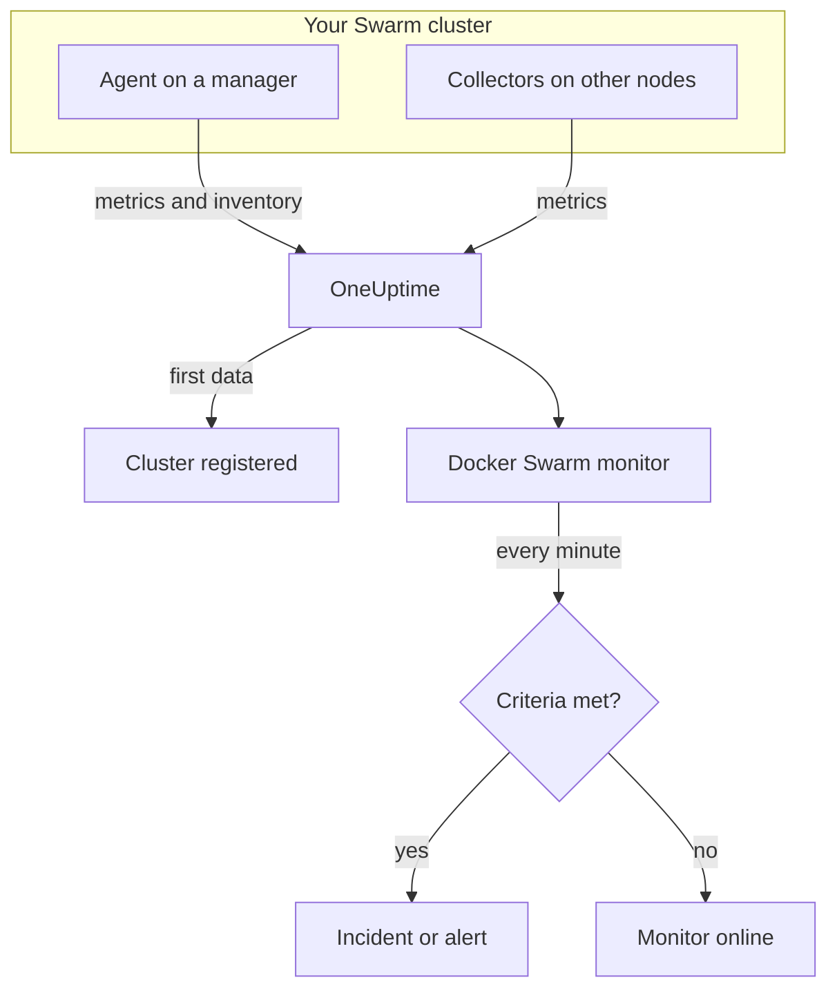

# Docker Swarm Monitor

A Docker Swarm monitor watches the containers behind a Swarm cluster's service tasks and tells you when a task restarts, runs hot, or runs out of memory. It reads the container metrics the OneUptime Docker Swarm Agent sends, so nothing is probed from outside: install the agent, then create the monitor from a template or your own query.

:::cards
- [Create the monitor](#create-a-docker-swarm-monitor): Six steps in the dashboard.
- [Templates](#pre-built-alert-templates): Four ready-made alerts, one incident per task.
- [Metrics](#collected-metrics): The container metrics you can alert on.
- [Filters](#monitor-settings): Narrow a monitor to a service, a task or an image.
:::

## How it works

The OneUptime Docker Swarm Agent runs on a manager node. Its collector reads container stats from that node's Docker daemon every 30 seconds and stamps every batch with the cluster's name, `docker.swarm.cluster.name`. A small inventory poller beside it reads the cluster's nodes, services and tasks from the Swarm API every 5 minutes. The first data registers the cluster in OneUptime.

The collector only sees containers on the node it runs on. For metrics from every node, run the collector on each node with the same `DOCKER_SWARM_CLUSTER_NAME`.

A Docker Swarm monitor is tied to one cluster. Every minute it runs its query over that cluster's container metrics and compares the result with its criteria.

## Before you begin

- **Install the Docker Swarm Agent** on a manager node. The [Docker Swarm Agent guide](/docs/telemetry/docker-swarm) covers installing and upgrading it, and running the collector on the other nodes.
- **Check the cluster is registered.** It appears under **Products → Infrastructure → Docker Swarm → All Clusters**, named after the agent's `DOCKER_SWARM_CLUSTER_NAME`, once its first data arrives.

## Create a Docker Swarm monitor

:::steps
### Start a new monitor

Go to **Monitors** and click **Create Monitor**.

### Pick Docker Swarm

Under **Monitor Type**, click **More monitor types** and pick **Docker Swarm** under **Infrastructure**, or type `swarm` in the search box. Enter a **Name** — it is used in incident and alert titles — and click **Next**.

### Choose the cluster

Under **Docker Swarm Monitor Configuration**, pick the cluster from **Docker Swarm Cluster**. Every cluster that has sent data is in the list.

### Choose what to watch

Pick one of the three tabs:

- **Quick Setup** — click a [template](#pre-built-alert-templates). It sets the metric, aggregation, time range and thresholds, and replaces the criteria below with its own. You can still change the **Time Range**.
- **Custom Metric** — pick one metric from **Docker Swarm Metric**, then set **Aggregation** and **Time Range**. The [filters](#monitor-settings) narrow it to some tasks.
- **Advanced** — build queries and formulas yourself under **Select Metrics**. Use **Group by** `resource.container.name` to judge each task on its own.

### Check the criteria

Open each criteria under **Monitor Criteria** and check its **Metric**, **Aggregation**, **Condition** and **Threshold**. A template fills these in. With **Custom Metric** or **Advanced**, the monitor starts with the [default criteria](#default-criteria), which only notice a metric dropping to zero, so set your own threshold.

### Create the monitor

Click **Create Monitor**. OneUptime opens the monitor's page and evaluates it every minute. Incidents and alerts it raises are also listed on the cluster's **Incidents** and **Alerts** pages.
:::

> [!TIP]
> To set up several templates at once, open the cluster from **Products → Infrastructure → Docker Swarm** and go to **Recommendations**. Pick the templates you want, choose who is paged, and OneUptime creates one monitor per template.

## Monitor settings

| Field | Tab | What it does |
| --- | --- | --- |
| **Docker Swarm Cluster** | All | Required. Scopes every query to `resource.docker.swarm.cluster.name`. This is the only resource attribute the agent stamps, so the monitor adds no `container.runtime` or `host.name` filter. |
| **Service Name** | Custom Metric, Advanced | Optional. Exact match on `docker.swarm.service.name`, for example `web`. |
| **Node Name** | Custom Metric, Advanced | Optional. Exact match on `docker.swarm.node.name`, for example `swarm-node-1`. |
| **Container Name** | Custom Metric, Advanced | Optional. Exact match on `resource.container.name`. A task's container is named `<service>.<slot>.<taskid>`, for example `web.1.abc123`. |
| **Container Image** | Custom Metric, Advanced | Optional. Exact match on `resource.container.image.name`, for example `nginx:latest`. |
| **Docker Swarm Metric** | Custom Metric | One metric from the [catalog](#collected-metrics). |
| **Aggregation** | Custom Metric | How samples are combined: **Average**, **Maximum**, **Minimum**, **Sum** or **Count**. Starts at the metric's usual aggregation. |
| **Time Range** | All | The rolling window the query reads, from **Past 1 Minute** to **Past 365 Days**. A new monitor starts at **Past 1 Minute**; templates set their own. |
| **Select Metrics** | Advanced | The query builder: **Metric**, **Aggregate by**, **Filter by attributes**, **Group by**, plus **Add Metric** and **Add Formula** to combine queries. |

> [!WARNING]
> The shipped agent does not set `docker.swarm.service.name` or `docker.swarm.node.name` yet, so a monitor with **Service Name** or **Node Name** filled in finds no data. Narrow by **Container Image** instead, or group by `resource.container.name`.

## Pre-built Alert Templates

**Quick Setup** offers four templates. Each builds a complete monitor: a query grouped by `resource.container.name`, a criteria that fires and one that recovers. Every task is judged on its own and gets its own incident and alert, whose root cause lists the affected tasks and their values. Thresholds are starting points you can edit.

Unless the table says otherwise, a criteria fires only when the condition holds for every minute of its window, and recovers 10% past the threshold so a value hovering at the line does not flap.

| Template | Severity | Watches | Fires when | Recovers when |
| --- | --- | --- | --- | --- |
| Task Down (Low Uptime) | Critical | `container.uptime`, Min per task, past 1 minute | Any value is below 60 seconds | Every value is at or above 66 seconds |
| High Task CPU Usage | Warning | `container.cpu.utilization`, Avg per task, past 5 minutes | Above 80 (% of one core) | At or below 72 |
| High Task Memory Usage | Warning | `container.memory.percent`, Avg per task, past 5 minutes | Above 85% | At or below 76.5% |
| High Task Process Count | Warning | `container.pids.count`, Max per task, past 5 minutes | Above 500 | At or below 450 |

**Severity** is the label the picker shows. The incident and alert a template creates start on your project's most severe incident and alert severity; change them in the criteria.

> [!NOTE]
> **Task Down (Low Uptime)** fires on a single young sample because a restart is an event, not a level. Swarm gives a replacement task a new container, and so a new series, which is why the template looks for an uptime under a minute rather than a 0. A deploy or a scale-up trips it too, and it clears once the new tasks pass a minute of uptime. A task that dies and is not replaced sends nothing, so it is not caught.

## Collected Metrics

The agent's collector uses the OpenTelemetry `docker_stats` receiver, so the metrics are the standard container metrics, one series per task container. There are no `docker_swarm_*` metrics: nodes, services and tasks are tracked as inventory, on the cluster's **Services**, **Tasks**, **Nodes** and related pages.

### CPU

| Metric | Unit | Description |
| --- | --- | --- |
| `container.cpu.utilization` | % | CPU utilization of a task's container, where 100% is one full CPU core. |

### Memory

| Metric | Unit | Description |
| --- | --- | --- |
| `container.memory.usage.total` | bytes | Memory used by a task's container. |
| `container.memory.percent` | % | Memory used as a percentage of the container's limit, or of the node's total memory when the service sets no limit. |

### Network

| Metric | Unit | Description |
| --- | --- | --- |
| `container.network.io.usage.rx_bytes` | bytes | Bytes received by a task's container. A lifetime counter. |
| `container.network.io.usage.tx_bytes` | bytes | Bytes sent by a task's container. A lifetime counter. |

### Container

| Metric | Unit | Description |
| --- | --- | --- |
| `container.pids.count` | count | Processes inside a task's container. A sudden rise can mean a fork bomb or a leak. |
| `container.uptime` | seconds | How long a task's container has been running. A rescheduled or restarted task starts a new container at 0. |

Each series carries the container's identity as resource attributes: `resource.container.name` (`<service>.<slot>.<taskid>`), `resource.container.image.name` and `resource.docker.swarm.cluster.name`.

## Monitoring criteria

A criteria compares one of the monitor's queries or formulas with a threshold. A Docker Swarm monitor's criteria have no **Filter Type**: every rule checks the metric value, with these fields.

| Field | What it does |
| --- | --- |
| **Metric** | The query or formula to check, by its variable name. |
| **Aggregation** | How the values in the window become one answer: **Average**, **Sum**, **Maximum Value**, **Minimum Value**, **All Values** (every value must match) or **Any Value** (one is enough). |
| **Condition** | **Greater Than**, **Less Than**, **Greater Than Or Equal To**, **Less Than Or Equal To** or **Equal To** — or an anomaly condition: **Anomalously High**, **Anomalously Low** or **Anomalous**. |
| **Threshold** | The value to compare with. A unit list sits beside it when the metric has a unit. Not shown for anomaly conditions. |
| **Sensitivity** | Anomaly conditions only. **Low** (4σ), **Medium** (3σ, the default) or **High** (2σ). |
| **Baseline Window** | Anomaly conditions only. 14 days (the default), 28, 60 or 90 days of history. |
| **If No Data** | Under **More fields**. What happens when the window has no samples: **Ignore** (the default), **Treat As Zero** or **Trigger**. |

Anomaly conditions compare each value with the same hour of the week in the baseline. They stay in a "Learning" state, and raise nothing, until the baseline window holds enough history.

Each criteria also says what to do when it matches: change the monitor status, create an alert, or declare an incident. Criteria are checked from top to bottom, and the first one that matches decides.

### Default criteria

A monitor you do not build from a template starts with two criteria:

| Order | Criteria | Matches when | Then |
| --- | --- | --- | --- |
| 1 | Check if _monitor name_ is offline | Any value of the first query is `0` | Marks the monitor **Offline** and declares the incident "_monitor name_ is offline", which resolves itself when the monitor recovers. |
| 2 | Check if _monitor name_ is online | Any value is above `0` | Marks the monitor **Operational**. |

> [!IMPORTANT]
> Silence matches neither criteria: a cluster that stops sending data leaves the monitor as it was. To be told when data stops, set **If No Data** to **Trigger** on a criteria. Time OneUptime itself was not receiving is never no data: a check whose window holds it waits instead, as [When OneUptime Is Not Receiving Data](/docs/monitor/when-oneuptime-is-not-receiving) explains.

## Troubleshooting

:::details The cluster is not in the Docker Swarm Cluster list
Clusters register themselves from the agent's data. Check that the agent is running on a manager node, that `DOCKER_SWARM_CLUSTER_NAME` is set, and that the cluster is listed under **Products → Infrastructure → Docker Swarm → All Clusters**. The [Docker Swarm Agent guide](/docs/telemetry/docker-swarm) has the checks to run on the node.
:::

:::details Only some tasks have metrics
The collector reads the Docker daemon of the node it runs on, so it only sees the tasks on that node. Run the collector on every node with the same `DOCKER_SWARM_CLUSTER_NAME`.
:::

:::details A monitor filtered by service or node finds no data
**Service Name** and **Node Name** match `docker.swarm.service.name` and `docker.swarm.node.name`, which the shipped agent does not set. Clear them and narrow by **Container Image**, or group by `resource.container.name`.
:::

:::details Every task shows as one series
Group by the resource attribute, `resource.container.name`, as the templates do. The bare `container.name` matches nothing, so every task collapses into one series with an empty name.
:::

## Next steps

:::cards
- [Docker Swarm Agent](/docs/telemetry/docker-swarm): Install and upgrade the agent this monitor reads.
- [Docker Monitor](/docs/monitor/docker-monitor): Watch the containers of a single Docker host.
- [Incidents](/docs/incidents/index): What happens after a criteria declares an incident.
- [On-Call Schedules](/docs/on-call/schedules): Decide who is paged when a task breaks.
:::
