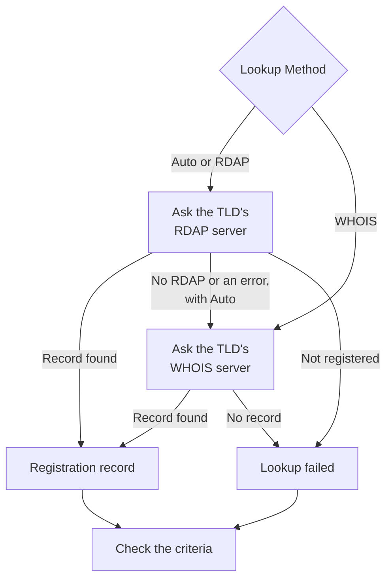

# Domain Monitor

A Domain monitor reads your domain's registration record on a schedule, to track its expiry date, registrar, name servers and status codes, and alert you before it expires. Use it for every domain your websites, APIs and email depend on: an expired registration takes all of them down at once.

:::cards
- [Create the monitor](#create-a-domain-monitor): Six steps in the dashboard.
- [Lookup methods](#lookup-methods): RDAP, WHOIS, and why **Auto** is the default.
- [Default criteria](#default-criteria): An expiry warning 30 days ahead, with no setup.
- [Troubleshooting](#troubleshooting): Retired WHOIS servers, proxies and missing dates.
:::

## How it works

On each check, a probe looks up the domain's registration record over RDAP or WHOIS, depending on the **Lookup Method**, and normalizes what it finds: the expiry date, the registrar, the name servers and the status codes. A lookup that fails is tried again, up to the number of retries you set. OneUptime then runs the record through the monitor's criteria.

If a lookup cannot produce registration data — because the TLD's service is retired, or the domain is not registered — the monitor is reported **offline** with the reason shown on the monitor's probe response, rather than being reported as healthy with a blank expiry date. A registry that answers "this domain is available" (for example DENIC's `Status: free`) is treated as **not registered**, not as a healthy record.

Internationalized domain names are accepted in either form: `münchen.de` is converted to its A-label (`xn--mnchen-3ya.de`) before the lookup.

## Before you begin

- **A role that can create monitors**: Project Owner, Project Admin, Project Member, Monitor Admin or Monitor Member, or a custom role with the Create Monitor permission.
- **Outbound access from the probe** to the registries. Your project's default probes are picked for every new monitor; a [custom probe](/docs/probe/custom-probe) needs to reach:

| Destination | Protocol | Used for |
| --- | --- | --- |
| `https://data.iana.org/rdap/dns.json` | HTTPS, port 443 | The IANA RDAP bootstrap registry, which says where each TLD's RDAP server is. Fetched once and cached for 24 hours. |
| The registries' RDAP servers | HTTPS, port 443 | RDAP lookups. |
| WHOIS servers | TCP port 43 | WHOIS lookups. |

RDAP requests honour the probe's `HTTP_PROXY_URL` / `HTTPS_PROXY_URL` / `NO_PROXY` settings. WHOIS runs over a raw socket and does not. If a probe cannot reach `data.iana.org`, **Auto** falls back to WHOIS and tries IANA again after five minutes.

## Create a domain monitor

:::steps
### Start a new monitor

Go to **Monitors** and click **Create Monitor**. Under **Monitor Type**, click **More monitor types** and pick **Domain** under **Basic Monitoring**.

### Name it

Enter a **Name**, such as `example.com registration`, then click **Next**.

### Enter the domain

Enter the **Domain Name**, such as `example.com`. Leave **Lookup Method** on **Auto** unless you have a reason not to (see [Lookup methods](#lookup-methods)).

### Test it

Click **Test Monitor**, pick a probe under **Select Probe** and click **Run Test**. **Monitor Test Result** shows the registration record the probe read, and whether RDAP or WHOIS answered.

### Review the criteria

**Monitor Criteria** starts with the [default criteria](#default-criteria): offline when the registration has expired or cannot be read, an alert when it expires in 30 days or less. Change them if you need to, then click **Next**.

### Pick probes and create

Keep or change the **Probes** and the **Monitoring Interval** (it starts at **Every 5 Minutes**), then click **Create Monitor**. The monitor's page opens.
:::

## Configuration options

| Field | Default | What to enter |
| --- | --- | --- |
| **Domain Name** | None | The registered domain, such as `example.com`. A pasted address works too: `https://example.com/pricing` is read as `example.com`. |
| **Lookup Method** | **Auto** | **Auto**, **RDAP** or **WHOIS**. See [Lookup methods](#lookup-methods). |
| **Timeout (ms)** (under **More fields**) | `10000` | How long to wait for each registration lookup, in milliseconds. |
| **Retries** (under **More fields**) | `3` | Retries after the first attempt fails. `0` means a single attempt. |

Every failed lookup is retried, with a one-second pause between attempts. That includes a registry answering that the domain is not registered, or that it has no registration service, in case the answer was a passing fault. Only a malformed domain name is reported at once, without a lookup.

The timeout applies to each request, not to the whole check: an **Auto** check that tries RDAP and then falls back to WHOIS can take twice as long, or longer.

### Lookup methods

Registration data can be read over two protocols, and which one works depends on the TLD.

| Method | Behaviour |
| --- | --- |
| **Auto** | Default. Uses RDAP when the TLD publishes an RDAP service, and falls back to WHOIS when it does not, or when the RDAP lookup fails. |
| **RDAP** | RDAP only. Fails with a clear error if the TLD publishes no RDAP service. |
| **WHOIS** | WHOIS only. |

**RDAP** ([RFC 9083](https://www.rfc-editor.org/rfc/rfc9083)) is the ICANN-mandated replacement for WHOIS. The authoritative server for each TLD is discovered from [IANA's bootstrap registry](https://www.rfc-editor.org/rfc/rfc9224), so it stays correct as registries move. Every gTLD publishes one. When the TLD's RDAP server says the domain is not registered, **Auto** takes that as the answer and does not ask WHOIS.

**WHOIS** has no equivalent discovery mechanism — clients ship a static map of TLD to WHOIS host, and those maps go stale. Every Identity Digital TLD (`.digital`, `.email`, `.life`, `.today`, `.zone` and around 290 others) is still mapped to a retired host that now answers every query with the literal text `TLD is not supported.` instead of a record. WHOIS remains the only option for the many ccTLDs that publish no RDAP service at all, such as `.io`, `.co`, `.de`, `.ch` and `.jp`.

## Monitoring Criteria

Criteria decide when the domain counts as fine or broken, and whether that declares an incident or creates an alert. Each criteria checks one or more filters:

| Filter | Conditions | What it checks |
| --- | --- | --- |
| **Is Online** | **True**, **False** | Whether the registration lookup itself succeeded. |
| **Is Request Timeout** | **True**, **False** | Whether the lookup timed out, on every attempt. |
| **Domain Expires In Days** | **Greater Than**, **Less Than**, **Greater Than Or Equal To**, **Less Than Or Equal To** | Days until the registration expires, rounded up to a whole day. |
| **Domain Is Expired** | **True**, **False** | Whether the expiry date has passed. |
| **Domain Registrar** | **Contains**, **Not Contains**, **Starts With**, **Ends With**, **Equal To**, **Not Equal To** | The registrar's name. |
| **Domain Name Server** | **Contains**, **Not Contains**, **Starts With**, **Ends With**, **Equal To**, **Not Equal To** | The domain's name servers. Matches when any one of them matches. |
| **Domain Status Code** | **Contains**, **Not Contains**, **Starts With**, **Ends With**, **Equal To**, **Not Equal To** | The domain's EPP status codes. Matches when any one of them matches. |

Status codes are normalized to their EPP names (`clientTransferProhibited`) regardless of which protocol answered, so a criterion keeps matching when **Auto** switches between RDAP and WHOIS. Registrar _names_ are whatever the answering service publishes and can differ slightly between the two protocols, so prefer **Contains** over **Equal To** for a **Domain Registrar** criterion.

Dates are normalized to ISO 8601. A date a registry publishes in a form that cannot be parsed is omitted rather than stored, so an expiry criterion cannot decide, and does not match, instead of silently answering "not expired" forever.

With two or more filters, **Match Condition** decides whether **All** of them or **Any** one must match. A criteria's **Actions** decide what it does: change the monitor status, create an alert, declare an incident, or any of these.

### Default Criteria

A new domain monitor starts with three criteria, so it warns you before a registration expires without any setup:

1. **Domain check failed** — the registration has expired, or its registration data could not be read. The monitor is marked **Offline** and an incident called "_monitor name_ domain check failed" is created. The incident resolves itself once the registration is read and current again.
2. **Domain expires soon** — the registration has not expired but expires in 30 days or less. An **alert** called "_monitor name_ domain expires soon" is created.
3. **Domain is not expired** — the monitor is marked **Operational**.

The "expires soon" warning is an alert, not an incident: it does not show on your status pages, it pages nobody unless you add an on-call policy to it, and it does not change the monitor's status. It uses your project's second alert severity, **Low** on a new project. Once the renewal shows up in the registration record, the alert resolves itself. A registry that publishes no expiry date gives the warning nothing to go on, so it stays quiet.

Criteria are checked from top to bottom, and the first one that matches decides what happens. That is why "expires soon" sits above "is not expired": a domain about to expire has not expired yet, so it would match both.

To be warned earlier, change the value of the **Domain Expires In Days** filter in the "expires soon" criteria, for example to `60`. To be paged instead, open that criteria's **Actions**: turn on **When filters match, declare an incident.**, or keep the alert and add an on-call policy to it under **On-Call Policies**.

:::details Add the warning to a monitor created before it existed
Monitors created before OneUptime added this warning have no "expires soon" criteria. To add it:

1. On the monitor, open **Configuration → Criteria** and click **Edit Monitoring Criteria**.
2. Click **Add Criteria**. Set its filter to **Domain Is Expired** / **False**, click **Add Filter**, and set the second one to **Domain Expires In Days** / **Less Than Or Equal To** / `30`. Leave **Match Condition** on **All** (it appears under the filters once there are two).
3. Under **Actions**, turn on **When filters match, create an alert.** and leave **When filters match, change monitor status.** off, so it creates an alert and does not change the monitor status.
4. Drag the new criteria above the criteria that marks the monitor as online, then save.
:::

### Example criteria

| Goal | Filter | Condition | Value |
| --- | --- | --- | --- |
| Alert when the domain expires within 30 days (a default) | **Domain Expires In Days** | **Less Than Or Equal To** | `30` |
| Offline when the domain has expired | **Domain Is Expired** | **True** | — |
| Offline when the registration cannot be read | **Is Online** | **False** | — |
| Alert when the name servers change | **Domain Name Server** | **Not Contains** | `ns1.example.com` |
| Alert when the domain is unlocked for transfer | **Domain Status Code** | **Not Contains** | `clientTransferProhibited` |

**Domain Name Server** and **Domain Status Code** match when _any_ one value matches, so **Not Contains** matches as soon as one name server, or one status code, does not contain the text.

## Best Practices

1. **Give yourself time to renew** — The default warning comes 30 days before expiry. If renewing needs approvals or a payment that takes longer, raise it to 60 days.
2. **Cover failed lookups** — Include an **Is Online** / **False** filter in your offline criteria so an unreadable registration is not mistaken for a healthy one. New monitors have it in their default criteria; a monitor created before it was added needs it added by hand. To ride out a WHOIS server that rate limits the probe now and then, tick **Evaluate this criteria over a period of time** under that filter and pick **All Values**: the domain then goes offline only when every lookup in the window failed.
3. **Monitor all critical domains** — Include primary domains, subdomains registered separately, and any domains used for email or APIs.
4. **Track registrar changes** — Add a criteria with **Domain Registrar** / **Not Contains** / your registrar's name, to catch an unauthorized transfer.

## Troubleshooting

:::details The WHOIS server "answered without any registration data"
The TLD's WHOIS host is retired, is rate limiting the probe, or is briefly broken. A retired host, such as the one still mapped for Identity Digital TLDs, answers `TLD is not supported.` every time. If the failure persists with **Lookup Method** on **WHOIS**, switch to **Auto**, so the probe reads the TLD's RDAP service where there is one.
:::

:::details The check fails with "No RDAP service is published"
The monitor uses **RDAP**, and the TLD publishes no RDAP service, as many ccTLDs do. Switch **Lookup Method** to **Auto**, which falls back to WHOIS.
:::

:::details The domain is reported as not registered
The registry answered that the domain is available. Check the spelling, and that you entered the registered domain, such as `example.com`, not a subdomain.
:::

:::details Lookups fail on a probe behind a proxy
RDAP goes through the probe's proxy settings, WHOIS does not. Allow outbound TCP port 43 for WHOIS, or use **Auto** or **RDAP** for TLDs that publish an RDAP service.
:::

:::details The expiry date is empty, and the expiry criteria never fire
The registry publishes no expiry date, or one in a form that cannot be parsed. Expiry criteria cannot decide without a date, so they stay quiet. **Is Online** still tells you whether the record can be read.
:::

## Next steps

:::cards
- [SSL Certificate Monitor](/docs/monitor/ssl-certificate-monitor): Get warned before the certificates on the domain expire.
- [DNS Monitor](/docs/monitor/dns-monitor): Check that the domain's records resolve, and what they say.
- [DNSSEC Monitor](/docs/monitor/dnssec-monitor): Validate a signed zone's chain of trust.
- [Escalation Rules](/docs/on-call/escalation-rules): Decide who gets paged by the alerts and incidents.
:::
