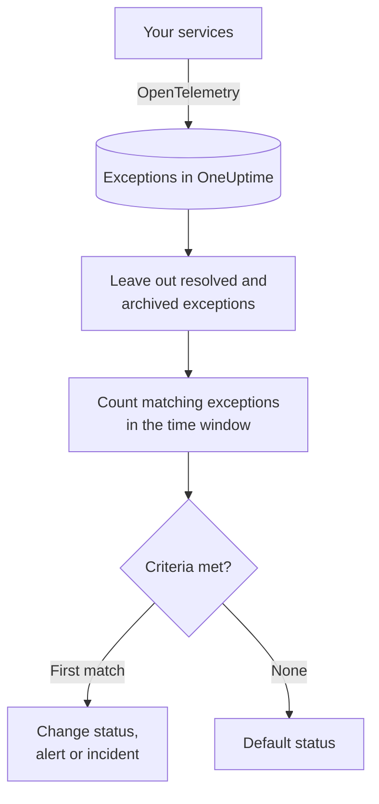

# Exceptions Monitor

An Exceptions monitor counts the exceptions your services report to OneUptime that match your filters — message, exception type, environment, service — over a time window, and changes the monitor's status, creates an alert or declares an incident when the count meets your criteria. Use it to alert on any new crash in production, on one exception type, or on a sudden rise in errors.

:::cards
- [Create the monitor](#create-an-exceptions-monitor): Pick the exceptions to count and when to alert.
- [Environments](#environments): Scope the monitor to `production`.
- [How it is evaluated](#how-it-is-evaluated): What is counted, and what resolving an exception does.
- [Criteria](#criteria): The conditions and the defaults.
:::

## How it works



Every minute, OneUptime counts the exceptions that match the monitor's filters and occurred within its time window, leaving out exceptions you have marked resolved or archived. It checks that count against the monitor's criteria from top to bottom, and the first criteria that matches decides what happens. When none matches, the monitor goes back to its default status.

## Before you begin

- Your services send exceptions to OneUptime over OpenTelemetry. See [OpenTelemetry](/docs/telemetry/open-telemetry).
- To scope a monitor to an environment, your services must set the `deployment.environment` resource attribute.

## Create an exceptions monitor

:::steps
### Start a new monitor

Go to **Monitors** and click **Create Monitor**.

### Choose Exceptions

Under **Monitor Type**, click **More monitor types** and pick **Exceptions** under **Telemetry**, or type `exceptions` in the search box. Enter a **Name**, then click **Next**.

### Choose the exceptions to count

In **Exception Monitor Configuration**, set **Filter Exception Message**, **Exception Types**, **Environments** and **Monitor exceptions for (time)**. A filter you leave empty matches every exception. **Exceptions Preview**, under the filters, shows the exceptions they match right now.

### Narrow them down (optional)

Open **More fields** to filter by telemetry service or infrastructure entity, or to count resolved and archived exceptions too.

### Set the criteria

The **Monitor Criteria** card starts with two criteria: offline, with an incident, when any exception matches; online when none does. Change them to what you want to alert on — see [Criteria](#criteria).

### Create the monitor

Click **Create Monitor**. The monitor opens on its **Overview** page, and its first evaluation runs within a minute.
:::

## What it queries

| Field | What it matches | Default |
| --- | --- | --- |
| **Filter Exception Message** | Exceptions whose message contains this text, ignoring case. | Empty: every exception |
| **Exception Types** | Exceptions of any of these types, separated by commas, such as `TypeError, NullReferenceException`. The type name must match exactly. | Empty: every type |
| **Environments** | Exceptions from any of these environments, separated by commas — see [Environments](#environments). | Empty: every environment |
| **Monitor exceptions for (time)** | Exceptions from the last 5 seconds up to the last 24 hours. | **Last 1 minute** |
| **Filter by Telemetry Service** (under **More fields**) | Exceptions from any of the chosen services. | Empty: every service |
| **Filter by Infrastructure Entity** (under **More fields**) | Exceptions from any of the chosen hosts, pods, containers and other entities. | Empty: every entity |
| **Include Resolved Exceptions** (under **More fields**) | Also count exceptions marked as resolved. | Off |
| **Include Archived Exceptions** (under **More fields**) | Also count exceptions that are archived. | Off |

All the filters you set must match for an exception to be counted.

### Environments

Environments come from the `deployment.environment` OpenTelemetry resource attribute on each exception, the same value the Exceptions explorer filters with `env:production`. Enter one environment, or several separated by commas; an exception is counted when its environment matches any of them.

Matching is exact and case-sensitive: `production` does not match `Production` or `prod`. Exceptions with no environment are not counted when this filter is set. Leave it empty to count exceptions from every environment, including those with no environment.

The environment filter is combined with every other filter, so a monitor scoped to one telemetry service and `production` only counts that service's production exceptions.

When creating the monitor through the API, set `environments` on the step's `exceptionMonitor` to a list of environment names:

```json
{
  "exceptionMonitor": {
    "telemetryServiceIds": [],
    "environments": ["production"],
    "exceptionTypes": [],
    "message": "",
    "includeResolved": false,
    "includeArchived": false,
    "lastXSecondsOfExceptions": 300
  }
}
```

## How it is evaluated

- **Every minute.** An Exceptions monitor is not checked by probes, so it has no interval to set and no **Probes & Interval** page.
- **Occurrences, not exception types.** The monitor counts every time a matching exception occurred within **Monitor exceptions for (time)**. One exception thrown 40 times counts 40.
- **Resolved and archived exceptions are left out.** Unless you turn on **Include Resolved Exceptions** or **Include Archived Exceptions**, the occurrences of an exception you marked resolved or archived do not count. Marking an exception resolved can therefore close the incident it opened. When a resolved exception occurs again, it is un-resolved automatically and counted again.
- **No exceptions is a count of 0.**
- **Criteria from top to bottom.** The first criteria that matches decides, so put the most severe one first.

Each status change, with the reason for it, is recorded on the monitor's **Status Timeline**.

## Criteria

An Exceptions monitor's criteria have one **Filter Type**: **Exception Count**, the number of exceptions that matched in the window. Pick a **Filter Condition** and a **Value**.

| Filter Condition | Matches when the exception count is… |
| --- | --- |
| **Greater Than** | above the value |
| **Greater Than Or Equal To** | the value or above |
| **Less Than** | below the value |
| **Less Than Or Equal To** | the value or below |
| **Equal To** | exactly the value |
| **Not Equal To** | anything but the value |

Exception counts have no anomaly conditions: there is no baseline to compare them with.

A new Exceptions monitor starts with these criteria:

| Criteria | Filter | Effect |
| --- | --- | --- |
| Check if … has exceptions | **Exception Count** **Greater Than** `0` | Marks the monitor offline and declares an incident, resolved automatically |
| Check if … has no exceptions | **Exception Count** **Equal To** `0` | Marks the monitor online |

## Worked example: production exceptions only

You want an incident whenever the API throws in production, and nothing for staging. You set **Environments** to `production` and **Monitor exceptions for (time)** to **Last 5 minutes**, and keep the default criteria. In the last five minutes:

| Exceptions | Environment | State | Counted? |
| --- | --- | --- | --- |
| `TypeError` × 3 | `production` | Active | Yes: 3 |
| `TypeError` × 40 | `staging` | Active | No: another environment |
| `TimeoutError` × 2 | none | Active | No: no environment |
| `NullReferenceException` × 4 | `production` | Resolved after they occurred | No: resolved |

The **Exception Count** is 3, so **Greater Than** `0` matches: the monitor goes offline and an incident is declared. Once five minutes pass with no active production exception, the online criteria matches and the incident resolves itself.

## Troubleshooting

:::details Exceptions appear in the explorer, but the monitor counts 0
Check the **Environments** value against the explorer's `env:` filter: matching is exact and case-sensitive, and exceptions without an environment are left out when the filter is set. Then check whether those exceptions are resolved or archived. Open the monitor's **Criteria** page (under **Configuration**) and click **Edit Monitoring Criteria**: **Exceptions Preview** shows what the filters match.
:::

:::details The incident resolved when I resolved the exception
That is expected. Resolved exceptions are not counted, so the count dropped and the criteria stopped matching. If the exception occurs again, it is un-resolved and counted again. Turn on **Include Resolved Exceptions** to count them regardless.
:::

:::details An exception type filter matches nothing
**Exception Types** are matched exactly, against the type name the exception was reported with, such as `TypeError`. Copy the type from the Exceptions explorer.
:::

## Next steps

:::cards
- [Traces Monitor](/docs/monitor/traces-monitor): Alert on failing spans and endpoints.
- [Logs Monitor](/docs/monitor/logs-monitor): Alert on log volume and content.
- [Incident & Alert Templating](/docs/monitor/incident-alert-templating): Write useful alert titles and descriptions.
- [OpenTelemetry](/docs/telemetry/open-telemetry): Send exceptions to OneUptime.
:::
