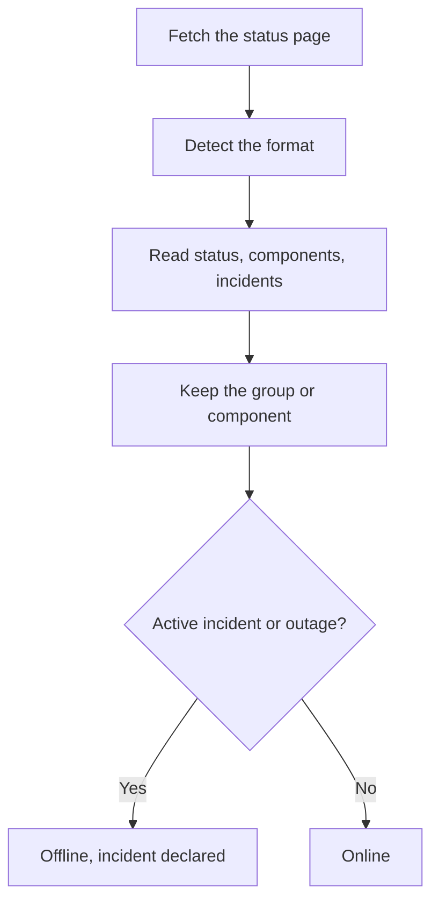

# External Status Page Monitor

An External Status Page monitor watches the public status page of a service you depend on — AWS, GCP, Azure, GitHub, OpenAI, Anthropic and many more — and alerts you when that provider reports an outage or degraded performance. Use it to learn about upstream problems as soon as the provider reports them, and to tell them apart from your own.

:::cards
- [Create the monitor](#creating-an-external-status-page-monitor): Paste a status page URL and pick what to watch.
- [Scope it](#configuration-options): Watch one component group or one component.
- [Criteria](#monitoring-criteria): What counts as down, out of the box.
- [Popular status pages](#popular-status-page-urls): URLs for the services most teams depend on.
:::

## How it works

On every check, a probe fetches the status page, works out which format it uses, and reads the overall status, the components and the active incidents. If you scoped the monitor to a component group or a component, only those count. The criteria then decide whether the monitor is online or offline.

You can use it to:

- Monitor the availability of third-party services your application depends on
- Get alerted when upstream providers experience outages
- Track individual component statuses
- Scope monitoring to a single component group (e.g., only OpenAI's "APIs"), so unrelated incidents elsewhere on the page do not trip your monitor
- Detect degraded performance before it impacts your users
- Correlate your own incidents with upstream provider issues

## Supported Providers

| Provider                 | Description                                                            |
| ------------------------ | ---------------------------------------------------------------------- |
| **Auto** (default)       | Automatically detects the status page format                           |
| **Atlassian Statuspage** | Status pages powered by Atlassian Statuspage (JSON API)                |
| **incident.io**          | Status pages powered by incident.io (e.g. `https://status.openai.com`) |
| **RSS**                  | Status pages that provide an RSS feed                                  |
| **Atom**                 | Status pages that provide an Atom feed                                 |

### Auto-Detection

When set to **Auto**, OneUptime detects the status page format automatically, in this order:

1. First, it tries the incident.io status page API (`/proxy/<host>`).
2. Next, it tries the Atlassian Statuspage JSON API (`/api/v2/status.json`, `/api/v2/components.json`, and `/api/v2/incidents/unresolved.json`).
3. If those fail, it attempts to parse the page as an RSS or Atom feed.
4. As a final fallback, it performs a basic HTTP reachability check.

> [!NOTE]
> incident.io is checked first because some incident.io status pages (such as `https://status.openai.com`) also expose a limited Atlassian-compatible endpoint that omits component groups and active incidents. Checking incident.io first ensures the richer, group-aware data is used.

The reachability check is also the fallback when a provider you chose explicitly fails. It only tells you whether the page answers — online on a `2xx` or `3xx` response — and reports no components or incidents.

## Creating an External Status Page Monitor

:::steps
### Start a new monitor

Go to **Monitors** and click **Create Monitor**. Under **Monitor Type**, click **More monitor types** and pick **External Status Page** under **Basic Monitoring**, or type `statuspage` in the search box. Enter a **Name**, then click **Next**.

### Enter the status page URL

Enter the **Status Page URL**. Leave the **Provider** on **Auto** unless you know the format.

### Scope it, if you need to

Open **More fields** to enter a **Component Group Filter (Optional)**, such as `APIs`, and a **Component Name Filter (Optional)** to watch a single component (within the group, if a group is set).

### Test it

Click **Test Monitor** to fetch the page once, and check the provider, components and incidents it found.

### Review the criteria

The criteria step starts with [the default criteria](#default-criteria), which mark the monitor offline when the provider reports an active incident or an outage in scope. Change them if you need to, then click **Next**.

### Pick probes and create

Select the **Probes** and a **Monitoring Interval** — it starts at **Every 5 Minutes** — then click **Create Monitor**.
:::

## Configuration Options

| Option | What to enter | Default |
| --- | --- | --- |
| **Status Page URL** | The URL of the status page. For Atlassian Statuspage and incident.io-powered sites, this is typically the root URL (e.g., `https://status.example.com`). For RSS/Atom feeds, enter the feed URL directly. | — |
| **Provider** | **Auto** to detect the format, or **Atlassian Statuspage**, **incident.io**, **RSS** or **Atom** if you know it. | **Auto** |
| **Component Group Filter (Optional)** | The group to scope the monitor to. Under **More fields**. | All groups |
| **Component Name Filter (Optional)** | The component to watch. Under **More fields**. | All components in scope |
| **Timeout (ms)** | The maximum time to wait for the status page. Under **More fields**. | `10000` (10 seconds) |
| **Retries** | How many times to retry, a second apart, after the first attempt fails; `0` means a single attempt. Under **More fields**. | `3` (up to 4 attempts) |

### Component Group Filter

If the status page organizes its components into groups, you can scope the monitor to a single group. For example, on `https://status.openai.com`, entering `APIs` scopes the monitor to OpenAI's API services.

When a component group is set, the **active incident count** and **overall status** are computed using only the components in that group — an incident affecting an unrelated group (for example, ChatGPT) will not trip a monitor scoped to the "APIs" group.

Component group filtering is supported for **Atlassian Statuspage** and **incident.io** providers. RSS and Atom feeds do not expose component groups.

### Component Name Filter

If the status page reports on multiple components, you can specify a component name to monitor only that component. The filter matches any component whose name contains what you enter, ignoring case — `actions` matches a component named "Actions".

When a component group is also set, the component name filter is applied **within** that group, letting you target a single component inside a larger group. When neither filter is specified, all components in scope are monitored. On an RSS or Atom feed, the name filter is matched against the titles of the feed's items.

> [!WARNING]
> A filter that matches nothing looks healthy: with no components in scope, there is nothing to report an outage. Check the spelling against the status page, and use **Test Monitor** to see what the filter keeps.

## Monitoring Criteria

You can configure criteria to decide when the external service is considered online or offline, based on:

| Filter type | What it checks | Filter conditions |
| --- | --- | --- |
| **External Status Page Is Online** | Whether the status page is reachable and returning status data | True or False |
| **External Status Page Overall Status** | The overall status the page reports | Equal To, Not Equal To, Contains, Not Contains, Starts With, Ends With |
| **External Status Page Component Status** | The status of the components in scope (respecting the component group / component name filters): Operational, Under Maintenance, Degraded Performance, Partial Outage, Major Outage or Full Outage | Equal To, Not Equal To, Contains, Not Contains, Starts With, Ends With |
| **External Status Page Active Incidents** | The number of currently active incidents reported on the status page (scoped to the component group / component when a filter is set) | Equal To, Not Equal To, and the numeric comparisons |
| **External Status Page Response Time (in ms)** | How long it takes to fetch the status page data | Greater Than, Less Than, Greater Than Or Equal To, Less Than Or Equal To |

The overall status is whatever the page says, so its values vary by provider: an Atlassian Statuspage reports its own description, such as `All Systems Operational`; a feed reports `operational` or `degraded_performance`; the reachability check reports `reachable` or `unreachable`. These comparisons are case-sensitive. To alert on outages, **External Status Page Active Incidents** and **External Status Page Component Status** are usually more reliable.

On an RSS or Atom feed, the items of the last 24 hours count as active incidents: an RSS item by its publication date, an Atom entry by its update date.

### Default Criteria

By default, OneUptime seeds criteria based on what actually matters for a status page — its active incidents and component health, rather than mere reachability:

| Criteria | Filters | Effect |
| --- | --- | --- |
| Offline | **Any** of: the page is not online; there is at least one active incident in scope; a component in scope reports Degraded Performance, Partial Outage, Major Outage or Full Outage | Marks the monitor offline and declares an incident, which resolves itself when the criteria stops matching |
| Online | **All** of: the page is online; there are no active incidents in scope | Marks the monitor online |

Because the active incident count and component statuses respect the component group / component name filters, these default criteria automatically target only the components you care about.

## Template variables

When creating incidents or alerts from External Status Page monitors, you can use these variables in titles, descriptions and remediation notes (see [Incident & Alert Dynamic Templating](/docs/monitor/incident-alert-templating)):

| Variable                  | Description                                                                     |
| ------------------------- | ------------------------------------------------------------------------------- |
| `{{isOnline}}`            | Whether the status page is online (true/false)                                  |
| `{{responseTimeInMs}}`    | Response time in milliseconds                                                   |
| `{{failureCause}}`        | Reason for failure, if any                                                      |
| `{{overallStatus}}`       | The overall status indicator value                                              |
| `{{activeIncidentCount}}` | Number of active incidents (scoped to the filter, if any)                       |
| `{{componentStatuses}}`   | JSON array of component statuses (`name`, `status`, `description`, `groupName`) |
| `{{provider}}`            | Detected provider (Atlassian Statuspage, incident.io, RSS, Atom); empty after a reachability check |
| `{{componentGroup}}`      | Component group the monitor is scoped to, if any                                |
| `{{componentName}}`       | Component the monitor is scoped to, if any                                      |

## Popular Status Page URLs

Here is a list of popular service status pages. Many of these use Atlassian Statuspage or incident.io, so the **Auto** provider detects them automatically. A page built on neither, and that is not a feed, only gets the reachability check — for those, monitor the provider's RSS or Atom feed instead, if it publishes one.

| Service                      | Status Page URL                               |
| ---------------------------- | --------------------------------------------- |
| AWS                          | `https://health.aws.amazon.com/health/status` |
| Google Cloud Platform        | `https://status.cloud.google.com`             |
| Microsoft Azure              | `https://status.azure.com`                    |
| GitHub                       | `https://www.githubstatus.com`                |
| OpenAI                       | `https://status.openai.com`                   |
| Anthropic                    | `https://status.anthropic.com`                |
| Cloudflare                   | `https://www.cloudflarestatus.com`            |
| Datadog                      | `https://status.datadoghq.com`                |
| PagerDuty                    | `https://status.pagerduty.com`                |
| Twilio                       | `https://status.twilio.com`                   |
| Stripe                       | `https://status.stripe.com`                   |
| Slack                        | `https://status.slack.com`                    |
| Atlassian (Jira, Confluence) | `https://status.atlassian.com`                |
| Vercel                       | `https://www.vercel-status.com`               |
| Netlify                      | `https://www.netlifystatus.com`               |
| DigitalOcean                 | `https://status.digitalocean.com`             |
| Heroku                       | `https://status.heroku.com`                   |
| MongoDB Atlas                | `https://status.cloud.mongodb.com`            |
| Fastly                       | `https://status.fastly.com`                   |
| New Relic                    | `https://status.newrelic.com`                 |
| Sentry                       | `https://status.sentry.io`                    |
| CircleCI                     | `https://status.circleci.com`                 |

## Best Practices

- **Use the Auto provider** unless you know the exact format — auto-detection works well for most status pages.
- **Scope to a component group** if you only depend on part of a provider (e.g. only OpenAI's "APIs"), so unrelated incidents don't create noise.
- **Monitor specific components** if you only depend on certain services.
- **Combine with your own monitors** — pair External Status Page monitors with your own API and Website monitors. When both go down at once, the upstream status page points you at the root cause faster.

## Troubleshooting

:::details The monitor is offline, but the incident is for a part of the service I do not use
Scope the monitor with a **Component Group Filter**, a **Component Name Filter**, or both. The active incident count and the component statuses then only count what is in scope.
:::

:::details The monitor never goes offline, even during an outage
The filters may match nothing, which looks healthy, or the page may only get the reachability check. Run **Test Monitor** and check the provider and the components it found.
:::

:::details Auto picks the wrong format, or finds no components
Set the **Provider** to the one you know the page uses. For an RSS or Atom feed, enter the feed's own URL rather than the status page's.
:::

:::details An internal status page cannot be reached
A probe refuses private network addresses unless it is allowed to reach them. Set `PROBE_ALLOW_PRIVATE_NETWORK_MONITORS=true` on a probe inside your network — see [Private Network Access](/docs/self-hosted/private-network-access).
:::

## Next steps

:::cards
- [Incident & Alert Dynamic Templating](/docs/monitor/incident-alert-templating): Put the provider's status into your incident titles.
- [API Monitor](/docs/monitor/api-monitor): Check your own endpoints next to your provider's status.
- [Creating a Monitor](/docs/monitor/create-monitor): The steps every monitor type shares.
:::
