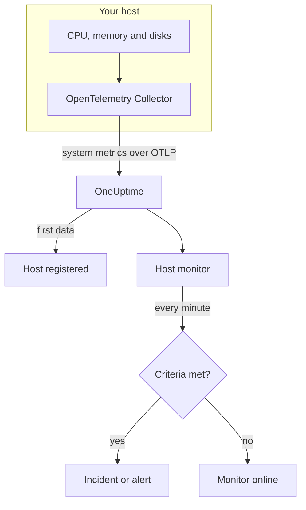

# Host Monitor

A Host monitor watches one machine — its CPU, memory, disks, load and processes — and tells you when it is saturated or filling up. It reads the `system.*` OpenTelemetry metrics an OpenTelemetry Collector sends from the host, the same data the **Hosts** product shows, so nothing is probed from outside.

:::cards
- [Create the monitor](#create-a-host-monitor): Six steps in the dashboard.
- [Templates](#pre-built-alert-templates): Five ready-made alerts for CPU, memory, disk, load and processes.
- [Metrics](#collected-metrics): The host metrics you can alert on, and their units.
- [Host or Server / VM?](#host-monitor-or-server-vm-monitor): Which of the two machine monitors to use.
:::

## How it works

An OpenTelemetry Collector runs on the host with the `hostmetrics` receiver. Every 30 seconds it reads the host's CPU, memory, disk, network, load and process figures and sends them to OneUptime over OTLP. The first data from a host registers it under **Hosts**.

A Host monitor is tied to one host. Every minute it runs its query over that host's metrics and compares the result with its criteria.

### Host monitor or Server / VM monitor?

OneUptime has two monitors for machines. They can run on the same host.

| | Host monitor | Server / VM monitor |
| --- | --- | --- |
| **Agent** | An OpenTelemetry Collector with the `hostmetrics` receiver | The OneUptime Infrastructure Agent |
| **Data** | `system.*` and `process.*` OpenTelemetry metrics, the same ones the **Hosts** pages chart | A status report the agent pushes to the monitor |
| **Criteria** | Thresholds or anomaly detection on any metric query or formula | Built-in checks such as CPU, memory and disk usage |
| **Setup** | Install the collector; the host registers itself | Create the monitor, then give its secret key to the agent |

Use the Host monitor when the host already sends OpenTelemetry data, or when you want logs and richer metrics from the same collector. See [Server / VM Monitor](/docs/monitor/server-monitor) for the other one.

## Before you begin

- **Run an OpenTelemetry Collector on the host** with the `hostmetrics` receiver. [Host OpenTelemetry Collector](/docs/telemetry/host-otel-collector) covers Linux, macOS and Windows, and **Products → Infrastructure → Hosts → Documentation** gives a ready-made configuration.
- **Turn on the utilization metrics.** `system.cpu.utilization`, `system.memory.utilization` and `system.filesystem.utilization` are optional in the receiver, and the CPU, memory and filesystem templates need them. The dashboard's configuration turns them on.
- **Check the host is registered.** It appears under **Products → Infrastructure → Hosts → All Hosts**, named after its `host.name`, once its first data arrives.

## Create a Host monitor

:::steps
### Start a new monitor

Go to **Monitors** and click **Create Monitor**.

### Pick Host

Under **Monitor Type**, click **More monitor types** and pick **Host** under **Infrastructure**. Enter a **Name** — it is used in incident and alert titles — and click **Next**.

### Choose the host

Under **Host Monitor Configuration**, pick the machine from **Host**. Every host that has sent data is in the list.

### Choose what to watch

Pick one of the three tabs:

- **Quick Setup** — click a [template](#pre-built-alert-templates). It sets the metric, aggregation, time range and thresholds, and replaces the criteria below with its own. You can still change the **Time Range**.
- **Custom Metric** — pick one metric from **Host Metric**, then set **Aggregation** and **Time Range**.
- **Advanced** — build queries and formulas yourself under **Select Metrics**, for example a filter on `state` or a group-by on `mountpoint`.

### Check the criteria

Open each criteria under **Monitor Criteria** and check its **Metric**, **Aggregation**, **Condition** and **Threshold**. A template fills these in. With **Custom Metric** or **Advanced**, the monitor starts with the [default criteria](#default-criteria), which only notice a metric dropping to zero, so set your own threshold.

### Create the monitor

Click **Create Monitor**. OneUptime opens the monitor's page and evaluates it every minute. Incidents and alerts it raises are also listed on the host's **Incidents** and **Alerts** pages.
:::

> [!TIP]
> To set up several templates at once, open the host from **Products → Infrastructure → Hosts** and go to **Recommendations**. Pick the templates you want, choose who is paged, and OneUptime creates one monitor per template.

## Monitor settings

| Field | Tab | What it does |
| --- | --- | --- |
| **Host** | All | Required. Scopes every query to the host's `resource.host.name`. |
| **Host Metric** | Custom Metric | One metric from the [catalog](#collected-metrics), grouped as CPU, memory, disk, network, load and processes. |
| **Aggregation** | Custom Metric | How samples are combined: **Average**, **Maximum**, **Minimum**, **Sum** or **Count**. Starts at the metric's usual aggregation. |
| **Time Range** | All | The rolling window the query reads, from **Past 1 Minute** to **Past 365 Days**. A new monitor starts at **Past 1 Minute**; templates set their own. |
| **Select Metrics** | Advanced | The query builder: **Metric**, **Aggregate by**, **Filter by attributes**, **Group by**, plus **Add Metric** and **Add Formula** to combine queries. |

## Pre-built Alert Templates

**Quick Setup** offers five templates. Each builds a complete monitor: a query, a criteria that fires and one that recovers. Thresholds are starting points you can edit.

A criteria fires only when the condition holds for every minute of its window, and recovers 10% past the threshold so a value hovering at the line does not flap.

| Template | Severity | Watches | Fires when | Recovers when |
| --- | --- | --- | --- | --- |
| High CPU Utilization | Warning | `system.cpu.utilization` for the `user` and `system` states, added and shown as a percentage, past 5 minutes | Above 80% | At or below 72% |
| High Memory Utilization | Warning | `system.memory.utilization` for the `used` state, as a percentage, past 5 minutes | Above 85% | At or below 76.5% |
| High Filesystem Usage | Critical | `system.filesystem.utilization`, Max per `mountpoint` and `device`, as a percentage, past 5 minutes | Above 90% | At or below 81% |
| High Load Average (1m) | Warning | `system.cpu.load_average.1m`, Avg, past 5 minutes | Above 4 | At or below 3.6 |
| High Process Count | Warning | `system.processes.count`, Max, past 5 minutes | Above 2000 | At or below 1800 |

**Severity** is the label the picker shows. The incident and alert a template creates start on your project's most severe incident and alert severity; change them in the criteria.

- **CPU** is busy time (`user` plus `system`), the same figure the host's **Overview** charts. Iowait and steal are left out.
- **Memory** excludes buffers and page cache, so a host that is mostly cache does not trip it.
- **Filesystem** opens one incident per mount. Read-only pseudo-filesystems, such as snap `squashfs` mounts or macOS `devfs`, are always 100% full; exclude them in the collector's `filesystem` scraper.
- **Load average** is a raw run-queue length, not divided by the number of cores: 4 is saturation on a 2-core host and routine on a 32-core one, so raise it on large hosts.
- **Process count** compares the largest single process state (`running`, `sleeping`, …), not the host's total, so it will not match a process listing. The processes scraper reports on Linux only.

## Collected Metrics

The **Host Metric** list offers these metrics. Each carries `resource.host.name`, which is how the monitor scopes its queries to one host.

> [!IMPORTANT]
> The utilization metrics are a ratio from 0 to 1, not a percentage: use `0.8` for 80% in a threshold on the raw metric. The templates convert to a percentage with a formula, so their thresholds read 80, 85 and 90.

### CPU

| Metric | Unit | Description |
| --- | --- | --- |
| `system.cpu.utilization` | ratio | Share of CPU time spent in each `state` (`user`, `system`, `idle`, …). Filter on `state`: an average across every state never reaches a useful threshold. |
| `process.cpu.utilization` | ratio | CPU utilization of each process on the host. |

### Memory

| Metric | Unit | Description |
| --- | --- | --- |
| `system.memory.utilization` | ratio | Share of physical memory in each `state` (`used`, `free`, `cached`, …). Filter on `state = used` for memory in use. |
| `system.memory.usage` | bytes | Memory usage in bytes. |

### Disk

| Metric | Unit | Description |
| --- | --- | --- |
| `system.filesystem.utilization` | ratio | Share of each filesystem's capacity in use, per `mountpoint` and `device`. |
| `system.filesystem.usage` | bytes | Filesystem usage in bytes. |

### Network

| Metric | Unit | Description |
| --- | --- | --- |
| `system.network.io` | bytes | Bytes received and sent. A lifetime counter. |

### Load

| Metric | Unit | Description |
| --- | --- | --- |
| `system.cpu.load_average.1m` | count | Load average over the last minute. |
| `system.cpu.load_average.5m` | count | Load average over the last 5 minutes. |
| `system.cpu.load_average.15m` | count | Load average over the last 15 minutes. |

### Processes

| Metric | Unit | Description |
| --- | --- | --- |
| `system.processes.count` | count | Processes on the host, one series per process `status`. |

The query builder in **Advanced** lists every metric the host sends, not only these.

## Monitoring criteria

A criteria compares one of the monitor's queries or formulas with a threshold. A Host monitor's criteria have no **Filter Type**: every rule checks the metric value, with these fields.

| Field | What it does |
| --- | --- |
| **Metric** | The query or formula to check, by its variable name. |
| **Aggregation** | How the values in the window become one answer: **Average**, **Sum**, **Maximum Value**, **Minimum Value**, **All Values** (every value must match) or **Any Value** (one is enough). |
| **Condition** | **Greater Than**, **Less Than**, **Greater Than Or Equal To**, **Less Than Or Equal To** or **Equal To** — or an anomaly condition: **Anomalously High**, **Anomalously Low** or **Anomalous**. |
| **Threshold** | The value to compare with. A unit list sits beside it when the metric has a unit. Not shown for anomaly conditions. |
| **Sensitivity** | Anomaly conditions only. **Low** (4σ), **Medium** (3σ, the default) or **High** (2σ). |
| **Baseline Window** | Anomaly conditions only. 14 days (the default), 28, 60 or 90 days of history. |
| **If No Data** | Under **More fields**. What happens when the window has no samples: **Ignore** (the default), **Treat As Zero** or **Trigger**. |

Anomaly conditions compare each value with the same hour of the week in the baseline. They stay in a "Learning" state, and raise nothing, until the baseline window holds enough history.

Each criteria also says what to do when it matches: change the monitor status, create an alert, or declare an incident. Criteria are checked from top to bottom, and the first one that matches decides.

### Default criteria

A monitor you do not build from a template starts with two criteria:

| Order | Criteria | Matches when | Then |
| --- | --- | --- | --- |
| 1 | Check if _monitor name_ is offline | Any value of the first query is `0` | Marks the monitor **Offline** and declares the incident "_monitor name_ is offline", which resolves itself when the monitor recovers. |
| 2 | Check if _monitor name_ is online | Any value is above `0` | Marks the monitor **Operational**. |

> [!IMPORTANT]
> Silence matches neither criteria: a host that stops sending data leaves the monitor as it was. To be told when the host goes quiet, set **If No Data** to **Trigger** on a criteria. Time OneUptime itself was not receiving is never no data: a check whose window holds it waits instead, as [When OneUptime Is Not Receiving Data](/docs/monitor/when-oneuptime-is-not-receiving) explains.

## Troubleshooting

:::details The host is not in the Host list
Hosts register themselves from the collector's data, which needs a `host.name` and the host's OS type — both come from the collector's `resourcedetection` processor. Check that the collector is running and that the host is listed under **Products → Infrastructure → Hosts → All Hosts**. [Host OpenTelemetry Collector](/docs/telemetry/host-otel-collector) covers the configuration.
:::

:::details A CPU or memory threshold never fires
The utilization metrics are ratios that top out at `1.0`, so a hand-written threshold of `80` is never crossed: use `0.8`, or start from a template, which converts to a percentage. Also filter on `state` — `user` and `system` for CPU, `used` for memory. An average across every state stays near 1 divided by the number of states.
:::

:::details Incidents fire for the wrong host
The monitor scopes every query with `resource.host.name` equal to the host you picked. Hosts that report the same `host.name` collapse into one series, so give each host a unique name.
:::

:::details High Filesystem Usage fires for a mount that is always full
Read-only pseudo-filesystems, such as snap `squashfs` loop mounts under `/snap` or macOS `devfs`, are 100% full by design and never recover. Exclude them from the collector's `filesystem` scraper.
:::

## Next steps

:::cards
- [Host OpenTelemetry Collector](/docs/telemetry/host-otel-collector): Install and configure the collector this monitor reads.
- [Server / VM Monitor](/docs/monitor/server-monitor): The agent-push monitor for machines.
- [Metrics Monitor](/docs/monitor/metrics-monitor): Alert on any metric, across hosts and services.
- [Incidents](/docs/incidents/index): What happens after a criteria declares an incident.
:::
