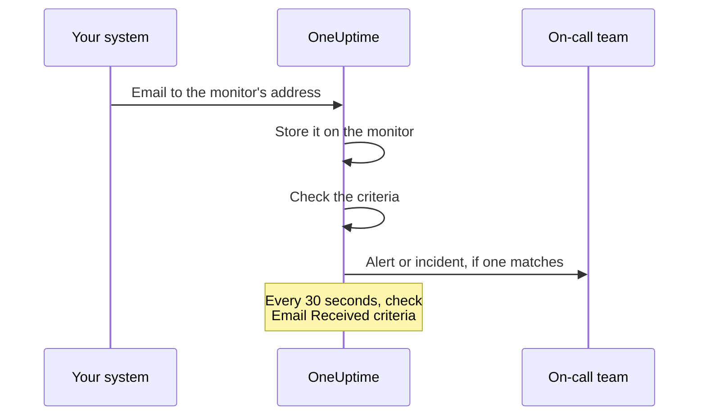

# Incoming Email Monitor

An Incoming Email monitor gives you an email address that belongs to one monitor. Anything that can send email — a backup job, a legacy system, a cloud provider's alerting — sends its results there, and OneUptime checks every email against your criteria to mark the monitor down, open an incident or create an alert, and to resolve them when the all-clear arrives.

:::cards
- [Create the monitor](#creating-an-incoming-email-monitor): Get an address and point your sender at it.
- [Verify the address](#verifying-the-address-with-the-sender): Read a sender's confirmation email on the monitor.
- [Write criteria](#available-filter-types): Match the subject, sender or body, or alert when email stops.
- [Use the email in alerts](#template-variables): Put the subject and body into titles and descriptions.
:::

## How It Works

Email is a push model: your system sends, and OneUptime listens. Each email is checked against the monitor's criteria as it arrives. Criteria that look for email that *should* have arrived are also checked on a schedule, every 30 seconds.



1. When you create an Incoming Email monitor, OneUptime gives it a unique email address.
2. Every email sent to that address is stored on the monitor and evaluated against its criteria, from the top; the first criteria that matches decides.
3. A matching criteria can change the monitor's status, create an alert and declare an incident. An incident or alert whose **Auto Resolve** option is on is resolved when a different criteria matches later — the one that marks the monitor online, for example.

## Creating an Incoming Email Monitor

:::steps
### Start a new monitor

Go to **Monitors** and click **Create Monitor**.

### Choose Incoming Email

Under **Monitor Type**, click **More monitor types** and pick **Incoming Email** under **Inbound Monitoring**, or type `email` in the search box. Enter a **Name**, then click **Next**.

### Review the criteria

The **Criteria** step starts with [the default criteria](#what-you-get-out-of-the-box), which mark the monitor offline when an email mentions `error`. Click a criteria to change it, or click **Add Criteria** to add one. See [Example Configurations](#example-configurations) for common setups.

### Create the monitor

Click **Create Monitor**. The monitor opens on its **Overview** page, where the **Incoming Email Address** card shows the address with a copy button until the first email arrives.

### Send email to the address

Configure your system to send its notifications to the address. If the sender asks you to confirm the address first, see [Verifying the Address With the Sender](#verifying-the-address-with-the-sender).
:::

> [!NOTE]
> The address contains the monitor's secret key, so only people who can edit monitors can see it. Everyone else sees that the setup details are hidden.

## Email Address Format

Each Incoming Email monitor gets a unique address in this format:

```text
monitor-{secret-key}@{inbound-domain}
```

The secret key is a UUID, for example `monitor-3f2b8c1e-5d4a-4f6b-9a7c-2e1d0b9f8a6c@inbound.yourdomain.com`. After the first email arrives, the address stays on the monitor's **Overview** page in the **Inbound email address** card, next to when the last email came in. The monitor's **Documentation** page shows it too.

## Resetting or Customizing the Email Address

Go to the monitor's **Settings** tab. The **Incoming Email Address** card shows the current address and offers two ways to replace it:

| Action | What it does | Use it when |
| --- | --- | --- |
| **Reset Address** | Gives the monitor a new, randomly generated `monitor-{secret-key}@{inbound-domain}` address. If the monitor has a custom address, resetting removes it. It asks you to confirm first. | The address has leaked, or you want to cut off whatever is sending to it. |
| **Customize Address** | Lets you choose the part before the @, for example `nightly-backups@{inbound-domain}`. Enter it in **Address name** — you can type the name or paste the whole address — and click **Save Address**. | You want an address people can recognize. |

Both actions end by showing the new address with a copy button.

> [!WARNING]
> **The old address stops working immediately**: email sent to it is ignored, so update every system that sends email to this monitor.

Custom address rules:

- 3 to 64 characters: lowercase letters, numbers, dots (`.`), hyphens (`-`) and underscores (`_`), with no two dots in a row. It must start and end with a letter or a number. Uppercase input is lowercased for you.
- The domain is always the server's inbound email domain.
- The name must not already be used by another monitor. Every project on the server shares the inbound domain, so the name must be unique across all of them.
- Names in the form `monitor-{id}` and `workflow-{id}` are reserved for generated addresses. Mailbox names that belong to the domain itself are reserved too: `abuse`, `admin`, `administrator`, `hostmaster`, `mailer-daemon`, `noc`, `postmaster`, `root`, `security` and `webmaster`.

A custom address is just as much a credential as a generated one: anyone who knows it can send email that this monitor evaluates. Generated addresses are practically impossible to guess, but a short, obvious name is not. Pick something hard to guess if that matters to you.

API users can do the same through the Monitor API, on an existing monitor: set `incomingEmailCustomLocalPart` to the name to use a custom address, or set it to `null` to go back to the generated one. Resetting means writing a new `incomingEmailSecretKey` and setting `incomingEmailCustomLocalPart` to `null` in the same update.

## Verifying the Address With the Sender

Some services won't send alerts to a new address until someone proves they can read mail there. They send a verification email first, and it arrives at the monitor like any other email. To read it:

:::steps
### Add the address to the service

Add the monitor's address to the service and save. The service sends its verification email.

### Open the newest email

In OneUptime, open the monitor. On its **Overview** page, the **Monitor Summary** card shows the newest email. Check that **From** and **Subject** belong to the verification email, then click **Show More Details**.

### Copy the code or link

The code or link is in **Email Body (Text)**. **Email Body (HTML)** shows the HTML source, so if you copy a link from there, change every `&amp;` in it to `&`.

### Finish verifying

Finish verifying the way the email tells you to.
:::

If another email has arrived since, the card no longer shows the verification email. Open **Monitoring Logs**, find the verification email by its subject in the **Email** column, and click **View Summary** on that row.

> [!IMPORTANT]
> **Your criteria see it too.** The verification email is evaluated like any other email. Wording such as "if you received this in error" matches the default `error` criteria and marks the monitor offline. To avoid that, turn off **Check this monitor** in the **Monitoring** card on the monitor's **Settings** page while you verify (it asks you to confirm). A monitor with monitoring off still records the email, and the **Monitor Summary** card still shows it. It evaluates nothing, though, so the email gets no row in **Monitoring Logs**: read it before another email arrives. When you're done, press **Turn monitoring on** in the banner at the top of the monitor's pages, or turn the switch back on.

**Verification belongs to the address.** If you [reset or customize the address](#resetting-or-customizing-the-email-address), the service sees a new recipient, and you have to verify again.

### Azure Monitor action groups

Since July 2026, Azure has been rolling out a requirement that every new **Email** recipient in an action group is verified with a one-time passcode. Until it is, the action group sends that address no alerts and no test notifications.

:::steps
1. Add an **Email** notification with the monitor's address to the action group, and save the action group. Azure sends the verification email from a Microsoft address such as `azure-noreply@microsoft.com`.
2. Read it on the monitor as described above, and follow its instructions within 30 minutes of saving the action group. If the passcode expires, open the action group and select **Resend**.
3. Open the action group and select **Test** to send a test notification. It arrives on the monitor like a real alert, so it also shows whether your criteria match Azure's emails.
:::

Verification covers every action group in the same Azure tenant, so each address only has to be verified once.

### Amazon SNS

An email subscription to an SNS topic receives nothing until it's confirmed. When you create the subscription, Amazon SNS sends a confirmation email to the address. Read it on the monitor as described above, and open its **Confirm subscription** link in your browser. SNS deletes a subscription that isn't confirmed within 48 hours; if that happens, create the subscription again.

## What you get out of the box

A new Incoming Email monitor is created with two criteria that read the email body:

| Criteria | Filter Type | Filter Condition | Value   | Effect                                       |
| -------- | ----------- | ---------------- | ------- | -------------------------------------------- |
| Offline  | Email Body  | Contains         | `error` | Marks the monitor offline, opens an incident |
| Online   | Email Body  | Not Contains     | `error` | Marks the monitor online                     |

This suits the common case where a job or a third-party tool emails its own result: a message whose body mentions `error` takes the monitor down, and the next message without it brings the monitor back up and resolves the incident. Body matching is case-insensitive, so `Error` and `ERROR` match too.

Change the value to whatever your sender actually writes (`FAILED`, `exit code 1`, and so on).

> [!NOTE]
> These defaults are **not** a dead-man's switch: nothing here fires when email stops arriving. Criteria that only read the subject, sender, body, or recipient are evaluated when an email lands and at no other time. To be alerted on silence, add an **Email Received** / **Not Recieved In Minutes** criteria — see [Example 3](#example-3-heartbeat-monitor-no-email-alert).

## Available Filter Types

You can create criteria based on these email fields:

| Filter Type               | Description                                                                         |
| ------------------------- | ----------------------------------------------------------------------------------- |
| **Email Subject**         | The subject line of the incoming email                                              |
| **Email From Address**    | The sender's email address: the bare address, lower-cased, without a display name |
| **Email Body**            | The plain text part of the email body                                               |
| **Email To Address**      | The recipient email address                                                         |
| **Email Received**        | Time-based criteria for when emails are received                                    |
| **JavaScript Expression** | A custom JavaScript expression that must evaluate to true                           |

The monitor's own address is masked before any criteria reads the email, so in **Email To Address**, **Email Subject** and **Email Body** it reads `[REDACTED]`.

## Filter Conditions

### String Filters (Subject, From, Body, To)

| Filter Condition | Description                               | Example                            |
| ---------------- | ----------------------------------------- | ---------------------------------- |
| **Contains**     | Field contains the specified text         | Subject contains "CRITICAL"        |
| **Not Contains** | Field does not contain the specified text | Subject not contains "TEST"        |
| **Equal To**     | Field exactly matches the specified text  | From equal to "alerts@service.com" |
| **Not Equal To** | Field does not match the specified text   | Subject not equal to "OK"          |
| **Starts With**  | Field starts with the specified text      | Subject starts with "[ALERT]"      |
| **Ends With**    | Field ends with the specified text        | Subject ends with "- Production"   |
| **Is Empty**     | Field is empty or blank                   | Body is empty                      |
| **Is Not Empty** | Field has content                         | Subject is not empty               |

All of these comparisons are case-insensitive. A filter with an empty value never matches.

### Time-Based Filters (Email Received)

The dashboard spells these conditions "Recieved".

| Filter Condition            | Description                         | Example                          |
| --------------------------- | ----------------------------------- | -------------------------------- |
| **Recieved In Minutes**     | Email was received within X minutes | Email received in 30 minutes     |
| **Not Recieved In Minutes** | No email received in X minutes      | Email not received in 60 minutes |

A monitor that has never received an email counts its creation time as the last email.

### JavaScript Expression

| Filter Condition      | Description                           |
| --------------------- | ------------------------------------- |
| **Evaluates To True** | The expression returns a truthy value |

The expression runs in a sandbox with no email fields bound to it, so it cannot read the subject, sender, body, or recipient of the message that triggered the check. Use the **Email Subject**, **Email From Address**, **Email Body**, and **Email To Address** filter types to match on email content.

## Example Configurations

Each example is a pair of criteria. A criteria has filters, a **Match Condition** (**All** or **Any** of its filters), and actions: change the monitor's status, create an alert, declare an incident. Turn on **Auto Resolve Alert** (or **Auto Resolve Incident**) under **More fields** in the alert or incident, so that the second criteria resolves what the first one opened.

### Example 1: Create Alert on Critical Emails

| Criteria | Filters | Match Condition | Actions |
| --- | --- | --- | --- |
| Critical email | **Email Subject** Contains `CRITICAL`; **Email Subject** Contains `ALERT`; **Email Subject** Contains `ERROR` | **Any** | Change the status to offline; create an alert |
| Recovery email | **Email Subject** Contains `RESOLVED`; **Email Subject** Contains `RECOVERED` | **Any** | Change the status to online |

Put the critical criteria first: criteria are checked from the top, and the first one that matches decides.

### Example 2: Monitor Specific Sender

| Criteria | Filters | Match Condition | Actions |
| --- | --- | --- | --- |
| Failed job | **Email From Address** Equal To `monitoring@legacy-system.com`; **Email Subject** Contains `Failed` | **All** | Change the status to offline; declare an incident |
| Successful job | **Email From Address** Equal To `monitoring@legacy-system.com`; **Email Subject** Contains `Success` | **All** | Change the status to online |

### Example 3: Heartbeat Monitor (No Email = Alert)

| Criteria | Filters | Actions |
| --- | --- | --- |
| Email is late | **Email Received** Not Recieved In Minutes `60` | Change the status to offline; create an alert |
| Email arrived | **Email Received** Recieved In Minutes `60` | Change the status to online |

The first criteria fires when no email has arrived for 60 minutes — useful for scheduled jobs or batch processes that send a completion email. The second resolves the alert as soon as one arrives.

## Use Cases

| Use case | What the monitor does |
| --- | --- |
| Legacy system integration | Turns email-only alerts from older systems into OneUptime incidents, and resolves them when the recovery email arrives. |
| Third-party services | Receives notifications from cloud providers (AWS, GCP, Azure), security scanners, backup tools and certificate expiry warnings. |
| Scheduled jobs | Alerts when a completion email is late, or when a job emails a failure. |
| Alert aggregation | Collects email alerts from Nagios, Zabbix or other tools, so OneUptime is the single place you manage them. |

## Template Variables

The titles, descriptions and remediation notes of the alerts and incidents this monitor creates can use these variables. The criteria's alert and incident forms list them under **Template variables**, and [Incident & Alert Dynamic Templating](/docs/monitor/incident-alert-templating) explains the syntax.

| Variable              | Description                                                       |
| --------------------- | ----------------------------------------------------------------- |
| `{{emailSubject}}`    | The subject of the received email                                 |
| `{{emailFrom}}`       | The sender's email address                                        |
| `{{emailTo}}`         | Who the email was sent to, with this monitor's own address masked |
| `{{emailBody}}`       | The plain text body of the email                                  |
| `{{emailReceivedAt}}` | When the email was received, as an ISO 8601 timestamp in UTC      |

- **A title gets one line of each.** In a title, each variable is cut to one line of at most 150 characters, ending in `...` when it was longer. A title can't be longer than 500 characters, and an alert or incident whose title is too long isn't created at all, so quoting a whole email would stop the monitor from alerting on long emails. Descriptions and remediation notes get the full value.
- **This monitor's address is masked.** The address works like a password, so it's masked before the email is stored, and `{{emailTo}}` reads `monitor-[REDACTED]@{inbound-domain}` (or `[REDACTED]@{inbound-domain}` for a custom address).
- **A check for missing email uses the last email.** When an **Email Received** criteria opens an alert because no email arrived in time, the variables describe the last email the monitor received. They're empty if none has arrived yet.

## Monitor Summary View

Once the monitor has received an email, the **Monitor Summary** card on its **Overview** page shows the newest one:

- **Last Email Received At:** When the most recent email was received
- **From:** The sender of the last email
- **Subject:** The subject line of the last email

Click **Show More Details** to see the rest of it:

- **Email Headers:** Full headers of the last email
- **Email Body (Text):** The plain text body
- **Email Body (HTML):** The HTML body, shown as HTML source rather than rendered

### Earlier Emails

The card only shows the newest email. Every email the monitor evaluates is also written to **Monitoring Logs**: the **Email** column shows its subject and sender, and **View Summary** on its row shows the whole email the same way the card does. A monitor with monitoring turned off evaluates nothing, so the emails it receives get no rows. If one of your criteria checks **Email Received**, the monitor also writes a row each time it checks for missing email. The **Email** column says "Scheduled check" on those rows, and their **View Summary** shows the newest email as of the check, or "No email yet" if none had arrived. Monitoring logs are kept for one day by default. On a self-hosted server, an administrator can change that with **Monitor Log Retention (Days)** in the Admin Dashboard's settings.

## Self-Hosted Setup

If you're self-hosting OneUptime, you need to configure an inbound email provider. Currently supported:

- **SendGrid Inbound Parse** - See [SendGrid Inbound Email Integration](/docs/self-hosted/sendgrid-inbound-email) for setup instructions

Until it is set up, the monitor's address card says that inbound email is not configured.

## Things to Consider

- **Email Address Security:** The monitor email address works like a password: anyone who knows it can send email to the monitor. Don't share it publicly, and reset it from the monitor's **Settings** tab if it leaks.
- **Email Size:** OneUptime accepts an inbound email of up to 50 MB, attachments included. Attachments are not stored — only their names, types and sizes.
- **Processing Time:** Emails are processed asynchronously. There may be a few seconds delay between sending an email and alert creation.
- **Case Insensitivity:** All string comparisons (Contains, Equal To, etc.) are case-insensitive.
- **Plain Text:** Email body criteria read the email's plain text part. An email sent only as HTML has an empty body for criteria — so it does not contain `error`, and the default criteria mark the monitor online.

## Troubleshooting

### Emails Not Being Received

1. Verify the email address is correct (check for typos).
2. Check whether the sender is waiting for you to verify the address. Azure Monitor action groups and Amazon SNS send nothing to a new address until it's verified. See [Verifying the Address With the Sender](#verifying-the-address-with-the-sender).
3. Check if the email is being blocked by spam filters.
4. Verify your inbound email provider is configured correctly.
5. Check the OneUptime logs for any error messages.

### Alerts Not Being Created

1. Verify your criteria match the email content. Remember that the monitor's own address reads `[REDACTED]`, and an HTML-only email has an empty body.
2. Check that monitoring is on: the monitor's **Settings** page, **Monitoring** card.
3. Open **Monitoring Logs** and click **View Summary** on the email's row to see what the criteria read.
4. Check the order of your criteria: the first one that matches decides.

### Alerts Not Being Resolved

1. Verify your resolution criteria match the recovery email.
2. Check that **Auto Resolve Alert** (or **Auto Resolve Incident**) is on in the criteria that opened it.
3. Check that the resolution email is sent to the same monitor address.

## Next steps

:::cards
- [Incident & Alert Dynamic Templating](/docs/monitor/incident-alert-templating): Put the email's subject and body into alerts.
- [Incoming Request Monitor](/docs/monitor/incoming-request-monitor): Receive heartbeats and webhooks over HTTP instead.
- [SendGrid Inbound Email Integration](/docs/self-hosted/sendgrid-inbound-email): Set up inbound email on a self-hosted server.
:::
