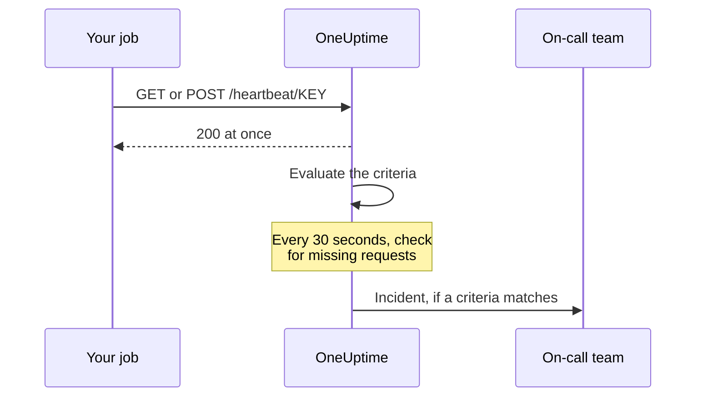

# Incoming Request Monitor

An Incoming Request monitor gives you a URL that other systems send HTTP requests to. OneUptime evaluates every request against your criteria, and can change the monitor's status, declare incidents, and page your on-call rota.

It covers two different jobs:

- **Heartbeat monitoring** — a cron job, worker, or device pings the URL on a schedule, and OneUptime raises an incident when the pings stop arriving.
- **Receiving alerts from another system** — Prometheus Alertmanager, Grafana, or anything else that can POST JSON pushes alerts in, and OneUptime turns each one into an incident with on-call escalation and automatic resolution on recovery.

Both use the same monitor type. What separates them is the criteria you configure.

:::cards
- [Create the monitor](#creating-an-incoming-request-monitor): Get a heartbeat URL in a few steps.
- [Send a heartbeat](#sending-a-heartbeat): From curl, cron, Node.js, Python or Go.
- [Alert when pings stop](#mark-as-offline-if-no-heartbeat-in-10-minutes-a-dead-mans-switch): Turn the monitor into a dead-man's switch.
- [Receive alerts](#receiving-alerts-from-another-system): One incident per Alertmanager or Grafana alert.
:::

## How it works

Nothing checks your system from outside: your system calls the monitor's URL, OneUptime answers at once, and then evaluates the request against the monitor's criteria. A criteria that checks for requests that *stopped* arriving is also re-checked in the background, every 30 seconds, so silence can raise an incident too.



Use it to:

- Monitor cron jobs and scheduled tasks
- Verify background workers are running
- Monitor services behind firewalls that cannot be reached externally
- Receive alerts from Prometheus Alertmanager, Grafana, and other alerting systems
- Track heartbeat signals from any HTTP-capable system

## Creating an Incoming Request Monitor

:::steps
### Start a new monitor

Go to **Monitors** and click **Create Monitor**.

### Choose Incoming Request

Under **Monitor Type**, pick **Incoming Request** — it is one of the common types at the top. Enter a **Name**, then click **Next**.

### Review the criteria

The **Criteria** step starts with [the default criteria](#what-you-get-out-of-the-box). For a heartbeat, click **Add Criteria** and give the new criteria an **Incoming Request** / **Not Recieved In Minutes** filter that changes the status to offline and declares an incident, with **Auto Resolve Incident** on. Then drag it to the top of the list — see [Example Criteria](#example-criteria) for why.

### Create the monitor

Click **Create Monitor**. The monitor opens on its **Overview** page, where the **Send the first heartbeat** card shows the **Heartbeat URL** with a copy button and an example `curl` command.

### Send the first request

Configure your service to send requests to that URL (see [Sending a heartbeat](#sending-a-heartbeat)). When the first request arrives, the card makes way for the monitor's history, and a **Heartbeat URL** card shows the URL and when the last request came in.
:::

> [!NOTE]
> The URL contains the monitor's secret key, so only people who can edit monitors can see it. You can find it again at any time on the monitor's **Documentation** page, in the **Configuration** section of its side menu.

## The request URL

Your monitor has a unique URL in this format:

```text
https://oneuptime.com/heartbeat/YOUR_SECRET_KEY
```

Replace `https://oneuptime.com` with your OneUptime instance URL if self-hosted.

Send **GET** or **POST** requests to this URL. HEAD is accepted and treated as GET; PUT, PATCH and DELETE return 404. The secret key in the path is the only credential — no header or token is required. Query strings are ignored: send what criteria should read in the body or the headers.

> [!WARNING]
> Anyone who knows this URL can mark the monitor healthy, so treat it as a secret. If it leaks, open the monitor's **Settings** page and click **Reset Incoming Request Secret Key**, then update every sender. Every header you send is stored on the monitor and is visible to anyone who can read it — do not send API keys or tokens in headers to this endpoint.

> [!IMPORTANT]
> OneUptime replies `200` with an empty JSON object (`{}`) immediately and processes the request on a queue. That reply is written before any validation happens, so a `200` is **not** confirmation that the request was accepted — a wrong secret key, a deleted monitor, and a disabled monitor all return `200` too. Check the monitor's own timeline to confirm requests are landing.

### Sending a request body

If you want to address fields inside the body — `{{requestBody.status}}` in an incident title, a JSON path in incident grouping, or a JavaScript Expression criteria — send `Content-Type: application/json`. It is the format these docs assume throughout. The body must be a JSON object or array: malformed JSON, or a bare value such as `"error"`, is refused with a `500`.

| Content type | What criteria and templates see |
| --- | --- |
| `application/json` | The parsed JSON. |
| `application/x-www-form-urlencoded` | The parsed form. Bracketed keys nest (`alerts[0][status]=firing`), and every value is a string. |
| Anything else, or none | An empty body (`{}`), so every `requestBody` reference resolves to nothing. |

Bodies up to 50 MB are accepted; a larger one is refused with a `413`. Do not compress the body with `Content-Encoding: gzip`: it is not stored as JSON, and paths into it will not resolve.

### Sending a heartbeat

Each example sends one request. Replace `YOUR_SECRET_KEY` with the key from your monitor's URL.

:::tabs
@tab curl
```bash
# Simple GET request
curl https://oneuptime.com/heartbeat/YOUR_SECRET_KEY

# POST request with a JSON body
curl -X POST https://oneuptime.com/heartbeat/YOUR_SECRET_KEY \
  -H "Content-Type: application/json" \
  -d '{"status": "healthy", "version": "1.2.3"}'
```
@tab Cron
```bash
# Send a heartbeat every 5 minutes
*/5 * * * * curl -fsS https://oneuptime.com/heartbeat/YOUR_SECRET_KEY > /dev/null

# Or ping only when the job succeeds, so a failed run counts as a missed heartbeat
0 2 * * * /usr/local/bin/backup.sh && curl -fsS https://oneuptime.com/heartbeat/YOUR_SECRET_KEY > /dev/null
```
@tab Node.js
```javascript title="heartbeat.mjs"
// Node.js 18 or later: fetch is built in. Run with `node heartbeat.mjs`.
const response = await fetch(
  "https://oneuptime.com/heartbeat/YOUR_SECRET_KEY",
  {
    method: "POST",
    headers: { "Content-Type": "application/json" },
    body: JSON.stringify({ status: "healthy", version: "1.2.3" }),
  },
);

console.log(response.status); // 200
```
@tab Python
```python title="heartbeat.py"
# Python 3, standard library only. Run with `python3 heartbeat.py`.
import json
import urllib.request

request = urllib.request.Request(
    "https://oneuptime.com/heartbeat/YOUR_SECRET_KEY",
    data=json.dumps({"status": "healthy", "version": "1.2.3"}).encode(),
    headers={"Content-Type": "application/json"},
    method="POST",
)

with urllib.request.urlopen(request, timeout=10) as response:
    print(response.status)  # 200
```
@tab Go
```go title="heartbeat.go"
// Run with `go run heartbeat.go`.
package main

import (
	"bytes"
	"fmt"
	"net/http"
)

func main() {
	body := []byte(`{"status": "healthy", "version": "1.2.3"}`)

	resp, err := http.Post(
		"https://oneuptime.com/heartbeat/YOUR_SECRET_KEY",
		"application/json",
		bytes.NewReader(body),
	)
	if err != nil {
		panic(err)
	}
	defer resp.Body.Close()

	fmt.Println(resp.StatusCode) // 200
}
```
@tab PowerShell
```powershell
# Windows PowerShell 5.1 or PowerShell 7
Invoke-RestMethod -Method Post `
  -Uri "https://oneuptime.com/heartbeat/YOUR_SECRET_KEY" `
  -ContentType "application/json" `
  -Body '{"status": "healthy", "version": "1.2.3"}'
```
:::

## Monitoring Criteria

You can configure criteria to determine when your service is considered online, degraded, or offline. Each criteria filter has a **Filter Type** (what to look at), a **Filter Condition** (how to compare it), and a **Value**.

### What you get out of the box

A new Incoming Request monitor is created with two criteria that read the request body:

| Criteria | Filter Type  | Filter Condition | Value   | Effect                                       |
| -------- | ------------ | ---------------- | ------- | -------------------------------------------- |
| Offline  | Request Body | Contains         | `error` | Marks the monitor offline, opens an incident |
| Online   | Request Body | Not Contains     | `error` | Marks the monitor online                     |

This suits the common case where the sender reports its own health in the payload: a request whose body mentions `error` takes the monitor down, and the next request without it brings the monitor back up and resolves the incident. A request with no body at all counts as "does not contain `error`", so a plain heartbeat ping keeps the monitor online.

Change the value to whatever your sender actually emits (`"status":"firing"`, `FAILED`, and so on) — the match is a case-sensitive substring test against the whole body, keys included, so `{"error":null}` matches `error` too.

> [!NOTE]
> These defaults are **not** a dead-man's switch: nothing here fires when requests stop arriving. If you want to be alerted on silence, add an **Incoming Request** / **Not Recieved In Minutes** criteria as described below.

### Available Filter Types

| Filter Type           | Checks                                                 | Notes                                                                                        |
| --------------------- | ------------------------------------------------------ | -------------------------------------------------------------------------------------------- |
| Incoming Request      | Whether a request was received within a time window    | The only check that can fire when nothing arrives                                            |
| Request Body          | The request body                                       | Substring match. Object bodies are compared as compact JSON                                  |
| Request Header        | The names of the request headers                       | Exact match against a whole header name, ignoring case                                       |
| Request Header Value  | The values of the request headers                      | Exact match against a whole header value, ignoring case                                      |
| JavaScript Expression | Any expression over `requestBody` and `requestHeaders` | The most flexible option — see [JavaScript Expressions](/docs/monitor/javascript-expression) |

### Filter Conditions

Each filter type offers its own set of conditions:

| Filter Type | Conditions |
| --- | --- |
| **Incoming Request** | **Recieved In Minutes** — a request was received within the specified number of minutes. **Not Recieved In Minutes** — no request was received within the specified number of minutes. (The dashboard spells them this way.) |
| **Request Body**, **Request Header**, **Request Header Value** | **Contains** and **Not Contains** |
| **JavaScript Expression** | **Evaluates To True** |

> [!NOTE]
> Header names and values are compared in lower case, against the whole name or value, not a substring: `application/json` does not match `application/json; charset=utf-8`. Only **Request Body** does a substring match. Headers your proxy or OneUptime's own load balancer add (`x-forwarded-for`, `x-real-ip`) are stored too.

Object bodies are compared as compact JSON with no spaces, so a **Request Body** / **Contains** filter must be written `"status":"firing"` — copying `"status": "firing"` out of a pretty-printed payload will never match.

### Example Criteria

#### Mark as offline if no heartbeat in 10 minutes (a dead-man's switch)

| Field | Value |
| --- | --- |
| **Filter Type** | Incoming Request |
| **Filter Condition** | Not Recieved In Minutes |
| **Value** | `10` |

#### Mark as degraded based on request body content

| Field | Value |
| --- | --- |
| **Filter Type** | Request Body |
| **Filter Condition** | Contains |
| **Value** | `"status":"degraded"` |

> [!IMPORTANT]
> Put the dead-man's switch **above** the default criteria. Criteria are checked from the top, and the first one that matches decides. The background check re-reads the last request, so the default online criteria — "Request Body Not Contains `error`" — keeps matching it, and a criteria below it never gets its turn. **Add Criteria** adds a criteria at the bottom: drag it up.

> [!WARNING]
> A monitor is only re-evaluated in the background if at least one of its criteria checks on **Incoming Request**. A monitor whose criteria only check Request Body, Request Header, or a JavaScript Expression is evaluated when a request arrives and at no other time — so it can never go offline on its own. If you want a missing-heartbeat alarm, you need an **Incoming Request** criteria.

The background check counts whole minutes and fires once *more* than the value has passed: "Not Recieved In Minutes: 10" fires about 11 minutes after the last request (the check runs every 30 seconds). A monitor which has never received a request is treated as though its creation time were the last request, so the same criteria on a brand-new monitor fires about 11 minutes after you create it, even if the sender was never wired up. Only minutes OneUptime was receiving count toward the value: minutes while OneUptime itself restarts, is upgraded or catches up do not, as [When OneUptime Is Not Receiving Data](/docs/monitor/when-oneuptime-is-not-receiving) explains.

## Receiving alerts from another system

Alertmanager, Grafana, and similar tools POST a JSON document describing one or more alerts. By default a criteria opens **one** incident, so a payload carrying five alerts would produce a single incident. Incident grouping changes that: it extracts a value from the payload and opens a **separate incident per distinct value**, all of which can be open at once.

```mermaid title="Incident grouping: one incident per alert in the payload"
flowchart TB
    payload["Webhook payload"] --> keys["One key per alert"]
    keys --> state{"Alert resolved?"}
    state -->|No| open["Open or keep its incident"]
    state -->|Yes| resolve["Resolve its incident"]
```

### Turning on incident grouping

:::steps
1. Open the criteria and expand **Settings**.
2. Turn on **Group incidents and alerts by a payload field**.
3. Fill in **Open a separate incident for each…**, and — under **Auto-resolve each incident when… (optional)** — the field and value that signal recovery (below). Then save the monitor.
:::

| Field                              | Example                                  | What it does                                                           |
| ---------------------------------- | ---------------------------------------- | ---------------------------------------------------------------------- |
| Open a separate incident for each… | `requestBody.alerts[*].labels.alertname` | The path whose distinct values split incidents apart                   |
| Field that signals recovery        | `requestBody.alerts[*].status`           | The path checked to decide an alert has recovered                      |
| Value that means recovered         | `resolved`                               | The exact value that marks recovery                                    |
| Max incidents per request          | `100` (default)                          | Safety cap so a high-cardinality field cannot open unbounded incidents |

### Path syntax

Paths must start with the literal prefix `requestBody.`. A path without it — `alerts[*].labels.alertname` — matches nothing, silently. The `{{ }}` wrapper is optional: `requestBody.status` and `{{requestBody.status}}` behave identically.

- `[*]` fans out over an array — one incident per **distinct** value. Two elements yielding the same value collapse into one incident, and that incident's firing/resolved state is taken from the **first** matching element. **Only the first `[*]` in a path is a wildcard**; `requestBody.groups[*].alerts[*].name` matches nothing.
- `[0]` and `[last]` select a single element, and may follow a `[*]`.
- Object and array values, empty strings, and nulls are skipped. `0` and `false` are valid keys.
- The body must be a JSON object; a payload whose top level is an array is not grouped.

### Resolution is event-driven

A webhook describes only what is in that payload, so OneUptime never resolves an incident because its key stopped appearing. An incident is resolved only when a payload explicitly says that key recovered. Two things must both be true:

1. **Field that signals recovery** and **Value that means recovered** are set, and match the payload. The comparison is exact and case-sensitive — `Resolved` does not match `resolved`.
2. The criteria's incident has **Auto Resolve Incident** turned on, under **More fields** in the incident form. Without it, matching recovery events are ignored and the incidents stay open. (The same applies to alerts and **Auto Resolve Alert**.) The default offline criteria starts with it on; an incident you add to a criteria yourself starts with it off.

**Max incidents per request** caps extraction, not just creation. Keys past the cap are invisible to recovery as well, so in a payload carrying more distinct keys than the cap, an alert reporting `resolved` beyond it will not close its incident.

> [!NOTE]
> When one monitor receives requests faster than OneUptime evaluates them, it evaluates the newest and skips the ones in between, so a burst of webhooks can leave a firing or a resolved alert unevaluated. On a self-hosted server, setting `INCOMING_REQUEST_INGEST_COALESCE_ENABLED=false` in the OneUptime app's environment evaluates every request on its own.

> [!WARNING]
> If **Field that signals recovery** contains `[*]` but **Open a separate incident for each…** does not, nothing will ever resolve. Either use `[*]` in both, or neither. A recovery path without `[*]` is evaluated against the whole payload, so a payload-level `status: resolved` resolves every key in that payload — including alerts whose own status is still firing.

### Naming the incidents

The grouping key is exposed to incident and alert templates as a variable named after the **last segment of the path**:

| Path                                     | Variable          |
| ---------------------------------------- | ----------------- |
| `requestBody.alerts[*].labels.alertname` | `{{alertname}}`   |
| `requestBody.alerts[*].fingerprint`      | `{{fingerprint}}` |
| `requestBody.commonLabels.severity`      | `{{severity}}`    |

The full payload is available alongside it, so an incident title of `{{alertname}}` and a description referencing `{{requestBody.commonAnnotations.summary}}` both work. See [Incident & Alert Dynamic Templating](/docs/monitor/incident-alert-templating).

> [!WARNING]
> The variable name is part of the identity OneUptime uses to match a recovery event to an open incident. Changing the grouping path to one with a different last segment orphans every incident that is currently open under the old path — they can no longer be resolved automatically and must be closed by hand.

`[*]` works **only** in the two grouping path fields. Elsewhere it does not resolve, and an unresolved placeholder is printed **verbatim** rather than blanked — a title of `{{requestBody.alerts[*].labels.alertname}}` renders with the braces still in it. A title of `{{requestBody.alerts[0].annotations.summary}}` resolves, but always reads the first alert in the payload, not the one this incident was opened for. Prefer the grouping variable plus the payload's shared `commonAnnotations` fields.

### Worked example

For a full Alertmanager configuration, see [Prometheus Alertmanager](/docs/integrations/prometheus-alertmanager). For Grafana, see [Grafana](/docs/integrations/grafana).

## Best Practices

1. **Set the time window appropriately** — If your cron job runs every 5 minutes, set the "Not Recieved In Minutes" threshold to 10–15 minutes to allow for occasional delays, and put that criteria first.
2. **Include meaningful data** — Send status information in the request body so you can set up granular criteria.
3. **Use POST with `Content-Type: application/json`** — anything that reads inside the body depends on it.
4. **Don't mix the two jobs on one monitor** — a monitor receiving event-driven alerts has no regular cadence, so a "Not Recieved In Minutes" criteria on it will flap. Use a separate monitor for the dead-man's switch.
5. **Monitor the monitor** — Ensure the service sending requests has proper error handling so failed requests don't go unnoticed.

## Troubleshooting

:::details My sender gets a 200, but nothing shows on the monitor
The `200` is sent before the request is validated, so it does not prove the request was accepted. Check that the secret key in the URL matches the monitor's **Heartbeat URL**, and that the monitor is not disabled. Then look at the monitor's timeline to see whether requests are landing.
:::

:::details The monitor never goes offline when the heartbeats stop
Only an **Incoming Request** criteria (**Not Recieved In Minutes**) can notice silence. Add one if there is none, and drag it above the default criteria: the default online criteria matches the last request on every background check, and the first criteria that matches decides.
:::

:::details A Request Body filter never matches
Send `Content-Type: application/json`, and write the value as compact JSON — `"status":"firing"`, with no space after the colon. Without a JSON or form content type, the body is not parsed.
:::

:::details A Request Header filter never matches
Header names and values are compared whole. Give the complete value, such as `application/json; charset=utf-8`, rather than part of it.
:::

:::details The sender gets a 500
The request says `Content-Type: application/json` but its body is not a JSON object or array. Send valid JSON, or a different content type.
:::

## Next steps

:::cards
- [Prometheus Alertmanager](/docs/integrations/prometheus-alertmanager): A complete inbound alerting setup.
- [Grafana](/docs/integrations/grafana): The same, for Grafana alerting.
- [Incident & Alert Dynamic Templating](/docs/monitor/incident-alert-templating): Every variable available in titles and descriptions.
- [JavaScript Expressions](/docs/monitor/javascript-expression): Expression syntax and quoting rules.
:::
