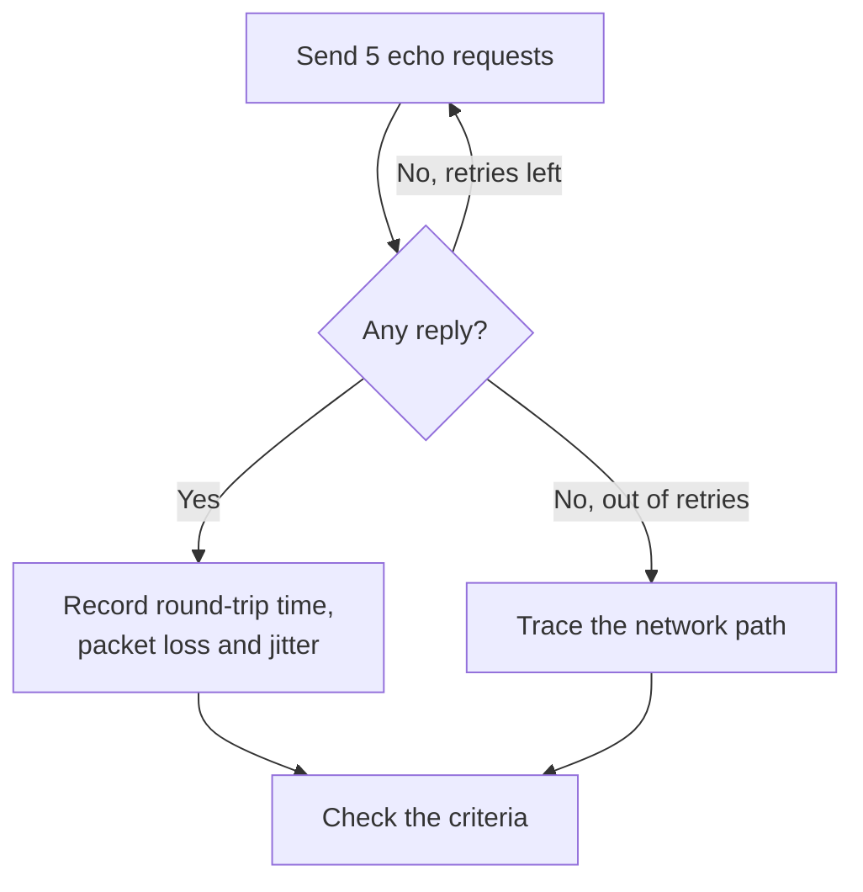

# IP Monitor

An IP monitor checks that an IPv4 or IPv6 address answers ping (ICMP echo requests), and measures the round-trip time, packet loss and jitter. Use it for infrastructure you know by address, such as a gateway, a load balancer's virtual IP or a server with a fixed address.

:::cards
- [Create the monitor](#create-an-ip-monitor): Six steps in the dashboard.
- [Configuration options](#configuration-options): The address, the timeout and retries.
- [Monitoring criteria](#monitoring-criteria): Reachability, latency, packet loss and jitter.
- [Troubleshooting](#troubleshooting): When the address is up but the monitor says offline.
:::

## How it works

An IP monitor runs the same check as a [Ping monitor](/docs/monitor/ping-monitor). On each check, a probe sends five echo requests to the address. If at least one reply comes back, the address is online, and the probe records the average round-trip time as the response time, along with the packet loss, the jitter and the fastest and slowest replies. If no reply comes back, the probe tries again, up to the number of retries you allow. OneUptime then runs the result through the monitor's criteria.

When a check fails, the probe also traces the route to the address, and attaches what it found to the result as **Network Path at Time of Failure**, so you can see where the route broke.

Which one to use:

| Monitor | Takes | Use it when |
| --- | --- | --- |
| **IP** | An IP address only | The address itself is what you watch, and it does not change. |
| [Ping](/docs/monitor/ping-monitor) | A host name or an IP address | You know the host by name; the name is resolved on every check, so the monitor follows DNS changes. |

> [!NOTE]
> Some hosting providers block ICMP on the machines a probe runs on. A probe that cannot send pings at all checks TCP port `80` on the address instead, so the monitor still says whether it is reachable. Packet loss and jitter are not measured then.

A probe that has lost its own network connection reports no result, so it cannot mark your address offline.

## Before you begin

- **A role that can create monitors**: Project Owner, Project Admin, Project Member, Monitor Admin or Monitor Member, or a custom role with the Create Monitor permission.
- **A probe that can reach the address**, with ICMP allowed on the way. Your project's default probes are picked for every new monitor. If a firewall sits in front of it, allow ICMP echo requests from [OneUptime Cloud's probe IP addresses](/docs/configuration/ip-addresses). A private address needs a [custom probe](/docs/probe/custom-probe) on that network, and an IPv6 address needs a probe with IPv6 connectivity.

## Create an IP monitor

:::steps
### Start a new monitor

Go to **Monitors** and click **Create Monitor**. Under **Monitor Type**, click **More monitor types** and pick **IP** under **Basic Monitoring**.

### Name it

Enter a **Name**, such as `Office gateway`, then click **Next**.

### Enter the address

In **IP Address**, enter the IPv4 or IPv6 address to check, such as `192.168.1.1` or `2001:db8::1`. A host name is not accepted: the field shows an error. To ping a host by name, use a [Ping monitor](/docs/monitor/ping-monitor).

### Test it

Click **Test Monitor**, pick a probe under **Select Probe** and click **Run Test**. **Monitor Test Result** shows the round-trip times and the packet loss the probe saw.

### Review the criteria

**Monitor Criteria** starts with the [default criteria](#default-criteria): offline when the address does not answer, online when it does. Change them if you need to, then click **Next**.

### Pick probes and create

Keep or change the **Probes** and the **Monitoring Interval** (it starts at **Every 5 Minutes**), then click **Create Monitor**. The monitor's page opens.
:::

## Configuration options

| Field | Default | What to enter |
| --- | --- | --- |
| **IP Address** | None | An IPv4 address, such as `192.168.1.1`, or an IPv6 address, such as `2001:db8::1`. Brackets around an IPv6 address are removed. |
| **Request Timeout (seconds)** (under **More fields**) | `60` | How long to wait for a reply on each attempt. The maximum is 60 seconds. |
| **Retries on Failure** (under **More fields**) | Probe default, usually `3` | How many times to retry a failed attempt. The maximum is 3. |

**Retries on Failure** counts retries _after_ the first attempt, so `0` runs the check once and `2` runs it up to three times. Left blank, it uses the probe's default: 3, unless the probe's `PROBE_MONITOR_RETRY_LIMIT` says otherwise. Every failure is retried, timeouts included, with a one-second pause between attempts. A successful check whose replies took longer than 10 seconds is checked again too.

## Monitoring Criteria

Criteria decide when the address counts as online, degraded or offline, and whether that declares an incident or creates an alert. Each criteria checks one or more filters:

| Filter | Conditions | What it checks |
| --- | --- | --- |
| **Is Online** | **True**, **False** | Whether at least one echo request got a reply. |
| **Response Time (in ms)** | **Greater Than**, **Less Than**, **Greater Than Or Equal To**, **Less Than Or Equal To** | The average round-trip time of the replies. |
| **Packet Loss (in %)** | **Greater Than**, **Less Than**, **Greater Than Or Equal To**, **Less Than Or Equal To** | The share of the five echo requests that got no reply. |
| **Jitter (in ms)** | **Greater Than**, **Less Than**, **Greater Than Or Equal To**, **Less Than Or Equal To** | The standard deviation of the round-trip times across the packets sent in one check. |
| **Is Request Timeout** | **True**, **False** | Whether the ping timed out on every attempt. |

With two or more filters, **Match Condition** decides whether **All** of them or **Any** one must match. A criteria's **Actions** decide what it does: change the monitor status, create an alert, declare an incident, or any of these.

### Default Criteria

A new IP monitor starts with two criteria:

- **Offline** — the address answers none of the echo requests, or cannot be reached at all, after every retry. The monitor is marked **Offline** and an incident called "_monitor name_ is offline" is created. The incident resolves itself when the address answers again.
- **Online** — the address answers. The monitor is marked **Operational**.

Criteria are checked from top to bottom, and the first one that matches decides what happens. When none matches, the monitor shows its default status: **Operational**, unless you pick another under **More fields**, below the criteria.

### Evaluating over a period of time

**Evaluate this criteria over a period of time** is a checkbox under a filter, offered for **Is Online**, **Response Time (in ms)**, **Packet Loss (in %)** and **Jitter (in ms)**. Turn it on to judge a window of past checks instead of the latest one: pick an aggregate under **Evaluate** and a window, from 2 to 60 minutes, under **For the last (in minutes)**.

| Aggregate | Matches when |
| --- | --- |
| **Average**, **Sum**, **Maximum Value**, **Minimum Value** | That figure, over the window, meets the condition. Numeric filters only. |
| **All Values** | Every check in the window meets the condition. |
| **Any Value** | At least one check in the window meets the condition. |

**All Values** only matches once the window is genuinely covered by data. A monitor that has just been created, or one whose checks stopped being recorded, does not have enough history to say anything about the last N minutes, so the criteria waits rather than matching on the one reading it does have. **Any Value** is the setting for "tell me the moment a single check breaches" and still fires immediately.

**If No Data** decides what happens while the window cannot back the criteria:

| Option | What happens | Use it for |
| --- | --- | --- |
| **Ignore** (default) | The criteria does not match. | Ordinary threshold alerting. |
| **Trigger** | The missing data counts as the problem. | Checks where silence is itself a failure. |
| **Treat As Zero** | The window is compared as a single zero. | Counters where no events genuinely means zero. |

### Example criteria

| Goal | Filter | Condition | Value |
| --- | --- | --- | --- |
| Offline when the address is unreachable | **Is Online** | **False** | — |
| Alert when latency is high | **Response Time (in ms)** | **Greater Than** | `100` |
| Mark the address degraded on a lossy link | **Packet Loss (in %)** | **Greater Than** | `20` |
| Alert on an unstable connection | **Jitter (in ms)** | **Greater Than** | `30` |

## Troubleshooting

:::details The address is up, but the monitor says offline
The address, or a firewall in front of it, does not answer ICMP echo requests from the probe. Allow ICMP echo requests from the probes, or watch a service on that address with a [Port monitor](/docs/monitor/port-monitor) instead. **Network Path at Time of Failure**, on the failed check, shows how far the route got.
:::

:::details An IPv6 address always fails
The probe that ran the check has no IPv6 connectivity; the failure says so. Run the monitor on a probe with IPv6: see [Custom Probes](/docs/probe/custom-probe).
:::

:::details Packet loss and jitter are empty
The probe that ran the check cannot send pings, so it checked TCP port `80` instead, which measures neither. Run the monitor on a probe that is allowed to send ICMP.
:::

## Next steps

:::cards
- [Ping Monitor](/docs/monitor/ping-monitor): Ping a host by name, following DNS changes.
- [Port Monitor](/docs/monitor/port-monitor): Check a service on the address, not just the address.
- [Custom Probes](/docs/probe/custom-probe): Check private and IPv6 addresses from your own network.
- [Incidents](/docs/incidents/index): What happens after the monitor declares one.
:::
