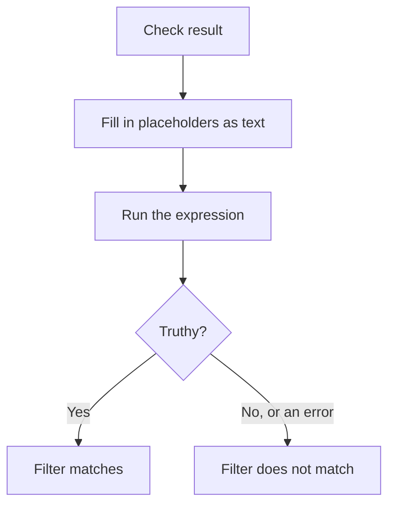

# JavaScript Expressions

A **JavaScript Expression** criteria filter decides whether a monitor's criteria is met with a line of JavaScript instead of a fixed comparison. Use it when the built-in filters cannot express the condition — a field deep inside a JSON response, two values compared with each other, or several checks combined with `&&` and `||`.

:::cards
- [How it works](#how-it-works): Placeholders are filled in, then the expression runs.
- [Variables](#variables-by-monitor-type): What each monitor type gives you.
- [Examples](#examples): Expressions for APIs, incoming requests and databases.
- [Quoting rules](#quoting-rules): The mistake almost everyone makes.
:::

## How it works

Before the expression runs, every `{{variable}}` placeholder in it is replaced with the value from the monitor's latest check — as plain text. The result is then run as JavaScript. If it evaluates to a truthy value, the filter matches; anything else, including an error, means it does not.



Because placeholders are replaced as text, `{{responseBody.item}}` becomes the raw value. A string has to be wrapped in quotes to be a JavaScript string; a number or boolean does not — see [Quoting rules](#quoting-rules). Expressions run on the OneUptime server, in an isolated sandbox.

## Add a JavaScript Expression filter

:::steps
### Open the criteria

On the monitor, open **Configuration → Criteria** and click **Edit Monitoring Criteria**, or use the **Criteria** step of **Create Monitor**. Work in the criteria you want to change, or click **Add Criteria** for a new one.

### Add a filter

Under **Filters**, click **Add Filter**, and set its **Filter Type** to **JavaScript Expression**. The **Filter Condition** is **Evaluates To True**.

### Write the expression

Enter the expression in **Value**, using the [variables of the monitor's type](#variables-by-monitor-type). The link under the filter, **Read documentation for using JavaScript expressions here.**, opens this page.

### Save

Save the monitor. The filter is evaluated on the monitor's next check.
:::

## Variables by monitor type

JavaScript expressions are offered for Website, API, Incoming Request, Incoming Email, SQL Query and Database Health monitors.

### Website and API monitors

| Variable             | Description                                                                                                           | Type                 |
| -------------------- | --------------------------------------------------------------------------------------------------------------------- | -------------------- |
| `responseBody`       | The response body. If the response body is JSON, it is parsed; otherwise, such as for HTML or XML, it is a string. | `string` or `JSON`   |
| `responseHeaders`    | The response headers, with lower-case names.                                                                          | `Dictionary<string>` |
| `responseStatusCode` | The response status code.                                                                                             | `number`             |
| `responseTimeInMs`   | The response time in milliseconds.                                                                                    | `number`             |
| `isOnline`           | Whether the monitor counts the response as online.                                                                    | `boolean`            |

### Incoming Request monitors

| Variable         | Description                                  | Type                 |
| ---------------- | -------------------------------------------- | -------------------- |
| `requestBody`    | The request body.                            | `string` or `JSON`   |
| `requestHeaders` | The request headers, with lower-case names.  | `Dictionary<string>` |

### SQL Query monitors

| Variable            | Description                                        | Type      |
| ------------------- | -------------------------------------------------- | --------- |
| `rowCount`          | The number of rows the query returned.             | `number`  |
| `scalarValue`       | The first column of the first row.                 | any       |
| `firstRow`          | The first row, as column/value pairs.              | `JSON`    |
| `executionTimeInMs` | How long the query took, in milliseconds.          | `number`  |
| `queryError`        | The query error, if there was one.                 | `string`  |
| `isOnline`          | Whether the database was reachable and the query succeeded. | `boolean` |

### Database Health monitors

`isOnline`, `engineVersion`, `connectionError`, `collectedGroups`, `unavailableGroups` and `metrics`. See [JavaScript expression variables](/docs/monitor/database-health-monitor#javascript-expression-variables) on the Database Health Monitor page.

### Incoming Email monitors

The filter is offered, but no email fields are bound to it: an expression cannot read the subject, sender, body or recipient. Use the email filter types instead — see [Incoming Email Monitor](/docs/monitor/incoming-email-monitor#available-filter-types).

## Examples

Each line below is one complete expression. For a JSON response body like this one:

```json
{
  "item": "hello",
  "count": 3,
  "items": [{ "name": "hello" }]
}
```

| Expression | Matches when |
| --- | --- |
| `"{{responseBody.item}}" === "hello"` | The `item` field is `hello`. |
| `{{responseBody.count}} > 2` | The `count` field is more than 2. |
| `"{{responseBody.items[0].name}}" === "hello"` | The first element of `items` has the name `hello`. |
| `{{responseStatusCode}} === 200 && {{responseTimeInMs}} < 500` | The status is 200 and the response took less than half a second. |
| `/hel+o/.test("{{responseBody.item}}")` | The `item` field matches a regular expression. |
| `"{{responseHeaders.content-type}}".startsWith("application/json")` | The response is JSON. Header names are lower case. |

Combine conditions with `&&` and `||`, and group them with parentheses:

```javascript
({{responseStatusCode}} === 200 || {{responseStatusCode}} === 204) && {{responseTimeInMs}} < 1000
```

For an Incoming Request monitor that receives `{"status": "degraded", "region": "eu"}` as `Content-Type: application/json`:

```javascript
"{{requestBody.status}}" === "degraded" && "{{requestBody.region}}" === "eu"
```

For a SQL Query monitor whose query returns a count, alert on a high count or a slow query:

```javascript
{{scalarValue}} > 50 || {{executionTimeInMs}} > 2000
```

For a Database Health monitor, read one metric by indexing the whole `metrics` object — the series names contain dots, so they cannot go inside the braces:

```javascript
{{metrics}}['oneuptime.monitor.database.connections.used.percent'] > 90
```

## Quoting rules

`{{var}}` will replace the variable with the value, so if you want to compare a string, you need to wrap it in quotes, e.g. `"{{responseBody.item}}" === "hello"` and if you want to compare a number, you don't need to wrap it in quotes, e.g. `{{responseStatusCode}} === 200`.

| Value type | Write it as | Example |
| --- | --- | --- |
| String | In quotes | `"{{responseBody.status}}" === "ok"` |
| Number | Bare | `{{responseTimeInMs}} < 500` |
| Boolean | Bare | `{{isOnline}} === true` |
| Object or array | Bare, then index it | `{{responseHeaders}}['content-type']` |

Three things to watch:

- **A quoted placeholder on its own is always true.** `"{{responseBody.healthy}}"` is the non-empty string `"false"` when the field is `false`. Compare it: `"{{responseBody.healthy}}" === "true"`, or leave it bare: `{{responseBody.healthy}} === true`.
- **Values are not escaped.** A value that contains a double quote or a line break ends the string early, and the expression fails. To look for text in an HTML page, use the **Response Body** filter instead.
- **A missing path stays as written.** If the check has no such field, `{{responseBody.item}}` is left in the expression as it is, which is usually a syntax error — so the filter does not match.

## Limits

An expression has 5 seconds to run. One that takes longer, or throws an error, does not match, and the error is written to the OneUptime server log.

## Troubleshooting

:::details The expression never matches
Check the quoting first: an unquoted string placeholder becomes a bare word, which is a syntax error, and an error never matches. Then check that the path exists in the check result — a placeholder for a path that is not there is not filled in.
:::

:::details The expression always matches
A quoted placeholder on its own is a non-empty string, which is always truthy. Compare it with a value.
:::

## Next steps

:::cards
- [Incident & Alert Dynamic Templating](/docs/monitor/incident-alert-templating): Use the same placeholders in incident titles and descriptions.
- [API Monitor](/docs/monitor/api-monitor): Check an HTTP endpoint and its response.
- [Incoming Request Monitor](/docs/monitor/incoming-request-monitor): Evaluate requests that other systems send you.
:::
