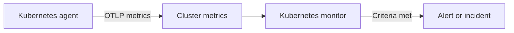

# Kubernetes Monitor

A Kubernetes monitor alerts on the metrics the OneUptime Kubernetes agent sends from a cluster: nodes, pods, containers, workloads, autoscalers and the control plane. Start from a ready-made alert template, pick a single metric, or write your own query, then set the threshold that opens an alert or incident.

:::cards
- [Install the agent](/docs/monitor/kubernetes-agent): One Helm command puts the cluster into OneUptime.
- [Create the monitor](#create-a-kubernetes-monitor): Pick the cluster, then a template, a metric or a query.
- [Alert templates](#pre-built-alert-templates): Seventeen ready-made alerts, from CrashLoopBackOff to etcd.
- [Criteria](#monitoring-criteria): Static thresholds and anomaly detection.
:::

## How it works

The agent ships the cluster's metrics to OneUptime over OTLP, each one stamped with the cluster's name (`k8s.cluster.name`, the chart's `clusterName`). The first data from a new name registers the cluster under **Kubernetes**, and from then on the cluster can be picked in a Kubernetes monitor. Every minute, the monitor queries those metrics over its **Time Range**, aggregates them, and compares the result with its criteria.

## Before you begin

- The OneUptime Kubernetes agent running in the cluster. See [Install the Kubernetes Agent](/docs/monitor/kubernetes-agent); the cluster appears under **Kubernetes** a few minutes after the install.
- For the control-plane templates (**etcd No Leader**, **API Server Request Saturation**, **Scheduler Backlog**): the agent's control-plane scrape, `controlPlane.enabled`. Managed clusters (EKS, GKE, AKS) do not expose these endpoints, so those monitors never receive data there.

## Create a Kubernetes monitor

:::steps
### Start a new monitor

Go to **Monitors** and click **Create Monitor**. Under **More monitor types**, pick **Kubernetes** — or type `k8s` in the search box.

### Pick the cluster

Select it in **Kubernetes Cluster**. The list holds every cluster the agent has reported from.

### Choose what to watch

Use one of the three tabs:

| Tab | What you choose |
| --- | --- |
| **Quick Setup** | A [pre-built alert template](#pre-built-alert-templates). It fills in the metric, scope, time range and criteria; you can still change the **Time Range**. |
| **Custom Metric** | One metric from the [metric catalog](#metric-catalog), then its **Resource Scope**, filters, **Aggregation** (Average, Maximum, Minimum, Sum or Count) and **Time Range**. |
| **Advanced** | The **Resource Scope**, filters and **Time Range**, and your own metric queries and formulas under **Select Metrics**, with a live chart of the result. |

### Set the criteria

Set when the monitor changes status and when it opens an alert or incident — see [Monitoring criteria](#monitoring-criteria). A template has already filled them in: review the thresholds, severities and on-call policies.

### Save the monitor

Finish the form and save. The monitor appears under **Monitors**, and its status follows your criteria from its first evaluation.
:::

## Configuration options

### Resource scope and filters

**Resource Scope** sets the level the metric is evaluated at, and decides which filters the form shows. Every filter is optional.

| Scope | Watches | Filters |
| --- | --- | --- |
| Cluster | The whole cluster | — |
| Namespace | Resources in a namespace | **Namespace** |
| Workload | A deployment, statefulset, daemonset, job or cronjob | **Namespace**, **Workload Name** |
| Node | A cluster node | **Node Name** |
| Pod | A pod | **Namespace**, **Pod Name** |

### Time Range

**Time Range** is the window the metric query covers each time the monitor is evaluated, from **Past 1 Minute** up to **Past 365 Days**. Short windows (1 to 15 minutes) suit alerting; longer ones smooth out noisy metrics.

### Metric queries and formulas

On the **Advanced** tab, each query names a metric, how its values are aggregated, and optional attribute filters. A **formula** combines queries with arithmetic — the node utilization templates, for example, divide usage by allocatable capacity.

## Metric catalog

The **Custom Metric** tab offers these metrics, grouped by resource type:

| Category | Metrics |
| --- | --- |
| Pod | Pod CPU Usage, Pod Memory Usage, Pod Phase (Code), Pod Filesystem Usage, Pod Memory Limit Utilization, Pod CPU Limit Utilization, Pod Network I/O (Cumulative, Both Directions) |
| Node | Node CPU Usage, Node Allocatable CPU, Node Memory Usage, Node Filesystem Usage, Node Allocatable Memory, Node Ready Condition, Node Filesystem Available |
| Container | Container Restarts, Container CPU Limit, Container CPU Request, Container Memory Limit, Container Memory Request, Container Ready |
| Workload | Deployment Available Replicas, Deployment Desired Replicas, DaemonSet Misscheduled Nodes, DaemonSet Ready Nodes, StatefulSet Ready Replicas, Job Failed Pods, Job Successful Pods |
| HPA | HPA Current Replicas, HPA Desired Replicas, HPA Max Replicas, HPA Min Replicas |
| Control Plane | etcd Has Leader, API Server In-Flight Requests, Scheduler Pending Pods |

> [!NOTE]
> **Pod CPU Usage** and **Node CPU Usage** are in cores, not percent: `0.18` is 0.18 of a core. **Pod Phase (Code)** is a code (1 Pending, 2 Running, 3 Succeeded, 4 Failed, 5 Unknown) — aggregate it with Maximum or Minimum, never Sum. Control-plane metrics only arrive when the agent's control-plane scrape is on.

## Monitoring criteria

### What gets evaluated

These monitors always evaluate the **Metric Value** — the value of the configured metric query or formula. The criteria form has no Filter Type selector; it shows **Metric**, **Aggregation**, **Condition**, and **Threshold**.

### Aggregation types

| Aggregation | Description |
| --- | --- |
| Average | Average value over the time window |
| Sum | Sum of all values |
| Maximum Value | Highest value in the time window |
| Minimum Value | Lowest value in the time window |
| All Values | All values must match the criteria |
| Any Value | At least one value must match |

### Conditions

Static thresholds are compared against the **Threshold** you enter: **Greater Than**, **Less Than**, **Greater Than Or Equal To**, **Less Than Or Equal To** and **Equal To**.

Baseline anomaly detection needs no threshold. Pick one of these conditions, and the form shows **Sensitivity** and **Baseline Window** instead:

| Condition | Matches when the value |
| --- | --- |
| **Anomalously High** | Rises above the expected range |
| **Anomalously Low** | Falls below the expected range |
| **Anomalous** | Leaves the expected range in either direction |

Each sample is compared with a same-hour-of-week baseline built from the **Baseline Window** (14 days by default; 28, 60 or 90 days). **Sensitivity** sets how wide the expected range is: **Low (4σ — egregious deviations only)**, **Medium (3σ — recommended)**, the default, or **High (2σ — noisier, very stable services)**. Anomaly conditions stay in a "Learning" state and produce no alerts until at least the chosen Baseline Window of metric history exists.

**If No Data**, under **More fields**, decides what happens when the query returns nothing in the window: **Ignore** (the default) does not match, **Trigger** treats the silence as the problem, and **Treat As Zero** compares a zero. Time OneUptime itself was not receiving is never no data: a check whose window holds it waits instead, as [When OneUptime Is Not Receiving Data](/docs/monitor/when-oneuptime-is-not-receiving) explains.

## Pre-built alert templates

The **Quick Setup** tab lists these templates, grouped by category. Each one fills in two criteria: one that marks the monitor offline and opens an incident and an alert when the condition holds, and one that brings it back online when it clears.

| Template | Category | Fires when | Severity |
| --- | --- | --- | --- |
| CrashLoopBackOff Detection | Workload | A container has restarted more than 5 times since its pod was created | Critical |
| Pod Stuck in Pending | Scheduling | Some pod is in the Pending phase in every sample of a 15-minute window | Warning |
| Node Not Ready | Node | A node reports NotReady | Critical |
| High Node CPU Utilization | Node | A node's average CPU usage is above 90% of its allocatable CPU | Warning |
| High Node Memory Utilization | Node | A node's average memory usage is above 85% of its allocatable memory | Warning |
| Deployment Replica Mismatch | Workload | A deployment has fewer available replicas than desired for 15 minutes | Warning |
| Job Failures | Workload | A job has failed pods | Warning |
| etcd No Leader | Control Plane | etcd has no elected leader | Critical |
| API Server Request Saturation | Control Plane | The API server holds 200 or more in-flight requests for the whole window | Critical |
| Scheduler Backlog | Scheduling | The scheduler's pending-pod queue is non-empty for 5 minutes | Warning |
| High Node Disk Usage | Storage | A node's filesystem is more than 90% full | Warning |
| DaemonSet Misscheduled Nodes | Workload | A DaemonSet runs pods on nodes that no longer match its node selector, affinity or tolerations | Warning |
| High Node CPU Request Commitment | Node | A node's summed container CPU requests exceed 90% of its allocatable CPU | Warning |
| High Node Memory Request Commitment | Node | A node's summed container memory requests exceed 90% of its allocatable memory | Warning |
| HPA Saturated at Max Replicas | Workload | An HPA runs at 90% or more of its `maxReplicas` | Critical |
| Pod Memory Saturating Container Limit | Workload | A pod uses more than 90% of its container memory limit | Critical |
| Pod CPU Saturating Container Limit | Workload | A pod uses more than 90% of its container CPU limit | Warning |

Templates on per-object metrics evaluate each node, pod, deployment, job, DaemonSet or HPA on its own, so a cluster with several unhealthy pods gets an incident per pod rather than one for the whole cluster.

> [!NOTE]
> **CrashLoopBackOff Detection** reads the container's lifetime restart count for its current pod, not a rate. A container that crash-looped and then recovered keeps the alert open until its pod is replaced.

### Catching causes, not just symptoms

The node-level templates (High Node CPU Utilization, High Node Memory Utilization, Node Not Ready, Pod Stuck in Pending) fire at the _end_ of a resource-exhaustion chain, when the cluster is already degraded. Three templates fire at the _start_ of it, which is usually where the fix is:

- **Pod Memory Saturating Container Limit** and **Pod CPU Saturating Container Limit** catch a workload pinned against its own limits. Crossing a memory limit is an immediate OOMKill; crossing a CPU limit makes the kernel throttle the pod, so it gets slower without ever erroring. Both are the usual cause behind CrashLoopBackOff and unexplained latency.
- **HPA Saturated at Max Replicas** catches an autoscaler with no headroom left. A workload whose per-pod limits are too low gets throttled or killed, which inflates the very metric the HPA scales on — so the autoscaler keeps adding replicas that are each equally starved, until it hits its ceiling. Raising the limits is the fix; raising `maxReplicas` makes it worse.

Enable them together on any namespace that runs an autoscaled workload: the combination tells "genuinely needs more capacity" apart from "under-resourced per pod".

> [!NOTE]
> The two pod-limit templates divide the pod's usage by the **sum** of its containers' limits, so pods with sidecars are measured correctly. The kubelet's pod memory figure includes reclaimable page cache, so a file-heavy workload can sit high on the memory template without ever being OOMKilled: read it as "approaching the limit", not "about to be killed".

## Troubleshooting

:::details The cluster is not in the Kubernetes Cluster list
Clusters register themselves from the agent's data, under the `clusterName` the agent was installed with. Check that the agent's pods are running and that the cluster is listed under **Products → Infrastructure → Kubernetes → All Clusters**. [Install the Kubernetes Agent](/docs/monitor/kubernetes-agent) covers the install and what to check when no data arrives.
:::

:::details A control-plane template never fires
**etcd No Leader**, **API Server Request Saturation** and **Scheduler Backlog** read metrics that only the agent's control-plane scrape collects. Turn on `controlPlane.enabled` in the agent's Helm values; it is off by default. Managed clusters (EKS, GKE, AKS) do not expose these endpoints, so on them these monitors never receive data.
:::

:::details A CPU threshold never fires
**Pod CPU Usage** and **Node CPU Usage** are in cores, not percent, so a threshold of `80` means 80 cores. Set the threshold in cores, or start from **High Node CPU Utilization** or **Pod CPU Saturating Container Limit**, which compare a percentage.
:::

:::details CrashLoopBackOff Detection stays open after the pod recovered
The template reads the container's lifetime restart count for its current pod, so the count does not fall back once it has passed 5. The alert resolves when the pod is replaced, for example by a redeploy, an eviction or a node drain.
:::

## Next steps

:::cards
- [Install the Kubernetes Agent](/docs/monitor/kubernetes-agent): Install, upgrade and tune the agent with Helm.
- [Kubernetes Agent](/docs/telemetry/kubernetes-agent): Namespace filters, control-plane metrics, log severity filters and the AI agent.
- [Metrics Monitor](/docs/monitor/metrics-monitor): Alert on any metric, including the agent's custom and eBPF metrics.
- [Incident and alert templating](/docs/monitor/incident-alert-templating): Put the breaching pod or node in incident titles.
:::
