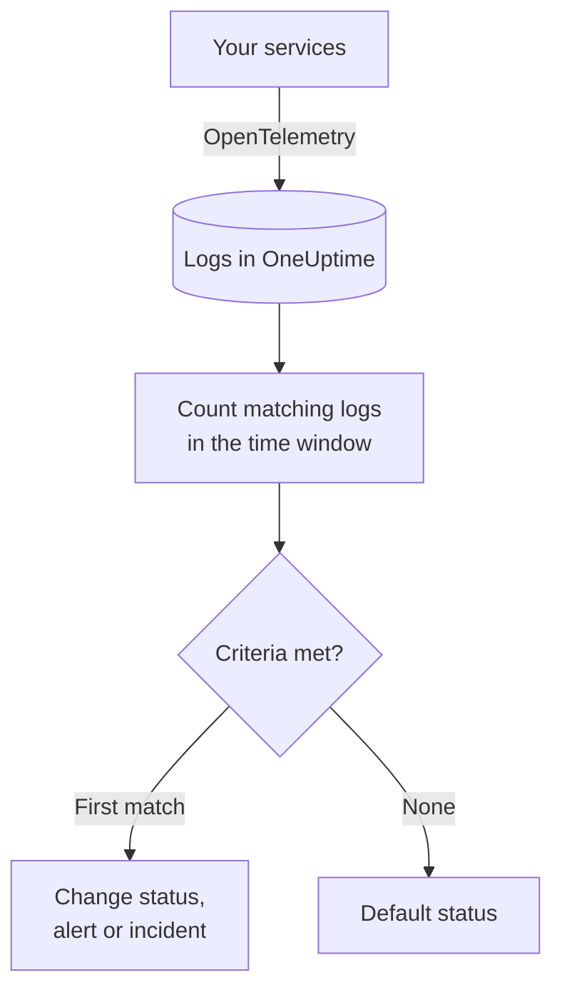
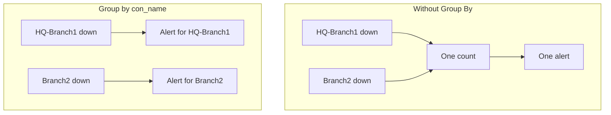

# Logs Monitor

A Logs monitor counts the logs your services send to OneUptime that match your filters — text, severity, service, attributes — over a time window, and changes the monitor's status, creates an alert or declares an incident when the count meets your criteria. Use it to catch error spikes, a specific failure message, or a service that has stopped logging.

:::cards
- [Create the monitor](#create-a-logs-monitor): Pick the logs to count and when to alert.
- [How it is evaluated](#how-it-is-evaluated): The time window, the count and the one-minute cycle.
- [Criteria](#criteria): Thresholds, anomaly detection and the defaults.
- [Per-group alerting](#per-group-alerting-group-by): One alert per tunnel, user or interface.
:::

## How it works



Every minute, OneUptime counts the logs that match the monitor's filters and arrived within its time window. It checks that count against the monitor's criteria from top to bottom, and the first criteria that matches decides what happens. When none matches, the monitor goes back to its default status.

## Before you begin

- Your services send logs to OneUptime over OpenTelemetry (or another log source OneUptime ingests). See [OpenTelemetry](/docs/telemetry/open-telemetry).
- To filter or group on a value inside the log line, such as a tunnel or user name, parse it into an attribute first with a [log pipeline](/docs/telemetry/log-pipelines).

## Create a logs monitor

:::steps
### Start a new monitor

Go to **Monitors** and click **Create Monitor**.

### Choose Logs

Under **Monitor Type**, click **More monitor types** and pick **Logs** under **Telemetry**, or type `logs` in the search box. Enter a **Name**, then click **Next**.

### Choose the logs to count

In **Log Monitor Configuration**, set **Monitor Logs that include this text**, **Monitor Logs for (time)** and **Log Severity**. A filter you leave empty matches every log. **Logs Preview**, under the filters, shows the logs they match right now.

### Narrow them down (optional)

Open **More fields** to filter by telemetry service, infrastructure entity or attribute. To get one alert per tunnel, user or interface instead of one for the whole monitor, add the attribute to **Group by Attributes** — see [Per-group alerting](#per-group-alerting-group-by).

### Set the criteria

The **Monitor Criteria** card starts with two criteria: offline, with an incident, when no logs match; online when at least one does. Change them to what you want to alert on — see [Criteria](#criteria).

### Create the monitor

Click **Create Monitor**. The monitor opens on its **Overview** page, and its first evaluation runs within a minute.
:::

## What it queries

| Field | What it matches | Default |
| --- | --- | --- |
| **Monitor Logs that include this text** | Logs whose body contains this text, ignoring case. | Empty: every log |
| **Monitor Logs for (time)** | Logs from the last 5 seconds up to the last 24 hours. | **Last 1 minute** |
| **Log Severity** | Logs with any of the chosen severities. | Empty: every severity |
| **Group by Attributes** | Not a filter: counts each combination of these attributes' values separately. | Empty: one count |
| **Filter by Telemetry Service** (under **More fields**) | Logs from any of the chosen services. | Empty: every service |
| **Filter by Infrastructure Entity** (under **More fields**) | Logs from any of the chosen hosts, pods, containers and other entities. | Empty: every entity |
| **Filter by Attributes** (under **More fields**) | Logs whose attributes meet every condition. Each condition has its own operator, such as equals or contains. | Empty: no condition |

All the filters you set must match for a log to be counted.

### Log severity

Every log is stored with one of seven severities. For OpenTelemetry logs it comes from the log's severity number, so pick the severity, not the text your logger printed:

| Severity | OpenTelemetry severity numbers |
| --- | --- |
| **Trace** | 1–4 |
| **Debug** | 5–8 |
| **Information** | 9–12 |
| **Warning** | 13–16 |
| **Error** | 17–20 |
| **Fatal** | 21–24 |
| **Unspecified** | Anything else |

## How it is evaluated

- **Every minute.** A Logs monitor is not checked by probes, so it has no interval to set and no **Probes & Interval** page.
- **One number per evaluation.** The monitor counts the logs that match every filter and arrived within **Monitor Logs for (time)** before the evaluation. With **Last 5 minutes**, each evaluation looks back five minutes, so the windows of consecutive evaluations overlap.
- **No logs is a count of 0.** A service that stops logging produces 0, which is what the default offline criteria looks for.
- **Criteria from top to bottom.** The first criteria that matches decides, so put the most severe one first. A grouped monitor works differently: it checks every criteria for every group — see [Criteria evaluation differs](#criteria-evaluation-differs).

Each status change, with the reason for it, is recorded on the monitor's **Status Timeline**.

## Criteria

A Logs monitor's criteria have one **Filter Type**: **Log Count**, the number of logs that matched in the window. Pick a **Filter Condition** and, for a threshold condition, a **Value**.

| Filter Condition | Matches when the log count is… |
| --- | --- |
| **Greater Than** | above the value |
| **Greater Than Or Equal To** | the value or above |
| **Less Than** | below the value |
| **Less Than Or Equal To** | the value or below |
| **Equal To** | exactly the value |
| **Anomalously High** | above the range expected for this hour of the week |
| **Anomalously Low** | below that range |
| **Anomalous** | outside that range, either way |

The anomaly conditions take no **Value**. Pick a **Sensitivity** — Low, Medium (the default) or High — and a **Baseline Window** of 14 (the default), 28, 60 or 90 days. OneUptime turns the count into a per-minute rate and compares it with the same hour of the week over that window. The baseline covers the monitor's services and severities only: its text and attribute filters are not part of it. Until that hour of the week has enough history, the criteria is still learning and does not fire.

A new Logs monitor starts with these criteria:

| Criteria | Filter | Effect |
| --- | --- | --- |
| Check if … is offline | **Log Count** **Equal To** `0` | Marks the monitor offline and declares an incident, resolved automatically |
| Check if … is online | **Log Count** **Greater Than** `0` | Marks the monitor online |

> [!TIP]
> To alert on errors rather than on silence, set **Log Severity** to **Error** and change the offline criteria to **Log Count** **Greater Than** the number of errors you can tolerate in the window.

## Worked example: an error spike

You want an incident when the checkout service logs more than 50 errors in five minutes:

- **Log Severity**: **Error**
- **Monitor Logs for (time)**: **Last 5 minutes**
- **Filter by Telemetry Service**: `checkout`
- Criteria 1: **Log Count** **Greater Than** `50` — mark the monitor offline and declare an incident
- Criteria 2: **Log Count** **Less Than Or Equal To** `50` — mark the monitor online

Four consecutive evaluations:

| Time | Error logs in the last 5 minutes | Criteria that matches | What happens |
| --- | --- | --- | --- |
| 10:00 | 12 | 2 | The monitor is online. |
| 10:01 | 64 | 1 | The monitor goes offline and an incident is declared. |
| 10:02 | 81 | 1 | Still offline. The incident is already open, so no second one is declared. |
| 10:06 | 9 | 2 | The monitor is back online, and the incident resolves itself because **Auto Resolve Incident** is on. |

Because the windows overlap, one burst of errors keeps the count high for up to five minutes after it ends. Use a shorter window for a monitor that should recover sooner.

## Per-group alerting (Group By)

**Group by Attributes** splits a Logs monitor's count into one count per distinct combination of attribute values - one per IPsec tunnel, per VPN user, per firewall interface - and evaluates the criteria on each group separately. It is the log counterpart of a metrics monitor's [Group By](/docs/monitor/metrics-monitor#per-series-alerting-group-by).

### One alert per group

Without Group By, a monitor that watches for terminated IPsec tunnels is a single count for the whole monitor and raises **one alert for the whole monitor**. While that alert is open, a second tunnel going down produces nothing new - the monitor is already alerting.

With Group By set to the tunnel name, tunnel `HQ-Branch1` terminating opens its own alert, and tunnel `Branch2` terminating ten minutes later opens a **second, separate alert** alongside it.



### Independent resolution

Each group's alert or incident resolves on its own. Once a group stops meeting the criteria - `HQ-Branch1` logs no more terminations within the time window - its alert resolves, while `Branch2`'s stays open until `Branch2` stops too. One group recovering never closes another group's alert.

A Logs monitor sees events, not state: a group's alert resolves once that group has logged nothing that meets the criteria for a whole time window, whether or not the tunnel is back.

### Example: one alert per Sophos IPsec tunnel

This assumes the firewall's syslog lines are parsed into attributes with a [Key=Value Parser](/docs/telemetry/log-pipelines#keyvalue-parser), without a target prefix, so the tunnel name is the attribute `con_name`:

```text
log_component="IPSec" con_name="HQ-Branch1" status="Terminated" message="IPSec Connection HQ-Branch1 between 10.171.4.117 and 10.171.4.118 for Child HQ-Branch1 terminated."
```

:::steps
1. Create a **Logs** monitor.
2. Set **Monitor Logs that include this text** to `terminated` and **Monitor Logs for (time)** to **Last 5 minutes**.
3. Under **More fields**, add the attribute filter `log_component` = `IPSec`.
4. In **Group by Attributes**, add `con_name`.
5. Add a criteria with the filter **Log Count** **Greater Than** `0` that creates an alert or incident titled `IPsec tunnel {{con_name}} terminated`.
:::

Each tunnel that logs a termination now gets its own alert - `IPsec tunnel HQ-Branch1 terminated`, `IPsec tunnel Branch2 terminated` - and each resolves on its own.

### Group values in titles and descriptions

Every group-by attribute's value is a [template variable](/docs/monitor/incident-alert-templating) in the alert or incident title, description, and remediation notes, the same way a metric series' labels are: grouping by `con_name` gives you `{{con_name}}`. A key with dots reads as a path, so `sophos.con_name` is `{{sophos.con_name}}`. When the title does not already name the group, the group is appended to it (`IPsec tunnel terminated - Con Name: HQ-Branch1`), and `{{seriesResourceSuffix}}` and `{{seriesResourceSummary}}` work as they do on metric monitors.

### How groups are counted

- Up to 10 attributes. Each distinct combination of their values is one group.
- A log that does not carry a group-by attribute is counted under an **empty value** for it, so logs missing the attribute form a group of their own whose alert names no value for it. If every alert arrives without a group value, check the attribute key - a log pipeline with a target prefix stores `con_name` as `sophos.con_name`.
- Group values longer than 256 characters are cut to 256.
- At most **100 groups** are evaluated per check: the 100 with the most logs. When more match, the rest are skipped for that check and a warning is logged - narrow the monitor's filters to cover them.

### Criteria evaluation differs

- **Every criteria is evaluated**, as on a grouped metrics monitor, so different groups can meet different criteria at once. A group that meets two criteria still gets one alert, from the first, so order the criteria most severe first.
- **A group only exists when it logged something in the time window.** **Equal To 0** and **Less Than** criteria therefore only fire for groups that logged at least once; to alert when logs stop arriving altogether, use a monitor without Group By.
- **Anomaly detection** (**Anomalously High**, **Anomalously Low**, **Anomalous**) is not evaluated per group - its baseline covers the whole monitor - so those filters never match on a grouped monitor.
- The monitor's status follows the first criteria any group meets. When no group meets any criteria, the monitor returns to its default status.

## Troubleshooting

:::details The monitor is offline, but my service is logging
The count was 0, so the filters match none of the logs the service sends. Open the monitor's **Criteria** page (under **Configuration**) and click **Edit Monitoring Criteria**: **Logs Preview** shows what the filters match right now. The usual causes are a severity picked by the text the logger prints instead of its severity number (see [Log severity](#log-severity)), a service or attribute filter that does not match, and a time window shorter than the gap between the service's logs.
:::

:::details A spike happened, but nothing alerted
The criteria are checked from top to bottom and the first match decides. A broad criteria above the one you expected, such as **Log Count** **Greater Than** `0`, matches first and stops the rest. Put the most severe criteria at the top.
:::

:::details An anomaly criteria never fires
It is still learning: the hour of the week it compares against does not have enough history yet. On a monitor with **Group by Attributes**, anomaly conditions never match — use a threshold there.
:::

:::details Group alerts arrive without a group value
Logs that do not carry the group-by attribute are counted under an empty value. Check the key's exact name in the log explorer: a log pipeline with a target prefix stores `con_name` as `sophos.con_name`.
:::

## Next steps

:::cards
- [Log Pipelines](/docs/telemetry/log-pipelines): Parse log lines into attributes you can filter and group on.
- [Incident & Alert Templating](/docs/monitor/incident-alert-templating): Put group values and counts in titles and descriptions.
- [Metrics Monitor](/docs/monitor/metrics-monitor): Alert on a metric, per host or per container.
- [Traces Monitor](/docs/monitor/traces-monitor): Alert on failing spans the same way.
:::
