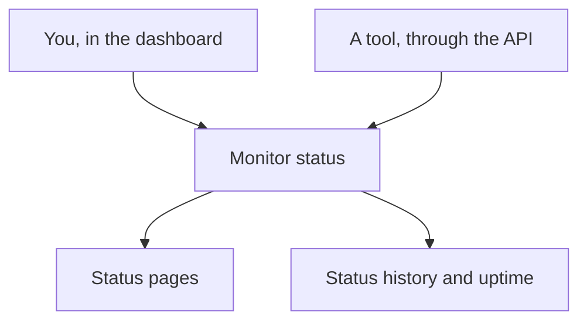

# Manual Monitor

A Manual monitor has no automatic checks: its status is whatever you set, in the dashboard or through the API. Use it to represent something OneUptime cannot check itself — a third-party dependency, a physical system, a business process — on your status pages and in your incidents.

## When to use a manual monitor

| Use case                 | Description                                                                     |
| ------------------------ | ------------------------------------------------------------------------------- |
| Third-party services     | Track the status of external services you depend on but cannot monitor directly |
| Physical infrastructure  | Represent hardware or physical systems without network monitoring               |
| Business processes       | Track non-technical processes that affect service status                        |
| API-driven status        | Let external tools update monitor status via the OneUptime API                  |
| Status page placeholders | Show components on your status page that are managed outside OneUptime          |

## How it works

A manual monitor has no monitoring interval, probes or criteria. Its status stays as you set it until you, or a tool using the API, change it — and the new status shows wherever the monitor does.

## Creating a Manual Monitor

:::steps
### Start a new monitor

Go to **Monitors** and click **Create Monitor**.

### Choose Manual

Under **Monitor Type**, click **More monitor types** and pick **Manual** under **Other**.

### Name it and create it

Enter a **Name** — and a **Description** under **More fields**, if you like — then click **Create Monitor**. A Manual monitor needs nothing more, so it is created from this first step.
:::

## Updating Status

You can update the status of a manual monitor in two ways:

- **Dashboard** — Change the monitor status directly from the OneUptime Dashboard.
- **API** — Update the monitor status programmatically using the OneUptime API.

## Incidents and Alerts

You can create incidents and alerts against manual monitors just like any other monitor type. This allows you to:

- Track downtime for externally monitored services
- Create incidents manually when issues are reported
- Use manual monitors on status pages to communicate status to users

## Next steps

:::cards
- [Creating a Monitor](/docs/monitor/create-monitor): The monitor types that check things for you.
- [External Status Page Monitor](/docs/monitor/external-status-page-monitor): Follow a provider's status page automatically instead.
- [Status Pages](/docs/status-pages/index): Show the monitor's status to your customers.
:::
