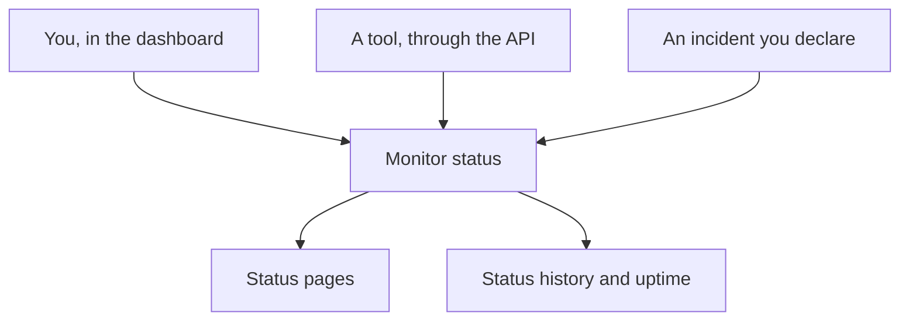

# Manual Monitor

A Manual monitor has no automatic checks: its status is whatever you set, in the dashboard or through the API. Use it to represent something OneUptime cannot check itself — a third-party dependency, a physical system, a business process — on your status pages and in your incidents.

:::cards
- [Create one](#creating-a-manual-monitor): One step in the dashboard.
- [Change its status](#updating-status): In the dashboard, or from your own tools through the API.
- [Incidents and alerts](#incidents-and-alerts): Declare an incident and set the status in the same step.
:::

## When to use a manual monitor

| Use case | Description |
| --- | --- |
| Third-party services | Track the status of external services you depend on but cannot monitor directly. |
| Physical infrastructure | Represent hardware or physical systems without network monitoring. |
| Business processes | Track non-technical processes that affect service status. |
| API-driven status | Let your own tools set the status through the OneUptime API. |
| Status page placeholders | Show components on your status page that are managed outside OneUptime. |

A provider that publishes a status page does not need one: an [External Status Page Monitor](/docs/monitor/external-status-page-monitor) follows that page for you.

## How it works

A manual monitor has no monitoring interval, probes or criteria. Its status stays as you set it until you, a tool using the API, or an incident you declare changes it — and the new status shows wherever the monitor does.



Each change is an entry on the monitor's **Status Timeline**, so its uptime and status history are kept like any other monitor's. A Manual monitor is not an active monitor, so on OneUptime Cloud it adds nothing to your bill.

## Creating a Manual Monitor

:::steps
### Start a new monitor

Go to **Monitors** and click **Create Monitor**.

### Choose Manual

Under **Monitor Type**, click **More monitor types** and pick **Manual** under **Other**.

### Name it and create it

Enter a **Name** — and a **Description** under **More fields**, if you like — then click **Create Monitor**. A Manual monitor needs nothing more, so it is created from this first step.
:::

## Updating Status

### In the dashboard

:::steps
1. Open the monitor and click **Status Timeline** in its side menu.
2. Click **Create Monitor Status Event**.
3. Pick the **Monitor Status**. **Starts At** is now; set an earlier time if the change happened earlier.
4. Click **Create Monitor Status Event**. The new status shows on the monitor, and on every status page that lists it, straight away.
:::

### Through the API

Send the new status as a monitor status event, with an [API key](/docs/api-reference/api-reference) of your project in the `ApiKey` header:

```bash
curl -X POST https://oneuptime.com/api/monitor-status-timeline \
  -H "ApiKey: $ONEUPTIME_API_KEY" \
  -H "Content-Type: application/json" \
  -d '{"data": {"monitorId": "<monitor id>", "monitorStatusId": "<monitor status id>"}}'
```

- `monitorId` is the monitor's ID: click the **ID** line on its page to copy it.
- `monitorStatusId` is the status to set: on **Monitors → Settings → Monitor Status**, pick **Show ID** in that status's row.
- `startsAt` is optional. Left out, the change starts now.
- On a self-hosted install, send the request to your own host instead of `oneuptime.com`.

Sending the status the monitor already has is refused with `Monitor Status cannot be same as previous status.` and records nothing, so a tool that reports on every run can ignore that answer.

## Incidents and Alerts

A manual monitor is picked like any other monitor wherever monitors are:

- Declare an incident and pick the monitor under **Monitors**. With **Change Monitor Status to**, declaring it also sets the monitor's status, and resolving it sets the monitor back to operational, unless another incident on it is still open. See [Declaring an Incident](/docs/incidents/declaring-incidents#step-2-resources-affected).
- Create an alert about it, for a problem your team should act on without telling your customers.
- Add it to a status page, to show customers a dependency you watch by hand.

## Next steps

:::cards
- [Creating a Monitor](/docs/monitor/create-monitor): The monitor types that check things for you.
- [External Status Page Monitor](/docs/monitor/external-status-page-monitor): Follow a provider's status page automatically instead.
- [Status Pages](/docs/status-pages/index): Show the monitor's status to your customers.
:::
