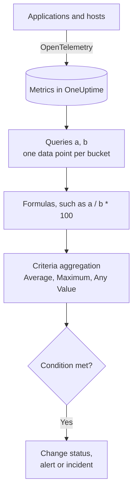

# Metrics Monitor

A Metrics monitor queries the metrics your applications and infrastructure send to OneUptime, combines them with formulas when you need a ratio or a total, and checks the result over a rolling time range against your criteria. Use it for request rates, error ratios, queue depths, CPU, memory and disk — any numeric series — with one alert per host or container when you group it.

:::cards
- [Create the monitor](#create-a-metrics-monitor): Queries, formulas, a time range and criteria.
- [How it is evaluated](#how-it-is-evaluated): Data points, formulas and the criteria's aggregation.
- [Worked example](#worked-example-a-growing-queue): The same data under each aggregation.
- [Per-series alerting](#per-series-alerting-group-by): One alert per host, container or mountpoint.
:::

## How it works

Every minute, OneUptime runs each of the monitor's metric queries over its time range. A query returns one data point per time bucket, and formulas combine the queries bucket by bucket. Each criteria then reduces the data points of the query or formula it checks — to their average, their maximum, or a test of every point — and compares the result with its threshold.

## Before you begin

- Your applications or infrastructure send metrics to OneUptime over OpenTelemetry. See [OpenTelemetry](/docs/telemetry/open-telemetry).
- Know the metric's name and the attributes you want to filter or group on. The **Metric** and **Group by** lists only offer names and attributes OneUptime has received.

## Create a metrics monitor

:::steps
### Start a new monitor

Go to **Monitors** and click **Create Monitor**.

### Choose Metrics

Under **Monitor Type**, click **More monitor types** and pick **Metrics** under **Telemetry**, or type `metrics` in the search box. Enter a **Name**, then click **Next**.

### Pick the time range

In **Metric Monitor Configuration**, pick a **Time Range**: how far back each evaluation looks. It starts at **Past 1 Minute**.

### Add the metric queries

Under **Select Metrics**, pick a **Metric** and how to **Aggregate by** it. Open **Filters & grouping** to filter by attributes or to **Group by** one. Click **Add Metric** for another query, or **Add Formula** to combine them. The chart under the queries previews the time range, so you can see the values the criteria will check.

### Set the criteria

In **Monitor Criteria**, each criteria picks the **Metric** to check (a query or a formula), its **Aggregation**, a **Condition** and a **Threshold**. See [Criteria](#criteria) for what a new monitor starts with.

### Create the monitor

Click **Create Monitor**. The monitor opens on its **Overview** page, and its first evaluation runs within a minute.
:::

## What it queries

### Metric queries

| Field | What it does | Default |
| --- | --- | --- |
| **Metric** | The metric to query. | Required |
| **Aggregate by** | How the values in each time bucket are combined into one data point: Avg, Sum, Min, Max, Count, or a percentile — P50, P75, P90, P95 or P99. | Avg |
| **Filter by attributes** (under **Filters & grouping**) | Only series whose attributes match these conditions. | No filter |
| **Group by** (under **Filters & grouping**) | One series per unique value of these attributes — see [Per-Series Alerting](#per-series-alerting-group-by). | One series |

Each query and formula gets a variable — `a`, `b`, `c` and so on — in the order you add them.

### Formulas

A formula combines query variables with `+`, `-`, `*`, `/`, `%`, `^` and parentheses, bucket by bucket. You can write the variables with or without a leading `$`:

- `a / b * 100` — the share of `b` that `a` is, as a percentage
- `a + b` — two metrics added together
- `a - b` — the difference between them

### Rolling Time Window

**Time Range** sets how far back every evaluation looks: **Past 1 Minute**, **Past 5 Minutes**, **Past 10 Minutes**, **Past 15 Minutes**, **Past 30 Minutes**, **Past 1 Hour**, **Past 2 Hours**, **Past 3 Hours**, **Past 6 Hours**, **Past 12 Hours**, **Past 1 Day**, **Past 2 Days**, **Past 3 Days**, **Past 7 Days**, **Past 14 Days**, **Past 30 Days**, **Past 60 Days**, **Past 90 Days**, **Past 180 Days** or **Past 365 Days**.

The longer the range, the wider each time bucket, so one data point stands for more time:

| Time Range | One data point per |
| --- | --- |
| Past 1 Minute to Past 3 Hours | minute |
| Past 6 Hours, Past 12 Hours | 5 minutes |
| Past 1 Day | 15 minutes |
| Past 2 Days, Past 3 Days | 30 minutes |
| Past 7 Days | hour |
| Past 14 Days, Past 30 Days | day |
| Past 60 Days to Past 180 Days | week |
| Past 365 Days | month |

## How it is evaluated

- **Every minute.** A Metrics monitor is not checked by probes, so it has no interval to set and no **Probes & Interval** page.
- **Queries, then formulas.** Each query returns one data point per time bucket of the time range, using its **Aggregate by**. Formulas are worked out for each bucket from the queries' data points.
- **Then the criteria's aggregation.** Each criteria reduces the data points of its **Metric** to what it compares with the threshold:

| Aggregation | The condition is checked against… |
| --- | --- |
| Average | the average of the data points |
| Sum | the sum of the data points |
| Maximum Value | the highest data point |
| Minimum Value | the lowest data point |
| All Values | every data point: all of them must meet the condition |
| Any Value | every data point: one of them meeting the condition is enough |

- **Criteria from top to bottom.** On a monitor without Group By, the first criteria that matches decides, so put the most severe one first. A grouped monitor checks every criteria for every series — see [Criteria evaluation differs](#criteria-evaluation-differs).
- **No data is not zero.** When the query returns no data points in the time range, a criteria does what its **If No Data** setting says, under **More fields**: **Ignore** (the default — the criteria does not match), **Treat As Zero**, or **Trigger**.
- **OneUptime's own downtime is not silence.** While the time range holds time OneUptime itself was not receiving data — it was restarting, being upgraded or catching up — the check waits: the status does not change, and no incident or alert is opened or resolved, whatever **If No Data** says. See [When OneUptime Is Not Receiving Data](/docs/monitor/when-oneuptime-is-not-receiving).

## Criteria

These monitors always evaluate the **Metric Value** — the aggregated value of the configured metric query or formula. The criteria form has no Filter Type selector; it shows **Metric**, **Aggregation**, **Condition**, and **Threshold**. When the metric has a unit, pick the threshold's unit next to it.

| Condition | Matches when the value is… |
| --- | --- |
| **Greater Than** | above the threshold |
| **Greater Than Or Equal To** | the threshold or above |
| **Less Than** | below the threshold |
| **Less Than Or Equal To** | the threshold or below |
| **Equal To** | exactly the threshold |
| **Anomalously High** | above the range expected for this hour of the week |
| **Anomalously Low** | below that range |
| **Anomalous** | outside that range, either way |

The anomaly conditions have no threshold. The form shows **Sensitivity** — Low, Medium (the default) or High — and **Baseline Window** — 14 days (the default), 28, 60 or 90 — instead, and compares each data point with the same-hour-of-week baseline built from that window. Until that hour of the week has enough history, the criteria is still learning and produces no alerts.

A new Metrics monitor starts with two criteria on its first query, both with the **Any Value** aggregation:

| Criteria | Condition | Effect |
| --- | --- | --- |
| Check if … is offline | **Equal To** `0` | Marks the monitor offline and declares an incident, resolved automatically |
| Check if … is online | **Greater Than** `0` | Marks the monitor online |

> [!NOTE]
> The offline criteria fires on a reported value of 0, not on silence. To alert when a metric stops arriving, set its **If No Data** to **Trigger**.

## Worked example: a growing queue

You want an incident when the checkout queue stays deep. Query `a` is the gauge `checkout.queue.depth`, with **Aggregate by** Max, and the **Time Range** is **Past 5 Minutes**. One evaluation sees these five one-minute data points:

| Minute | 10:01 | 10:02 | 10:03 | 10:04 | 10:05 |
| --- | --- | --- | --- | --- | --- |
| `a` | 640 | 980 | 1,500 | 1,620 | 1,100 |

A criteria of **Metric** `a`, **Condition** **Greater Than**, **Threshold** `1000` gives a different answer for each **Aggregation**:

| Aggregation | Compared with 1,000 | Matches? |
| --- | --- | --- |
| Average | 1,168 | Yes |
| Sum | 5,840 | Yes |
| Maximum Value | 1,620 | Yes |
| Minimum Value | 640 | No |
| All Values | 640, 980, 1,500, 1,620, 1,100 | No — two points are not above 1,000 |
| Any Value | 640, 980, 1,500, 1,620, 1,100 | Yes — 1,500 is |

**Average** pages on a sustained backlog and ignores one deep minute; **All Values** waits until every minute in the range is deep; **Any Value** pages on the first deep minute.

## Per-Series Alerting (Group By)

**Group by** on a metric query splits that query into one series per unique attribute value — one per host, one per container, one per mountpoint — and a monitor with Group By set evaluates every series independently. That single setting is the difference between "the fleet is unhealthy" and "`prod-db-01` is unhealthy".

### One alert per group

With Group By set to `host.name`, a disk-usage monitor watching fifty hosts raises **one alert (or incident) per breaching host**. Host A filling up opens its own alert; host B filling up ten minutes later opens a second, separate alert alongside it.

Without Group By, the same monitor is a single scalar: the query collapses every host into one number and the monitor raises **one alert for the whole monitor**. While that alert is open, a second host breaching produces nothing — the monitor is already alerting, so there is nothing new to raise, and the on-call engineer never learns about host B. **Setting Group By is how you get per-host alerts.** If you want to be paged per host, per container, or per mountpoint, set it.

### Independent resolution

Each per-group alert tracks its own group. When host A drops back under the threshold its alert resolves on its own, and host B's alert stays open until host B recovers. One group recovering never closes another group's alert.

### Criteria evaluation differs

- **Grouped monitors evaluate every criteria.** Severity bands can therefore fire on different groups at the same time: with "Critical — greater than 95" above "Warning — greater than 80", a host at 96% opens a critical alert while a host at 85% opens a warning alert on the same check. A host that breaches both bands still gets exactly one alert — from the first matching criteria, so **order the criteria most severe first**.
- **Ungrouped monitors stop at the first matching criteria.** Only that one criteria fires, which is another reason to put the alerting criteria above the healthy one: a broad healthy criteria placed first matches on nearly every check and prevents the alerting criteria below it from ever being evaluated.

| Host | Disk used | Critical (> 95) | Warning (> 80) | Alert raised |
| --- | --- | --- | --- | --- |
| `prod-db-01` | 96% | Yes | Yes | Critical |
| `prod-db-02` | 85% | No | Yes | Warning |
| `prod-db-03` | 40% | No | No | None |

### Choosing an attribute to group by

Group by an attribute that genuinely identifies a distinct thing you would page someone about: the host attribute for a fleet-wide host metric, the container or pod attribute for a container metric, the mountpoint or device attribute for a filesystem or disk-I/O metric, the interface attribute for a network metric. The **Group by** dropdown is populated from the attributes your collector actually sends, so pick from the list rather than typing a key by hand.

Do not group a metric that is already a single scalar for the whole system — a cluster-wide leader flag, a scheduler backlog, or a single host's CPU on a single-host monitor. Grouping those produces exactly one series and changes nothing except the alert titles.

The grouping attribute values are also available as [template variables](/docs/monitor/incident-alert-templating) in the alert or incident title, description, and remediation notes — grouping by `host.name` lets the title read `Disk almost full on {{host.name}}`.

## Troubleshooting

:::details The chart shows a breach, but the monitor did not alert
Check the criteria's **Aggregation** first: **All Values** only matches when every data point in the time range breaches, and **Average** smooths out a short spike. Then check that the criteria's **Metric** is the query or formula you mean (`a` is not the formula `c`), and that the threshold is in the unit you think.
:::

:::details The metric stopped arriving and nothing happened
A time range with no data points is not a value of 0. With **If No Data** at its default, **Ignore**, the criteria does not match. Set it to **Trigger** under the criteria's **More fields** to alert on silence.
:::

:::details I get one alert for the whole fleet
The query has no **Group by**, so every host is collapsed into one number. Group the query by the host, container or mountpoint attribute — see [Per-Series Alerting](#per-series-alerting-group-by).
:::

:::details An anomaly criteria never fires
It is still learning: the hour of the week it compares against does not have enough history yet within the **Baseline Window**.
:::

## Next steps

:::cards
- [Incident & Alert Templating](/docs/monitor/incident-alert-templating): Put the host and the value in alert titles.
- [Logs Monitor](/docs/monitor/logs-monitor): Alert on log volume and content, per group.
- [Host Monitor](/docs/monitor/host-monitor): Ready-made CPU, memory and disk checks for your hosts.
- [OpenTelemetry](/docs/telemetry/open-telemetry): Send metrics to OneUptime.
:::
