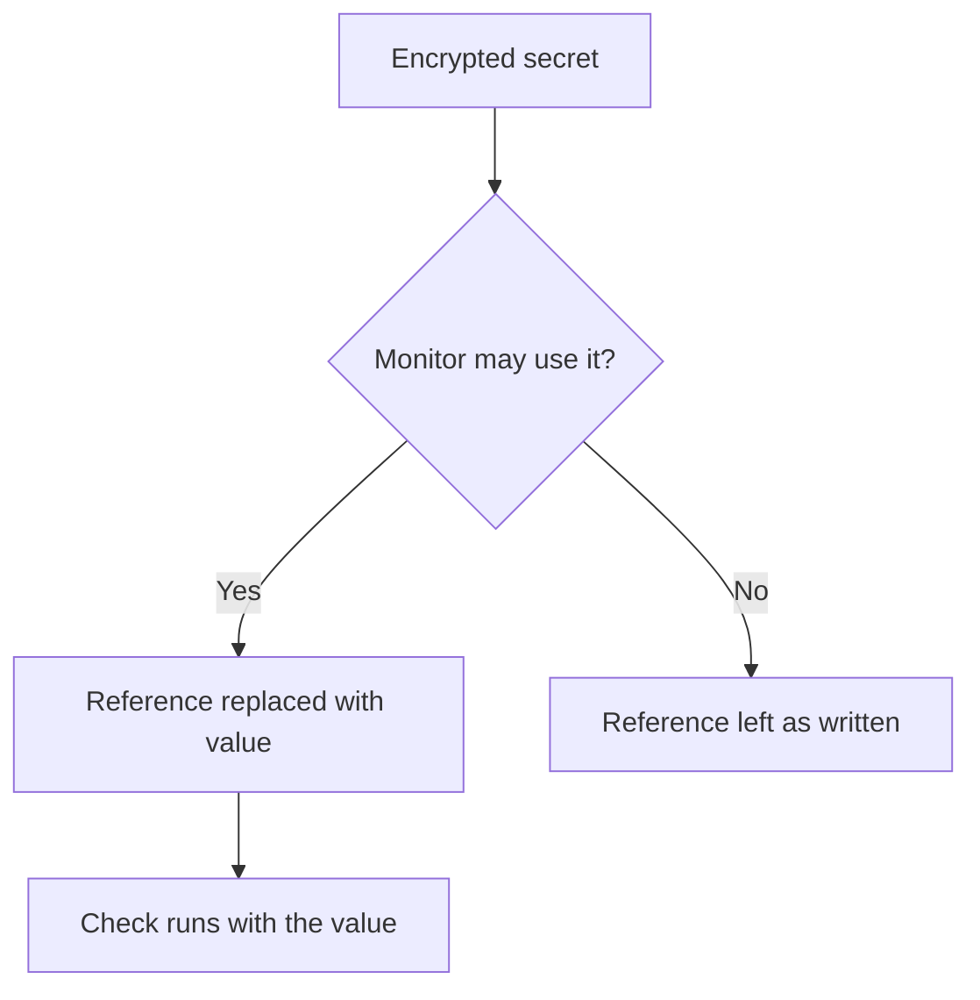

# Monitor Secrets

Monitor secrets keep the passwords, API keys and tokens your monitors need out of the monitor itself. You store a value once, encrypted, choose which monitors may use it, and reference it as `{{monitorSecrets.NAME}}` wherever the monitor needs it.

:::cards
- [Add a secret](#adding-a-secret): Store a value and choose who can use it.
- [Choose access](#choosing-which-monitors-can-use-a-secret): All monitors, specific monitors, or monitors with labels.
- [Use a secret](#using-a-secret): Where `{{monitorSecrets.NAME}}` works.
:::

## How secrets reach a monitor

A secret is stored encrypted and is never shown again after you save it. When a monitor that is allowed to use the secret runs, the reference is replaced with the decrypted value; a monitor that is not allowed keeps the reference as written.

## Work with secrets

### Adding a secret

:::steps
1. Go to OneUptime Dashboard -> **Monitors** -> **Settings** -> **Secrets** and click **Create Monitor Secret**.
2. Give the secret a name and a value. The name is what you reference, for example `ApiKey`.
3. On the **Access** step, choose which monitors can use it (see the next section), then create the secret.
:::

> [!IMPORTANT]
> Secrets are encrypted and stored securely. The secret value is never shown again after it is saved — not in the table, not in the edit form, and not over the API. If you lose the value you will need to get it from wherever it came from and set it again. To rotate a secret, use the **Update Secret Value** button on its row; you do not need to delete and recreate it.

### Choosing which monitors can use a secret

Each secret has one of three access options:

| Option | Which monitors can use the secret | Use it for |
| --- | --- | --- |
| **All monitors** | Every monitor in the project, including monitors you create later. | A credential that many monitors share. |
| **Specific monitors** | Only the monitors you pick. This is the default, and secrets created before these options existed work this way. | A credential for one or a few monitors. |
| **Monitors with labels** | Monitors that have at least one of the labels you pick. Adding one of those labels to a monitor gives it access, and removing the label takes access away the next time the monitor runs. | A credential for a group of monitors that changes over time. |

You can change the option at any time with **Edit** on the secret's row. Only the list for the chosen option is kept: switching to **All monitors** clears the secret's monitor and label lists, and switching between **Specific monitors** and **Monitors with labels** clears the list you switched away from.

A secret is never available to monitors in another project.

> [!WARNING]
> Anyone who can edit a monitor that can use a secret can send that secret anywhere the monitor connects to. With **All monitors**, that is anyone who can create or edit monitors in the project. With **Monitors with labels**, it also includes anyone who can add one of those labels to a monitor.

Over the API, the access option is the `monitorAccess` field: `All Monitors`, `Specific Monitors` or `Monitors With Labels`. The `monitors` and `labels` fields hold the lists. A secret created without `monitorAccess` gets `Specific Monitors`.

### Using a secret

To use a secret, add `{{monitorSecrets.SECRET_NAME}}` in the field where you want to use the secret. For example, a request header of `Authorization: Bearer {{monitorSecrets.ApiKey}}` sends the `ApiKey` secret's value.

You can use secrets in these monitor types and fields:

| Monitor type | Fields |
| --- | --- |
| API | Request headers, request body, and URL |
| Website, IP, Port, Ping, SSL Certificate | URL |
| Synthetic Monitor, Custom Code Monitor | The script |
| SNMP (Network Device) | Community string, SNMPv3 auth key, and priv key |

Secrets are injected on the probe before Synthetic or Custom Code monitor scripts execute, so references such as `{{monitorSecrets.ApiKey}}` resolve to the decrypted value inside the running script.

If a monitor references a secret it cannot use, the reference is left as it is and is not replaced with the value.

When you test a monitor before saving it, only secrets available to **All monitors** are filled in, because a new monitor is not on any list and has no labels yet. After you save the monitor, tests use every secret the monitor can use.

## Troubleshooting

:::details The monitor sends `{{monitorSecrets.NAME}}` literally
The monitor cannot use the secret, or the name does not match. Check the secret's access option with **Edit** on its row, and that the name in the reference is exactly the secret's name.
:::

:::details Testing a new monitor does not fill in the secret
Before a monitor is saved, only secrets available to **All monitors** are filled in. Save the monitor, then test it again.
:::

## Next steps

:::cards
- [API Monitor](/docs/monitor/api-monitor): Send a secret in a request header.
- [Synthetic Monitor](/docs/monitor/synthetic-monitor): Use a secret inside a browser script.
- [SQL Query Monitor](/docs/monitor/sql-monitor): Keep a database password encrypted.
:::
