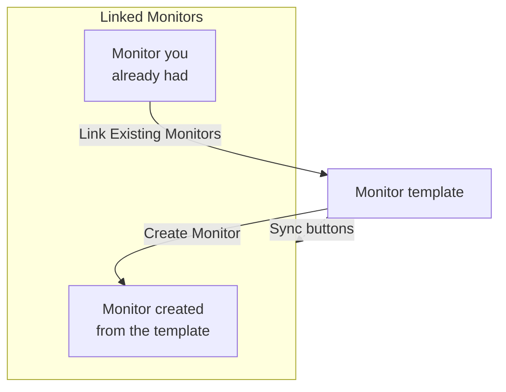

# Monitor Templates

A monitor template is a saved monitor configuration (a type, criteria, an interval, labels and custom field defaults) that you create monitors from in one click. Monitors created from it, or linked to it, stay connected: change the template, then sync the change to all of them. Use templates when many monitors should behave the same way, such as the same health check on every service, or the same API checks in production and staging.

:::cards
- [Create a template](#create-a-template): Four steps, like Create Monitor.
- [Create monitors from it](#create-monitors-from-a-template): One click, or link monitors you already have.
- [Sync changes](#sync-changes-to-linked-monitors): What each sync button copies.
- [Keep values specific to each monitor](#keep-values-specific-to-each-monitor): Protect a destination or headers from a sync.
:::

## How templates work

A template does not watch anything itself. Monitors are created from it, or linked to it, and the template's page lists them as **Linked Monitors**. When you change the template, nothing changes on those monitors until you sync: each sync button copies one part of the template onto every linked monitor, and fields you protect keep each monitor's own value.



## Before you begin

- **A role that can create templates**: Project Owner, Project Admin, Project Member, Monitor Admin or Monitor Member, or a custom role with the Create Monitor Template permission. Changing a template takes the same roles, or the Edit Monitor Template permission.
- **Permission to update the linked monitors.** A sync writes to each linked monitor as you, and skips the monitors your permissions do not cover.

## Create a template

:::steps
### Open Templates

Go to **Monitors → Settings → Templates** and click **Create Monitor Template**.

### Name the template

On **Template Info**, enter a **Template Name**, such as `Production API Health`, and a **Template Description**, then click **Next**.

### Set the monitor defaults

On **Monitor Defaults**, pick the **Monitor Type**, with the same picker as Create Monitor. Optionally enter a **Default Monitor Name**; left blank, each monitor is named after the resource it watches. **Default Monitor Description** and **Labels** wait under **More fields**. Click **Next**.

### Set the criteria and the interval

On **Criteria**, fill in what to check and the criteria, as on [Create Monitor](/docs/monitor/create-monitor#criteria). The **Template sync settings** card at the top lets you protect fields from syncs (see [Keep values specific to each monitor](#keep-values-specific-to-each-monitor)). For a monitor type that probes check, the last step, **Interval**, asks for the **Monitoring Interval**. Click **Create Monitor Template** on the last step.
:::

The template is added to the list. Open it to see its page, with a card for each part: **Template Info**, **Monitor Defaults**, **Monitoring Criteria**, **Monitoring Interval** (with **Minimum Probe Agreement**), **Labels**, **Custom Field Defaults** and **Linked Monitors**. You change each part on its own card, for example with **Edit Criteria** or **Edit Interval**.

## Create monitors from a template

- **New monitor.** Click **Create Monitor** on the template's row in the list, or **Create Monitor from Template** on its page. **Create Monitor** opens with the template's type and settings filled in; change anything you need, then create it. The new monitor is linked to the template.
- **Monitors you already have.** In **Linked Monitors**, click **Link Existing Monitors** and pick them. They keep their settings until you sync.

Custom field values set under **Custom Field Defaults** are written onto every monitor created from the template, including monitors that auto-import rules and alert policies create from it.

## Sync changes to linked monitors

Editing a template changes only the template. To copy a change onto the linked monitors, use the sync button on the card you changed. Each button names how many monitors it reaches, such as **Sync Criteria to 3 Linked Monitors**, and is greyed out while nothing is linked. A sync cannot be undone.

| Button | Copies onto every linked monitor | Leaves alone |
| --- | --- | --- |
| **Sync Criteria to Linked Monitors** | The criteria and the step settings, such as destinations and request options, except protected fields | The monitoring interval, minimum probe agreement, name, description, labels and custom field values |
| **Sync Interval to Linked Monitors** | The monitoring interval and minimum probe agreement | The criteria, name, description, labels and custom field values |
| **Sync Labels to Linked Monitors** | The labels, and nothing else | Everything else |
| **Sync Custom Fields to Linked Monitors** | The custom fields the template has a default for, replacing what each monitor had | Custom fields the template leaves blank, and everything else |

To sync one monitor, click **Sync from Template** on its row in **Linked Monitors**. That copies the criteria and step settings (except protected fields), the monitoring interval, minimum probe agreement and labels, and leaves the monitor's name, description and custom field values alone. **Unlink from Template** disconnects a monitor; it keeps its settings.

After a sync, a summary says how many monitors were updated. **Partially synced** means some linked monitors still have the previous configuration, usually because your permissions do not cover them.

## Keep values specific to each monitor

A criteria sync also copies step settings such as destinations, request headers, and timeouts unless you protect those fields. Protect a field to keep each linked monitor's own value for it.

:::steps
### Open the template

Go to **Monitors → Settings → Templates** and open the template.

### Edit its criteria

On the **Monitoring Criteria** card, click **Edit Criteria**.

### Protect the fields

In **Template sync settings**, check **Do not sync this field** beside each field you want to keep on the linked monitors.

### Save

Save your changes. The **Monitoring Criteria** card, and the confirmation of every sync, list the protected fields.

### Sync

Use **Sync Criteria to Linked Monitors**, or **Sync from Template** on an individual linked monitor.
:::

For example, protect **Monitor destination** and **Request headers** on an API template. Production and staging monitors keep their own URLs and headers, while both receive the template's updated criteria and other unprotected settings.

The available options depend on the monitor type. These include destinations and ports, HTTP request options, database connections, DNS settings, infrastructure selectors, and telemetry queries. Related credentials, such as a client certificate and its private key, are kept together.

### How exclusions behave

- Checked fields keep each existing monitor's current value, including an empty or unset value. Request headers and other collections are preserved in full.
- Unchecked fields continue to sync from the template. Uncheck a protected field and save to copy its template value on the next sync.
- Exclusions apply to bulk and individual syncs. They are saved on the template, not selected separately for each sync.
- New monitors still start with the template's field values. Exclusions only affect syncing to existing monitors.
- Criteria always sync. Criteria-only sync leaves monitoring interval, labels, and other monitor-level settings alone.
- Existing templates have no field exclusions until you configure them. Network Device monitors continue to retain their own device binding automatically.

For templates with multiple steps, protected values are matched using the step IDs. Independently created single-step monitors can also receive a single-step template. If a protected step cannot be matched, the sync is rejected before any monitor updates, so a new or reordered step cannot accidentally copy another step's destination or credentials.

> [!IMPORTANT]
> Before changing a saved template's monitor type (with **Edit Monitor Defaults**), clear exclusions that do not apply to the new type in **Edit Criteria**. A template's exclusions must all exist for its monitor type.

## API configuration

Each template step accepts a `doNotSyncFields` array in its `MonitorStep.value` object. For an API monitor, protect its destination and entire header collection with:

```json title="monitorSteps (excerpt)"
{
  "_type": "MonitorSteps",
  "value": {
    "monitorStepsInstanceArray": [
      {
        "_type": "MonitorStep",
        "value": {
          "id": "<step id>",
          "doNotSyncFields": ["monitorDestination", "requestHeaders"]
        }
      }
    ]
  }
}
```

Omit the array or set it to `[]` to sync every supported step setting. Unsupported field names and fields that do not apply to the template's monitor type are rejected. The template's array controls sync; any such metadata on a linked monitor does not override it.

:::details Field names for doNotSyncFields, by monitor type
| Monitor type | Field names |
| --- | --- |
| Website, API, Ping, IP, Port, SSL Certificate | `monitorDestination`, `requestTimeoutInMs`, `retryCount` |
| API only | `requestHeaders`, `requestType`, `requestBody` |
| Website and API | `doNotFollowRedirects`, `allowSelfSignedCertificates`, `tlsClientAuthentication` (the client certificate, key and passphrase together) |
| Port | `monitorDestinationPort` |
| Synthetic Monitor, Custom JavaScript Code | `customCode` |
| Synthetic Monitor | `browserTypes`, `screenSizeTypes`, `retryCountOnError` |
| DNS | `dnsMonitor.queryName`, `dnsMonitor.recordType`, `dnsMonitor.resolver` (the DNS server and port together), `dnsMonitor.timeout`, `dnsMonitor.retries` |
| Domain | `domainMonitor.domainName`, `domainMonitor.lookupMethod`, `domainMonitor.timeout`, `domainMonitor.retries` |
| DNSSEC | `dnssecMonitor.domainName`, `dnssecMonitor.resolvers`, `dnssecMonitor.checkNameserverConsistency`, `dnssecMonitor.signatureExpiryWarningDays`, `dnssecMonitor.timeout`, `dnssecMonitor.retries` |
| SQL Query | `sqlMonitor.connection`, `sqlMonitor.connectionTimeoutInMs`, `sqlMonitor.statementTimeoutInMs`, `sqlMonitor.query`, `sqlMonitor.maxRows` |
| Database Health | `databaseMonitor.connection`, `databaseMonitor.connectionTimeoutInMs`, `databaseMonitor.statementTimeoutInMs`, `databaseMonitor.enabledMetricGroups` |
| External Status Page | `externalStatusPageMonitor.statusPageUrl`, `externalStatusPageMonitor.provider`, `externalStatusPageMonitor.components`, `externalStatusPageMonitor.timeout`, `externalStatusPageMonitor.retries` |
| Logs, Security Events, Traces, Metrics, Exceptions | `logMonitor`, `securityEventsMonitor`, `traceMonitor`, `metricMonitor`, `exceptionMonitor` (the whole query configuration) |

Infrastructure monitors (Kubernetes, Docker, Host, Podman, Proxmox, Docker Swarm, Ceph, Storage Array, IoT Device) offer their resource selector, filters, metric queries and query time window. Their names are listed in **Template sync settings** on a template of that type.
:::

## Troubleshooting

:::details A sync says "Partially synced"
Some linked monitors were not updated, usually because your permissions do not cover them. Ask someone who can update every linked monitor to run the sync again.
:::

:::details A sync fails with "a template step cannot be matched to an existing monitor step"
A protected field could not be matched to a step on one of the monitors, so the sync stopped before changing any of them. Give the template's steps the same IDs as the monitors' steps, or use a single-step template with single-step monitors.
:::

:::details The sync buttons are greyed out
No monitor is linked to the template yet. Create a monitor from it, or click **Link Existing Monitors** in **Linked Monitors**.
:::

:::details Saving fails with "Unsupported do not sync field"
A name in `doNotSyncFields` is not a field of the template's monitor type. Check it against the field names above.
:::

## Next steps

:::cards
- [Creating a Monitor](/docs/monitor/create-monitor): The form a template fills in.
- [API Monitor](/docs/monitor/api-monitor): The settings an API template carries.
- [Monitor Secrets](/docs/monitor/monitor-secrets): Share credentials across monitors without copying them.
- [Terraform Monitor Steps](/docs/terraform/monitor-steps): Manage monitors and their steps as code.
:::
