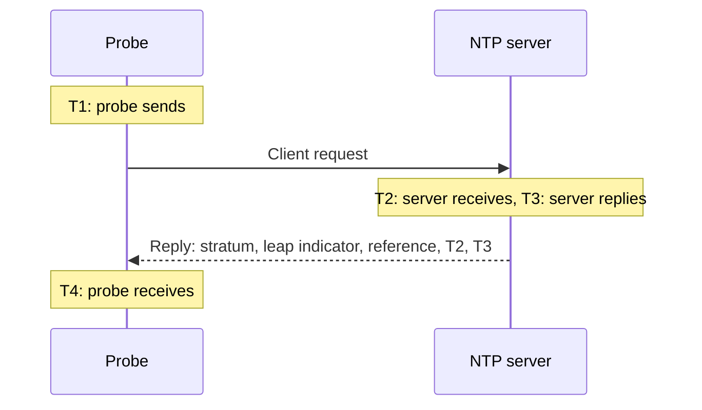

# NTP Monitor

An NTP monitor checks that a time server answers on UDP port 123 and serves good time: that it is synchronized, at a sensible stratum, and that its clock agrees with the probe's. Use it for the time servers you run, such as a GPS clock in the data center or the internal servers your fleet syncs to, and for the public servers you depend on.

:::cards
- [Create the monitor](#create-an-ntp-monitor): Six steps in the dashboard.
- [What the check reads](#what-the-check-reads): Stratum, clock offset, leap indicator and the rest of the reply.
- [Monitoring criteria](#monitoring-criteria): Reachability, synchronization, stratum and offset.
- [Troubleshooting](#troubleshooting): When the server is up but the monitor says otherwise.
:::

## How it works

On each check, a probe sends one SNTP client request (NTP version 4, client mode) from a random local port to the server's UDP port, and waits for the reply. Only a real reply to that request counts: the probe puts 64 random bits in the request's transmit timestamp, and ignores any packet that does not echo them back, is shorter than an NTP packet, or is not in server mode. A stale reply to an earlier check, or a spoofed one, can never make a dead server look alive.

From the four timestamps the probe works out the **clock offset**, ((T2 − T1) + (T3 − T4)) / 2: how far the server's clock is from the probe's. A positive offset means the server is ahead. The formula assumes the request and the reply take equally long, so a path that is much slower one way can skew the offset by up to half the round trip.

> [!NOTE]
> The offset is measured against the probe's own clock. OneUptime Cloud's probes keep their clocks synchronized. On a [custom probe](/docs/probe/custom-probe), keep the host's clock synchronized too, with chrony or systemd-timesyncd, or an offset alert may be about the probe rather than the server.

A server that answers is not asked again, even when it answers without good time. Silence, a refused port and a failed DNS lookup are retried with a new request. When the server does not answer at all, the probe also traces the route to it and attaches what it found as **Network Path at Time of Failure**. A probe that has lost its own network connection reports no result, so it cannot mark your server offline.

## Before you begin

- **A role that can create monitors**: Project Owner, Project Admin, Project Member, Monitor Admin or Monitor Member, or a custom role with the Create Monitor permission.
- **A probe that can reach UDP port 123 on the server.** Any probe can check a public time server. For a server on a private network, use a [custom probe](/docs/probe/custom-probe) inside that network. A firewall in front of the server has to let UDP through, not only TCP, from [OneUptime Cloud's probe IP addresses](/docs/configuration/ip-addresses) or from your custom probe.

## Create an NTP monitor

:::steps
### Start a new monitor

Go to **Monitors** and click **Create Monitor**. Under **Monitor Type**, type `ntp` into the search box and pick **NTP**. It is also listed under **More monitor types**, in the Network group.

### Name it

Enter a **Name**, such as `GPS time server`, then click **Next**.

### Enter the server

In **NTP Server**, enter the server's host name or IP address, such as `time.example.com` or `192.168.1.10`. The request goes to port 123. To use another port, open **More fields** and set **Port**.

### Test it

Click **Test Monitor**, pick a probe under **Select Probe** and click **Run Test**. **Monitor Test Result** shows whether the server answered, whether it is synchronized, its stratum and how far its clock is off.

### Review the criteria

**Monitor Criteria** starts with the [default criteria](#default-criteria): offline when the server does not serve good time, online when it does. Change them if you need to, then click **Next**.

### Pick probes and create

Keep or change the **Probes** and the **Monitoring Interval** (it starts at **Every 5 Minutes**), then click **Create Monitor**. The monitor's page opens.
:::

## Configuration options

| Field | Default | What to enter |
| --- | --- | --- |
| **NTP Server** | None | The server, such as `time.example.com`, `192.168.1.10` or `2001:db8::123`. Enter the host only, without `udp://`. A port written after the host, such as `time.example.com:1123`, is used instead of **Port**. |
| **Port** (under **More fields**) | `123` | The UDP port the server answers NTP on, from `1` to `65535`. Leave it empty for `123`. |
| **Request Timeout (seconds)** (under **More fields**) | `5` | How long one attempt waits for the reply, the DNS lookup included. The maximum is 60 seconds. |
| **Retries on Failure** (under **More fields**) | Probe default, usually `3` | How many times to retry an attempt that got no answer. The maximum is 3. |

**Retries on Failure** counts retries _after_ the first attempt, so `0` runs the check once and `2` runs it up to three times, with a one-second pause between attempts. Left blank, it uses the probe's default: 3, unless the probe's `PROBE_MONITOR_RETRY_LIMIT` says otherwise.

## What the check reads

The monitor's page shows the latest check from each probe:

| Field | What it means |
| --- | --- |
| **Synchronized** | Whether the server answered at stratum 1 to 15, without the alarm in its leap indicator, and with real timestamps in its reply. |
| **Clock Offset** | How far the server's clock is from the probe's, and in which direction. A healthy server is within a few milliseconds. |
| **Stratum** | How many hops the server is from a reference clock: 1 for a server with its own GPS or atomic source, 2 for one that syncs to a stratum 1 server, and so on. 16 means not synchronized. |
| **Reference** | What the server synchronizes to: a source name such as `GPS`, `PPS` or `NIST` at stratum 1, the upstream server's address from stratum 2 on. |
| **Leap Indicator** | 0 when no leap second is pending, 1 or 2 when one will be added or removed at the end of the day, 3 when the server says its clock is not synchronized. |
| **Root Dispersion** | The server's own estimate of how far its time could be from the true time. It grows while the server cannot reach its source. ntpd stops trusting a server once half its root delay plus this passes 1.5 seconds. |
| **Root Delay** | The round trip from the server to its reference clock. |
| **Response Time** | From the probe sending the request to receiving the reply, without the DNS lookup. |
| **Server Time** | The server's clock when it sent the reply. |

A server that refuses to give the time sends a **kiss-o'-death** instead: a reply at stratum 0 with a four-letter code. The most common codes are `RATE` (the server rate-limits the probe), `DENY` and `RSTR` (its access rules refuse the probe) and `INIT` (it has not synchronized yet). The check shows the code and counts the server as answering but not synchronized.

## Monitoring Criteria

Criteria decide when the server counts as online, degraded or offline, and whether that declares an incident or creates an alert. Each criteria checks one or more filters:

| Filter | Conditions | What it checks |
| --- | --- | --- |
| **NTP Is Online** | **True**, **False** | Whether the server answered the probe's request with an NTP reply. A kiss-o'-death is an answer. |
| **NTP Is Synchronized** | **True**, **False** | Whether the server that answered serves synchronized time. When the server does not answer, this filter is not checked; use **NTP Is Online** for that. |
| **NTP Stratum** | **Greater Than**, **Greater Than Or Equal To**, **Less Than**, **Less Than Or Equal To**, **Equal To**, **Not Equal To** | The server's stratum. A kiss-o'-death's 0 counts as 16, not synchronized. |
| **NTP Clock Offset (in ms)** | **Greater Than**, **Less Than**, **Greater Than Or Equal To**, **Less Than Or Equal To** | How far the server's clock is from the probe's, in either direction. |
| **NTP Response Time (in ms)** | **Greater Than**, **Less Than**, **Greater Than Or Equal To**, **Less Than Or Equal To** | From the request to the reply. |
| **NTP Root Dispersion (in ms)** | **Greater Than**, **Less Than**, **Greater Than Or Equal To**, **Less Than Or Equal To** | The server's own estimate of its maximum error. |

With two or more filters, **Match Condition** decides whether **All** of them or **Any** one must match. A criteria's **Actions** decide what it does: change the monitor status, create an alert, declare an incident, or any of these.

### Default Criteria

A new NTP monitor starts with two criteria:

- **Offline** — the server does not answer, is not synchronized, or its clock is `1000` ms or more away from the probe's. The monitor is marked **Offline** and an incident called "_monitor name_ is not serving good time" is created. It resolves itself when the server serves good time again.
- **Online** — the server answers, is synchronized, and its clock is within `1000` ms of the probe's. The monitor is marked **Operational**.

Criteria are checked from top to bottom, and the first one that matches decides what happens. A server that answers with the wrong time is treated as down on purpose: every client that follows it would take that time too.

### Evaluating over a period of time

**Evaluate this criteria over a period of time** is a checkbox under every NTP filter. Turn it on to judge a window of past checks instead of the latest one: pick an aggregate under **Evaluate** and a window, from 2 to 60 minutes, under **For the last (in minutes)**. Only checks the server answered have a stratum, an offset and a root dispersion, so a window of silence has no data for those filters, and **If No Data** decides what happens.

### Example criteria

| Goal | Filter | Condition | Value |
| --- | --- | --- | --- |
| Alert when a GPS server falls back to a network source | **NTP Stratum** | **Greater Than** | `1` |
| Alert when the clock drifts | **NTP Clock Offset (in ms)** | **Greater Than** | `100` |
| Alert when the server's error bound grows | **NTP Root Dispersion (in ms)** | **Greater Than** | `500` |
| Alert when answering gets slow | **NTP Response Time (in ms)** | **Greater Than** | `1000` |

## Troubleshooting

:::details The server is up, but the monitor says it did not answer
The request or the reply was dropped on the way. A firewall that allows TCP but not UDP, an ntpd `restrict` or chrony `allow` rule that leaves out the probe's address, or a server that only listens on an internal interface all look like this. **Network Path at Time of Failure** shows how far the route got. Allow the probe through, or check the server from a [custom probe](/docs/probe/custom-probe) inside the network.
:::

:::details The monitor says the server refused the request
The host answered that nothing listens on that UDP port (ICMP port unreachable): the NTP service is stopped, or it listens on another port. Start the service, or set **Port** to the one it uses.
:::

:::details The server answers with a kiss-o'-death
`RATE` means the server rate-limits the probe. The probe asks once per check, so a longer **Monitoring Interval**, or exempting the probe's addresses from the server's rate limit, stops it. `DENY` and `RSTR` mean the server's access rules refuse the probe. `INIT` and `STEP` mean the server has not synchronized yet, which is normal for a few minutes after it starts.
:::

:::details Every NTP monitor on one probe shows a similar offset
The probe's clock is off, not the servers'. Check that the probe's host keeps its clock synchronized, or run the monitors on another probe.
:::

:::details The offset jumps between checks
The probe is far from the server, or the path is slower one way than the other. Use a probe closer to the server, or judge the offset over a few minutes with **Evaluate this criteria over a period of time** and **Average**.
:::

## Next steps

:::cards
- [Ping Monitor](/docs/monitor/ping-monitor): Check that the host itself is reachable.
- [Port Monitor](/docs/monitor/port-monitor): Check the TCP services on the same host.
- [Custom Probes](/docs/probe/custom-probe): Check time servers on your own network.
- [Incident & Alert Templating](/docs/monitor/incident-alert-templating): Put the stratum and the offset in an incident's title.
:::
