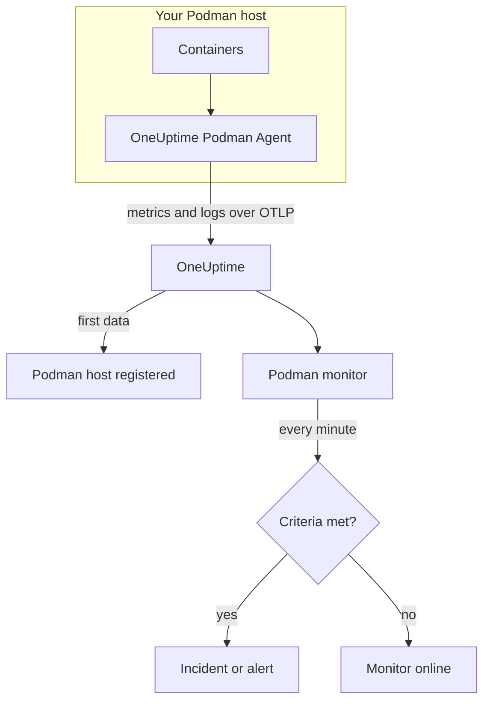

# Podman Monitor

A Podman monitor watches the containers on one Podman host and tells you when a container runs hot, runs out of memory, or keeps restarting. It reads the metrics the OneUptime Podman Agent sends from the host, so nothing is probed from outside: install the agent, then create the monitor from a template or your own query.

:::cards
- [Create the monitor](#create-a-podman-monitor): Six steps in the dashboard.
- [Templates](#pre-built-alert-templates): Five ready-made alerts, one incident per container.
- [Metrics](#collected-metrics): What the agent collects, and what each metric means.
- [Logs](#collected-logs): Container logs, and the log driver they need.
:::

## How it works

The OneUptime Podman Agent runs as a container on the host. Every 30 seconds it reads container stats through Podman's Docker-compatible API socket, tails the containers' log files, and sends both to OneUptime over OTLP. The first data from a host registers it in OneUptime.

A Podman monitor is tied to one host. Every minute it runs its query over that host's container metrics and compares the result with its criteria.



## Before you begin

- **Install the Podman Agent** on the host. The [Podman Agent guide](/docs/telemetry/podman-host) covers installing, upgrading and checking it. The agent needs Podman's API socket at `/run/podman/podman.sock`.
- **Check the host is registered.** It appears under **Products → Infrastructure → Podman → All Hosts**, named after the agent's `PODMAN_HOST_NAME`, once its first data arrives.
- **For container logs**, run the containers with the `k8s-file` log driver. See [Log driver requirement](#log-driver-requirement).

## Create a Podman monitor

:::steps
### Start a new monitor

Go to **Monitors** and click **Create Monitor**.

### Pick Podman Container

Under **Monitor Type**, click **More monitor types** and pick **Podman Container** under **Infrastructure**, or type `podman` in the search box. Enter a **Name** — it is used in incident and alert titles — and click **Next**.

### Choose the host

Under **Podman Monitor Configuration**, pick the host from **Podman Host**. Every host that has sent data is in the list.

### Choose what to watch

Pick one of the three tabs:

- **Quick Setup** — click a [template](#pre-built-alert-templates). It sets the metric, aggregation, time range and thresholds, and replaces the criteria below with its own. You can still change the **Time Range**.
- **Custom Metric** — pick one metric from **Podman Metric**, then set **Aggregation** and **Time Range**. **Container Name** and **Container Image** narrow it to some containers.
- **Advanced** — build queries and formulas yourself under **Select Metrics**. Use **Group by** `resource.container.name` to judge each container on its own.

### Check the criteria

Open each criteria under **Monitor Criteria** and check its **Metric**, **Aggregation**, **Condition** and **Threshold**. A template fills these in. With **Custom Metric** or **Advanced**, the monitor starts with the [default criteria](#default-criteria), which only notice a metric dropping to zero, so set your own threshold.

### Create the monitor

Click **Create Monitor**. OneUptime opens the monitor's page and evaluates it every minute. Incidents and alerts it raises are also listed on the host's **Incidents** and **Alerts** pages.
:::

> [!TIP]
> To set up several templates at once, open the host from **Products → Infrastructure → Podman** and go to **Recommendations**. Pick the templates you want, choose who is paged, and OneUptime creates one monitor per template.

## Monitor settings

| Field | Tab | What it does |
| --- | --- | --- |
| **Podman Host** | All | Required. Scopes every query to the host's `resource.host.name`. OneUptime also adds `resource.container.runtime = podman` to every query. |
| **Podman Metric** | Custom Metric | One metric from the agent's catalog, grouped as CPU, memory, network, block I/O and container. |
| **Container Name** | Custom Metric, Advanced | Optional. Exact match on `resource.container.name`, for example `my-container`. |
| **Container Image** | Custom Metric, Advanced | Optional. Exact match on `resource.container.image.name`, for example `nginx:latest`. |
| **Aggregation** | Custom Metric | How samples are combined: **Average**, **Maximum**, **Minimum**, **Sum** or **Count**. Starts at the metric's usual aggregation. |
| **Time Range** | All | The rolling window the query reads, from **Past 1 Minute** to **Past 365 Days**. A new monitor starts at **Past 1 Minute**; templates set their own. |
| **Select Metrics** | Advanced | The query builder: **Metric**, **Aggregate by**, **Filter by attributes**, **Group by**, plus **Add Metric** and **Add Formula** to combine queries. |

## Pre-built Alert Templates

**Quick Setup** offers five templates. Each builds a complete monitor: a query grouped by `resource.container.name`, a criteria that fires and one that recovers. Every container is judged on its own and gets its own incident and alert. Thresholds are starting points you can edit.

A criteria fires only when the condition holds for every minute of its window, and recovers 10% past the threshold so a value hovering at the line does not flap.

| Template | Severity | Watches | Fires when | Recovers when |
| --- | --- | --- | --- | --- |
| High Container CPU Usage | Warning | `container.cpu.utilization`, Avg per container, past 5 minutes | Above 80 (% of one core) | At or below 72 |
| High Container Memory Usage | Warning | `container.memory.percent`, Avg per container, past 5 minutes | Above 85% | At or below 76.5% |
| High Container Restart Count | Critical | `container.restarts`, Max per container, past 5 minutes | Above 5 restarts in total | 4.5 or fewer |
| High Container Process Count | Warning | `container.pids.count`, Max per container, past 5 minutes | Above 500 | At or below 450 |
| Container Restarted (Low Uptime) | Critical | `container.uptime`, Min per container, past 1 minute | Below 120 seconds | At or above 132 seconds |

**Severity** is the label the picker shows. The incident and alert a template creates start on your project's most severe incident and alert severity; change them in the criteria.

The two percentage templates use **Average**: their metrics are already per-container percentages, so the average of a minute is the sustained reading. Restart count and process count use **Maximum**, where one breaching sample is the signal.

> [!NOTE]
> `container.cpu.utilization` is the number `podman stats` prints: 100% is one full CPU core, not the container's whole CPU allowance. A container given several cores reads well above 100 while healthy, so raise the threshold for those.

> [!NOTE]
> `container.restarts` is a running total kept by Podman, not a count of restarts in the window. **High Container Restart Count** therefore stays open until the container is recreated, which resets the count.

> [!CAUTION]
> `container.uptime` exists only for running containers. A container that stops and stays stopped sends no data, so **Container Restarted (Low Uptime)** catches restarts and redeploys, not a permanent shutdown. A container meant to run for less than two minutes stays in the alerting state for its whole life.

There is no CPU-throttling template. The throttling metrics the agent collects only ever grow, and a "throttled at all" alert would fire once and never clear. Both are still collected, so you can chart them.

## Collected Metrics

The agent uses the OpenTelemetry `docker_stats` receiver pointed at Podman's Docker-compatible socket, `/run/podman/podman.sock`, every 30 seconds. Each container's metrics carry its identity as resource attributes: `resource.container.name`, `resource.container.image.name`, `resource.container.id`, `resource.container.runtime` (`podman`) and `resource.host.name`.

### CPU

| Metric | Description |
| --- | --- |
| `container.cpu.utilization` | CPU utilization of the container, where 100% is one full CPU core. |
| `container.cpu.usage.total` | CPU time used since the container started, in nanoseconds. A lifetime counter. |
| `container.cpu.throttling_data.throttled_time` | Nanoseconds the container has been throttled by its CPU limit. A lifetime counter. |
| `container.cpu.throttling_data.throttled_periods` | Throttling periods since the container started. A lifetime counter. |

### Memory

| Metric | Description |
| --- | --- |
| `container.memory.usage.total` | Memory in use, in bytes. |
| `container.memory.usage.limit` | Memory limit, in bytes. |
| `container.memory.percent` | Memory use as a percentage of the container's limit, or of host memory when the container has no limit. |

### Network

| Metric | Description |
| --- | --- |
| `container.network.io.usage.rx_bytes` | Bytes received. A lifetime counter. |
| `container.network.io.usage.tx_bytes` | Bytes sent. A lifetime counter. |

### Block I/O

| Metric | Description |
| --- | --- |
| `container.blockio.io_service_bytes_recursive.read` | Bytes read from block devices. |
| `container.blockio.io_service_bytes_recursive.write` | Bytes written to block devices. |

### Container

| Metric | Description |
| --- | --- |
| `container.uptime` | Seconds since the container started. Only running containers report it. |
| `container.restarts` | Times the container has restarted. A running total. |
| `container.pids.count` | Tasks in the container. The cgroup pids controller counts threads as well as processes. |

The **Podman Metric** list also offers `container.cpu.usage.percpu`, `container.memory.rss`, `container.memory.cache` and the network packet counters. The shipped agent configuration does not turn these on, so check the host's **Metrics** page before you build on them. `container.cpu.throttling_data.throttled_periods` is not in the list; query it from **Advanced**.

## Monitoring criteria

A criteria compares one of the monitor's queries or formulas with a threshold. A Podman monitor's criteria have no **Filter Type**: every rule checks the metric value, with these fields.

| Field | What it does |
| --- | --- |
| **Metric** | The query or formula to check, by its variable name. |
| **Aggregation** | How the values in the window become one answer: **Average**, **Sum**, **Maximum Value**, **Minimum Value**, **All Values** (every value must match) or **Any Value** (one is enough). |
| **Condition** | **Greater Than**, **Less Than**, **Greater Than Or Equal To**, **Less Than Or Equal To** or **Equal To** — or an anomaly condition: **Anomalously High**, **Anomalously Low** or **Anomalous**. |
| **Threshold** | The value to compare with. A unit list sits beside it when the metric has a unit. Not shown for anomaly conditions. |
| **Sensitivity** | Anomaly conditions only. **Low** (4σ), **Medium** (3σ, the default) or **High** (2σ). |
| **Baseline Window** | Anomaly conditions only. 14 days (the default), 28, 60 or 90 days of history. |
| **If No Data** | Under **More fields**. What happens when the window has no samples: **Ignore** (the default), **Treat As Zero** or **Trigger**. |

Anomaly conditions compare each value with the same hour of the week in the baseline. They stay in a "Learning" state, and raise nothing, until the baseline window holds enough history.

Each criteria also says what to do when it matches: change the monitor status, create an alert, or declare an incident. Criteria are checked from top to bottom, and the first one that matches decides.

### Default criteria

A monitor you do not build from a template starts with two criteria:

| Order | Criteria | Matches when | Then |
| --- | --- | --- | --- |
| 1 | Check if _monitor name_ is offline | Any value of the first query is `0` | Marks the monitor **Offline** and declares the incident "_monitor name_ is offline", which resolves itself when the monitor recovers. |
| 2 | Check if _monitor name_ is online | Any value is above `0` | Marks the monitor **Operational**. |

> [!IMPORTANT]
> Silence matches neither criteria: a host that stops sending data leaves the monitor as it was. To be told when data stops, set **If No Data** to **Trigger** on a criteria.

## Collected logs

The agent also tails every container's `ctr.log` file and sends each line as an OpenTelemetry log record with:

| Field | Value |
| --- | --- |
| `resource.host.name` | The host, from `PODMAN_HOST_NAME`. |
| `resource.container.id` | The full container ID. |
| `resource.container.runtime` | Always `podman`. |
| `attributes["log.iostream"]` | `stdout` or `stderr`. |
| `severityText` / `severityNumber` | Read from a level keyword where a level sits in the line (`[ERROR]`, `app.INFO:`, `{"level":"warn"}`, `level=error`). A line with no level falls back to its stream: `stderr` is `ERROR`, `stdout` is `INFO`. |
| `body` | The line the container wrote. Lines that start with whitespace or a closing bracket, such as stack-trace frames, are joined to the line before. |
| `time` | Podman's timestamp for the line. |

Logs appear on the host's **Logs** page and on each container's page.

### Log driver requirement

The agent reads the files Podman's `k8s-file` log driver writes, at `/var/lib/containers/storage/overlay-containers/*/userdata/ctr.log`. Rootful Podman defaults to `journald`, which writes to the systemd journal instead, so there is no file to read:

| Driver | What the agent sees |
| --- | --- |
| `k8s-file` (or `json-file`, which Podman treats the same way) | Every line. |
| `journald` | Nothing: the logs are in the systemd journal. |
| `none` | Nothing: the logs are discarded. |

Metrics do not depend on the log driver: a host whose containers use `journald` still reports metrics, only its **Logs** page stays empty.

Check a container's driver, and Podman's default:

```bash
podman inspect <container> --format '{{.HostConfig.LogConfig.Type}}'
podman info --format '{{.Host.LogDriver}}'
```

Switch to `k8s-file`. Podman sets a container's log driver when the container is created, so recreate each container after the change — a restart keeps the old driver.

:::tabs
@tab podman run
Start the container with the driver:

```bash
podman run --log-driver k8s-file ... <image>
```

To switch an existing container, remove it and run it again:

```bash
podman rm -f <container>
podman run --log-driver k8s-file ... <image>
```
@tab Podman Compose
Set the driver on each service:

```yaml title="docker-compose.yml"
services:
  my-app:
    image: my-app:latest
    logging:
      driver: "k8s-file"
      options:
        max-size: "100m"
```

Then recreate the service:

```bash
podman compose up -d --force-recreate <service>
```
@tab containers.conf
Make `k8s-file` the default for every container created afterwards, in `/etc/containers/containers.conf` (rootful) or `~/.config/containers/containers.conf` (rootless):

```toml title="containers.conf"
[containers]
log_driver = "k8s-file"
```

Then remove and recreate each container.
:::

## Troubleshooting

:::details The host is not in the Podman Host list
Hosts register themselves from the agent's data. Check that the agent container is running, that Podman's API socket is enabled, and that the host is listed under **Products → Infrastructure → Podman → All Hosts**. The [Podman Agent guide](/docs/telemetry/podman-host) has the checks to run on the host.
:::

:::details Metrics arrive but the Logs page is empty
The containers are almost certainly using `journald`. Switch the ones whose logs you want to `k8s-file` (see [Log driver requirement](#log-driver-requirement)) and recreate them.
:::

:::details The agent logs "no files match the configured criteria"
The agent looks for `/var/lib/containers/storage/overlay-containers/*/userdata/ctr.log` and found nothing. Either no container on the host uses `k8s-file`, or the agent's mount of `/var/lib/containers/storage` is missing or empty, or the agent and the containers run under different modes — rootless containers keep their storage somewhere the rootful path does not cover, and the other way round.
:::

:::details Data arrives under the wrong host name
OneUptime identifies a host by `resource.host.name`, which the agent takes from `PODMAN_HOST_NAME`. Changing `PODMAN_HOST_NAME` after the first data creates a second host rather than renaming the first, and a monitor stays tied to the name it was created with.
:::

:::details A CPU alert never fires
Group the query by `resource.container.name`, as the **High Container CPU Usage** template does, so each container is judged on its own. An average across every container on a busy host is pulled down by the idle ones. Remember that 100% means one full core, so a container allowed several cores needs a higher threshold.
:::

:::details The restart-count alert never clears
`container.restarts` is a running total, so it does not fall back below the threshold on its own. Fix the cause, then recreate the container to reset the count, or raise the threshold.
:::

## Next steps

:::cards
- [Podman Agent](/docs/telemetry/podman-host): Install, upgrade and troubleshoot the agent this monitor reads.
- [Docker Monitor](/docs/monitor/docker-monitor): The same monitor for Docker hosts.
- [Incidents](/docs/incidents/index): What happens after a criteria declares an incident.
- [On-Call Schedules](/docs/on-call/schedules): Decide who is paged when a container breaks.
:::
