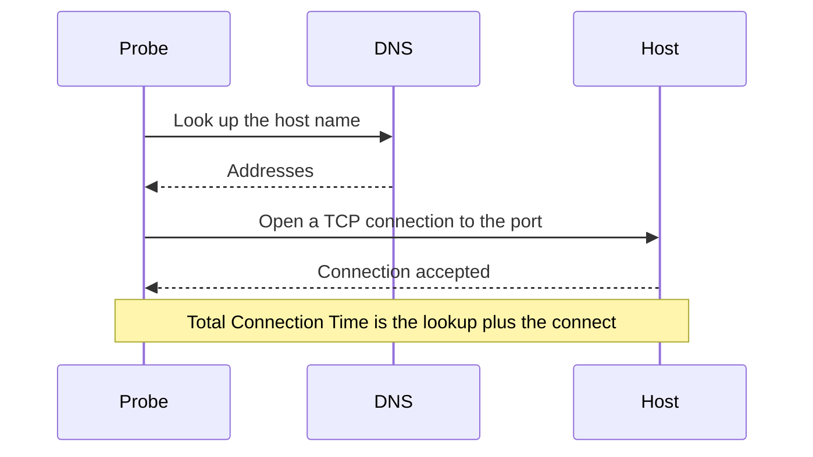

# Port Monitor

A Port monitor checks that a host accepts TCP connections on a port, and measures how long the connection takes. Use it for services that do not speak HTTP, or whose HTTP you do not want to check: databases, mail servers, SSH, message brokers and the like.

:::cards
- [Create the monitor](#create-a-port-monitor): Six steps in the dashboard.
- [Connection timing](#connection-timing): What the DNS, TCP and total times measure.
- [Monitoring criteria](#monitoring-criteria): Reachability and connection times.
- [Troubleshooting](#troubleshooting): When the service is up but the monitor says offline.
:::

## How it works

On each check, a probe looks up the host name, if you gave one, and opens a TCP connection to the port. The port is online as soon as the connection is accepted; the probe then closes it without sending anything. A connection that is refused or times out is tried again, up to the number of retries you allow. OneUptime then runs the result through the monitor's criteria.

The probe opens TCP connections only: a service that listens on UDP alone, such as an SNMP agent, cannot be checked with a Port monitor.

When a check fails, the probe also traces the route to the host and looks up its name, and attaches what it found to the result as **Network Path at Time of Failure**, so you can see where the route broke. A probe that has lost its own network connection reports no result, so it cannot mark your service offline.

## Before you begin

- **A role that can create monitors**: Project Owner, Project Admin, Project Member, Monitor Admin or Monitor Member, or a custom role with the Create Monitor permission.
- **A probe that can reach the port.** Your project's default probes are picked for every new monitor. If a firewall sits in front of the service, allow [OneUptime Cloud's probe IP addresses](/docs/configuration/ip-addresses) to connect to the port. A service on a private network, such as a database, needs a [custom probe](/docs/probe/custom-probe) inside that network.

## Create a port monitor

:::steps
### Start a new monitor

Go to **Monitors** and click **Create Monitor**. Under **Monitor Type**, pick **Port**.

### Name it

Enter a **Name**, such as `Orders database`, then click **Next**.

### Enter the host and the port

In **Hostname or IP Address**, enter the host the port is on, such as `db.example.com` or `10.0.0.12`. In **Port**, enter the port number, such as `5432`.

### Test it

Click **Test Monitor**, pick a probe under **Select Probe** and click **Run Test**. **Monitor Test Result** shows whether the connection opened, and how long each part took.

### Review the criteria

**Monitor Criteria** starts with the [default criteria](#default-criteria): offline when the port does not accept a connection, online when it does. Change them if you need to, then click **Next**.

### Pick probes and create

Keep or change the **Probes** and the **Monitoring Interval** (it starts at **Every 5 Minutes**), then click **Create Monitor**. The monitor's page opens.
:::

## Configuration options

| Field | Default | What to enter |
| --- | --- | --- |
| **Hostname or IP Address** | None | The host, such as `example.com`, `192.168.1.1` or `2001:db8::1`. Enter the host only, without `http://`. |
| **Port** | None | The TCP port to connect to, from `1` to `65535`. |
| **Request Timeout (seconds)** (under **More fields**) | `60` | How long one attempt may take, the DNS lookup and the TCP connection together. The maximum is 60 seconds. |
| **Retries on Failure** (under **More fields**) | Probe default, usually `3` | How many times to retry a failed attempt. The maximum is 3. |

**Retries on Failure** counts retries _after_ the first attempt, so `0` runs the check once and `2` runs it up to three times. Left blank, it uses the probe's default: 3, unless the probe's `PROBE_MONITOR_RETRY_LIMIT` says otherwise. Every failure is retried, timeouts included, with a one-second pause between attempts. A successful connection that took longer than 10 seconds is checked again too.

Common ports:

| Port | Service |
| --- | --- |
| `22` | SSH |
| `25` | SMTP |
| `80` | HTTP |
| `443` | HTTPS |
| `3306` | MySQL |
| `5432` | PostgreSQL |
| `6379` | Redis |
| `27017` | MongoDB |

> [!NOTE]
> Many hosting providers block outbound SMTP. On a probe that cannot send pings, which is how a probe notices it runs on such a provider, a check of port `25` that times out counts as online. To check a mail server's port `25` reliably, run the monitor on a [custom probe](/docs/probe/custom-probe) that is allowed to connect to it.

## Connection timing

For a host name, the probe measures the check in two phases:

| Phase | From | To |
| --- | --- | --- |
| **DNS lookup** | The start of the check | The first TCP connection attempt |
| **TCP connect** | The first TCP connection attempt | The connection being accepted, including any time spent falling back between IPv6 and IPv4 addresses |

**Total Connection Time (DNS + TCP)** runs from the start of the check until the connection is accepted. It is also the port monitor's response time, so existing criteria, alerts and charts that use the response time keep working.

When the target is an IP address, there is no DNS lookup, so that phase is left out. Check results from before phase timing existed show only the total connection time.

## Monitoring Criteria

Criteria decide when the port counts as online, degraded or offline, and whether that declares an incident or creates an alert. Each criteria checks one or more filters:

| Filter | Conditions | What it checks |
| --- | --- | --- |
| **Is Online** | **True**, **False** | Whether the port accepted a connection. |
| **Total Connection Time (DNS + TCP) (in ms)** | **Greater Than**, **Less Than**, **Greater Than Or Equal To**, **Less Than Or Equal To** | The whole connection time, including the DNS lookup for a host name. |
| **Port DNS Lookup Time (in ms)** | **Greater Than**, **Less Than**, **Greater Than Or Equal To**, **Less Than Or Equal To** | The DNS lookup before the first TCP attempt. It has no value when the target is an IP address. |
| **Port TCP Connect Time (in ms)** | **Greater Than**, **Less Than**, **Greater Than Or Equal To**, **Less Than Or Equal To** | From the first TCP attempt until the connection is accepted, including IPv6 and IPv4 fallback. |
| **Is Request Timeout** | **True**, **False** | Whether the DNS lookup or the TCP connection ran past the timeout, on every attempt. |

A DNS lookup criteria has nothing to evaluate when the target is an IP address. For criteria that must work with host names and IP addresses alike, use the total or the TCP connect time.

With two or more filters, **Match Condition** decides whether **All** of them or **Any** one must match. A criteria's **Actions** decide what it does: change the monitor status, create an alert, declare an incident, or any of these.

### Default Criteria

A new port monitor starts with two criteria:

- **Offline** — the port does not accept a connection, after every retry. The monitor is marked **Offline** and an incident called "_monitor name_ is offline" is created. The incident resolves itself when the port accepts connections again.
- **Online** — the port accepts a connection. The monitor is marked **Operational**.

Criteria are checked from top to bottom, and the first one that matches decides what happens. When none matches, the monitor shows its default status: **Operational**, unless you pick another under **More fields**, below the criteria.

### Evaluating over a period of time

**Evaluate this criteria over a period of time** is a checkbox under a filter, offered for **Is Online**, **Total Connection Time (DNS + TCP) (in ms)**, **Port DNS Lookup Time (in ms)** and **Port TCP Connect Time (in ms)**. Turn it on to judge a window of past checks instead of the latest one: pick an aggregate under **Evaluate** and a window, from 2 to 60 minutes, under **For the last (in minutes)**.

| Aggregate | Matches when |
| --- | --- |
| **Average**, **Sum**, **Maximum Value**, **Minimum Value** | That figure, over the window, meets the condition. Numeric filters only. |
| **All Values** | Every check in the window meets the condition. |
| **Any Value** | At least one check in the window meets the condition. |

**All Values** only matches once the window is genuinely covered by data. A monitor that has just been created, or one whose checks stopped being recorded, does not have enough history to say anything about the last N minutes, so the criteria waits rather than matching on the one reading it does have. **Any Value** is the setting for "tell me the moment a single check breaches" and still fires immediately.

**If No Data** decides what happens while the window cannot back the criteria:

| Option | What happens | Use it for |
| --- | --- | --- |
| **Ignore** (default) | The criteria does not match. | Ordinary threshold alerting. |
| **Trigger** | The missing data counts as the problem. | Checks where silence is itself a failure. |
| **Treat As Zero** | The window is compared as a single zero. | Counters where no events genuinely means zero. |

### Example criteria

| Goal | Filter | Condition | Value |
| --- | --- | --- | --- |
| Offline when the port is closed | **Is Online** | **False** | — |
| Alert when connecting is slow | **Total Connection Time (DNS + TCP) (in ms)** | **Greater Than** | `500` |
| Mark the service degraded when it is slow to connect | **Total Connection Time (DNS + TCP) (in ms)** | **Greater Than** | `200` |
| Alert when DNS is slow | **Port DNS Lookup Time (in ms)** | **Greater Than** | `100` |
| Alert when the TCP handshake is slow | **Port TCP Connect Time (in ms)** | **Greater Than** | `250` |

## Troubleshooting

:::details The service is up, but the monitor says offline
The probe could not open a connection: a firewall drops it, the service listens only on a private interface, or the port is wrong. The incident's root cause, and **Monitoring Logs** on the monitor, show the error, and **Network Path at Time of Failure** shows how far the route got. Allow the probes through the firewall, or use a [custom probe](/docs/probe/custom-probe) inside the network.
:::

:::details The DNS lookup time is always empty
The target is an IP address, so there is nothing to look up. Use **Total Connection Time (DNS + TCP) (in ms)** or **Port TCP Connect Time (in ms)** instead.
:::

:::details I need to check a UDP service
Port monitors open TCP connections only. For a DNS server, use a [DNS monitor](/docs/monitor/dns-monitor), which sends real queries.
:::

## Next steps

:::cards
- [Ping Monitor](/docs/monitor/ping-monitor): Check that the host itself is reachable.
- [SSL Certificate Monitor](/docs/monitor/ssl-certificate-monitor): Check the certificate on a TLS port.
- [Database Health Monitor](/docs/monitor/database-health-monitor): Go beyond an open port and watch a database's health.
- [Custom Probes](/docs/probe/custom-probe): Check ports on your own network.
:::
