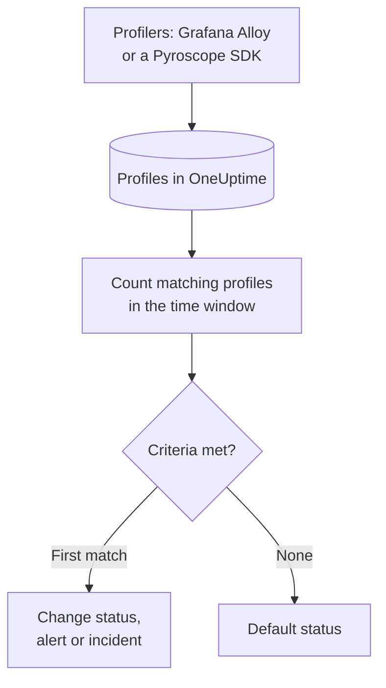

# Profiles Monitor

A Profiles monitor counts the continuous profiles your services send to OneUptime that match your filters — profile type, service, attributes — over a time window, and changes the monitor's status, creates an alert or declares an incident when the count meets your criteria. Its main use is to notice when profiling data stops arriving from a service.

> [!IMPORTANT]
> **Create Monitor** in the dashboard does not offer Profiles: there is no form for its filters yet. Create a Profiles monitor through the [API](/docs/api-reference/api-reference) or [Terraform](/docs/terraform/monitor-steps), as described below. Once it exists, you can view and edit its criteria on the monitor's **Criteria** page in the dashboard; its filters can only be changed through the API or Terraform.

:::cards
- [Create the monitor](#create-a-profiles-monitor): The configuration to send through the API or Terraform.
- [What it queries](#what-it-queries): Profile types, services, attributes and the window.
- [Criteria](#criteria): The conditions you can use.
- [Worked example](#worked-example-profiles-stop-arriving): Know when a service stops sending profiles.
:::

## How it works



Every minute, OneUptime counts the profiles that match the monitor's filters and started within its time window. It checks that count against the monitor's criteria from top to bottom, and the first criteria that matches decides what happens. When none matches, the monitor goes back to its default status.

## Before you begin

- Your services send continuous profiling data to OneUptime, through Grafana Alloy (eBPF) or a Pyroscope SDK. See [Continuous Profiling](/docs/telemetry/profiles).
- You have either an API key that can create monitors, or the OneUptime Terraform provider set up.
- You know the ID of each telemetry service to watch, and the profile types it sends, such as `cpu`, `wall`, `alloc_objects`, `alloc_space` or `goroutine`.

## Create a profiles monitor

:::steps
### Choose what to count

Write the step's `profileMonitor` configuration. This one counts CPU profiles from one service over the last five minutes:

```json
{
  "profileMonitor": {
    "telemetryServiceIds": [],
    "profileTypes": ["cpu"],
    "profileType": "",
    "attributes": {},
    "lastXSecondsOfProfiles": 300
  }
}
```

Put the service's ID in `telemetryServiceIds`, or leave the list empty to count profiles from every service. [What it queries](#what-it-queries) describes each field.

### Create the monitor

Create a monitor with the monitor type `Profiles` and a step that holds this configuration and at least one criteria, through the [API](/docs/api-reference/api-reference) or [Terraform](/docs/terraform/monitor-steps). In Terraform, pass the configuration as the step's `profile_monitor` attribute, written with `jsonencode()`.

### Check it in the dashboard

Open the monitor from **Monitors**. Its first evaluation runs within a minute, and its status changes as soon as a criteria matches.
:::

## What it queries

| Field | What it matches | Default |
| --- | --- | --- |
| `profileTypes` | Profiles of any of these types, matched exactly, such as `cpu`. | Empty: every type |
| `profileType` | Profiles whose type contains this text, ignoring case. When it is set, `profileTypes` is ignored. | Empty |
| `telemetryServiceIds` | Profiles from any of these telemetry services. | Empty: every service |
| `entityKeys` | Profiles from any of these hosts, pods, containers and other infrastructure entities. | Empty: every entity |
| `attributes` | Profiles whose attributes have these values. | Empty: no condition |
| `lastXSecondsOfProfiles` | Profiles that started within this many seconds before the evaluation. | None: always set it, or every stored profile is counted and the count never falls to 0 |

All the filters you set must match for a profile to be counted.

## How it is evaluated

- **Every minute.** A Profiles monitor is not checked by probes, so it has no interval to set and no **Probes & Interval** page.
- **One number per evaluation.** The monitor counts the profiles that match every filter and started within `lastXSecondsOfProfiles`. A profiler uploads at a regular interval, so give the window room for several uploads.
- **No profiles is a count of 0.** A service whose profiler stops uploading produces 0.
- **OneUptime's own downtime is not silence.** While the time window holds time OneUptime itself was not receiving data — it was restarting, being upgraded or catching up — the check waits: the status does not change, and no incident or alert is opened or resolved. See [When OneUptime Is Not Receiving Data](/docs/monitor/when-oneuptime-is-not-receiving).
- **Criteria from top to bottom.** The first criteria that matches decides, so put the most severe one first.

Each status change, with the reason for it, is recorded on the monitor's **Status Timeline**.

## Criteria

A Profiles monitor's criteria have one filter, **Profile Count**: the number of profiles that matched in the window. Compare it with a value:

| Filter Condition | Matches when the profile count is… |
| --- | --- |
| **Greater Than** | above the value |
| **Greater Than Or Equal To** | the value or above |
| **Less Than** | below the value |
| **Less Than Or Equal To** | the value or below |
| **Equal To** | exactly the value |
| **Not Equal To** | anything but the value |

Profile counts have no anomaly conditions: there is no baseline to compare them with.

## Worked example: profiles stop arriving

The checkout service runs a Pyroscope SDK that uploads CPU profiles. You want an incident when they stop for five minutes:

- `profileTypes`: `["cpu"]`, `telemetryServiceIds`: the checkout service, `lastXSecondsOfProfiles`: `300`
- Criteria 1: **Profile Count** **Equal To** `0` — mark the monitor offline and declare an incident
- Criteria 2: **Profile Count** **Greater Than** `0` — mark the monitor online

While the SDK uploads, every evaluation counts some profiles and criteria 2 keeps the monitor online. When the service is deployed without the SDK, the count falls to 0 five minutes after the last upload, criteria 1 matches, and the incident is declared. The first upload after the fix brings the count above 0 again, and the incident resolves itself if **Auto Resolve Incident** is on for it.

## Troubleshooting

:::details The monitor counts 0, but profiles show up in OneUptime
Check the filters against the profiles you see: `profileTypes` must match the type exactly, and `telemetryServiceIds` must hold the right service IDs. A short `lastXSecondsOfProfiles` can also fall between two uploads.
:::

:::details Profiles is missing from Create Monitor
That is expected: the dashboard has no form for a Profiles monitor's filters yet. Create it through the API or Terraform, as described in [Create a profiles monitor](#create-a-profiles-monitor).
:::

## Next steps

:::cards
- [Continuous Profiling](/docs/telemetry/profiles): Send profiles from Grafana Alloy or a Pyroscope SDK.
- [Terraform Monitor Steps](/docs/terraform/monitor-steps): Pass the step configuration from Terraform.
- [Traces Monitor](/docs/monitor/traces-monitor): Alert on failing spans.
- [Metrics Monitor](/docs/monitor/metrics-monitor): Alert on CPU, memory and other metrics.
:::
