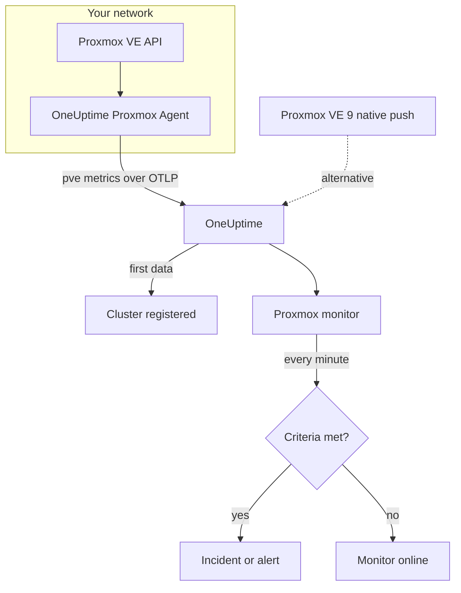

# Proxmox Monitor

A Proxmox monitor watches one Proxmox VE cluster — its nodes, VMs and LXC containers, storage, HA state, backup-job coverage and storage replication — and tells you when a node goes offline, a guest stops, or storage fills up. It reads the `pve_*` metrics the OneUptime Proxmox Agent collects, so nothing is probed from outside.

:::cards
- [Create the monitor](#create-a-proxmox-monitor): Six steps in the dashboard.
- [Templates](#pre-built-alert-templates): Eleven ready-made alerts, one incident per node, guest or volume.
- [Resource identity](#resource-identity): How to target one node, guest or storage volume.
- [Metrics](#collected-metrics): Every `pve_*` series the monitor can alert on.
:::

## How it works

The OneUptime Proxmox Agent runs on a machine that can reach the Proxmox VE API. Every 30 seconds it scrapes prometheus-pve-exporter with the cluster and node collectors, labels each series with the resource it describes, and sends the metrics to OneUptime over OTLP, stamped with the cluster's name, `proxmox.cluster.name`. The first data registers the cluster. Proxmox VE 9 and later can instead push metrics natively, with nothing to install; see [the native push](#the-proxmox-ve-native-push).

A Proxmox monitor is tied to one cluster. Every minute it runs its query over that cluster's metrics and compares the result with its criteria.

## Before you begin

- **Install the Proxmox Agent** where it can reach the Proxmox VE API, with a read-only API token. The [Proxmox Agent guide](/docs/telemetry/proxmox) covers the token, the install and the native push.
- **Check the cluster is registered.** It appears under **Products → Infrastructure → Proxmox → All Clusters**, named after the agent's `PROXMOX_CLUSTER_NAME`, about a minute after the first scrape.

## Create a Proxmox monitor

:::steps
### Start a new monitor

Go to **Monitors** and click **Create Monitor**.

### Pick Proxmox

Under **Monitor Type**, click **More monitor types** and pick **Proxmox** under **Infrastructure**, or type `proxmox` in the search box. Enter a **Name** — it is used in incident and alert titles — and click **Next**.

### Choose the cluster

Under **Proxmox Monitor Configuration**, pick the cluster from **Proxmox Cluster**. Every cluster that has sent data is in the list.

### Choose what to watch

Pick one of the three tabs:

- **Quick Setup** — click a [template](#pre-built-alert-templates). It sets the metrics, filters, aggregation, time range and thresholds, and replaces the criteria below with its own. You can still change the **Time Range**.
- **Custom Metric** — pick one metric from **Proxmox Metric**, then set **Aggregation** and **Time Range**. The [filters](#monitor-settings) narrow it to a kind of resource or to one resource.
- **Advanced** — build queries and formulas yourself under **Select Metrics**, for example a memory percentage from `pve_memory_usage_bytes / pve_memory_size_bytes`. Use **Group by** `id` to judge each resource on its own.

### Check the criteria

Open each criteria under **Monitor Criteria** and check its **Metric**, **Aggregation**, **Condition** and **Threshold**. A template fills these in. With **Custom Metric** or **Advanced**, the monitor starts with the [default criteria](#default-criteria), which only notice a metric dropping to zero, so set your own threshold.

### Create the monitor

Click **Create Monitor**. OneUptime opens the monitor's page and evaluates it every minute. Incidents and alerts it raises are also listed on the cluster's **Incidents** and **Alerts** pages.
:::

> [!TIP]
> To set up several templates at once, open the cluster from **Products → Infrastructure → Proxmox** and go to **Recommendations**. Pick the templates you want, choose who is paged, and OneUptime creates one monitor per template.

## Monitor settings

| Field | Tab | What it does |
| --- | --- | --- |
| **Proxmox Cluster** | All | Required. Scopes every query to `resource.proxmox.cluster.name`. |
| **Resource Scope** | Custom Metric, Advanced | Optional. **Node**, **Guest (VM / container)**, **Storage** or **Cluster** — an exact match on `pve.scope`. |
| **PVE ID** | Custom Metric, Advanced | Optional. Exact match on `pve.id`: a node name (`pve1`), a VMID (`100`) or `<node>/<storage>` (`pve1/local`). Pair it with a scope to target one resource. |
| **Node Name** | Custom Metric, Advanced | Optional. A node's own series only (`pve.scope = node` and `pve.id`). It cannot select the guests or storage on that node. |
| **Guest ID** | Custom Metric, Advanced | Optional. Exact match on the raw `id` label, such as `qemu/100` or `lxc/101`. When set, the other filters are ignored. |
| **Proxmox Metric** | Custom Metric | One metric from the [catalog](#collected-metrics). |
| **Aggregation** | Custom Metric | How samples are combined: **Average**, **Maximum**, **Minimum**, **Sum** or **Count**. Starts at the metric's usual aggregation. |
| **Time Range** | All | The rolling window the query reads, from **Past 1 Minute** to **Past 365 Days**. A new monitor starts at **Past 1 Minute**; templates set their own. |
| **Select Metrics** | Advanced | The query builder: **Metric**, **Aggregate by**, **Filter by attributes**, **Group by**, plus **Add Metric** and **Add Formula** to combine queries. |

## Resource identity

Every series carries an `id` datapoint label naming the Proxmox resource it belongs to:

| `id` value | Resource |
| --- | --- |
| `node/<name>` | A cluster node, for example `node/pve1`. |
| `qemu/<vmid>` | A QEMU virtual machine, for example `qemu/100`. |
| `lxc/<vmid>` | An LXC container, for example `lxc/101`. |
| `storage/<node>/<storage>` | A storage volume on a node, for example `storage/pve1/local`. |

Two exceptions: replication series (`pve_replication_*`) carry the replication **job** id in `id` (for example `100-0`), and the cluster-wide `pve_not_backed_up_total` has no `id` at all.

Filters match on equality, not on a prefix, so the agent also splits `id` into three attributes you can filter on. The templates rely on them:

| Attribute | Values | For `qemu/100` |
| --- | --- | --- |
| `pve.scope` | `node`, `guest`, `storage`, `cluster` (`qemu` and `lxc` are both `guest`) | `guest` |
| `pve.type` | `node`, `qemu`, `lxc`, `storage` | `qemu` |
| `pve.id` | Everything after the first `/` of `id` (`pve1`, `100`, `pve1/local`) | `100` |

Filter on `pve.scope` or `pve.type` for one kind of resource, on `pve.id` or `id` for one resource, and group by `id` to judge each resource on its own.

## Pre-built Alert Templates

**Quick Setup** offers 11 templates. Each builds a complete monitor — queries, attribute filters, a group-by, a criteria that fires and one that recovers. Most group by `id`, so each node, guest, volume or job gets its own incident and alert. Thresholds are starting points you can edit.

Templates read the past 5 minutes unless the table says otherwise. A criteria fires only when the condition holds for every minute of its window, and a threshold criteria recovers 10% past its threshold so a value hovering at the line does not flap.

| Template | Severity | Watches | Fires when | Recovers when |
| --- | --- | --- | --- | --- |
| Node Offline | Critical | `pve_up` for `pve.scope = node`, Min per `id` | Below 1 | At 1 |
| Guest Down | Warning | `pve_up` and `pve_onboot_status` for `pve.scope = guest`, Min per `id` | `pve_up` is below 1 while `pve_onboot_status` is 1 | `pve_up` is back at 1, or start on boot is turned off |
| Cluster Quorum at Risk | Critical | `pve_up` ÷ `pve_node_info` × 100 for `pve.scope = node` (both Sum): the share of nodes online | 50% or less | Above 55% |
| High Node CPU Usage | Warning | `pve_cpu_usage_ratio` for `pve.scope = node`, Avg per `id` | Above 0.9 (90% of the node's cores) | At or below 0.81 |
| High Node Memory Usage | Warning | `pve_memory_usage_bytes` ÷ `pve_memory_size_bytes` × 100 for `pve.scope = node`, per `id` | Above 85% | At or below 76.5% |
| High Guest CPU Usage | Warning | `pve_cpu_usage_ratio` for `pve.scope = guest`, Avg per `id`, past 15 minutes | Above 0.95 (95% of its vCPUs) for all 15 minutes | At or below 0.855 |
| Storage Near Full | Warning | `pve_disk_usage_bytes` ÷ `pve_disk_size_bytes` × 100 for `pve.scope = storage`, per `id` | Above 85% | At or below 76.5% |
| Container Root Disk Near Full | Warning | The same disk ratio for `pve.type = lxc`, per `id` | Above 90% | At or below 81% |
| HA Resource in Error State | Critical | `pve_ha_state` for `state = error`, Max per `id` | Above 0 | At 0 |
| Guest Not Backed Up | Warning | `pve_not_backed_up_total`, Max (one cluster-wide series) | Above 0 | At 0 |
| Replication Failing | Critical | `pve_replication_failed_syncs`, Max per `id` (the job id) | Above 0 | At 0 |

**Severity** is the label the picker shows. The incident and alert a template creates start on your project's most severe incident and alert severity; change them in the criteria.

- **Down templates use Minimum**, so one down scrape trips them instead of being hidden by scrapes where the resource was up.
- **Guest Down** only looks at guests set to start on boot, so a guest you stopped on purpose never pages.
- **Cluster Quorum at Risk** is a proxy: pve-exporter has no corosync metric, so it counts nodes online.
- **High Guest CPU Usage** is higher and slower than the node template: a guest is meant to use its vCPUs, so only one that never comes down pages.
- **Ratio formulas** take the **Sum** of both sides. Both come from the same scrape, so the result is a true percentage.
- **Container Root Disk Near Full** leaves out QEMU VMs: their disk usage reads 0 without the QEMU guest agent.
- **Guest Not Backed Up** covers backup-job membership only. pve-exporter does not say whether backups ran or succeeded; group `pve_not_backed_up_info` by `id` to list the guests.
- **Replication staleness** (now minus the last sync) cannot be alerted on, because criteria have no clock arithmetic. The cluster's **Overview** page shows it; alert on **Replication Failing** instead.

### The Proxmox VE native push

Proxmox VE 9 and later can push metrics through its built-in OpenTelemetry metric server, with nothing to install — see the [Proxmox Agent guide](/docs/telemetry/proxmox). OneUptime turns the push into the same `pve_*` series, so the catalog and the CPU, memory and storage templates work with it.

**Node Offline** and **Cluster Quorum at Risk** work too: each node pushes only its own status, so a node that stops reporting is reported down (`pve_up` = 0) by the nodes still alive — see [When a node stops reporting](/docs/telemetry/proxmox#when-a-node-stops-reporting). **Guest Down**, **HA Resource in Error State**, **Guest Not Backed Up** and **Replication Failing** need data only the agent collects.

## Collected Metrics

The agent scrapes prometheus-pve-exporter every 30 seconds with both the cluster and the node collectors, which also covers the exporter's `backup-info` and `replication` collectors (both on by default).

### Availability

| Metric | Unit | Description |
| --- | --- | --- |
| `pve_up` | — | 1 when the node or guest is up or running, 0 otherwise. |
| `pve_uptime_seconds` | seconds | Uptime of the node or guest. |
| `pve_version_info` | count | The Proxmox VE release, in its labels. Always 1. |

### Node

| Metric | Unit | Description |
| --- | --- | --- |
| `pve_node_info` | count | Node metadata, always 1. Sum it to count the nodes reporting. |
| `pve_cpu_usage_ratio` | ratio | CPU in use as a 0–1 ratio of the CPU available. |
| `pve_cpu_usage_limit` | cores | CPU available, in cores. For a guest, its vCPUs. |
| `pve_memory_usage_bytes` | bytes | Memory in use. |
| `pve_memory_size_bytes` | bytes | Total memory. |

The CPU and memory series are also reported for each guest, on `qemu/*` and `lxc/*` ids.

### Guest

| Metric | Unit | Description |
| --- | --- | --- |
| `pve_guest_info` | count | Guest metadata (name, node, type `qemu` or `lxc`) in labels. Always 1. |
| `pve_network_receive_bytes` | bytes | Bytes received by the guest. A lifetime counter. |
| `pve_network_transmit_bytes` | bytes | Bytes sent by the guest. A lifetime counter. |
| `pve_disk_read_bytes` | bytes | Bytes read from disk by the guest. A lifetime counter. |
| `pve_disk_write_bytes` | bytes | Bytes written to disk by the guest. A lifetime counter. |
| `pve_onboot_status` | count | 1 when the guest starts on node boot. A stopped guest with this set is usually unplanned downtime. |

### Storage

| Metric | Unit | Description |
| --- | --- | --- |
| `pve_disk_usage_bytes` | bytes | Bytes used on the disk or storage. For a QEMU guest it reads 0 unless the QEMU guest agent is installed. |
| `pve_disk_size_bytes` | bytes | Total size of the disk or storage. |
| `pve_storage_info` | count | Storage metadata, always 1. Sum it to count storage volumes. |

### HA

| Metric | Unit | Description |
| --- | --- | --- |
| `pve_ha_state` | — | One series per HA state (`started`, `stopped`, `error`, …) for each HA resource, 1 on its current state. Filter on the `state` label to alert on a state. |

### Backup

From the exporter's cluster-level `backup-info` collector. They report backup-**job** coverage only:

| Metric | Unit | Description |
| --- | --- | --- |
| `pve_not_backed_up_total` | count | Guests in no backup job. One cluster-wide series with no `id`. |
| `pve_not_backed_up_info` | count | One series per uncovered guest, always 1, labeled with the guest's `id`. It disappears once the guest joins a backup job. |

### Replication

From the exporter's node-level `replication` collector. The series exist only when the cluster has replication jobs, and carry the job id in `id`:

| Metric | Unit | Description |
| --- | --- | --- |
| `pve_replication_failed_syncs` | count | Failed sync attempts in a row. Above 0 means the replica is going stale. |
| `pve_replication_duration_seconds` | seconds | How long the last sync took. |
| `pve_replication_last_sync_timestamp_seconds` | seconds | Unix time of the last **successful** sync. |
| `pve_replication_last_try_timestamp_seconds` | seconds | Unix time of the last **attempt**. Newer than the last sync means the latest attempt failed. |
| `pve_replication_next_sync_timestamp_seconds` | seconds | Unix time of the next scheduled sync. |
| `pve_replication_info` | count | Job metadata — type, source, target, guest — in labels. Always 1. |

## Monitoring criteria

A criteria compares one of the monitor's queries or formulas with a threshold. A Proxmox monitor's criteria have no **Filter Type**: every rule checks the metric value, with these fields.

| Field | What it does |
| --- | --- |
| **Metric** | The query or formula to check, by its variable name. |
| **Aggregation** | How the values in the window become one answer: **Average**, **Sum**, **Maximum Value**, **Minimum Value**, **All Values** (every value must match) or **Any Value** (one is enough). |
| **Condition** | **Greater Than**, **Less Than**, **Greater Than Or Equal To**, **Less Than Or Equal To** or **Equal To** — or an anomaly condition: **Anomalously High**, **Anomalously Low** or **Anomalous**. |
| **Threshold** | The value to compare with. A unit list sits beside it when the metric has a unit. Not shown for anomaly conditions. |
| **Sensitivity** | Anomaly conditions only. **Low** (4σ), **Medium** (3σ, the default) or **High** (2σ). |
| **Baseline Window** | Anomaly conditions only. 14 days (the default), 28, 60 or 90 days of history. |
| **If No Data** | Under **More fields**. What happens when the window has no samples: **Ignore** (the default), **Treat As Zero** or **Trigger**. |

Anomaly conditions compare each value with the same hour of the week in the baseline. They stay in a "Learning" state, and raise nothing, until the baseline window holds enough history.

Each criteria also says what to do when it matches: change the monitor status, create an alert, or declare an incident. Criteria are checked from top to bottom, and the first one that matches decides.

### Default criteria

A monitor you do not build from a template starts with two criteria:

| Order | Criteria | Matches when | Then |
| --- | --- | --- | --- |
| 1 | Check if _monitor name_ is offline | Any value of the first query is `0` | Marks the monitor **Offline** and declares the incident "_monitor name_ is offline", which resolves itself when the monitor recovers. |
| 2 | Check if _monitor name_ is online | Any value is above `0` | Marks the monitor **Operational**. |

> [!IMPORTANT]
> Silence matches neither criteria: a cluster that stops sending data leaves the monitor as it was. To be told when data stops, set **If No Data** to **Trigger** on a criteria. Time OneUptime itself was not receiving is never no data: a check whose window holds it waits instead, as [When OneUptime Is Not Receiving Data](/docs/monitor/when-oneuptime-is-not-receiving) explains.

## Troubleshooting

:::details The cluster is not in the Proxmox Cluster list
Clusters register themselves from the agent's data. Check that the agent is running and shipping data (see the [Proxmox Agent guide](/docs/telemetry/proxmox)), and that `PROXMOX_CLUSTER_NAME` is set.
:::

:::details Guest metrics are missing
Guest series come from the exporter's cluster collector, which the shipped configuration turns on with the `cluster=1` scrape parameter. If you changed the collector configuration, restore it.
:::

:::details High Node CPU Usage never fires
The template averages `pve_cpu_usage_ratio` per `id`, so each node is checked on its own. If you built your own query, group it by `id`: an average across every node is pulled down by the idle ones.
:::

:::details Node Offline keeps firing for a node you removed from the cluster
On the Proxmox VE native push, a node taken out of the cluster looks the same as one that went down: it stopped reporting, so the nodes still alive keep reporting it down. Open the node's page and click **Remove Node** — the node goes away and its alert resolves. Otherwise it stays Offline for up to 7 days. The agent does not have this problem: it asks the cluster, which no longer lists the node.
:::

:::details Backup or replication metrics are missing
`pve_not_backed_up_*` comes from the exporter's `backup-info` collector and `pve_replication_*` from its `replication` collector. Both are on by default and covered by the shipped configuration's `cluster=1` and `node=1` scrape parameters. If you run your own exporter, check you have not turned them off. `pve_replication_*` only exists when the cluster has storage replication jobs.
:::

:::details Counters like pve_network_receive_bytes only ever grow
Network and disk I/O series are lifetime counters, and criteria compare raw values: there is no rate operator, and **Convert to per-second rate** in the query builder only changes the chart. Chart them as a rate, or alert on their growth with a formula, such as a **Maximum** query minus a **Minimum** query of the same counter.
:::

## Next steps

:::cards
- [Proxmox Agent](/docs/telemetry/proxmox): Install the agent, or set up the native push.
- [Ceph Monitor](/docs/monitor/ceph-monitor): Watch the Ceph storage behind a Proxmox cluster.
- [VMware Monitor](/docs/monitor/vmware-monitor): The same kind of monitor for vSphere.
- [Incidents](/docs/incidents/index): What happens after a criteria declares an incident.
:::
