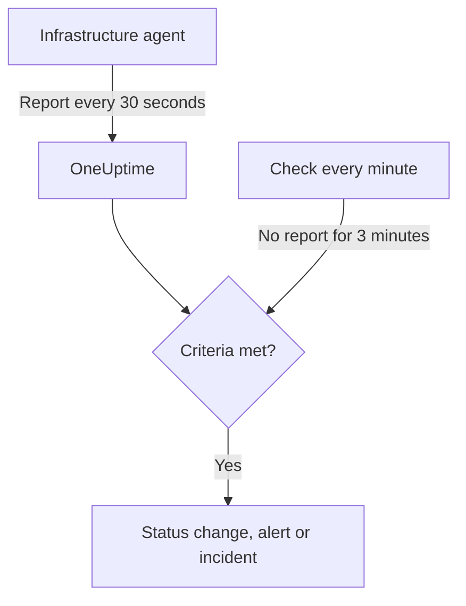

# Server / VM Monitor

A Server / VM monitor watches one machine through the OneUptime infrastructure agent (`oneuptime-infrastructure-agent`), a small service that reports CPU, memory, disks, load, network and running processes to OneUptime every 30 seconds. This page shows how to connect the agent to a Server / VM monitor, what the agent reports, and how to write the criteria that decide when the server is online or offline.

> [!IMPORTANT]
> **Create Monitor** no longer offers **Server / VM**. Server / VM monitors you already have keep working, and everything on this page applies to them. To watch a new server, create a [Host monitor](/docs/monitor/host-monitor) instead: it alerts on the host metrics that the [Host OpenTelemetry Collector](/docs/telemetry/host-otel-collector) sends.

:::cards
- [Connect the agent](#connect-the-agent): Install it, give it the monitor's secret key and start it.
- [What the agent reports](#what-the-agent-reports): CPU, memory, disks, load, network and processes.
- [Monitoring criteria](#monitoring-criteria): Decide when the server counts as online or offline.
- [Troubleshooting](#troubleshooting): The agent does not report, or the monitor never goes offline.
:::

## How it works

The agent runs as a system service. Every 30 seconds it collects a report and sends it to your OneUptime URL, signed with the monitor's secret key. OneUptime stores the numbers as the monitor's metrics and checks the report against the monitor's criteria.

Silence is checked separately. Every minute, OneUptime re-evaluates the **Is Online** criteria of every Server / VM monitor that has not reported for 3 minutes or more, and a server silent for longer than its criteria allows (3 minutes by default) counts as offline. A monitor with no **Is Online** criteria is never marked offline just because the agent went quiet.



## Before you begin

- A Server / VM monitor in your project.
- Permission to edit monitors. The secret key, and the setup commands that contain it, are only shown to people who can edit monitors.
- Root (Linux, macOS) or Administrator (Windows) on the server. The agent installs itself as a system service.
- Outbound HTTPS from the server to your OneUptime URL, directly or through an HTTP proxy.

## Connect the agent

The commands below use `https://oneuptime.com` and `YOUR_SECRET_KEY`. The monitor's own setup commands already have your OneUptime URL and the monitor's secret key filled in, so copy them from the monitor when you can.

:::steps
### Open the monitor's setup commands

Go to **Monitors**, open the Server / VM monitor and select **Documentation**. The **Set up your Server Monitor (Linux/Mac)** and **Set up your Server Monitor (Windows)** cards hold the commands for this monitor. Until the agent first reports, the monitor's **Overview** shows them too.

### Install the agent

:::tabs
@tab Linux
```bash
curl -sSL https://oneuptime.com/docs/static/scripts/infrastructure-agent/install.sh | sudo bash
```
@tab macOS
```bash
curl -sSL https://oneuptime.com/docs/static/scripts/infrastructure-agent/install.sh | sudo bash
```
@tab Windows
1. Download the agent from the [latest GitHub release](https://github.com/OneUptime/oneuptime/releases/latest): `oneuptime-infrastructure-agent_windows_amd64.zip` for x64, or `oneuptime-infrastructure-agent_windows_arm64.zip` for ARM64.
2. Extract the zip. It contains `oneuptime-infrastructure-agent.exe`.
3. Open **Command Prompt** as Administrator in the folder you extracted it to.
:::

The install script downloads the latest release for your operating system and processor (x86-64 or ARM64) and puts the `oneuptime-infrastructure-agent` binary in `$HOME/bin`. On a self-hosted install, the script is served from your own OneUptime URL.

### Connect it to the monitor

:::tabs
@tab Linux
```bash
sudo oneuptime-infrastructure-agent configure --secret-key=YOUR_SECRET_KEY --oneuptime-url=https://oneuptime.com
```
@tab macOS
```bash
sudo oneuptime-infrastructure-agent configure --secret-key=YOUR_SECRET_KEY --oneuptime-url=https://oneuptime.com
```
@tab Windows
```shell
oneuptime-infrastructure-agent configure --secret-key=YOUR_SECRET_KEY --oneuptime-url=https://oneuptime.com
```
:::

`configure` saves the secret key and URL to the agent's configuration file and installs the agent as a system service. Both flags are required. Replace `https://oneuptime.com` with your own URL on a self-hosted install.

If the server reaches the internet through a proxy, add `--proxy-url`:

```bash
sudo oneuptime-infrastructure-agent configure --proxy-url=http://proxy.example.com:8080 --secret-key=YOUR_SECRET_KEY --oneuptime-url=https://oneuptime.com
```

### Start the agent

:::tabs
@tab Linux
```bash
sudo oneuptime-infrastructure-agent start
```
@tab macOS
```bash
sudo oneuptime-infrastructure-agent start
```
@tab Windows
```shell
oneuptime-infrastructure-agent start
```
:::

When it starts, the agent checks the secret key with OneUptime and sends its first report straight away.

### Check that it reports

Run `sudo oneuptime-infrastructure-agent status` (no `sudo` on Windows): it prints `Service is running`. In OneUptime, the monitor's **Overview** stops showing the setup commands once the first report arrives, and its **Metrics** tab starts charting the server.
:::

## Agent reference

### Commands

| Command | What it does |
| --- | --- |
| `configure --secret-key=<key> --oneuptime-url=<url>` | Saves the settings and installs the agent as a system service. Add `--proxy-url=<url>` to send reports through a proxy. |
| `start` | Starts the service. It refuses to start until `configure` has been run. |
| `stop` | Stops the service. |
| `restart` | Restarts the service. |
| `status` | Prints whether the service is running or stopped. |
| `logs` | Prints the last 100 lines of the agent's log. `-n <lines>` prints a different number of lines, and `-f` follows new ones. |
| `uninstall` | Removes the service and deletes the agent's configuration file. |
| `help` | Lists the commands. |

Run them with `sudo` on Linux and macOS, and from an Administrator **Command Prompt** on Windows. To change the secret key, URL or proxy of a configured agent, run `stop` and `uninstall`, then `configure` and `start` again.

### Files

| File | Linux and macOS | Windows |
| --- | --- | --- |
| Configuration | `/etc/oneuptime-infrastructure-agent/config.json` | `%PROGRAMDATA%\oneuptime-infrastructure-agent\config.json` |
| Log | `/var/log/oneuptime-infrastructure-agent/oneuptime-infrastructure-agent.log` | `%PROGRAMDATA%\oneuptime-infrastructure-agent\oneuptime-infrastructure-agent.log` |

When the agent cannot write to these directories, it uses `~/.oneuptime-infrastructure-agent/` instead. The `ONEUPTIME_AGENT_CONFIG_PATH` and `ONEUPTIME_AGENT_LOG_PATH` environment variables set either path explicitly.

## What the agent reports

Every report carries the server's hostname and:

| Area | What is reported |
| --- | --- |
| CPU | Usage %, core count, usage per core, and time spent in user, system, idle, I/O wait, steal, nice, IRQ and soft IRQ |
| Memory | Total, used, free and available memory, buffers and cache, usage %, and swap total, used, free and usage % |
| Disks | For each mounted disk: mount path, device, file system, total, used and free space, usage %, bytes and operations read and written, and I/O time |
| Load | 1-, 5- and 15-minute load averages |
| Network | For each interface: bytes and packets sent and received, errors and drops in and out; plus established and listening connections |
| Host | Operating system, platform and version, kernel version and architecture, uptime, boot time, virtualization and process count |
| Processes | Each running process: name, PID, command, CPU %, memory, status, threads, user and start time |

Values the operating system does not provide are left out. The monitor's **Metrics** tab charts availability, CPU, memory, disk usage and I/O, load averages, swap, network traffic and errors, connections, uptime and the process count.

## Monitoring criteria

Criteria decide when the monitor is online, degraded or offline, and when it opens an alert or incident. Each filter in a criteria has a **Filter Type**, a **Filter Condition** and, for most types, a value.

| Filter Type | What it checks | Filter Conditions |
| --- | --- | --- |
| Is Online | Whether the agent has reported recently (in the last 3 minutes, by default) | True, False |
| CPU Usage (in %) | Overall CPU usage | Greater Than, Less Than, Greater Than Or Equal To, Less Than Or Equal To |
| Memory Usage (in %) | Memory in use | Same as CPU |
| Disk Usage (in %) | Usage of the disk named in **Disk Path** | Same as CPU |
| Swap Usage (in %) | Swap in use | Same as CPU |
| CPU IO Wait (in %) | Share of CPU time spent waiting on I/O | Same as CPU |
| Load Average (1 minute) | Load average over the last minute | Same as CPU |
| Load Average (5 minute) | Load average over the last 5 minutes | Same as CPU |
| Load Average (15 minute) | Load average over the last 15 minutes | Same as CPU |
| Server Process Name | Whether a process with this name is running (case-insensitive) | Is Executing, Is Not Executing |
| Server Process Command | Whether a process with exactly this command line is running (case-insensitive) | Is Executing, Is Not Executing |
| Server Process PID | Whether a process with this PID is running | Is Executing, Is Not Executing |

**Disk Path** takes a mount point or device, such as `/`, `/mnt/data`, `C:\` or `/dev/sda1`; it is `/` when left empty. Enter `*` to check every disk the agent reports: each disk that crosses the threshold gets an alert of its own, so a second disk filling up is not hidden behind the first one's open alert.

### Evaluate over a period of time

**Evaluate this criteria over a period of time** is a separate checkbox on the criteria form rather than a filter condition. It is available for **Is Online** and every numeric filter type. Turn it on to compare an aggregate — chosen under **Evaluate** (Average, Sum, Maximum Value, Minimum Value, All Values, Any Value) over the window set by **For the last (in minutes)** — instead of the value from the latest check. On an **Is Online** filter, the window is how long the agent may stay silent before the server counts as offline.

**All Values** only matches once the window is genuinely covered by data. A monitor that has just been created, or one whose checks stopped being recorded, does not have enough history to say anything about the last N minutes, so the criteria waits rather than matching on the one reading it does have. **Any Value** is the setting for "tell me the moment a single check breaches" and still fires immediately.

**If No Data** controls what happens while the window cannot back the criteria:

| If No Data | Behavior | Use it for |
| --- | --- | --- |
| **Ignore** (default) | The criteria does not match. | Ordinary threshold alerting. |
| **Trigger** | The missing data is treated as the problem. | Heartbeat-style checks, where silence is itself a failure. |
| **Treat As Zero** | The window is compared as a single zero. | Counters, where "no events" genuinely means zero. |

> [!TIP]
> CPU and load spike briefly all the time. Evaluate them over a few minutes with **Average** or **All Values** instead of alerting on a single report.

### Example criteria

| Goal | Filter Type | Filter Condition | Value |
| --- | --- | --- | --- |
| Mark the server offline when the agent stops reporting | Is Online | False | — |
| Alert when CPU usage is above 90% | CPU Usage (in %) | Greater Than | `90` |
| Alert when the root disk is more than 85% full | Disk Usage (in %), **Disk Path** `/` | Greater Than | `85` |
| Alert on any disk more than 85% full, one alert per disk | Disk Usage (in %), **Disk Path** `*` | Greater Than | `85` |
| Alert when memory usage is above 80% | Memory Usage (in %) | Greater Than | `80` |
| Alert when nginx stops running | Server Process Name | Is Not Executing | `nginx` |

## Troubleshooting

:::details The agent is not reporting
- Check that the service runs: `sudo oneuptime-infrastructure-agent status`.
- Read its log: `sudo oneuptime-infrastructure-agent logs -n 50`. A line `Metrics successfully pushed to OneUptime server` means reports are getting through.
- The agent checks the secret key when it starts and exits if OneUptime rejects it, logging `Secret key is invalid`. Compare the key with the one on the monitor's **Settings** page, under **Reset Server Monitor Secret Key**.
- Make sure the server can reach your OneUptime URL over HTTPS, and that no firewall blocks outbound connections.
:::

:::details `sudo` says the command is not found
The install script puts the binary in `$HOME/bin` of the user it ran as, and prints the directory it used. Run the agent by its full path, for example `sudo /root/bin/oneuptime-infrastructure-agent configure ...`. To install it into a directory on the system path instead, pass `-b` to the script:

```bash
curl -sSL https://oneuptime.com/docs/static/scripts/infrastructure-agent/install.sh | sudo bash -s -- -b /usr/local/bin
```
:::

:::details `start` says the service configuration was not found
`configure` has not been run, or `uninstall` removed its configuration. Run `configure` with the secret key and URL, then `start`.
:::

:::details The monitor never goes offline when the server is down
Only an **Is Online** criteria marks a silent server offline. Add one with **Filter Condition** set to **False**, and set the monitor status it changes to.
:::

:::details Reports do not get through the proxy
- Check the proxy URL and port passed to `--proxy-url`.
- Make sure the proxy allows connections to your OneUptime URL.
- To change the proxy, run `stop` and `uninstall`, then `configure` with the new `--proxy-url`, and `start`.
:::

## Next steps

:::cards
- [Host Monitor](/docs/monitor/host-monitor): The monitor to use for new servers, built on OpenTelemetry host metrics.
- [Host OpenTelemetry Collector](/docs/telemetry/host-otel-collector): Send host metrics and logs from Linux, macOS and Windows.
- [Incident and alert templating](/docs/monitor/incident-alert-templating): Put CPU, memory, disk and process details in incident titles.
:::
