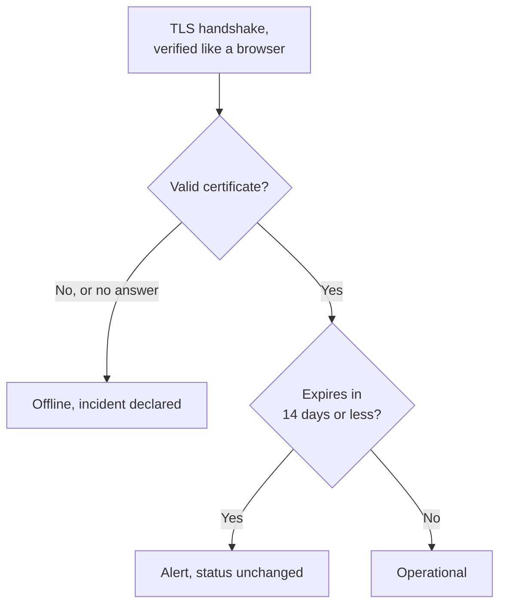

# SSL Certificate Monitor

An SSL Certificate monitor checks the TLS certificates your sites and services present, the way a browser does, and alerts you before they expire. It also takes the monitor offline when a certificate is no longer valid: expired, self-signed, issued for another host name, or from an authority browsers do not trust.

:::cards
- [Create the monitor](#create-an-ssl-certificate-monitor): Six steps in the dashboard.
- [Default criteria](#default-criteria): An expiry warning 14 days ahead, with no setup.
- [Monitoring criteria](#monitoring-criteria): Validity, expiry and self-signed certificates.
- [Troubleshooting](#troubleshooting): Self-signed and internal certificates.
:::

## How it works

On each check, a probe opens a TLS connection to the host and port in the URL, port `443` unless the URL names another, and verifies the certificate as a browser would: a trusted issuer, a host name that matches, and dates that include today. If the certificate fails verification, the probe still reads it, so its expiry date, issuer and fingerprints are recorded either way. A connection that fails, times out or presents an invalid certificate is tried again, up to the number of retries you allow. OneUptime then runs the result through the monitor's criteria.

A probe that has lost its own network connection reports no result, so it cannot mark your certificate invalid.

## Before you begin

- **A role that can create monitors**: Project Owner, Project Admin, Project Member, Monitor Admin or Monitor Member, or a custom role with the Create Monitor permission.
- **A probe that can reach the host and port.** Your project's default probes are picked for every new monitor. A service on a private network needs a [custom probe](/docs/probe/custom-probe) inside that network.

## Create an SSL certificate monitor

:::steps
### Start a new monitor

Go to **Monitors** and click **Create Monitor**. Under **Monitor Type**, pick **SSL Certificate**.

### Name it

Enter a **Name**, such as `example.com certificate`, then click **Next**.

### Enter the URL

In **Website URL**, enter the site whose certificate to check, such as `https://example.com`. For a service on another port, include it: `https://example.com:8443`.

### Test it

Click **Test Monitor**, pick a probe under **Select Probe** and click **Run Test**. **Monitor Test Result** shows the certificate the probe got, with its issuer and expiry date.

### Review the criteria

**Monitor Criteria** starts with the [default criteria](#default-criteria): offline when the certificate is not valid, an alert when it expires in 14 days or less. Change them if you need to, then click **Next**.

### Pick probes and create

Keep or change the **Probes** and the **Monitoring Interval** (it starts at **Every 5 Minutes**; SSL Certificate monitors are offered 5 minutes or longer), then click **Create Monitor**. The monitor's page opens.
:::

## Configuration options

| Field | Default | What to enter |
| --- | --- | --- |
| **Website URL** | None | The site whose certificate to check, such as `https://example.com` or `https://example.com:8443`. Only the host and the port are used; the path is ignored. |
| **Request Timeout (seconds)** (under **More fields**) | `60` | How long to wait for the TLS handshake on each attempt. The maximum is 60 seconds. |
| **Retries on Failure** (under **More fields**) | Probe default, usually `3` | How many times to retry a failed attempt. The maximum is 3. |

**Retries on Failure** counts retries _after_ the first attempt, so `0` runs the check once and `2` runs it up to three times. Left blank, it uses the probe's default: 3, unless the probe's `PROBE_MONITOR_RETRY_LIMIT` says otherwise. Connection failures, certificate validation failures and timeouts are all retried, with a one-second pause between attempts.

## Monitoring Criteria

Criteria decide when the certificate counts as fine, degraded or broken, and whether that declares an incident or creates an alert. Each criteria checks one or more filters:

| Filter | Conditions | What it checks |
| --- | --- | --- |
| **Is Valid Certificate** | **True**, **False** | The certificate passes a browser's checks: a trusted issuer, a matching host name and dates that include today. **False** when the endpoint did not answer. |
| **Is Not A Valid Certificate** | **True**, **False** | The opposite of **Is Valid Certificate**: **True** when the certificate fails those checks or could not be checked. |
| **Is Expired Certificate** | **True**, **False** | The certificate's expiry date has passed. |
| **Is Self Signed Certificate** | **True**, **False** | The certificate, or one in its chain, is self-signed. |
| **Expires In Days** | **Greater Than**, **Less Than**, **Greater Than Or Equal To**, **Less Than Or Equal To** | Days until the certificate expires. |
| **Expires In Hours** | **Greater Than**, **Less Than**, **Greater Than Or Equal To**, **Less Than Or Equal To** | Hours until the certificate expires. |

**Expires In Days** counts whole days: a certificate that expires in 14 days and 20 hours has 14 days left. **Expires In Hours** counts whole hours the same way.

With two or more filters, **Match Condition** decides whether **All** of them or **Any** one must match. A criteria's **Actions** decide what it does: change the monitor status, create an alert, declare an incident, or any of these.

### Default Criteria

A new SSL certificate monitor starts with three criteria, so it warns you before a certificate expires without any setup:

1. **Certificate is not valid** — the certificate has expired, is self-signed, was issued for another host name or by an untrusted authority, or could not be checked because the endpoint did not answer. The monitor is marked **Offline** and an incident called "_monitor name_ certificate is not valid" is created. Its root cause says which of these it was. The incident resolves itself once the certificate is valid again.
2. **Certificate expires soon** — the certificate is valid but expires in 14 days or less. An **alert** called "_monitor name_ certificate expires soon" is created.
3. **Certificate is valid** — the monitor is marked **Operational**.

The "expires soon" warning is an alert, not an incident: it does not show on your status pages, it pages nobody unless you add an on-call policy to it, and it does not change the monitor's status. It uses your project's second alert severity, **Low** on a new project. When the renewed certificate is picked up, the monitor is back on "Certificate is valid" and the alert resolves itself.

Criteria are checked from top to bottom, and the first one that matches decides what happens. That is why "expires soon" sits above "is valid": an expiring certificate is still valid, so it would match both.

To be warned earlier, change the value of the **Expires In Days** filter in the "expires soon" criteria, for example to `30`. To be paged instead, open that criteria's **Actions**: turn on **When filters match, declare an incident.**, or keep the alert and add an on-call policy to it under **On-Call Policies**.

:::details Add the warning to a monitor created before it existed
Monitors created before OneUptime added this warning have no "expires soon" criteria. To add it:

1. On the monitor, open **Configuration → Criteria** and click **Edit Monitoring Criteria**.
2. Click **Add Criteria**. Set its filter to **Is Valid Certificate** / **True**, click **Add Filter**, and set the second one to **Expires In Days** / **Less Than Or Equal To** / `14`. Leave **Match Condition** on **All** (it appears under the filters once there are two).
3. Under **Actions**, turn on **When filters match, create an alert.** and leave **When filters match, change monitor status.** off, so it creates an alert and does not change the monitor status.
4. Drag the new criteria above the criteria that marks the monitor as online, then save.
:::

### Example criteria

| Goal | Filter | Condition | Value |
| --- | --- | --- | --- |
| Warn a month ahead | **Expires In Days** | **Less Than Or Equal To** | `30` |
| Page someone on the last day | **Expires In Hours** | **Less Than** | `24` |
| Offline only once the certificate has expired | **Is Expired Certificate** | **True** | — |
| Flag a self-signed certificate | **Is Self Signed Certificate** | **True** | — |

A criteria about expiry has to sit above the criteria that marks the certificate valid: a certificate about to expire is still valid, and the first criteria that matches wins.

## Best Practices

1. **Give yourself time to renew** — The default warning comes 14 days before expiry, which suits certificates that renew themselves. If renewing takes you longer (a certificate you buy, or a change process), raise it to 30 days.
2. **Monitor every endpoint** — If you have several domains or subdomains, create a monitor for each. Each one can have its own certificate.
3. **Include other ports** — Services that serve TLS on a port other than `443`, such as `8443`, have certificates too. Put the port in the URL.
4. **Check after renewal** — After renewing a certificate, check the monitor's next result: the expiry date it shows should be the new one.

## Troubleshooting

:::details The certificate is fine in my browser, but the monitor says it is not valid
The incident's root cause says why. A common one is a server that sends its certificate without the intermediate certificates: browsers often fill the gap themselves, the probe does not. Configure the server to send the full chain. Another is a URL whose host name is not on the certificate.
:::

:::details I monitor an internal service with a self-signed certificate
A self-signed certificate is never valid, so the default criteria keep the monitor offline. **Is Self Signed Certificate**, **Is Expired Certificate** and **Expires In Days** still work for it, so build the criteria on those. On **Configuration → Criteria**:

1. In the "not valid" criteria, click **Add Filter**, set the new filter to **Is Self Signed Certificate** / **False**, and set **Match Condition** to **All**. The criteria still takes the monitor offline when the endpoint does not answer, or the certificate is wrong in another way.
2. Add a criteria with **Is Expired Certificate** / **True** that marks the monitor **Offline** and declares an incident, and drag it to the top.
3. In the "expires soon" criteria, replace **Is Valid Certificate** / **True** with **Is Expired Certificate** / **False**, so the warning covers the self-signed certificate too.

While the certificate is current, no criteria matches and the monitor shows its default status, **Operational**.
:::

:::details The monitor is offline with "could not be checked because the endpoint is not reachable"
The probe could not open a TLS connection to the host and port. Check the port in the URL, and that a firewall lets the probes through. A host on a private network needs a [custom probe](/docs/probe/custom-probe).
:::

## Next steps

:::cards
- [Website Monitor](/docs/monitor/website-monitor): Check that the site itself answers.
- [Domain Monitor](/docs/monitor/domain-monitor): Get warned before the domain's registration expires.
- [Escalation Rules](/docs/on-call/escalation-rules): Decide who gets paged by the alerts and incidents.
- [Incidents](/docs/incidents/index): What happens after the monitor declares one.
:::
