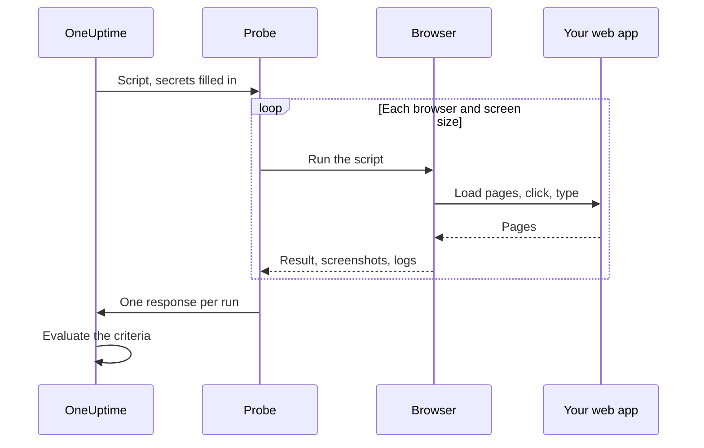

# Synthetic Monitor

A Synthetic Monitor drives your web app in a real browser, on a schedule, with a Playwright script you write: it opens pages, fills in forms and clicks through a user journey, and fails when the journey does. Use it to catch the breakages an uptime check cannot see — a login that no longer works, a checkout button that does nothing, a dashboard that never finishes loading.

:::cards
- [Create the monitor](#create-a-synthetic-monitor): Write a script, pick browsers and screen sizes.
- [Write the script](#write-the-script): A runnable sign-in journey to start from.
- [Screenshots](#screenshots): See what the page looked like when a run failed.
- [What the script can use](#modules-available-in-the-script): Playwright, HTTP, crypto and metrics.
:::

## How it works

On every check, a probe runs your script once for each browser and screen size you picked, one after another. Each run starts a fresh browser with no cookies or storage from earlier runs; the script drives its page, takes screenshots, and returns a result or throws an error. The probe reports every run, and OneUptime evaluates your criteria against them.



| Screen Type | Viewport |
| --- | --- |
| Mobile | 360 × 640 |
| Tablet | 1024 × 768 |
| Desktop | 1920 × 1080 |

The browsers are Chromium and Firefox.

## Before you begin

- A **probe** that can reach your web app. Use a [custom probe](/docs/probe/custom-probe) for an app inside your network. The probe's Docker image includes Chromium and Firefox; a probe run outside Docker needs them installed.
- Any password or token the journey needs, stored as a [monitor secret](/docs/monitor/monitor-secrets).

## Create a synthetic monitor

:::steps
### Start a new monitor

Go to **Monitors** and click **Create Monitor**. Under **Monitor Type**, click **More monitor types** and pick **Synthetic Monitor** under **Synthetic Monitoring**, or type `playwright` in the search box. Enter a **Name**, then click **Next**.

### Add the script

Write your script in the **Playwright Code** editor. Start from the [example below](#write-the-script).

### Pick browsers and screen sizes

Tick the browsers under **Browser Type** and the sizes under **Screen Type**. The script runs once for each combination, so two browsers and three sizes make six runs per check. Under **More fields**, **Retry Count on Error** retries a failed run up to 5 times.

### Test it

Click **Test Monitor** to run the script once from a probe, and check each run's result, logs and screenshots.

### Review the criteria

The monitor starts with two criteria: it is offline, and declares an incident, when a run fails, and online when none does. Change them or add your own — see [Criteria](#criteria) — then click **Next**.

### Pick probes and create

Select the **Probes** and a **Monitoring Interval** — synthetic monitors are offered every 5 minutes or longer — then click **Create Monitor**.
:::

## Write the script

The script is the body of an `async` function. `page` is a Playwright-compatible page that is already open; drive it, `return` a result, and `throw` (or let a Playwright call time out) to fail the run. This example signs in and checks that the dashboard loads:

```javascript title="Synthetic monitor script"
await page.goto("https://app.example.com/login");
screenshots["login-page"] = await page.screenshot();

await page.fill("#email", "monitoring@example.com");
await page.fill("#password", "{{monitorSecrets.AppPassword}}");
await page.click("button[type=submit]");

// Fails the run if the dashboard does not appear within 10 seconds.
await page.waitForSelector(".dashboard", { timeout: 10000 });
screenshots["dashboard"] = await page.screenshot();

console.log(`Signed in on ${browserType}, ${screenSizeType}`);

return {
  data: { title: await page.title() },
};
```

| To | Do this | What OneUptime records |
| --- | --- | --- |
| Report a result | `return { data: ... }` | The run's **Result**. Only `data` is kept. |
| Fail the run | `throw new Error("...")`, or let a wait time out | The run's **Script Error**. |
| Keep evidence | `screenshots["name"] = await page.screenshot()` | A screenshot, kept even when the run fails. |
| Leave a trace | `console.log(...)` | The run's log messages. |

To see the runs, open the monitor's **Overview**: the **Monitor Summary** card has one block per browser and screen size, and **Show More Details** shows each run's screenshots.

### Use of Playwright

We use Playwright to simulate user interactions. The `page` value is a secure, Playwright-compatible facade for the page created for this execution. Common `Page`, `Locator`, `Frame`, `ElementHandle`, `JSHandle`, `Request`, `Response`, keyboard, mouse, and browser-context methods are available. This includes navigation, locators, clicks, form input, page evaluation, popups, additional pages, response inspection, and screenshots. You can reach the execution's browser context through `page.context()`, for example to open a new page or handle a popup.

Synthetic scripts do not run in the Probe's Node.js process. Values cross the runtime boundary as copied data or opaque, execution-scoped capabilities, so some Playwright APIs work differently or not at all:

| Not available | Use instead |
| --- | --- |
| Browser launch or connection methods, CDP sessions, request routing, exposed bindings, Playwright private fields, and any option that reads or writes a host filesystem path. `page.context().browser()` is therefore unavailable. | The page and browser context you are given. |
| Event listeners (`page.on(...)`, `page.once(...)`) — calling them fails with a clear error. | `page.waitForEvent(...)` for dialogs and popups, or response and request waits with string or regular-expression matchers. |
| Function predicates for event, request, response, and URL wait methods. | String or regular-expression matchers, locators, or explicit polling. |
| The synchronous frame accessors (`page.frames()`, `page.mainFrame()`, `page.frame(...)`). | `page.frameLocator(...)` for iframes. |
| `page.request.*` | The `axios` global for HTTP requests. |
| Full-page screenshots and PDF output. | Viewport screenshots, which keep the failure evidence behavior described below. |

`page.waitForNavigation(...)`, `page.setDefaultTimeout(...)`, and `page.setDefaultNavigationTimeout(...)` are supported. `page.waitForEvent(...)` waits for `dialog`, `domcontentloaded`, `load`, `popup`, `request`, `requestfailed`, `requestfinished` and `response`. Evaluation functions passed to methods such as `page.evaluate()` execute in the monitored browser page, never in the Probe process. Each execution can use up to eight pages.

Browser permissions are limited to geolocation and notifications. Clipboard, camera, microphone, MIDI, local-font, and other host-device permissions are not available to monitor scripts.

### What the script returns

Data returned from the script is serialized to JSON before it is stored: in plain objects and arrays, `NaN` and `Infinity` become `null`, `undefined` properties and functions are dropped, and `Date` objects become ISO strings — the same way `JSON.stringify` handles them. Class instances and other non-plain objects are dropped entirely. A `BigInt` becomes a string. A result that is circular, nested more than 30 levels deep, or larger than 5 MB fails the run instead.

### Alerting on the returned data

Whatever the script returns as `data` is the monitor's **Result Value**, which a criteria can compare. When `data` is an object or an array, fill in **Field Path** on the Result Value filter to compare one field of it — for example `status`, `timings.loadTime` or `errors[0].message`. The filter is checked against the data from every browser and screen size the monitor runs on, and matches when any of them does. See [Alerting on the returned data](/docs/monitor/custom-code-monitor#alerting-on-the-returned-data) for how paths and conditions work.

## Screenshots

A pre-declared `screenshots` object is available in the script context. Assign screenshots to it at any point in the script — these screenshots are captured **even if the script throws** (including assertion failures, timeouts, or unexpected errors), so you can see exactly what the page looked like when the run failed. Captured screenshots appear in the OneUptime Dashboard for that specific monitor run.

```javascript
// Capture screenshots via the `screenshots` side-channel — they are preserved on both success and failure.

await page.goto("https://app.example.com/login");
screenshots["login-page"] = await page.screenshot();

await page.fill("#email", "user@example.com");
await page.fill("#password", "wrong");
await page.click("button[type=submit]");

// If the next assertion throws, the `login-page` screenshot above is still captured.
await page.waitForSelector(".dashboard", { timeout: 5000 });

screenshots["dashboard"] = await page.screenshot();

return {
  data: "Login succeeded",
};
```

A run keeps up to 20 screenshots, each up to 10 MB and 50 MB in all. A screenshot can also be shown in the incident or alert a failing run opens — on its page and in the emails about it — by placing it in the monitor's incident or alert description. See [Showing a screenshot](/docs/monitor/incident-alert-templating#showing-a-screenshot).

:::details Returning screenshots (legacy)
For backward compatibility, you can also return screenshots from the script as part of the return value. Screenshots returned this way are **only** captured when the script completes normally — they are lost if the script throws. Prefer the side-channel pattern above when you want evidence of failures.

```javascript
// Legacy pattern — screenshots only captured on successful return.
const screenshots = {};
screenshots["screenshot-name"] = await page.screenshot();

return {
  data: "Hello World",
  screenshots: screenshots,
};
```
:::

## Using Monitor Secrets

Reference a secret as `{{monitorSecrets.NAME}}` anywhere in the script. OneUptime replaces the reference with the secret's value, as plain text, before the script reaches the probe. So wrap a secret in quotes to use it as a string, and leave it bare to use it as a number or a boolean:

```javascript
// Used as a string: wrap it in quotes.
const password = "{{monitorSecrets.AppPassword}}";

// Used as a number or a boolean: leave it bare.
const retryLimit = {{monitorSecrets.RetryLimit}};
const verbose = {{monitorSecrets.Verbose}};
```

To create a secret and choose which monitors can use it, see [Monitor Secrets](/docs/monitor/monitor-secrets).

## Custom Metrics

You can capture custom metrics from your script with the `oneuptime.captureMetric()` function. These metrics are stored in OneUptime and can be charted on dashboards using the Metric Explorer.

```javascript
oneuptime.captureMetric(name, value, attributes);
```

| Parameter | Type | Description |
| --- | --- | --- |
| `name` | string, required | The metric name (e.g. `"dashboard.load.time"`). It is stored with a `custom.monitor.` prefix automatically. |
| `value` | number, required | The numeric metric value. |
| `attributes` | object, optional | Key-value pairs for additional context. |

### Example

```javascript
await page.goto("https://app.example.com");

const startTime = Date.now();
await page.waitForSelector("#dashboard-loaded");
const loadTime = Date.now() - startTime;

// Capture page load time, tagged with this run's browser and screen size
oneuptime.captureMetric("dashboard.load.time", loadTime, {
  page: "dashboard",
  browser: browserType,
  screen: screenSizeType,
});

screenshots["dashboard"] = await page.screenshot();

return {
  data: { loadTime },
};
```

Once captured, these metrics appear in the Metric Explorer under names like `custom.monitor.dashboard.load.time`, and on the monitor's **Metrics** page under **Custom Metrics**. OneUptime adds the monitor and the probe to every datapoint; to filter by browser or screen size, pass them as attributes, as the example does.

A script can capture at most 100 metrics per execution, with numeric values only. As for a Custom Code monitor, some attribute names are [reserved](/docs/monitor/custom-code-monitor#reserved-attribute-keys) and dropped if a script sets them.

## Criteria

| Filter type | What it checks |
| --- | --- |
| **Error** | The error a run threw, if any. |
| **Result Value** | The `data` a run returned. |
| **Execution Time (in ms)** | How long a run took. |
| **Browser Type** | The browser a run used: **Equal To** or **Not Equal To**. |
| **Screen Size** | The screen size a run used: **Equal To** or **Not Equal To**. |

Each filter is checked against every run, and matches when any one run matches it. Filters are checked separately, not run by run: **Error** Is Not Empty together with **Browser Type** Equal To `Firefox` matches when any run failed and one of the runs used Firefox — not only when the Firefox run failed. To watch one browser on its own, give it a monitor of its own.

In incident and alert templates, every run is in `{{syntheticResponses}}`: see [Incident & Alert Dynamic Templating](/docs/monitor/incident-alert-templating#synthetic-monitors).

## Modules available in the script

| Name | What it is |
| --- | --- |
| `page` | A secure Playwright-compatible facade for interacting with the browser. You can access the execution's browser context via `page.context()` to create pages or deal with popups, but browser launch/connect, CDP, routing, bindings, private fields, and host-path options are unavailable. |
| `screenshots` | A pre-declared object that you assign screenshots to (e.g. `screenshots['login-page'] = await page.screenshot()`). Screenshots assigned here are captured even if the script later throws. |
| `browserType` | The browser this run uses: `Chromium` or `Firefox`. |
| `screenSizeType` | The screen size this run uses: `Mobile`, `Tablet` or `Desktop`. |
| `axios` | A promise-based HTTP client supporting callable Axios plus `request`, `get`, `head`, `options`, `post`, `put`, `patch`, `delete`, and `create`. A request body can be up to 1 MB and a response up to 5 MB; it follows up to 5 redirects and times out after at most 30 seconds. Custom transports, adapters, sockets, agents, and proxy overrides are unavailable. |
| `crypto` | A browser-worker implementation of SHA-256 hashes, HMAC-SHA-256, `randomBytes`, `randomInt`, and `randomUUID`. |
| `console` | `console.log`, `info`, `warn` and `error`. The messages are kept with each run. |
| `oneuptime.captureMetric` | Captures a custom metric. See [Custom Metrics](#custom-metrics). |
| `http` | A buffered, client-only compatibility facade supporting `request`, `get`, and `Agent`. |
| `https` | The HTTPS equivalent of the client-only `http` facade. |
| `Buffer`, `setTimeout`, `setInterval` | And their `clear` functions. |

The script runs in a browser worker, not in Node.js, and cannot open its own network connections: `fetch`, `XMLHttpRequest` and `WebSocket` are blocked. Use `axios` for HTTP requests.

## Limits

| Limit | Default | Probe setting |
| --- | --- | --- |
| Script timeout | 60 seconds. Timed-out workers and all browser descendants are terminated. | `PROBE_SYNTHETIC_MONITOR_SCRIPT_TIMEOUT_IN_MS` |
| Memory for a run's whole process tree | 1.5 GiB | `PROBE_SYNTHETIC_MONITOR_MAX_PROCESS_TREE_RSS_BYTES` |
| Writable browser storage | 256 MiB | `PROBE_SYNTHETIC_MONITOR_MAX_DISK_BYTES` |
| Runs at the same time on one probe | 4 | `PROBE_SYNTHETIC_MONITOR_MAX_CONCURRENCY` |
| Pages per execution | 8 | — |

Exceeding the memory or storage limit terminates that execution and removes its temporary profile. The probe settings apply to self-hosted probes; the Helm chart sets the same values per probe (for example `syntheticMonitorScriptTimeoutInMs`).

The browsers ship inside the probe's Docker image, so a self-hosted probe gets newer browsers when you update its image.

## Troubleshooting

:::details A run fails, but I cannot tell why
Assign screenshots to the `screenshots` object before each risky step. They are kept even when the run fails, and show what the page looked like at that point.
:::

:::details `page.on(...)` throws an error
Event listeners cannot cross the isolation boundary. Use `page.waitForEvent(...)` for dialogs and popups, or a response or request wait with a string or regular-expression matcher.
:::

:::details The run times out
Wait for specific elements with `page.waitForSelector(...)` and a `timeout` shorter than the script's own limit, so the run fails on the step that is slow with a clear error.
:::

:::details A self-hosted probe says the browser executable was not found
The probe is running outside its Docker image, without Chromium or Firefox installed. Run the probe's image, or install the browsers on that machine.
:::

## Next steps

:::cards
- [Custom Code Monitor](/docs/monitor/custom-code-monitor): Check APIs with a script, without a browser.
- [Showing a screenshot](/docs/monitor/incident-alert-templating#showing-a-screenshot): Put the failing run's screenshot in the incident.
- [Monitor Secrets](/docs/monitor/monitor-secrets): Keep credentials out of your script.
:::
