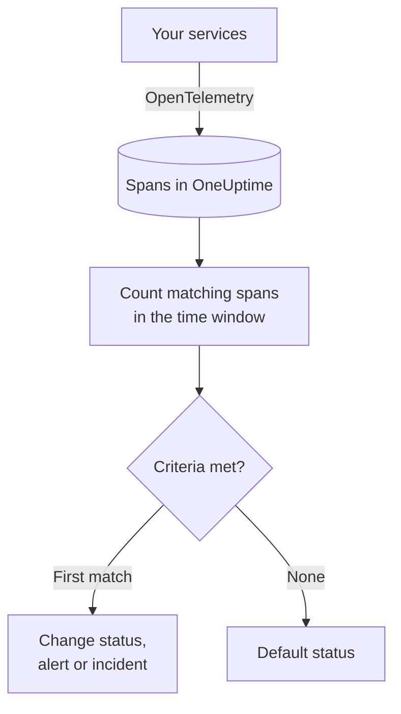

# Traces Monitor

A Traces monitor counts the spans your services send to OneUptime that match your filters — span name, status, service, attributes — over a time window, and changes the monitor's status, creates an alert or declares an incident when the count meets your criteria. Use it to alert on failing requests to an endpoint, a spike of error spans, or a service that has stopped sending traces.

:::cards
- [Create the monitor](#create-a-traces-monitor): Pick the spans to count and when to alert.
- [Span status codes](#span-status-codes): What OK, ERROR and UNSET mean, and which to filter on.
- [How it is evaluated](#how-it-is-evaluated): The time window, the count and the one-minute cycle.
- [Criteria](#criteria): Thresholds, anomaly detection and the defaults.
:::

## How it works

Every minute, OneUptime counts the spans that match the monitor's filters and started within its time window. It checks that count against the monitor's criteria from top to bottom, and the first criteria that matches decides what happens. When none matches, the monitor goes back to its default status.

## Before you begin

- Your services send traces to OneUptime over OpenTelemetry. See [OpenTelemetry](/docs/telemetry/open-telemetry).
- Look up the exact span name you want to watch in the trace explorer: span names are set by your instrumentation, for example `POST /api/checkout` or `GET`.

## Create a traces monitor

:::steps
### Start a new monitor

Go to **Monitors** and click **Create Monitor**.

### Choose Traces

Under **Monitor Type**, click **More monitor types** and pick **Traces** under **Telemetry**, or type `traces` in the search box. Enter a **Name**, then click **Next**.

### Choose the spans to count

In **Trace Monitor Configuration**, set **Span Name**, **Monitor Traces for (time)** and **Filter by Span Status**. A filter you leave empty matches every span. **Spans Preview**, under the filters, shows the spans they match right now.

### Narrow them down (optional)

Open **More fields** to filter by telemetry service, infrastructure entity or attribute.

### Set the criteria

The **Monitor Criteria** card starts with two criteria: offline, with an incident, when no spans match; online when at least one does. Change them to what you want to alert on — see [Criteria](#criteria).

### Create the monitor

Click **Create Monitor**. The monitor opens on its **Overview** page, and its first evaluation runs within a minute.
:::

## What it queries

| Field | What it matches | Default |
| --- | --- | --- |
| **Span Name** | Spans whose name contains this text, ignoring case. | Empty: every span |
| **Monitor Traces for (time)** | Spans that started in the last 5 seconds up to the last 24 hours. | **Last 1 minute** |
| **Filter by Span Status** | Spans with any of the chosen statuses: **Unset**, **Ok** or **Error**. | Empty: every status |
| **Filter by Telemetry Service** (under **More fields**) | Spans from any of the chosen services. | Empty: every service |
| **Filter by Infrastructure Entity** (under **More fields**) | Spans from any of the chosen hosts, pods, containers and other entities. | Empty: every entity |
| **Filter by Attributes** (under **More fields**) | Spans whose attributes meet every condition. Each condition has its own operator, such as equals or contains. | Empty: no condition |

All the filters you set must match for a span to be counted.

### Span Status Codes

- **OK** — The operation was explicitly marked successful, by application code or a trace pipeline
- **ERROR** — The operation encountered an error
- **UNSET** — No error status was set. This is the OpenTelemetry default status

UNSET does not mean data is missing. OpenTelemetry instrumentation sets ERROR when an operation fails and leaves successful spans UNSET, so on a healthy service most spans are UNSET. OneUptime shows them in green as "Unset (no error)". Recording an exception does not change a span's status, so an UNSET span can still have exceptions; they are listed with the span. To alert on failures, filter on ERROR. To count every span that did not fail, select both OK and UNSET.

If you want successful requests to show as OK, add a trace pipeline under **Traces > Settings > Pipelines** with the filter condition **Status = Unset** and a **Status Remapper** that maps `http.response.status_code` values such as `200` to Ok.

## How it is evaluated

- **Every minute.** A Traces monitor is not checked by probes, so it has no interval to set and no **Probes & Interval** page.
- **One number per evaluation.** The monitor counts the spans that match every filter and started within **Monitor Traces for (time)** before the evaluation. With **Last 5 minutes**, each evaluation looks back five minutes, so the windows of consecutive evaluations overlap.
- **No spans is a count of 0.** A service that stops sending traces produces 0, which is what the default offline criteria looks for.
- **Criteria from top to bottom.** The first criteria that matches decides, so put the most severe one first.

Each status change, with the reason for it, is recorded on the monitor's **Status Timeline**.

## Criteria

A Traces monitor's criteria have one **Filter Type**: **Span Count**, the number of spans that matched in the window. Pick a **Filter Condition** and, for a threshold condition, a **Value**.

| Filter Condition | Matches when the span count is… |
| --- | --- |
| **Greater Than** | above the value |
| **Greater Than Or Equal To** | the value or above |
| **Less Than** | below the value |
| **Less Than Or Equal To** | the value or below |
| **Equal To** | exactly the value |
| **Anomalously High** | above the range expected for this hour of the week |
| **Anomalously Low** | below that range |
| **Anomalous** | outside that range, either way |

The anomaly conditions take no **Value**. Pick a **Sensitivity** — Low, Medium (the default) or High — and a **Baseline Window** of 14 (the default), 28, 60 or 90 days. OneUptime turns the count into a per-minute rate and compares it with the same hour of the week over that window. The baseline covers the monitor's services and span statuses only: its span name and attribute filters are not part of it. Until that hour of the week has enough history, the criteria is still learning and does not fire.

A new Traces monitor starts with these criteria:

| Criteria | Filter | Effect |
| --- | --- | --- |
| Check if … is offline | **Span Count** **Equal To** `0` | Marks the monitor offline and declares an incident, resolved automatically |
| Check if … is online | **Span Count** **Greater Than** `0` | Marks the monitor online |

## Worked example: failed checkout requests

In five minutes, the checkout service records 1,200 spans named `POST /api/checkout`: 1,150 UNSET, 20 OK and 30 ERROR. The same monitor counts very different numbers depending on **Filter by Span Status**:

| Filter by Span Status | Span Count | What it measures |
| --- | --- | --- |
| **Error** | 30 | Requests that failed |
| **Ok** | 20 | Only the requests your code marked successful |
| **Unset** and **Ok** | 1,170 | Every request that did not fail |
| Empty | 1,200 | Every request |

To be paged when more than 10 checkout requests fail in five minutes:

- **Span Name**: `POST /api/checkout`
- **Monitor Traces for (time)**: **Last 5 minutes**
- **Filter by Span Status**: **Error**
- Criteria 1: **Span Count** **Greater Than** `10` — mark the monitor offline and declare an incident
- Criteria 2: **Span Count** **Less Than Or Equal To** `10` — mark the monitor online

With 30 failed requests, criteria 1 matches and the incident is declared. Once five minutes pass with 10 or fewer failures, criteria 2 matches, the monitor is back online and the incident resolves itself.

## Troubleshooting

:::details The monitor counts no spans for my endpoint
**Span Name** is matched against the span's name, and instrumentation often names server spans after the route (`POST /api/checkout`) or only the method (`GET`). Find the exact name in the trace explorer. Then open the monitor's **Criteria** page (under **Configuration**) and click **Edit Monitoring Criteria**: **Spans Preview** shows what the filters match right now.
:::

:::details Successful requests are not counted when I filter on Ok
Most instrumentation leaves successful spans UNSET, not OK — see [Span Status Codes](#span-status-codes). Select both **Unset** and **Ok**, or add the trace pipeline described there.
:::

:::details A span has an exception but is not counted as an error
Recording an exception does not change a span's status. Filter on **Error**, or use an [Exceptions monitor](/docs/monitor/exceptions-monitor) to alert on the exceptions themselves.
:::

:::details An anomaly criteria never fires
It is still learning: the hour of the week it compares against does not have enough history yet within the **Baseline Window**.
:::

## Next steps

:::cards
- [Exceptions Monitor](/docs/monitor/exceptions-monitor): Alert on the exceptions your services record.
- [Logs Monitor](/docs/monitor/logs-monitor): Alert on log volume and content.
- [Search Syntax](/docs/telemetry/search-syntax): Find span names and statuses in the trace explorer.
- [Incident & Alert Templating](/docs/monitor/incident-alert-templating): Write useful alert titles and descriptions.
:::
