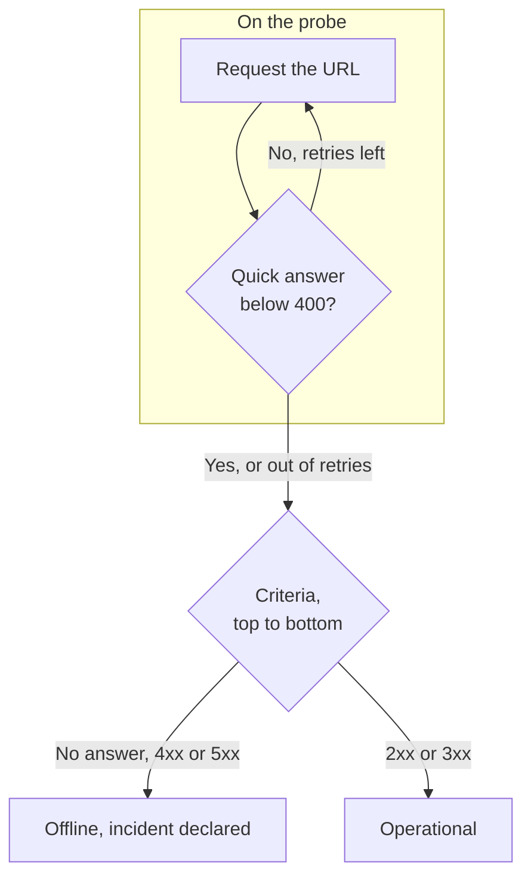

# Website Monitor

A Website monitor checks that a web page answers. On every check a probe requests the page's URL, and the monitor goes offline and declares an incident when the page does not answer or answers with an error. To call an endpoint with a method, headers or a body, use an [API monitor](/docs/monitor/api-monitor) instead.

:::cards
- [Create the monitor](#create-a-website-monitor): Six steps in the dashboard.
- [Configuration options](#configuration-options): URL placeholders, redirects, certificates, timeouts and retries.
- [Monitoring criteria](#monitoring-criteria): What counts as up or down, out of the box.
- [Troubleshooting](#troubleshooting): When the monitor and your browser disagree.
:::

## How it works

On each check, a probe requests the URL, follows any redirects, and records what came back: the status code, the response time, the headers and, when a criteria needs it, the body. A request that fails, times out, answers with a `4xx` or `5xx` status, or takes longer than 10 seconds is tried again, up to the number of retries you allow. OneUptime then runs the result through the monitor's criteria.



When none of the monitor's criteria reads the response body (a **Response Body** or **JavaScript Expression** filter), the probe sends a `HEAD` request instead of a `GET`, and repeats it as a `GET` if the server rejects `HEAD`. Your server's access logs can show either.

A probe that has lost its own network connection reports no result, so it cannot mark your site offline.

## Before you begin

- **A role that can create monitors**: Project Owner, Project Admin, Project Member, Monitor Admin or Monitor Member, or a custom role with the Create Monitor permission.
- **A probe that can reach the site.** Your project's default probes are picked for every new monitor. If a firewall sits in front of the site, allow [OneUptime Cloud's probe IP addresses](/docs/configuration/ip-addresses). A site on a private network needs a [custom probe](/docs/probe/custom-probe) inside that network, allowed to reach private addresses: see [Private Network Access](/docs/self-hosted/private-network-access).

## Create a website monitor

:::steps
### Start a new monitor

Go to **Monitors** and click **Create Monitor**. Under **Monitor Type**, pick **Website**.

### Name it

Enter a **Name**, such as `Marketing site`, then click **Next**.

### Enter the URL

In **Website URL**, enter the full address of the page, including `https://`, such as `https://example.com`. To change redirects, certificates, the timeout or retries, open **More fields** below it (see [Configuration options](#configuration-options)).

### Test it

Click **Test Monitor**, pick a probe under **Select Probe** and click **Run Test**. **Monitor Test Result** shows what the probe got back.

### Review the criteria

**Monitor Criteria** starts with the [default criteria](#default-criteria): offline when the site does not answer or answers with an error, online on any `2xx` or `3xx` status. Change them if you need to, then click **Next**.

### Pick probes and create

Keep or change the **Probes** and the **Monitoring Interval** (it starts at **Every 5 Minutes**), then click **Create Monitor**. The monitor's page opens.
:::

## Configuration options

### Website URL

The page to check, as a full URL with its scheme: `https://example.com`, `https://example.com/pricing` or `http://example.com:8080/health`. You can put a [monitor secret](/docs/monitor/monitor-secrets) in the URL as `{{monitorSecrets.NAME}}`, for example a token in the query string.

### Dynamic URL placeholders

When a CDN or a caching proxy sits in front of the site, a probe can be answered from the cache instead of your server. To get past the cache, add a placeholder to the URL; the probe replaces it with a new value on every check.

| Placeholder | Replaced with | Example value |
| --- | --- | --- |
| `{{timestamp}}` | The current Unix time, in seconds | `1719500000` |
| `{{random}}` | A random, unique string of 32 hexadecimal characters | `3f2b8c1d9e7a4b6c8d0e1f2a3b4c5d6e` |

A URL with a placeholder:

```text
https://example.com/health?cb={{timestamp}}
```

What the probe requests on two checks five minutes apart:

```text
https://example.com/health?cb=1719500000
https://example.com/health?cb=1719500300
```

Use `{{random}}` the same way: `https://example.com/health?nocache={{random}}`.

### More fields

These settings are folded under **More fields**, below the URL. The folded header lists them and shows which ones you changed.

| Field | Default | What it does |
| --- | --- | --- |
| **Do not follow redirects** | Off | Judge the first response instead of following redirects. See [below](#do-not-follow-redirects). |
| **Allow self-signed certificates** | Off | Skip TLS certificate validation for the monitor's own host name. |
| **Use client certificate (mTLS)** | Off | Present a client certificate and private key. See [Client certificate (mTLS)](#client-certificate-mtls). |
| **Request Timeout (seconds)** | `60` | How long to wait for each attempt. The maximum is 60 seconds. |
| **Retries on Failure** | Probe default, usually `3` | How many times to retry a failed attempt. The maximum is 3. See [Retries and timeouts](#retries-and-timeouts). |

#### Do Not Follow Redirects

By default, the probe follows redirects (`301`, `302`, `303`, `307` and `308`), up to 10 of them, and judges the page it ends on. Turn on **Do not follow redirects** to judge the redirect response itself instead, for example to check that `http://` redirects to `https://`. The [default criteria](#default-criteria) count a redirect response as online.

**Allow self-signed certificates** follows redirects that stay on the monitor's own host name. A redirect to another host name is verified as usual.

#### Client certificate (mTLS)

If the site requires mutual TLS, turn on **Use client certificate (mTLS)** and fill in:

| Field | What to enter |
| --- | --- |
| **Client Certificate (PEM)** | The PEM-encoded client certificate to present. |
| **Client Private Key (PEM)** | The matching PEM-encoded private key. |
| **Client Private Key Passphrase** | Optional. The passphrase, only if the private key is encrypted. |

This is the equivalent of curl's `--cert` and `--key` flags:

```bash
curl --cert client.crt --key client.key https://example.com/health
```

To keep the key out of the monitor's settings, store the certificate and key as [monitor secrets](/docs/monitor/monitor-secrets) and enter `{{monitorSecrets.NAME}}` in these fields. Secrets are filled in on the server, and their values never appear in the dashboard.

The client certificate is only presented while the request stays on the monitor URL's origin (the same scheme, host and port). After a redirect to another origin, the probe continues without it.

#### Retries and timeouts

**Retries on Failure** counts retries _after_ the first attempt, so `0` runs the check once and `2` runs it up to three times. Left blank, it uses the probe's default: 3, unless the probe's `PROBE_MONITOR_RETRY_LIMIT` says otherwise. The probe waits one second between attempts, and every attempt gets the full **Request Timeout (seconds)**.

These failures are retried: connection errors, timeouts, `4xx` and `5xx` responses, and responses slower than 10 seconds. These are not, because trying again cannot change them: an invalid or blocked URL, more than 10 redirects, and a response larger than 512 KiB.

## Monitoring Criteria

Criteria decide when the website counts as online, degraded or offline, and whether that declares an incident or creates an alert. Each criteria checks one or more filters:

| Filter | Conditions | What it checks |
| --- | --- | --- |
| **Is Online** | **True**, **False** | Whether the site answered at all, whatever the status code. |
| **Response Status Code** | **Equal To**, **Not Equal To**, **Greater Than**, **Less Than**, **Greater Than Or Equal To**, **Less Than Or Equal To** | The HTTP status code. |
| **Response Time (in ms)** | **Greater Than**, **Less Than**, **Greater Than Or Equal To**, **Less Than Or Equal To** | How long the request took, redirects included. |
| **Response Body** | **Contains**, **Not Contains** | Text in the response body. The match is case-sensitive. |
| **Response Header** | **Contains**, **Not Contains** | Whether the response has a header with this name. Enter the name in lowercase, such as `x-cache`. |
| **Response Header Value** | **Contains**, **Not Contains** | Whether a header has exactly this value, compared in lowercase, such as `no-store`. |
| **JavaScript Expression** | **Evaluates To True** | An expression over the response. See [JavaScript Expressions](/docs/monitor/javascript-expression). |
| **Is Request Timeout** | **True**, **False** | Whether the request timed out on every attempt. |

**Add Criteria** adds a criteria that is already named after its filter, for example _Response Time (in ms) is above 3000_. The name changes with the filters until you type a name of your own. A description is optional: to add one, open the criteria's **Settings**.

With two or more filters, **Match Condition** decides whether **All** of them or **Any** one must match. A criteria's **Actions** decide what it does: change the monitor status, create an alert, declare an incident, or any of these.

### Default Criteria

A new website monitor starts with two criteria, so it works without changing anything:

- **Offline** — the website does not answer, or answers with a status code of `400` or above (or below `200`). The monitor is marked **Offline** and an incident is created. The incident resolves itself when the website is back.
- **Online** — the website answers with any `2xx` or `3xx` status code, such as `200`, `204` or `301`. The monitor is marked **Operational**.

In the criteria list they are named after the monitor: _Check if (name) is offline_ and _Check if (name) is online_.

So a page that answers `204 No Content`, or a redirect you watch with **Do not follow redirects** turned on, counts as up. If only one status code means healthy for you, change both criteria on the monitor's **Configuration → Criteria** page: for example **Response Status Code** / **Equal To** / `200` in the online criteria and **Not Equal To** / `200` in the offline one, in place of the two status code filters each has.

Criteria are checked from top to bottom, and the first one that matches decides what happens.

When none of them matches, the monitor falls back to its default status: **Operational**, unless you pick another under **More fields**, below the criteria. The folded **More fields** header shows which status that is.

Monitors created before OneUptime changed these defaults keep the criteria they were created with, which count only `200` as online. Monitors created through the API or Terraform use the criteria you send.

### Evaluating over a period of time

**Evaluate this criteria over a period of time** is a checkbox under a filter, offered for **Is Online**, **Response Status Code** and **Response Time (in ms)**. Turn it on to judge a window of past checks instead of the latest one: pick an aggregate under **Evaluate** and a window, from 2 to 60 minutes, under **For the last (in minutes)**.

| Aggregate | Matches when |
| --- | --- |
| **Average**, **Sum**, **Maximum Value**, **Minimum Value** | That figure, over the window, meets the condition. Numeric filters only. |
| **All Values** | Every check in the window meets the condition. |
| **Any Value** | At least one check in the window meets the condition. |

**All Values** only matches once the window is genuinely covered by data. A monitor that has just been created, or one whose checks stopped being recorded, does not have enough history to say anything about the last N minutes, so the criteria waits rather than matching on the one reading it does have. **Any Value** is the setting for "tell me the moment a single check breaches" and still fires immediately.

**If No Data** decides what happens while the window cannot back the criteria:

| Option | What happens | Use it for |
| --- | --- | --- |
| **Ignore** (default) | The criteria does not match. | Ordinary threshold alerting. |
| **Trigger** | The missing data counts as the problem. | Checks where silence is itself a failure. |
| **Treat As Zero** | The window is compared as a single zero. | Counters where no events genuinely means zero. |

### Example criteria

| Goal | Filter | Condition | Value |
| --- | --- | --- | --- |
| Mark the site degraded when it is slow | **Response Time (in ms)** | **Greater Than** | `3000` |
| Catch an error page served with `200` | **Response Body** | **Not Contains** | `Welcome` |
| Check that a CDN header is present | **Response Header** | **Contains** | `x-cache` |
| Accept only `200` as healthy | **Response Status Code** | **Equal To** | `200` |

## Troubleshooting

:::details The monitor is offline, but the site loads in my browser
The probe got a different answer than your browser. The incident's root cause, and **Monitoring Logs** on the monitor, show what the probe saw. Common causes:

- A firewall or a bot filter blocks the probes. Allow [OneUptime Cloud's probe IP addresses](/docs/configuration/ip-addresses).
- The site is only reachable on your network. Use a [custom probe](/docs/probe/custom-probe) inside it.
- The certificate is self-signed or from a private authority. Turn on **Allow self-signed certificates**, or monitor the certificate on its own with an [SSL Certificate monitor](/docs/monitor/ssl-certificate-monitor).
:::

:::details The check fails with "Remote response exceeded the allowed size."
The probe reads at most 512 KiB of a response, and this page is larger. Point the monitor at a smaller page, such as a health endpoint, or remove the **Response Body** and **JavaScript Expression** filters so the probe only needs the headers.
:::

:::details The check fails with "Monitor target exceeded 10 redirects."
The URL redirects more than 10 times, usually in a loop. Open the URL with `curl -IL` to see the chain, and point the monitor at the page the chain should end on.
:::

:::details The check fails with a message about a private network address
The URL resolves to a private address, and the probe that ran the check is not allowed to reach private addresses. On a self-hosted probe, turn that on with `PROBE_ALLOW_PRIVATE_NETWORK_MONITORS`: see [Private Network Access](/docs/self-hosted/private-network-access).
:::

## Next steps

:::cards
- [API Monitor](/docs/monitor/api-monitor): Call an endpoint with a method, headers and a body.
- [SSL Certificate Monitor](/docs/monitor/ssl-certificate-monitor): Get warned before the site's certificate expires.
- [Monitor Secrets](/docs/monitor/monitor-secrets): Keep tokens and keys out of monitor settings.
- [Incidents](/docs/incidents/index): What happens after the monitor declares one.
:::
