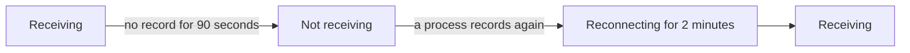

# When OneUptime Is Not Receiving Data

While OneUptime restarts, is upgraded or works through a backlog, nothing your agents, collectors, probes and heartbeat senders send can reach your monitors. OneUptime records when that happens and never holds that time against a server, a host or any other resource: the time was not monitored, so it is not downtime.

## How it works

Every OneUptime process that takes in data records every 30 seconds that it is receiving, as long as it can reach the databases it keeps data in. OneUptime leaves out three kinds of time:

- Not receiving: no process recorded for more than 90 seconds. OneUptime was stopped, restarting or being upgraded, or could not reach one of its databases.
- Reconnecting: the first 2 minutes after OneUptime receives again, while agents reconnect and send what they kept.
- Catching up: while the queue of data waiting to be processed is more than a minute behind, the time since the oldest data still in it.



A restart that takes less than 90 seconds is not a gap: collectors send again what they could not deliver.

## What changes during that time

| Where | What OneUptime does |
| --- | --- |
| Server / VM monitors | **Is Online** counts only the minutes OneUptime was receiving: by default, a server is offline after 3 minutes of silence that OneUptime could have heard. |
| Incoming Request and Incoming Email monitors | **Recieved In Minutes** and **Not Recieved In Minutes** count only the minutes OneUptime was receiving. When such a criteria is met, its reason says how many of the minutes were left out. |
| Host, Kubernetes, Docker, metrics, logs, traces and the other monitors that read telemetry | A check whose window holds time OneUptime was not receiving waits until that time has left the window, and never longer than 15 minutes after it ended. Until then nothing changes: no status change, and no incident or alert is opened or resolved. While the queue is behind, a check reads up to where the queue is instead of up to now. |
| Hosts, clusters and the rest of the inventory | A resource turns **Disconnected** only after its silence threshold, 15 minutes for most, has passed while OneUptime was receiving. |
| Probes and AI agents | Turn **Disconnected** after 3 minutes of silence while OneUptime was receiving. |
| **Availability** charts of hosts, Docker and Podman hosts and Kubernetes clusters | The time is shaded **Not monitored**, and the line breaks there instead of dropping to down. The uptime badge leaves that time out; an interval with data in it still counts as up. |
| Status page uptime and SLOs | Both are worked out from monitor statuses, so with no false status change there is no false downtime. |

> [!NOTE]
> Leaving time out is not filling it in. A resource is never shown as up for time OneUptime could not hear from it: that time is simply not judged. Once OneUptime receives again, a resource that really is down is judged on what it sends, or fails to send, from then on.

## Self-hosted installations

### Starting up

While a OneUptime process starts, it answers every request except its status checks with `503 Service Unavailable` and `Retry-After: 5`, and a browser gets a page that reloads itself. OpenTelemetry collectors and SDKs send such a request again instead of dropping the data. `/status/ready` fails until the process is ready, so Kubernetes sends it no traffic before then.

### Worker replicas

A process records that OneUptime is receiving only when ingress traffic can reach it. If you run replicas that only work through queues, with no ingress in front of them, set `RECEIVES_INGRESS_TRAFFIC` to `false` on them. Otherwise they keep recording while every replica that takes traffic is down, and that outage counts against your resources again. The Helm chart already sets it on its worker pods, and a single OneUptime container needs nothing.

```yaml title="Worker container"
env:
  - name: RECEIVES_INGRESS_TRAFFIC
    value: "false"
```

### What is recorded

OneUptime starts keeping this record when you upgrade to a version that has it, so time before that is judged as it always was. While no process records that it is receiving, the time since the last record is treated as a gap for at most an hour; after that, silence counts again, so a record that stopped being written cannot hide an outage of your resources for long. Records are kept for 400 days, and when OneUptime cannot read them, it judges silence as if it had been receiving throughout.

## Next steps

:::cards
- [Host Monitor](/docs/monitor/host-monitor): Alert on a host's metrics.
- [Server / VM Monitor](/docs/monitor/server-monitor): Know when a server's agent stops reporting.
- [Incoming Request Monitor](/docs/monitor/incoming-request-monitor): Turn a heartbeat into a dead-man's switch.
- [Upgrading OneUptime](/docs/installation/upgrading): Upgrade a self-hosted installation.
:::
