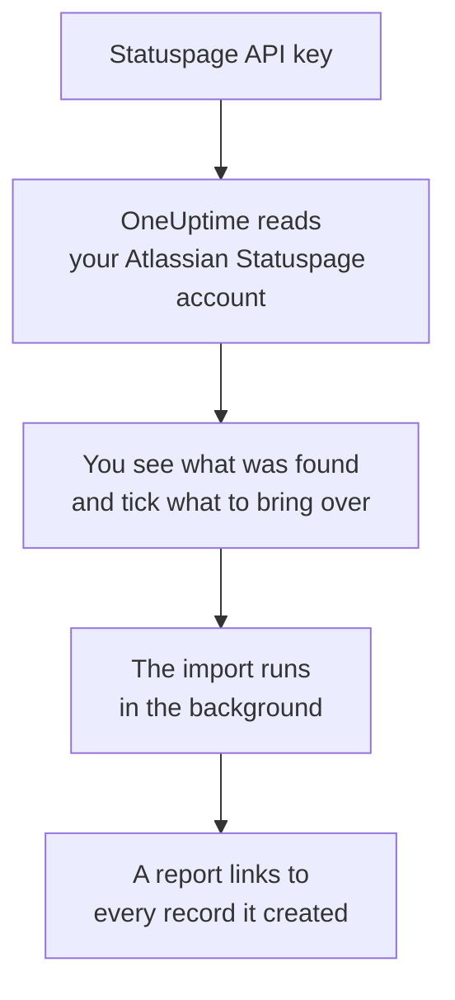

# Moving from Atlassian Statuspage

**Import from another tool** brings your Atlassian Statuspage pages into OneUptime in minutes. With a Statuspage API key, OneUptime reads your pages, their components and groups, and their email subscribers, shows you what it found, and creates what you tick. Nothing in Statuspage changes.

:::cards
- [Import your account](#import-your-atlassian-statuspage-account): Create a key, read your account and tick what to bring over.
- [What comes over](#what-comes-over): How each Statuspage page, component and subscriber becomes a OneUptime one.
- [Finish the switch](#finish-the-switch): What to do once the import is done.
:::

## How it works

- **The key is used once.** It is kept encrypted while OneUptime reads your account and deleted as soon as the read ends, whether it worked or not. It is never shown again or written to a log.
- **OneUptime only reads.** It calls Atlassian Statuspage's own API and nothing else: `api.statuspage.io`. It makes one request a second, the most Statuspage allows a key. When Atlassian Statuspage asks it to slow down, it waits and tries again.
- **Nothing is created until you start the import.** The preview shows, for every item, whether it is new, already in OneUptime (and used as it is), brought over by an earlier import, or why it cannot come over.
- **Running it again never creates anything twice.** OneUptime remembers what each import brought over, by its Atlassian Statuspage ID. Run it again after you add pages or components in Atlassian Statuspage, and only the new ones are created.

## Before you begin

- **A OneUptime project, and the right to create what you bring over.** Project Owners and Project Admins can bring everything over. Other roles can run an import too, and bring over the kinds of records they may create. Everything else is shown as not brought over, with the reason.
- **A Statuspage API key.** Only an account owner can create one. The import never writes to Statuspage, and it reads every page the key can see.
- **Room for your pages, on OneUptime Cloud.** Your plan has room for a set number of status pages and subscribers. What does not fit is shown as not brought over. The components come over as manual monitors, which are free.

## Import your Atlassian Statuspage account

:::steps
### Create an API key in Statuspage
In Statuspage, select your avatar at the bottom left, then **API info**. Select **Create key**, name it `OneUptime import`, and copy it.

### Open the import page
In OneUptime, go to **Project Settings** > **Import from another tool** and select **Atlassian Statuspage**.

### Connect Atlassian Statuspage
Paste the key into **Atlassian Statuspage API key** and select **Read my Atlassian Statuspage account**. A large account takes a few minutes, and you can leave the page while it reads.

### Tick what to bring over
The preview lists what was found, one section per kind. Everything that would be created starts ticked, except subscribers. Under each item, OneUptime says what will not come over exactly as it was. When a ticked status page shows a monitor you left unticked, it says so, and **Tick them too** ticks it. To bring subscribers over, tick them, then confirm under them that they agreed to get your updates and that you may move them. Nobody is emailed.

### Start the import
Select **Start import**. The import runs in the background: you can leave the page, and the report waits for you there.
:::

The report counts what was created and not brought over, and lists every item with a link to the record it became, failures first. Earlier imports are listed under **Earlier imports** on the same page.

## What comes over

| In Atlassian Statuspage | In OneUptime | How |
| --- | --- | --- |
| Components | Manual monitors | Each component becomes a manual monitor that the status page shows. Nothing checks it: you set its status in OneUptime, as you did in Statuspage. A component group becomes a group on the page. |
| Pages | Status pages | Each page comes over with its name and description, its components in their groups, and uptime and history for the components it showcases. A page only some people may see comes over private. |
| Email subscribers | Status page subscribers | Confirmed email subscribers come over once you confirm you may move them, following the same components. Nobody is emailed, and every update they get from OneUptime has a link to unsubscribe. |

Components come over operational. The preview names each one that is not operational in Statuspage right now, so you can set its status after the import.

## What does not come over

- **Incidents, scheduled maintenance and their history.** An incident in OneUptime is a live record that pages people, so past ones stay in Statuspage.
- **Subscribers by text message, webhook, Slack or Microsoft Teams.** The preview counts them. Only email subscribers come over.
- **Incident templates and system metrics.** Add what you still need in OneUptime.
- **A status page's own domain and branding.** Add the domain under **Custom Domains** and the logo under **Branding** in OneUptime.

## Limits

One import creates at most 2,000 records: at most 1,000 monitors and 50 status pages. Subscribers do not count toward that: one import brings over at most 5,000 subscribers. Anything over a limit is shown as not brought over. Run the import again to bring over the rest.

On OneUptime Cloud, status pages and subscribers your plan has no room for are shown as not brought over, with what they need.

A preview is kept for a day. Only the person who read the account can tick and start it. Project Owners and Project Admins see the progress and the report of every import.

## Finish the switch

:::steps
### Check your status pages
Under **Status Pages**, open each page and compare it with the one in Statuspage. Each component is a manual monitor: set its status in OneUptime when something changes.

### Point your status page's address at OneUptime
Under **Status Pages**, open the page, add your domain under **Custom Domains**, then change its DNS record. Your visitors and subscribers then reach the new page.

### Turn off your page in Atlassian Statuspage
Once your domain points at OneUptime, close the page in Statuspage so its subscribers are not told twice.
:::

## Troubleshooting

:::details Atlassian Statuspage did not accept the API key
Check that you copied the whole key, and that an account owner created it under **API info**. A key belongs to one Statuspage organization, and reads only its pages. Then select **Try again**.
:::

:::details The subscribers cannot be brought over
Tick the box under them that says they agreed to get your updates and that you may move them: **Start import** waits for it. Subscribers who never confirmed their subscription in Statuspage stay there.
:::

:::details Some items cannot be ticked
Each one says why: a name the project already has, something an earlier import brought over, or a record you do not have permission to create or your plan does not include.
:::

## Next steps

:::cards
- [Status Pages Overview](/docs/status-pages/index): What a status page shows, and who can see it.
- [Subscribers & Announcements](/docs/status-pages/subscribers): How subscribers hear about incidents.
- [Manual Monitor](/docs/monitor/manual-monitor): A monitor whose status you set yourself.
:::
