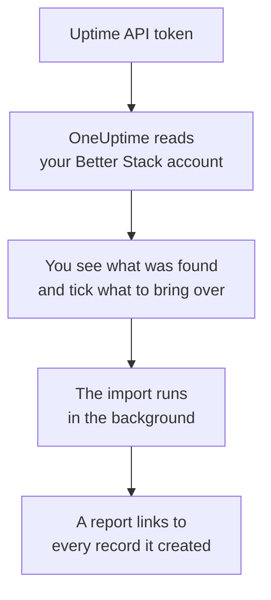

# Moving from Better Stack

**Import from another tool** brings your Better Stack Uptime monitors, heartbeats and status pages into OneUptime in minutes. With a Better Stack Uptime API token, OneUptime reads your monitors, heartbeats, status pages and their email subscribers, shows you what it found, and creates what you tick. Nothing in Better Stack changes.

:::cards
- [Import your account](#import-your-better-stack-account): Create a token, read your account and tick what to bring over.
- [What comes over](#what-comes-over): How each Better Stack monitor, heartbeat and status page becomes a OneUptime one.
- [Finish the switch](#finish-the-switch): What to do once the import is done.
:::

## How it works

- **The key is used once.** It is kept encrypted while OneUptime reads your account and deleted as soon as the read ends, whether it worked or not. It is never shown again or written to a log.
- **OneUptime only reads.** It calls Better Stack's own API and nothing else: `incidents.betterstack.com`. When Better Stack asks it to slow down, it waits and tries again.
- **Nothing is created until you start the import.** The preview shows, for every item, whether it is new, already in OneUptime (and used as it is), brought over by an earlier import, or why it cannot come over.
- **Running it again never creates anything twice.** OneUptime remembers what each import brought over, by its Better Stack ID. Run it again after you add monitors or heartbeats in Better Stack, and only the new ones are created.

## Before you begin

- **A OneUptime project, and the right to create what you bring over.** Project Owners and Project Admins can bring everything over. Other roles can run an import too, and bring over the kinds of records they may create. Everything else is shown as not brought over, with the reason.
- **A Better Stack Uptime API token.** Use a team-based Uptime token: it reads that team's monitors, heartbeats and status pages. The import never writes to Better Stack.
- **A payment method, on OneUptime Cloud.** Monitors that run checks are billed as they are used, even on the Free plan, so add one under **Project Settings** > **Billing** before you import. Without one, those monitors are shown as not brought over.

## Import your Better Stack account

:::steps
### Create an API token in Better Stack
In Better Stack, go to **API tokens** > **Team-based tokens** and select your team. Under **Uptime API tokens**, create a token named `OneUptime import` and copy it.

### Open the import page
In OneUptime, go to **Project Settings** > **Import from another tool** and select **Better Stack**.

### Connect Better Stack
Paste the token into **Better Stack API key** and select **Read my Better Stack account**. A large account takes a few minutes, and you can leave the page while it reads.

### Tick what to bring over
The preview lists what was found, one section per kind. Everything that would be created starts ticked, except paused monitors, which come over paused when you tick them, and subscribers. Under each item, OneUptime says what will not come over exactly as it was. When a ticked status page shows a monitor you left unticked, it says so, and **Tick them too** ticks it. To bring subscribers over, tick them, then confirm under them that they agreed to get your updates and that you may move them. Nobody is emailed.

### Start the import
Select **Start import**. The import runs in the background: you can leave the page, and the report waits for you there.
:::

The report counts what was created and not brought over, and lists every item with a link to the record it became, failures first. Earlier imports are listed under **Earlier imports** on the same page.

## What comes over

| In Better Stack | In OneUptime | How |
| --- | --- | --- |
| Monitors and heartbeats | Monitors | Each monitor becomes a monitor of the same kind, with the same address, interval and timeout. Each heartbeat becomes an incoming request monitor. |
| Status pages | Status pages | Each page comes over with its sections as groups and the monitors and heartbeats it shows. An item you track by hand becomes a manual monitor. A page with a password or an IP allowlist comes over private. |
| Email subscribers | Status page subscribers | Confirmed email subscribers come over once you confirm you may move them, following the same resources. Nobody is emailed, and every update they get from OneUptime has a link to unsubscribe. |

- **Status, expected status code, keyword and keyword absence monitors** become website monitors, or API monitors when they send another method, headers or a JSON body. A status monitor is up on any 2xx answer, and an expected status code monitor on the codes it lists.
- **Ping and TCP monitors** become ping and port monitors. **SMTP, POP and IMAP monitors** become port monitors on their port: OneUptime checks that the port answers, not the mail conversation.
- **DNS monitors** become DNS monitors of the name they query, asking the same server.
- **Heartbeats** become incoming request monitors, which go down when no request has come for the period and the grace. Each has a new address in OneUptime.
- **SSL expiry warnings.** A monitor that warns before its certificate expires also gets an SSL certificate monitor, named after it, that warns as many days ahead.

Every monitor is checked from your project's probes, as one you create yourself is. An interval OneUptime does not offer comes over as the closest one it does, and a timeout over a minute as one minute. The preview says when either changes.

## What does not come over

- **Uptime history, response times and incidents.** OneUptime starts checking when the import is done.
- **Alert contacts and integrations.** Choose who is told in OneUptime, as described in [Finish the switch](#finish-the-switch).
- **Passwords, and headers that may hold a secret.** A monitor that signs in, or sends an `Authorization`, cookie or token header, comes over without it: add it with a [monitor secret](/docs/monitor/monitor-secrets).
- **UDP and Playwright monitors.** OneUptime has no monitor that does the same, and the preview names each one.
- **Subscribers who never confirmed their subscription.** They stay in Better Stack.
- **What a status page shows besides monitors, heartbeats and items tracked by hand.** The preview names each one.
- **A status page's own domain and branding.** Add the domain under **Custom Domains** and the logo under **Branding** in OneUptime.

## Limits

One import creates at most 2,000 records: at most 1,000 monitors and 50 status pages. Subscribers do not count toward that: one import brings over at most 5,000 subscribers. Anything over a limit is shown as not brought over. Run the import again to bring over the rest.

On OneUptime Cloud, monitors that run checks need a payment method, and anything your plan has no room for is shown as not brought over, with what it needs.

A preview is kept for a day. Only the person who read the account can tick and start it. Project Owners and Project Admins see the progress and the report of every import.

## Finish the switch

:::steps
### Check your monitors
Open each one under **Monitors** and check its first results. A heartbeat monitor has a new address: point the job that pings it there.

### Choose who is told
Add owners to your monitors, or an on-call policy under **On-Call Duty** > **On-Call Policies** to the incidents they open, so the right people hear when something goes down.

### Point your status page's address at OneUptime
Under **Status Pages**, open the page, add your domain under **Custom Domains**, then change its DNS record. Your visitors and subscribers then reach the new page.

### Turn off the checks in Better Stack
Once OneUptime checks the same things, pause them in Better Stack so nobody is told twice.
:::

## Troubleshooting

:::details Better Stack did not accept the API key
Check that you copied the whole token, and that it is the team's token from **Uptime API tokens**, not a Telemetry one. Then select **Try again**.
:::

:::details A monitor is shown as not brought over
It says why: a kind of monitor OneUptime does not have, an address OneUptime cannot read, or a project with no room or no payment method for it. A monitor OneUptime already runs, with the same name, type and address, is used as it is.
:::

:::details Some items cannot be ticked
Each one says why: a name the project already has, something an earlier import brought over, or a record you do not have permission to create or your plan does not include.
:::

## Next steps

:::cards
- [Incoming Request Monitor](/docs/monitor/incoming-request-monitor): How a heartbeat works in OneUptime.
- [Status Pages Overview](/docs/status-pages/index): What a status page shows, and who can see it.
- [Moving from UptimeRobot](/docs/moving-to-oneuptime/uptimerobot): Bring your checks over from UptimeRobot.
:::
