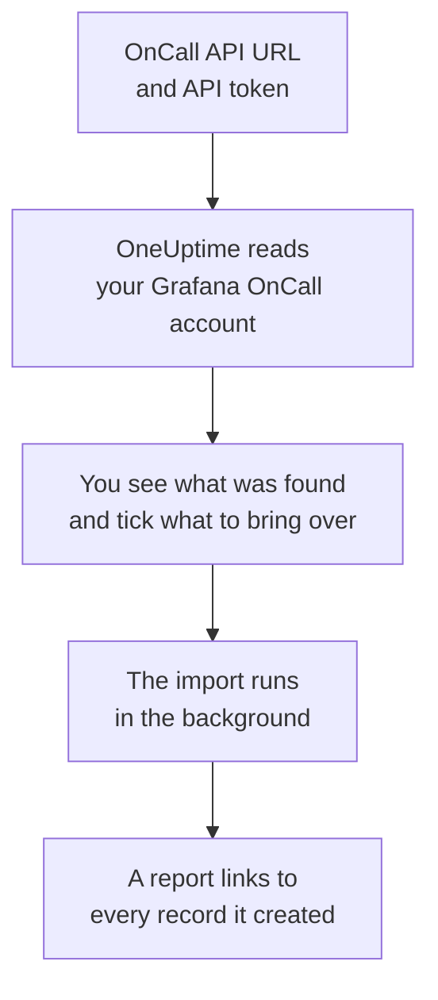

# Moving from Grafana OnCall

Grafana Labs archived the open-source Grafana OnCall in March 2026, and on Grafana Cloud it lives on as part of Grafana Cloud IRM. Wherever yours runs, **Import from another tool** brings your on-call setup into OneUptime in minutes. With your OnCall API URL and an API token, OneUptime reads your users, teams, schedules and escalation chains, shows you what it found, and creates what you tick. Nothing in Grafana OnCall changes.

:::cards
- [Import your account](#import-your-grafana-oncall-account): Create a token, read your account and tick what to bring over.
- [What comes over](#what-comes-over): How each Grafana OnCall record becomes a OneUptime one.
- [Finish the switch](#finish-the-switch): What to do once the import is done.
:::

## How it works

- **The token is used once.** It is kept encrypted, with the API URL, while OneUptime reads your account and deleted as soon as the read ends, whether it worked or not. It is never shown again or written to a log.
- **OneUptime only reads, and only from the address you give.** It calls the OnCall API URL you paste and nothing else, at most once a second, which keeps within Grafana OnCall's limit of 300 requests per token in five minutes. When Grafana OnCall asks it to slow down, it waits and tries again.
- **The address is checked before every request.** OneUptime never calls the machine it runs on or a cloud metadata service, and never follows a redirect. On OneUptime Cloud, the address must also be public and start with `https://`. A self-hosted OneUptime can read a Grafana OnCall on your own network too, unless its administrator turned that off, as described in [Private Network Access](/docs/self-hosted/private-network-access).
- **Nothing is created until you start the import.** The preview shows, for every item, whether it is new, already in OneUptime (and used as it is), brought over by an earlier import, or why it cannot come over.
- **Running it again never creates anything twice.** OneUptime remembers what each import brought over, by its Grafana OnCall ID. Run it again after you add people or schedules in Grafana OnCall, and only the new ones are created.

## Before you begin

- **A OneUptime project, and the right to create what you bring over.** Project Owners and Project Admins can bring everything over. Other roles can run an import too, and bring over the kinds of records they may create. Everything else is shown as not brought over, with the reason.
- **A Grafana OnCall API token.** Use an OnCall API token, not a Grafana service account token. The import never writes to Grafana OnCall. Delete the token once the import is done.
- **Your OnCall API URL.** OnCall's settings show it next to the API tokens. On Grafana Cloud it looks like `https://oncall-prod-us-central-0.grafana.net/oncall`. On your own install, it is the address of your OnCall engine.

## Import your Grafana OnCall account

:::steps
### Create an API token in Grafana OnCall
In Grafana, open **OnCall** > **Settings**. On Grafana Cloud, open **IRM** > **Settings** > **Admin & API**. Copy the OnCall API URL shown there. Under **API tokens**, create a token named `OneUptime import` and copy it.

### Open the import page
In OneUptime, go to **Project Settings** > **Import from another tool** and select **Grafana OnCall**.

### Connect Grafana OnCall
Paste the address into **Grafana OnCall API URL** and the token into **Grafana OnCall API key**, and select **Read my Grafana OnCall account**. A large account takes a few minutes, and you can leave the page while it reads.

### Tick what to bring over
The preview lists what was found, one section per kind. Everything that would be created starts ticked, except people who are on no team, schedule or escalation chain. Under each item, OneUptime says what will not come over exactly as it was. When a ticked item uses something you left unticked, it says so, and **Tick them too** ticks it.

### Start the import
If people will be invited, pick the team they join under **Invite new people to**. Then select **Start import**. The import runs in the background: you can leave the page, and the report waits for you there.
:::

The report counts what was created, invited and not brought over, and lists every item with a link to the record it became, failures first. Earlier imports are listed under **Earlier imports** on the same page.

## What comes over

| In Grafana OnCall | In OneUptime | How |
| --- | --- | --- |
| Users | Project members | Matched by email address. Anyone who is not in the project yet is invited to the team you pick. |
| Teams | Teams | Created with their members. A team whose name the project already has is used as it is, and its members are left alone. |
| Schedules | On-call schedules | Each rotation becomes a layer with the same people, start, hand-off and on-call hours, in the schedule's time zone, owned by the schedule's team. A rotation on a higher layer still takes over from the ones below it. |
| Escalation chains | On-call policies | The steps that notify people, a team or a schedule's on-call person become escalation rules, and a wait step becomes the wait before the next rule. A step that repeats the chain comes over as the policy's repeats. |

Rotations on the same layer that are on call at the same time, and a rotation that puts several people on call at once, become one OneUptime schedule each, because a OneUptime schedule has one person on call at a time. Every on-call policy that paged the schedule pages all of them.

## What does not come over

- **Alert groups and their history.** OneUptime starts with your setup, not your past alerts.
- **Integrations, routes and outgoing webhooks.** Point your monitors and alert sources at OneUptime instead, as described in [Finish the switch](#finish-the-switch).
- **Overrides, one-off shifts and rotations that have already ended.** Add the overrides you still need in OneUptime after the import.
- **Shifts from a calendar link.** A schedule whose shifts come from an iCal link comes over without layers, so add them in OneUptime.
- **Each person's notification rules.** People choose how they are paged in their own **User Settings** once they accept their invitation.
- **Steps OneUptime has no exact match for.** A step that notifies a Slack user group or channel, calls a webhook, declares an incident or resolves the alert is left out. A step that notifies people one at a time pages all of them at once, a step that goes on only at certain times or alert counts always goes on, and the preview says what changes.

## Limits

One import creates at most 2,000 records: at most 500 people, 200 teams, 200 on-call schedules and 200 on-call policies. Anything over a limit is shown as not brought over. Run the import again to bring over the rest.

On OneUptime Cloud, records your plan does not include are shown as not brought over, with the plan they need.

A preview is kept for a day. Only the person who read the account can tick and start it. Project Owners and Project Admins see the progress and the report of every import.

## Finish the switch

:::steps
### Check the on-call schedules
Open each schedule under **On-Call Duty** > **On-Call Schedules** and check who is on call now and who is next.

### Make sure everyone can be paged
People you invited accept their invitation, then add a phone number, an email address or the mobile app to be paged on. **On-Call Duty** > **Readiness** shows who cannot be reached yet.

### Send your alerts to OneUptime
Point your monitors and the tools that raise alerts at OneUptime, and page yourself once to test it.

### Turn off paging in Grafana OnCall
Once OneUptime pages the right people, switch off notifications in Grafana OnCall so nobody is paged twice.
:::

## Troubleshooting

:::details Grafana OnCall did not accept the API key
Check that you copied the whole token, that it is an OnCall API token and not a Grafana service account token, and that the API URL is the one shown next to it. Then select **Try again**.
:::

:::details OneUptime would not call the API URL
Paste the OnCall API URL exactly as OnCall's settings show it. On OneUptime Cloud, it must start with `https://` and be reachable from the internet. A self-hosted OneUptime can also reach an address on your own network, unless its administrator turned that off, but never one on the machine OneUptime runs on.
:::

:::details A kind of record is missing from the preview
The token could not read it, and the preview says so at the top. A token reads what the person who created it may see, so create one as a Grafana OnCall admin and read the account again.
:::

:::details Some items cannot be ticked
Each one says why: a name the project already has, something an earlier import brought over, or a record you do not have permission to create or your plan does not include.
:::

## Next steps

:::cards
- [On-Call Schedules](/docs/on-call/schedules): Layers, restrictions and hand-offs.
- [Escalation Rules](/docs/on-call/escalation-rules): How on-call policies page people.
- [Moving from PagerDuty](/docs/moving-to-oneuptime/pagerduty): Bring a team over from PagerDuty.
:::
