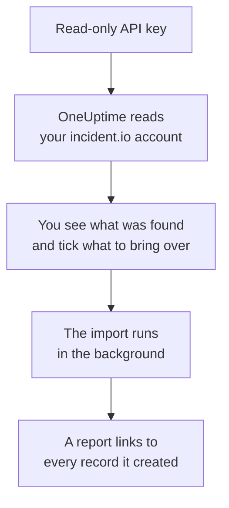

# Moving from incident.io

**Import from another tool** brings your incident.io setup into OneUptime in minutes. With a read-only incident.io API key, OneUptime reads your users, teams, schedules, escalation paths, services and incident settings, shows you what it found, and creates what you tick. Nothing in incident.io changes.

:::cards
- [Import your account](#import-your-incidentio-account): Create a key, read your account and tick what to bring over.
- [What comes over](#what-comes-over): How each incident.io record becomes a OneUptime one.
- [Finish the switch](#finish-the-switch): What to do once the import is done.
:::

## How it works

- **The key is used once.** It is kept encrypted while OneUptime reads your account and deleted as soon as the read ends, whether it worked or not. It is never shown again or written to a log.
- **OneUptime only reads.** It calls incident.io's own API, `api.incident.io`, and nothing else. When incident.io asks it to slow down, it waits and tries again.
- **Nothing is created until you start the import.** The preview shows, for every item, whether it is new, already in OneUptime (and used as it is), brought over by an earlier import, or why it cannot come over.
- **Running it again never creates anything twice.** OneUptime remembers what each import brought over, by its incident.io ID. Run it again after you add people or schedules in incident.io, and only the new ones are created.

## Before you begin

- **A OneUptime project, and the right to create what you bring over.** Project Owners and Project Admins can bring everything over. Other roles can run an import too, and bring over the kinds of records they may create. Everything else is shown as not brought over, with the reason.
- **An incident.io API key that can only view data.** The import never writes to incident.io, so the key needs no permission to create, edit or manage anything.

## Import your incident.io account

:::steps
### Create an API key in incident.io
In incident.io, go to **Settings** > **API keys** and select **Add new**. Name it `OneUptime import`, give it only permissions that view data, none that create, edit or manage, and copy the key.

### Open the import page
In OneUptime, go to **Project Settings** > **Import from another tool** and select **incident.io**.

### Connect incident.io
Paste the key into **incident.io API key** and select **Read my incident.io account**. A large account takes a few minutes, and you can leave the page while it reads.

### Tick what to bring over
The preview lists what was found, one section per kind. Everything that would be created starts ticked, except people who are on no team, schedule or escalation path. Under each item, OneUptime says what will not come over exactly as it was. When a ticked item uses something you left unticked, it says so, and **Tick them too** ticks it.

### Start the import
If people will be invited, pick the team they join under **Invite new people to**. Then select **Start import**. The import runs in the background: you can leave the page, and the report waits for you there.
:::

The report counts what was created, invited and not brought over, and lists every item with a link to the record it became, failures first. Earlier imports are listed under **Earlier imports** on the same page.

## What comes over

| In incident.io | In OneUptime | How |
| --- | --- | --- |
| Users | Project members | Matched by email address. Anyone who is not in the project yet is invited to the team you pick. Deactivated users are not brought over. |
| Teams | Teams | Created with their members. A team whose name the project already has is used as it is, and its members are left alone. |
| Schedules | On-call schedules | Each rotation becomes a layer with the same people, start, turn length and working hours, in the schedule's time zone. The version of a rotation in effect now is the one brought over. |
| Escalation paths | On-call policies | Each level becomes an escalation rule that pages the same schedules, users and teams, after the same wait. A repeat comes over as the policy's repeats, and a branch brings over its first path. |
| Catalog services | Services | The entries of your catalog types in the service category, created in the service catalog. Archived entries are left out. |
| Severities | Incident severities | Created in their incident.io order, most severe first. A severity whose name the project already has is used as it is. |
| Statuses | Incident states | A triage status matches the state OneUptime starts incidents in, and a closed status the state incidents are resolved in. Live and paused statuses are created between Acknowledged and Resolved. |
| Incident roles | Incident roles | The lead role matches OneUptime's Incident Commander, and the other roles are created. OneUptime records who declared each incident, so the reporter role is not needed. |
| Custom fields | Incident custom fields | Single-select fields become dropdowns, multi-select fields multi-select dropdowns, text and link fields text, and numeric fields numbers, with their options. |

A rotation with several people on call at the same time becomes one OneUptime schedule per person on call, because a OneUptime schedule has one person on call at a time. Every on-call policy that paged the schedule pages all of them.

## What does not come over

- **Incidents, alerts and their history.** OneUptime starts with your setup, not your past incidents.
- **Workflows, status pages, alert routes and integrations.** Point your monitors and alert sources at OneUptime instead, as described in [Finish the switch](#finish-the-switch).
- **Custom fields whose options come from the catalog,** and statuses OneUptime has no state for: declined, merged, canceled and learning.
- **Schedule overrides, and changes to a rotation scheduled for later.** The preview names each scheduled change, so you can make it in OneUptime when it is due.
- **Escalation steps OneUptime has no exact match for.** A step that posts to a Slack or Microsoft Teams channel is left out, because workspace notification rules do that in OneUptime, and so is a step that hands over to another escalation path. A step that pages whoever is on call next comes over as the closest thing OneUptime has, and the preview says what changes.

## Limits

One import creates at most 2,000 records: at most 500 people, 200 teams, 200 on-call schedules, 200 on-call policies, 500 services, 100 incident custom fields and 25 each of incident severities, states and roles. Anything over a limit is shown as not brought over. Run the import again to bring over the rest.

On OneUptime Cloud, records your plan does not include are shown as not brought over, with the plan they need.

A preview is kept for a day. Only the person who read the account can tick and start it. Project Owners and Project Admins see the progress and the report of every import.

## Finish the switch

:::steps
### Check the on-call schedules
Open each schedule under **On-Call Duty** > **On-Call Schedules** and check who is on call now and who is next.

### Make sure everyone can be paged
People you invited accept their invitation, then add a phone number, an email address or the mobile app to be paged on. **On-Call Duty** > **Readiness** shows who cannot be reached yet.

### Send your alerts to OneUptime
Point your monitors and the tools that raise alerts at OneUptime, and page yourself once to test it.

### Turn off paging in incident.io
Once OneUptime pages the right people, switch off notifications in incident.io so nobody is paged twice.
:::

## Troubleshooting

:::details incident.io did not accept the API key
Check that you copied the whole key and that it has not been deleted in **Settings** > **API keys**. Then select **Try again**.
:::

:::details A kind of record is missing from the preview
The key could not read it, and the preview says so at the top. Give the key the permission to view that kind of data and read the account again.
:::

:::details Some items cannot be ticked
Each one says why: a deactivated user, a name the project already has, something an earlier import brought over, or a record you do not have permission to create or your plan does not include.
:::

## Next steps

:::cards
- [On-Call Schedules](/docs/on-call/schedules): Layers, restrictions and hand-offs.
- [Incident States & Severities](/docs/incidents/states-and-severities): The states and severities incidents move through.
- [Moving from Opsgenie](/docs/moving-to-oneuptime/opsgenie): Bring a team over from Opsgenie.
:::
