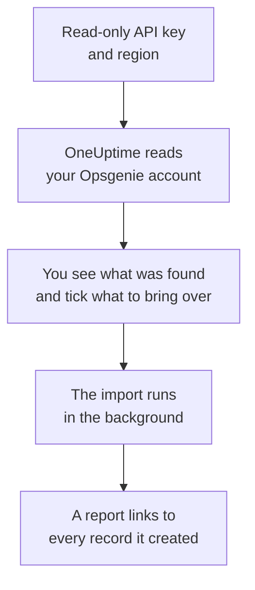

# Moving from Opsgenie

Atlassian is retiring Opsgenie: it stopped selling Opsgenie in June 2025 and ends support for it in April 2027. OneUptime is a home for your on-call team, and **Import from another tool** brings it over in minutes. With a read-only Opsgenie API key, OneUptime reads your users, teams, schedules, escalations and services, shows you what it found, and creates what you tick. Nothing in Opsgenie changes.

:::cards
- [Import your account](#import-your-opsgenie-account): Create a key, read your account and tick what to bring over.
- [What comes over](#what-comes-over): How each Opsgenie record becomes a OneUptime one.
- [Finish the switch](#finish-the-switch): What to do once the import is done.
:::

## How it works

- **The key is used once.** It is kept encrypted while OneUptime reads your account and deleted as soon as the read ends, whether it worked or not. It is never shown again or written to a log.
- **OneUptime only reads.** It calls Opsgenie's own API and nothing else: `api.opsgenie.com`, or `api.eu.opsgenie.com` for an account in Europe. When Opsgenie asks it to slow down, it waits and tries again.
- **Nothing is created until you start the import.** The preview shows, for every item, whether it is new, already in OneUptime (and used as it is), brought over by an earlier import, or why it cannot come over.
- **Running it again never creates anything twice.** OneUptime remembers what each import brought over, by its Opsgenie ID. Run it again after you add people or schedules in Opsgenie, and only the new ones are created.

## Before you begin

- **A OneUptime project, and the right to create what you bring over.** Project Owners and Project Admins can bring everything over. Other roles can run an import too, and bring over the kinds of records they may create. Everything else is shown as not brought over, with the reason.
- **An Opsgenie API key with Read and Configuration access.** Configuration access is what lets a key read users, teams, schedules and escalations. The import never writes to Opsgenie.
- **Your Opsgenie region.** If you sign in at `app.eu.opsgenie.com`, your account is in Europe. Otherwise it is in the United States.

## Import your Opsgenie account

:::steps
### Create an API key in Opsgenie
In Opsgenie, go to **Settings** > **API key management** and select **Add new API key**. Name it `OneUptime import`, give it **Read** and **Configuration access** only, and copy the key.

### Open the import page
In OneUptime, go to **Project Settings** > **Import from another tool** and select **Opsgenie**.

### Connect Opsgenie
Under **Where is your Opsgenie account?**, choose **United States** or **Europe**. Paste the key into **Opsgenie API key** and select **Read my Opsgenie account**. A large account takes a few minutes, and you can leave the page while it reads.

### Tick what to bring over
The preview lists what was found, one section per kind. Everything that would be created starts ticked, except schedules turned off in Opsgenie and people who are on no team, schedule or escalation. Under each item, OneUptime says what will not come over exactly as it was. When a ticked item uses something you left unticked, it says so, and **Tick them too** ticks it.

### Start the import
If people will be invited, pick the team they join under **Invite new people to**. Then select **Start import**. The import runs in the background: you can leave the page, and the report waits for you there.
:::

The report counts what was created, invited and not brought over, and lists every item with a link to the record it became, failures first. Earlier imports are listed under **Earlier imports** on the same page.

## What comes over

| In Opsgenie | In OneUptime | How |
| --- | --- | --- |
| Users | Project members | Matched by email address. Anyone who is not in the project yet is invited to the team you pick. Blocked users are not brought over. |
| Teams | Teams | Created with their members. A team whose name the project already has is used as it is, and its members are left alone. |
| Schedules | On-call schedules | Each rotation becomes a layer with the same people, start, turn length and time restriction, in the schedule's time zone, owned by the schedule's team. |
| Escalations | On-call policies | Each rule becomes an escalation rule that pages the same schedule, user or team. Rules with the same delay page together, and the wait before the next escalation rule is the difference between the delays. The escalation's repeats come over as the policy's repeats. |
| Services | Services | Created in the service catalog, owned by their team. |

A schedule whose rotations put two people on call at the same time becomes one OneUptime schedule per rotation, because a OneUptime schedule has one person on call at a time. Every on-call policy that paged the schedule pages all of them.

## What does not come over

- **Alerts, incidents and their history.** OneUptime starts with your setup, not your past alerts.
- **Integrations, heartbeats, alert policies and routing rules.** Point your monitors and alert sources at OneUptime instead, as described in [Finish the switch](#finish-the-switch).
- **Schedule overrides, and rotations that have already ended.** Add the overrides you still need in OneUptime after the import.
- **Each person's notification rules.** People choose how they are paged in their own **User Settings** once they accept their invitation.
- **Steps OneUptime has no exact match for.** A rule that pages whoever is on call next, or a team's admins, comes over as the closest thing OneUptime has, and the preview says what changes.

## Limits

One import creates at most 2,000 records: at most 500 people, 200 teams, 200 on-call schedules, 200 on-call policies and 500 services. Anything over a limit is shown as not brought over. Run the import again to bring over the rest.

On OneUptime Cloud, records your plan does not include are shown as not brought over, with the plan they need.

A preview is kept for a day. Only the person who read the account can tick and start it. Project Owners and Project Admins see the progress and the report of every import.

## Finish the switch

:::steps
### Check the on-call schedules
Open each schedule under **On-Call Duty** > **On-Call Schedules** and check who is on call now and who is next.

### Make sure everyone can be paged
People you invited accept their invitation, then add a phone number, an email address or the mobile app to be paged on. **On-Call Duty** > **Readiness** shows who cannot be reached yet.

### Send your alerts to OneUptime
Point your monitors and the tools that raise alerts at OneUptime, and page yourself once to test it.

### Turn off paging in Opsgenie
Once OneUptime pages the right people, switch off notifications in Opsgenie so nobody is paged twice.
:::

## Troubleshooting

:::details Opsgenie did not accept the API key
Check that you copied the whole key, that it is a key from **API key management** and not an integration's key, that it has **Read** and **Configuration access**, and that you picked the region your account is in. Then select **Try again**.
:::

:::details A kind of record is missing from the preview
The key could not read it, and the preview says so at the top. Give the key **Configuration access** and read the account again.
:::

:::details Some items cannot be ticked
Each one says why: a blocked user, a name the project already has, something an earlier import brought over, or a record you do not have permission to create or your plan does not include.
:::

## Next steps

:::cards
- [On-Call Schedules](/docs/on-call/schedules): Layers, restrictions and hand-offs.
- [Escalation Rules](/docs/on-call/escalation-rules): How on-call policies page people.
- [Moving from incident.io](/docs/moving-to-oneuptime/incident-io): Bring a team over from incident.io.
:::
