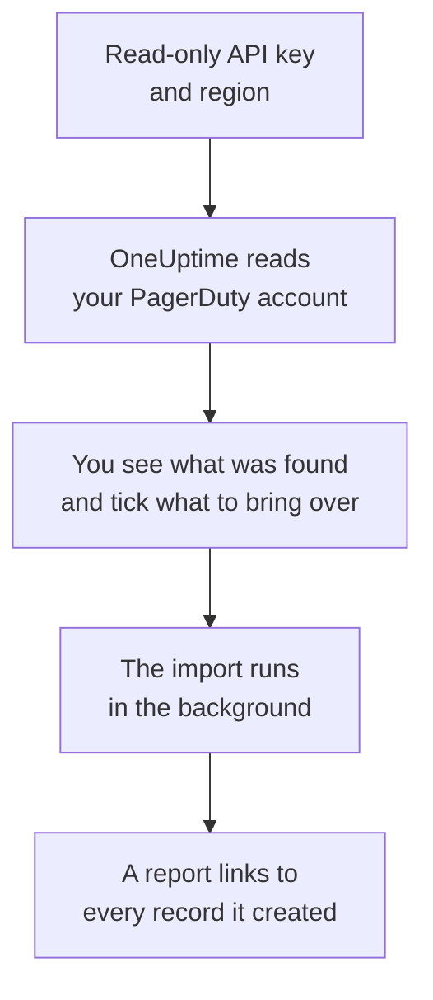

# Moving from PagerDuty

**Import from another tool** brings your PagerDuty setup into OneUptime in minutes. With a read-only PagerDuty API key, OneUptime reads your users, teams, schedules, escalation policies and services, shows you what it found, and creates what you tick. Nothing in PagerDuty changes.

:::cards
- [Import your account](#import-your-pagerduty-account): Create a key, read your account and tick what to bring over.
- [What comes over](#what-comes-over): How each PagerDuty record becomes a OneUptime one.
- [Finish the switch](#finish-the-switch): What to do once the import is done.
:::

## How it works

- **The key is used once.** It is kept encrypted while OneUptime reads your account and deleted as soon as the read ends, whether it worked or not. It is never shown again or written to a log.
- **OneUptime only reads.** It calls PagerDuty's own REST API and nothing else: `api.pagerduty.com`, or `api.eu.pagerduty.com` for an account in Europe. When PagerDuty asks it to slow down, it waits and tries again.
- **Nothing is created until you start the import.** The preview shows, for every item, whether it is new, already in OneUptime (and used as it is), brought over by an earlier import, or why it cannot come over.
- **Running it again never creates anything twice.** OneUptime remembers what each import brought over, by its PagerDuty ID. Run it again after you add people or schedules in PagerDuty, and only the new ones are created.

## Before you begin

- **A OneUptime project, and the right to create what you bring over.** Project Owners and Project Admins can bring everything over. Other roles can run an import too, and bring over the kinds of records they may create. Everything else is shown as not brought over, with the reason.
- **A read-only PagerDuty REST API key.** PagerDuty's admins and account owners can create one. The import never writes to PagerDuty, so the key needs no more than read access.
- **Your PagerDuty region.** If you sign in at an address ending in `eu.pagerduty.com`, your account is in Europe. Otherwise it is in the United States.

## Import your PagerDuty account

:::steps
### Create an API key in PagerDuty
In PagerDuty, go to **Integrations** > **Developer Tools** > **API Access Keys** and select **Create New API Key**. Describe it as `OneUptime import`, tick **Read-only API Key**, select **Create Key**, and copy the key.

### Open the import page
In OneUptime, go to **Project Settings** > **Import from another tool** and select **PagerDuty**.

### Connect PagerDuty
Under **Where is your PagerDuty account?**, choose **United States** or **Europe**. Paste the key into **PagerDuty API key** and select **Read my PagerDuty account**. A large account takes a few minutes, and you can leave the page while it reads.

### Tick what to bring over
The preview lists what was found, one section per kind. Everything that would be created starts ticked, except services turned off in PagerDuty and people who are on no team, schedule or escalation policy. Under each item, OneUptime says what will not come over exactly as it was. When a ticked item uses something you left unticked, it says so, and **Tick them too** ticks it.

### Start the import
If people will be invited, pick the team they join under **Invite new people to**. Then select **Start import**. The import runs in the background: you can leave the page, and the report waits for you there.
:::

The report counts what was created, invited and not brought over, and lists every item with a link to the record it became, failures first. Earlier imports are listed under **Earlier imports** on the same page.

## What comes over

| In PagerDuty | In OneUptime | How |
| --- | --- | --- |
| Users | Project members | Matched by email address. Anyone who is not in the project yet is invited to the team you pick. |
| Teams | Teams | Created with their members. A team whose name the project already has is used as it is, and its members are left alone. |
| Schedules | On-call schedules | Each layer becomes a layer with the same people, start, turn length and restrictions, in the schedule's time zone, owned by the schedule's team. The layers keep their order, so a higher layer still takes over from the ones below it. |
| Escalation policies | On-call policies | Each escalation rule becomes an escalation rule that pages the same schedules and users, and escalates after the same delay. The policy's repeats come over as the policy's repeats. |
| Services | Services | Created in the service catalog, owned by their team. A service turned off in PagerDuty starts unticked. |

A PagerDuty schedule stays one OneUptime schedule: its layers take over from one another the way PagerDuty's do. A layer whose turns are not whole hours comes over with turns rounded to the hour, and the preview says so.

## What does not come over

- **Incidents, alerts and their history.** OneUptime starts with your setup, not your past incidents.
- **Integrations, event orchestrations, incident workflows and status pages.** Point your monitors and alert sources at OneUptime instead, as described in [Finish the switch](#finish-the-switch).
- **Schedule overrides, and layers that have already ended.** Add the overrides you still need in OneUptime after the import.
- **Shift-based schedules.** The import reads PagerDuty's layered schedules, not its newer shift-based ones. When your account has shift-based schedules, the preview says so at the top, and an escalation rule that pages one comes over without it. Create them in OneUptime.
- **Each person's notification rules.** People choose how they are paged in their own **User Settings** once they accept their invitation.
- **Rules OneUptime has no exact match for.** An escalation rule that assigns its people round robin pages all of them at once in OneUptime, and the preview says what changes.

## Limits

One import creates at most 2,000 records: at most 500 people, 200 teams, 200 on-call schedules, 200 on-call policies and 500 services. Anything over a limit is shown as not brought over. Run the import again to bring over the rest.

On OneUptime Cloud, records your plan does not include are shown as not brought over, with the plan they need.

A preview is kept for a day. Only the person who read the account can tick and start it. Project Owners and Project Admins see the progress and the report of every import.

## Finish the switch

:::steps
### Check the on-call schedules
Open each schedule under **On-Call Duty** > **On-Call Schedules** and check who is on call now and who is next.

### Make sure everyone can be paged
People you invited accept their invitation, then add a phone number, an email address or the mobile app to be paged on. **On-Call Duty** > **Readiness** shows who cannot be reached yet.

### Send your alerts to OneUptime
Point your monitors and the tools that raise alerts at OneUptime, and page yourself once to test it.

### Turn off paging in PagerDuty
Once OneUptime pages the right people, switch off notifications in PagerDuty so nobody is paged twice.
:::

## Troubleshooting

:::details PagerDuty did not accept the API key
Check that you copied the whole key, that it is a REST API key from **API Access Keys** and not an integration key, and that you picked the region your account is in. Then select **Try again**.
:::

:::details A kind of record is missing from the preview
The key could not read it, and the preview says so at the top. Some kinds need a PagerDuty plan that has them: teams, for example. Read the account again with a key that can read them.
:::

:::details Some items cannot be ticked
Each one says why: a name the project already has, something an earlier import brought over, or a record you do not have permission to create or your plan does not include.
:::

## Next steps

:::cards
- [On-Call Schedules](/docs/on-call/schedules): Layers, restrictions and hand-offs.
- [Escalation Rules](/docs/on-call/escalation-rules): How on-call policies page people.
- [Moving from Opsgenie](/docs/moving-to-oneuptime/opsgenie): Bring a team over from Opsgenie.
:::
