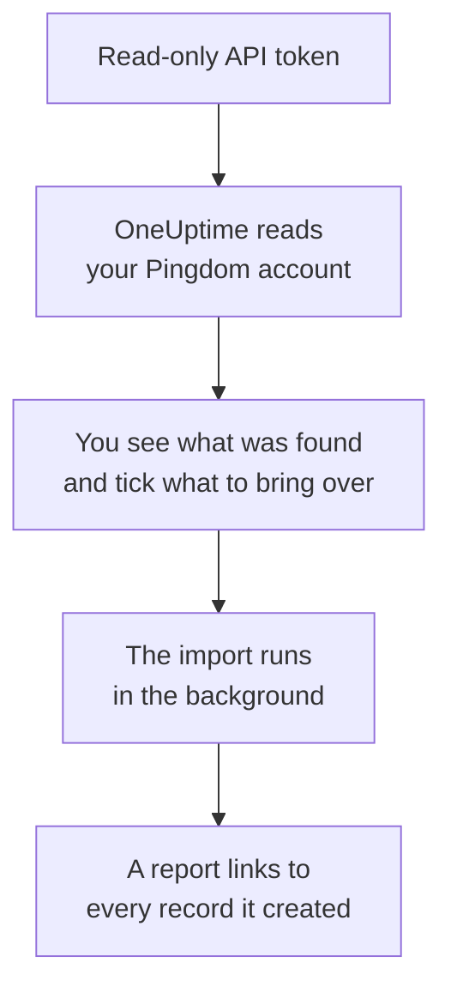

# Moving from Pingdom

**Import from another tool** brings your Pingdom uptime checks into OneUptime in minutes. With a read-only Pingdom API token, OneUptime reads your checks, shows you what it found, and creates what you tick. Nothing in Pingdom changes.

:::cards
- [Import your account](#import-your-pingdom-account): Create a token, read your account and tick what to bring over.
- [What comes over](#what-comes-over): How each Pingdom check becomes a OneUptime monitor.
- [Finish the switch](#finish-the-switch): What to do once the import is done.
:::

## How it works

- **The key is used once.** It is kept encrypted while OneUptime reads your account and deleted as soon as the read ends, whether it worked or not. It is never shown again or written to a log.
- **OneUptime only reads.** It calls Pingdom's own API and nothing else: `api.pingdom.com`. Pingdom counts every request against the token's allowance, so OneUptime reads a check's settings only when it has some, one request at a time. When Pingdom asks it to slow down, it waits and tries again.
- **Nothing is created until you start the import.** The preview shows, for every item, whether it is new, already in OneUptime (and used as it is), brought over by an earlier import, or why it cannot come over.
- **Running it again never creates anything twice.** OneUptime remembers what each import brought over, by its Pingdom ID. Run it again after you add checks in Pingdom, and only the new ones are created.

## Before you begin

- **A OneUptime project, and the right to create what you bring over.** Project Owners and Project Admins can bring everything over. Other roles can run an import too, and bring over the kinds of records they may create. Everything else is shown as not brought over, with the reason.
- **A Pingdom API token with Read access.** The import never writes to Pingdom.
- **A payment method, on OneUptime Cloud.** Monitors that run checks are billed as they are used, even on the Free plan, so add one under **Project Settings** > **Billing** before you import. Without one, those monitors are shown as not brought over.

## Import your Pingdom account

:::steps
### Create an API token in Pingdom
In My Pingdom, open **Settings** > **Pingdom API** and select **Add API token**. Name it `OneUptime import`, choose **Read access**, and copy the token.

### Open the import page
In OneUptime, go to **Project Settings** > **Import from another tool** and select **Pingdom**.

### Connect Pingdom
Paste the token into **Pingdom API key** and select **Read my Pingdom account**. A large account takes a few minutes, and you can leave the page while it reads.

### Tick what to bring over
The preview lists what was found, one section per kind. Everything that would be created starts ticked, except checks that are paused in Pingdom, which come over paused when you tick them. Under each item, OneUptime says what will not come over exactly as it was.

### Start the import
Select **Start import**. The import runs in the background: you can leave the page, and the report waits for you there.
:::

The report counts what was created and not brought over, and lists every item with a link to the record it became, failures first. Earlier imports are listed under **Earlier imports** on the same page.

## What comes over

| In Pingdom | In OneUptime | How |
| --- | --- | --- |
| Uptime checks | Monitors | Each check becomes a monitor of the same kind, with the same address, interval and the text a page should, or should not, contain. |

- **HTTP checks** become website monitors, or API monitors when they post data or send headers.
- **Ping and TCP checks** become ping and port monitors. **SMTP, POP3 and IMAP checks** become port monitors on their port: OneUptime checks that the port answers, not the mail conversation.
- **DNS checks** become DNS monitors, asking the same name server.
- **Certificate checks.** An HTTP check that treats an expiring certificate as down also gets an SSL certificate monitor, named after it, that warns as many days ahead.

Every monitor is checked from your project's probes, as one you create yourself is. An interval OneUptime does not offer comes over as the closest one it does, and a timeout over a minute as one minute. The preview says when either changes.

## What does not come over

- **Uptime history, response times and incidents.** OneUptime starts checking when the import is done.
- **Alert contacts and integrations.** Choose who is told in OneUptime, as described in [Finish the switch](#finish-the-switch).
- **Passwords, and headers that may hold a secret.** A monitor that signs in, or sends an `Authorization`, cookie or token header, comes over without it: add it with a [monitor secret](/docs/monitor/monitor-secrets).
- **UDP, custom HTTP and transaction checks.** OneUptime has no monitor that does the same, and the preview names each one. A [synthetic monitor](/docs/monitor/synthetic-monitor) can walk a page the way a transaction check does.
- **The address a DNS check expects.** Add it as criteria in OneUptime.
- **Maintenance windows.** The preview counts them: plan them as scheduled maintenance in OneUptime.

## Limits

One import creates at most 2,000 records, and at most 1,000 monitors. Anything over a limit is shown as not brought over. Run the import again to bring over the rest.

On OneUptime Cloud, monitors that run checks need a payment method, and anything your plan has no room for is shown as not brought over, with what it needs.

A preview is kept for a day. Only the person who read the account can tick and start it. Project Owners and Project Admins see the progress and the report of every import.

## Finish the switch

:::steps
### Check your monitors
Open each one under **Monitors** and check its first results. A heartbeat monitor has a new address: point the job that pings it there.

### Choose who is told
Add owners to your monitors, or an on-call policy under **On-Call Duty** > **On-Call Policies** to the incidents they open, so the right people hear when something goes down.

### Turn off the checks in Pingdom
Once OneUptime checks the same things, pause them in Pingdom so nobody is told twice.
:::

## Troubleshooting

:::details Pingdom did not accept the API key
Check that you copied the whole token, and that it is an API 3.1 token from **Pingdom API** with **Read access**. Then select **Try again**.
:::

:::details A monitor is shown as not brought over
It says why: a kind of monitor OneUptime does not have, an address OneUptime cannot read, or a project with no room or no payment method for it. A monitor OneUptime already runs, with the same name, type and address, is used as it is.
:::

:::details Some items cannot be ticked
Each one says why: a name the project already has, something an earlier import brought over, or a record you do not have permission to create or your plan does not include.
:::

## Next steps

:::cards
- [Website Monitor](/docs/monitor/website-monitor): What a website monitor checks, and how.
- [Port Monitor](/docs/monitor/port-monitor): What a port monitor checks, and how.
- [Moving from StatusCake](/docs/moving-to-oneuptime/statuscake): Bring your checks over from StatusCake.
:::
