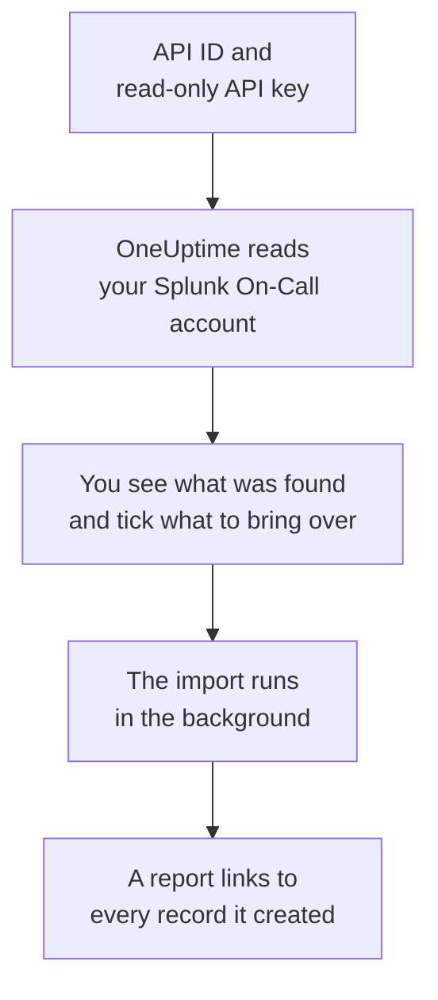

# Moving from Splunk On-Call

**Import from another tool** brings your Splunk On-Call (formerly VictorOps) setup into OneUptime in minutes. With your API ID and a read-only API key, OneUptime reads your users, teams, rotations and escalation policies, shows you what it found, and creates what you tick. Nothing in Splunk On-Call changes.

:::cards
- [Import your account](#import-your-splunk-on-call-account): Create a key, read your account and tick what to bring over.
- [What comes over](#what-comes-over): How each Splunk On-Call record becomes a OneUptime one.
- [Finish the switch](#finish-the-switch): What to do once the import is done.
:::

## How it works

- **The key is used once.** It is kept encrypted, with the API ID, while OneUptime reads your account and deleted as soon as the read ends, whether it worked or not. It is never shown again or written to a log.
- **OneUptime only reads.** It calls Splunk On-Call's own API, `api.victorops.com`, and nothing else. Splunk On-Call answers each kind of request at most twice a second, so OneUptime keeps to that pace, and when Splunk On-Call asks it to slow down, it waits and tries again.
- **Nothing is created until you start the import.** The preview shows, for every item, whether it is new, already in OneUptime (and used as it is), brought over by an earlier import, or why it cannot come over.
- **Running it again never creates anything twice.** OneUptime remembers what each import brought over, by its Splunk On-Call ID. Run it again after you add people or rotations in Splunk On-Call, and only the new ones are created.

## Before you begin

- **A OneUptime project, and the right to create what you bring over.** Project Owners and Project Admins can bring everything over. Other roles can run an import too, and bring over the kinds of records they may create. Everything else is shown as not brought over, with the reason.
- **Your Splunk On-Call API ID and a read-only API key.** Both are under **Integrations** > **API** in Splunk On-Call. The import never writes to Splunk On-Call, so a read-only key is enough.

## Import your Splunk On-Call account

:::steps
### Create an API key in Splunk On-Call
In Splunk On-Call, go to **Integrations** > **API**. Your API ID is shown above your API keys. Create a new API key named `OneUptime import`, tick **Read-only**, and copy the API ID and the key.

### Open the import page
In OneUptime, go to **Project Settings** > **Import from another tool** and select **Splunk On-Call**.

### Connect Splunk On-Call
Paste the API ID into **Splunk On-Call API ID** and the key into **Splunk On-Call API key**, and select **Read my Splunk On-Call account**. A large account takes a few minutes, and you can leave the page while it reads.

### Tick what to bring over
The preview lists what was found, one section per kind. Everything that would be created starts ticked, except people who are on no team, rotation or escalation policy. Under each item, OneUptime says what will not come over exactly as it was. When a ticked item uses something you left unticked, it says so, and **Tick them too** ticks it.

### Start the import
If people will be invited, pick the team they join under **Invite new people to**. Then select **Start import**. The import runs in the background: you can leave the page, and the report waits for you there.
:::

The report counts what was created, invited and not brought over, and lists every item with a link to the record it became, failures first. Earlier imports are listed under **Earlier imports** on the same page.

## What comes over

| In Splunk On-Call | In OneUptime | How |
| --- | --- | --- |
| Users | Project members | Matched by email address. Anyone who is not in the project yet is invited to the team you pick. |
| Teams | Teams | Created with their members. A team whose name the project already has is used as it is, and its members are left alone. |
| Rotations | On-call schedules | Each rotation becomes a schedule owned by its team, and each of its shifts a layer with the same people, start, hand-off and on-call days and hours. Whoever is on call in Splunk On-Call now is on call in OneUptime. |
| Escalation policies | On-call policies | Owned by the policy's team. Each step becomes an escalation rule that pages the same rotations and users. A step's timeout becomes the wait before it, and steps with no timeout between them page together. |

Shifts of one rotation that are on call at the same time become one OneUptime schedule each, because a OneUptime schedule has one person on call at a time. Every on-call policy that paged the rotation pages all of them. The schedule keeps the time zone of the rotation's first shift, and a shift kept in another time zone has its hours moved into it.

## What does not come over

- **Incidents, alerts and their history.** OneUptime starts with your setup, not your past incidents.
- **Integrations, routing keys and alert rules.** Point your monitors and alert sources at OneUptime instead, as described in [Finish the switch](#finish-the-switch).
- **Scheduled overrides.** Add the overrides you still need in OneUptime after the import.
- **Each person's paging policy.** People choose how they are paged in their own **User Settings** once they accept their invitation.
- **Steps OneUptime has no exact match for.** A step that calls a webhook or routes to another escalation policy is left out, and so is a step that emails an address that is none of the people being brought over. A step that pages whoever is on call next, or was on call before, pages whoever is on call now, and the preview says what changes.

## Limits

One import creates at most 2,000 records: at most 500 people, 200 teams, 200 on-call schedules and 200 on-call policies. Anything over a limit is shown as not brought over. Run the import again to bring over the rest.

On OneUptime Cloud, records your plan does not include are shown as not brought over, with the plan they need.

A preview is kept for a day. Only the person who read the account can tick and start it. Project Owners and Project Admins see the progress and the report of every import.

## Finish the switch

:::steps
### Check the on-call schedules
Open each schedule under **On-Call Duty** > **On-Call Schedules** and check who is on call now and who is next.

### Make sure everyone can be paged
People you invited accept their invitation, then add a phone number, an email address or the mobile app to be paged on. **On-Call Duty** > **Readiness** shows who cannot be reached yet.

### Send your alerts to OneUptime
Point your monitors and the tools that raise alerts at OneUptime, and page yourself once to test it.

### Turn off paging in Splunk On-Call
Once OneUptime pages the right people, switch off notifications in Splunk On-Call so nobody is paged twice.
:::

## Troubleshooting

:::details Splunk On-Call did not accept the API ID and API key
Check that you copied the API ID and the whole key from **Integrations** > **API**, and that the key has not been deleted there. Then select **Try again**.
:::

:::details A kind of record is missing from the preview
The key could not read it, and the preview says so at the top. Check the key under **Integrations** > **API** and read the account again.
:::

:::details Some items cannot be ticked
Each one says why: a name the project already has, something an earlier import brought over, or a record you do not have permission to create or your plan does not include.
:::

## Next steps

:::cards
- [On-Call Schedules](/docs/on-call/schedules): Layers, restrictions and hand-offs.
- [Escalation Rules](/docs/on-call/escalation-rules): How on-call policies page people.
- [Moving from PagerDuty](/docs/moving-to-oneuptime/pagerduty): Bring a team over from PagerDuty.
:::
