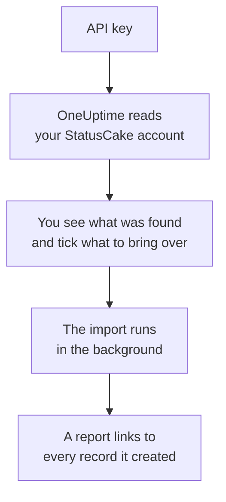

# Moving from StatusCake

**Import from another tool** brings your StatusCake checks into OneUptime in minutes. With a StatusCake API key, OneUptime reads your uptime, SSL and heartbeat checks, shows you what it found, and creates what you tick. Nothing in StatusCake changes.

:::cards
- [Import your account](#import-your-statuscake-account): Create a key, read your account and tick what to bring over.
- [What comes over](#what-comes-over): How each StatusCake check becomes a OneUptime monitor.
- [Finish the switch](#finish-the-switch): What to do once the import is done.
:::

## How it works

- **The key is used once.** It is kept encrypted while OneUptime reads your account and deleted as soon as the read ends, whether it worked or not. It is never shown again or written to a log.
- **OneUptime only reads.** It calls StatusCake's own API and nothing else: `api.statuscake.com`. It makes one request a second, which keeps within the 60 a minute StatusCake allows a Free account. When StatusCake asks it to slow down, it waits and tries again.
- **Nothing is created until you start the import.** The preview shows, for every item, whether it is new, already in OneUptime (and used as it is), brought over by an earlier import, or why it cannot come over.
- **Running it again never creates anything twice.** OneUptime remembers what each import brought over, by its StatusCake ID. Run it again after you add checks in StatusCake, and only the new ones are created.

## Before you begin

- **A OneUptime project, and the right to create what you bring over.** Project Owners and Project Admins can bring everything over. Other roles can run an import too, and bring over the kinds of records they may create. Everything else is shown as not brought over, with the reason.
- **A StatusCake API key.** The import never writes to StatusCake.
- **A payment method, on OneUptime Cloud.** Monitors that run checks are billed as they are used, even on the Free plan, so add one under **Project Settings** > **Billing** before you import. Without one, those monitors are shown as not brought over.

## Import your StatusCake account

:::steps
### Create an API key in StatusCake
In StatusCake, open your account panel and go to **API Keys**. Create a key named `OneUptime import` and copy it.

### Open the import page
In OneUptime, go to **Project Settings** > **Import from another tool** and select **StatusCake**.

### Connect StatusCake
Paste the key into **StatusCake API key** and select **Read my StatusCake account**. A large account takes a few minutes, and you can leave the page while it reads.

### Tick what to bring over
The preview lists what was found, one section per kind. Everything that would be created starts ticked, except checks that are paused in StatusCake, which come over paused when you tick them. Under each item, OneUptime says what will not come over exactly as it was.

### Start the import
Select **Start import**. The import runs in the background: you can leave the page, and the report waits for you there.
:::

The report counts what was created and not brought over, and lists every item with a link to the record it became, failures first. Earlier imports are listed under **Earlier imports** on the same page.

## What comes over

| In StatusCake | In OneUptime | How |
| --- | --- | --- |
| Uptime, SSL and heartbeat checks | Monitors | Each check becomes a monitor of the same kind, with the same address, interval, timeout and the text a page should, or should not, contain. |

- **HTTP and HEAD checks** become website monitors, or API monitors when they post data or send headers. StatusCake lists the status codes that raise an alert: every other code counts as up in OneUptime too.
- **Ping and TCP checks** become ping and port monitors. **SMTP and SSH checks** become port monitors on their port: OneUptime checks that the port answers, not the conversation on it.
- **DNS checks** become DNS monitors, asking the same server.
- **SSL checks** become SSL certificate monitors that warn as far ahead as the first alert. An uptime check with SSL alerts also gets one.
- **Heartbeat checks** become incoming request monitors, which go down when no request has come for the period. Each has a new address in OneUptime.

Every monitor is checked from your project's probes, as one you create yourself is. An interval OneUptime does not offer comes over as the closest one it does, and a timeout over a minute as one minute. The preview says when either changes.

## What does not come over

- **Uptime history, response times and incidents.** OneUptime starts checking when the import is done.
- **Alert contacts and integrations.** Choose who is told in OneUptime, as described in [Finish the switch](#finish-the-switch).
- **Passwords, and headers that may hold a secret.** A monitor that signs in, or sends an `Authorization`, cookie or token header, comes over without it: add it with a [monitor secret](/docs/monitor/monitor-secrets).
- **The addresses a DNS check expects.** Add them as criteria in OneUptime.
- **Page speed, domain and server checks.** OneUptime has its own [domain monitor](/docs/monitor/domain-monitor) and server monitoring to set up instead.
- **Maintenance windows.** The preview counts them: plan them as scheduled maintenance in OneUptime.

## Limits

One import creates at most 2,000 records, and at most 1,000 monitors. Anything over a limit is shown as not brought over. Run the import again to bring over the rest.

On OneUptime Cloud, monitors that run checks need a payment method, and anything your plan has no room for is shown as not brought over, with what it needs.

A preview is kept for a day. Only the person who read the account can tick and start it. Project Owners and Project Admins see the progress and the report of every import.

## Finish the switch

:::steps
### Check your monitors
Open each one under **Monitors** and check its first results. A heartbeat monitor has a new address: point the job that pings it there.

### Choose who is told
Add owners to your monitors, or an on-call policy under **On-Call Duty** > **On-Call Policies** to the incidents they open, so the right people hear when something goes down.

### Turn off the checks in StatusCake
Once OneUptime checks the same things, pause them in StatusCake so nobody is told twice.
:::

## Troubleshooting

:::details StatusCake did not accept the API key
Check that you copied the whole key from **API Keys**, and that it has not been deleted. Then select **Try again**.
:::

:::details A monitor is shown as not brought over
It says why: a kind of monitor OneUptime does not have, an address OneUptime cannot read, or a project with no room or no payment method for it. A monitor OneUptime already runs, with the same name, type and address, is used as it is.
:::

:::details Some items cannot be ticked
Each one says why: a name the project already has, something an earlier import brought over, or a record you do not have permission to create or your plan does not include.
:::

## Next steps

:::cards
- [Website Monitor](/docs/monitor/website-monitor): What a website monitor checks, and how.
- [SSL Certificate Monitor](/docs/monitor/ssl-certificate-monitor): How OneUptime warns before a certificate expires.
- [Moving from Uptime Kuma](/docs/moving-to-oneuptime/uptime-kuma): Bring your checks over from Uptime Kuma.
:::
