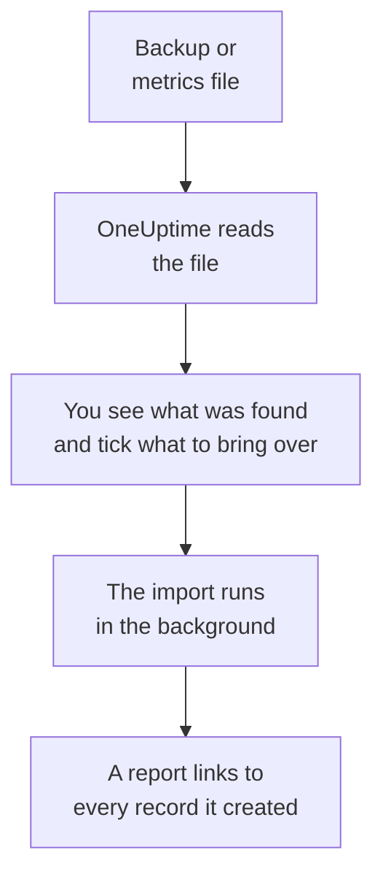

# Moving from Uptime Kuma

Uptime Kuma runs on your own machines, so **Import from another tool** reads it from a file instead of a key: the backup Uptime Kuma 1 exports, or the metrics page every version serves. OneUptime reads your monitors from it, shows you what it found, and creates what you tick. Nothing in Uptime Kuma changes.

:::cards
- [Import your monitors](#import-your-uptime-kuma-monitors): Save the file, read it and tick what to bring over.
- [What comes over](#what-comes-over): How each Uptime Kuma monitor becomes a OneUptime one.
- [Finish the switch](#finish-the-switch): What to do once the import is done.
:::

## How it works

- **The file is read once.** OneUptime reads it as it uploads, to find your monitors, and never stores it. Passwords, tokens and push keys in it are never copied.
- **OneUptime never connects to Uptime Kuma.** Everything comes from the file. A file that is not an Uptime Kuma backup or metrics page is refused with the reason.
- **Nothing is created until you start the import.** The preview shows, for every item, whether it is new, already in OneUptime (and used as it is), brought over by an earlier import, or why it cannot come over.
- **Running it again never creates anything twice.** OneUptime remembers what each import brought over, by its Uptime Kuma ID. Read a newer file after you add monitors, and only the new ones are created.

## Before you begin

- **A OneUptime project, and the right to create what you bring over.** Project Owners and Project Admins can bring everything over. Other roles can run an import too, and bring over the kinds of records they may create. Everything else is shown as not brought over, with the reason.
- **A file from Uptime Kuma.** On Uptime Kuma 1, its JSON backup holds every monitor with its settings. Uptime Kuma 2 has no backup, so save its metrics page instead: it lists each monitor's name, type and address, but not how often it is checked or what it looks for.
- **A payment method, on OneUptime Cloud.** Monitors that run checks are billed as they are used, even on the Free plan, so add one under **Project Settings** > **Billing** before you import. Without one, those monitors are shown as not brought over.

## Import your Uptime Kuma monitors

:::steps
### Save the file in Uptime Kuma
On Uptime Kuma 1, go to **Settings** > **Backup** and select **Export**. On Uptime Kuma 2, add a key under **Settings** > **API Keys**, open `/metrics` on your Uptime Kuma, sign in with no user name and the key as the password, and save the page as a text file.

### Open the import page
In OneUptime, go to **Project Settings** > **Import from another tool** and select **Uptime Kuma**.

### Read the file
Under **Uptime Kuma backup or metrics file**, select **Choose file**, pick the file you saved, and select **Read the file**. OneUptime reads it at once and shows what it found.

### Tick what to bring over
The preview lists what was found, one section per kind. Everything that would be created starts ticked, except monitors that are paused in Uptime Kuma, which come over paused when you tick them. Under each item, OneUptime says what will not come over exactly as it was.

### Start the import
Select **Start import**. The import runs in the background: you can leave the page, and the report waits for you there.
:::

The report counts what was created and not brought over, and lists every item with a link to the record it became, failures first. Earlier imports are listed under **Earlier imports** on the same page.

## What comes over

| In Uptime Kuma | In OneUptime | How |
| --- | --- | --- |
| Monitors | Monitors | From a backup, each monitor becomes a monitor of the same kind, with the same address, interval, timeout and status codes that count as up. From the metrics page, each one comes over checked every five minutes: check each one after the import. |

- **HTTP(S) and keyword monitors** become website monitors, or API monitors when they send another method, headers or a JSON body, with the keyword where it should be.
- **JSON query monitors** become API monitors, without the query: add it as criteria in OneUptime.
- **Ping, port and DNS monitors** become ping, port and DNS monitors.
- **Push monitors** become incoming request monitors, which go down when no request has come for the interval and its retries. Each has a new address in OneUptime.
- **Manual monitors** stay manual monitors. **Groups** are folders, so their monitors come over on their own.
- **Certificate expiry.** A monitor that warns before its certificate expires also gets an SSL certificate monitor, named after it.

Every monitor is checked from your project's probes, as one you create yourself is. An interval OneUptime does not offer comes over as the closest one it does, and a timeout over a minute as one minute. The preview says when either changes.

## What does not come over

- **Uptime history, response times and incidents.** OneUptime starts checking when the import is done.
- **Notifications.** Choose who is told in OneUptime, as described in [Finish the switch](#finish-the-switch).
- **Passwords, and headers that may hold a secret.** A monitor that signs in, or sends an `Authorization`, cookie or token header, comes over without it: add it with a [monitor secret](/docs/monitor/monitor-secrets).
- **Upside down monitors**, which count as up when their check fails. OneUptime has no monitor that does that.
- **Docker, database, game server, MQTT and other monitors OneUptime has no match for.** The preview names each one.
- **Status pages and maintenance.** Create the status pages you need in OneUptime, and show the imported monitors on them.

## Limits

One import creates at most 2,000 records, and at most 1,000 monitors. A file can be at most 10 MB. Anything over a limit is shown as not brought over. Run the import again to bring over the rest.

On OneUptime Cloud, monitors that run checks need a payment method, and anything your plan has no room for is shown as not brought over, with what it needs.

A preview is kept for a day. Only the person who read the file can tick and start it. Project Owners and Project Admins see the progress and the report of every import.

## Finish the switch

:::steps
### Check your monitors
Open each one under **Monitors** and check its first results. A heartbeat monitor has a new address: point the job that pings it there.

### Choose who is told
Add owners to your monitors, or an on-call policy under **On-Call Duty** > **On-Call Policies** to the incidents they open, so the right people hear when something goes down.

### Turn off the checks in Uptime Kuma
Once OneUptime checks the same things, pause them in Uptime Kuma so nobody is told twice.
:::

## Troubleshooting

:::details The file was refused
OneUptime says why: a file over 10 MB, one that is not valid JSON, or one that is neither an Uptime Kuma backup nor its metrics page. Export the backup again, or save `/metrics` again as plain text, and choose it again.
:::

:::details A monitor is shown as not brought over
It says why: a kind of monitor OneUptime does not have, an address OneUptime cannot read, or a project with no room or no payment method for it. A monitor OneUptime already runs, with the same name, type and address, is used as it is.
:::

:::details Some items cannot be ticked
Each one says why: a name the project already has, something an earlier import brought over, or a record you do not have permission to create or your plan does not include.
:::

## Next steps

:::cards
- [Website Monitor](/docs/monitor/website-monitor): What a website monitor checks, and how.
- [Incoming Request Monitor](/docs/monitor/incoming-request-monitor): How a heartbeat works in OneUptime.
- [Moving from UptimeRobot](/docs/moving-to-oneuptime/uptimerobot): Bring your checks over from UptimeRobot.
:::
