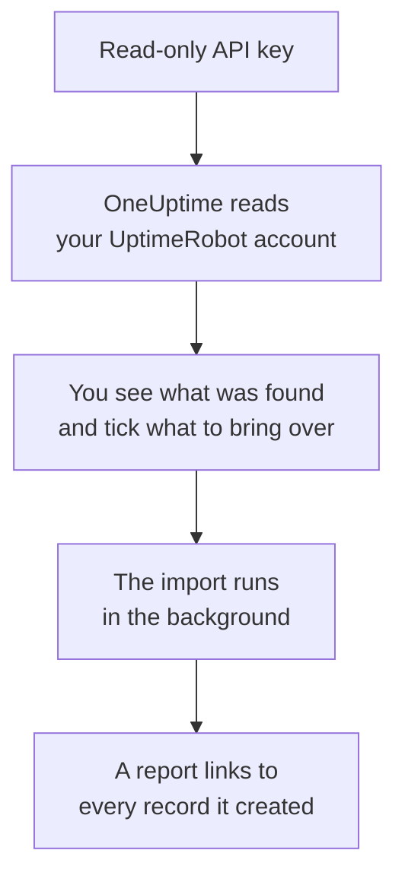

# Moving from UptimeRobot

**Import from another tool** brings your UptimeRobot monitors and status pages into OneUptime in minutes. With a read-only UptimeRobot API key, OneUptime reads your monitors and public status pages, shows you what it found, and creates what you tick. Nothing in UptimeRobot changes.

:::cards
- [Import your account](#import-your-uptimerobot-account): Create a key, read your account and tick what to bring over.
- [What comes over](#what-comes-over): How each UptimeRobot monitor and status page becomes a OneUptime one.
- [Finish the switch](#finish-the-switch): What to do once the import is done.
:::

## How it works

- **The key is used once.** It is kept encrypted while OneUptime reads your account and deleted as soon as the read ends, whether it worked or not. It is never shown again or written to a log.
- **OneUptime only reads.** It calls UptimeRobot's own API and nothing else: `api.uptimerobot.com`. It makes one request every six seconds, which keeps within the ten a minute UptimeRobot allows a Free account, so a large account takes a few minutes. When UptimeRobot asks it to slow down, it waits and tries again.
- **Nothing is created until you start the import.** The preview shows, for every item, whether it is new, already in OneUptime (and used as it is), brought over by an earlier import, or why it cannot come over.
- **Running it again never creates anything twice.** OneUptime remembers what each import brought over, by its UptimeRobot ID. Run it again after you add monitors in UptimeRobot, and only the new ones are created.

## Before you begin

- **A OneUptime project, and the right to create what you bring over.** Project Owners and Project Admins can bring everything over. Other roles can run an import too, and bring over the kinds of records they may create. Everything else is shown as not brought over, with the reason.
- **An UptimeRobot API key.** The Read-only API key is enough: the import never writes to UptimeRobot. The Main API key works too, but a monitor-specific key reads only one monitor.
- **A payment method, on OneUptime Cloud.** Monitors that run checks are billed as they are used, even on the Free plan, so add one under **Project Settings** > **Billing** before you import. Without one, those monitors are shown as not brought over.

## Import your UptimeRobot account

:::steps
### Create an API key in UptimeRobot
In UptimeRobot, go to **Integrations & API** > **API**. Create a **Read-only API key**, or copy the one you have.

### Open the import page
In OneUptime, go to **Project Settings** > **Import from another tool** and select **UptimeRobot**.

### Connect UptimeRobot
Paste the key into **UptimeRobot API key** and select **Read my UptimeRobot account**. A large account takes a few minutes, and you can leave the page while it reads.

### Tick what to bring over
The preview lists what was found, one section per kind. Everything that would be created starts ticked, except monitors that are paused in UptimeRobot, which come over paused when you tick them. Under each item, OneUptime says what will not come over exactly as it was. When a ticked status page shows a monitor you left unticked, it says so, and **Tick them too** ticks it.

### Start the import
Select **Start import**. The import runs in the background: you can leave the page, and the report waits for you there.
:::

The report counts what was created and not brought over, and lists every item with a link to the record it became, failures first. Earlier imports are listed under **Earlier imports** on the same page.

## What comes over

| In UptimeRobot | In OneUptime | How |
| --- | --- | --- |
| Monitors | Monitors | Each monitor becomes a monitor of the same kind, with the same address, interval and timeout, and the same status codes that count as up. |
| Public status pages | Status pages | Each page shows the same monitors: the ones it names, the ones with its tags, or all of them, with uptime and history bars as it showed them. A page with a password comes over private. |

- **HTTP(S) and keyword monitors** become website monitors, or API monitors when they send another method, headers or a JSON body. A keyword monitor goes down when its keyword appears or is missing, as it did in UptimeRobot, and matches it exactly, capital letters included.
- **Ping and port monitors** become ping and port monitors.
- **Heartbeat monitors** become incoming request monitors, which go down when no request has come for the interval and the grace period. Each has a new address in OneUptime.
- **DNS and API monitors** become DNS and API monitors.
- **SSL expiry reminders.** A monitor that warns before its certificate expires also gets an SSL certificate monitor, named after it, that warns as many days ahead.

Every monitor is checked from your project's probes, as one you create yourself is. An interval OneUptime does not offer comes over as the closest one it does, and a timeout over a minute as one minute. The preview says when either changes.

## What does not come over

- **Uptime history, response times and incidents.** OneUptime starts checking when the import is done.
- **Alert contacts and integrations.** Choose who is told in OneUptime, as described in [Finish the switch](#finish-the-switch).
- **Passwords, and headers that may hold a secret.** A monitor that signs in, or sends an `Authorization`, cookie or token header, comes over without it: add it with a [monitor secret](/docs/monitor/monitor-secrets).
- **UDP, visual comparison and dependency monitors.** OneUptime has no monitor that does the same, and the preview names each one.
- **Port monitors that alert while the port is open.** They work the other way round from OneUptime's port monitors.
- **The answers a DNS monitor expects and the assertions of an API monitor.** Add them as criteria in OneUptime.
- **Maintenance windows.** The preview counts them: plan them as scheduled maintenance in OneUptime.
- **A status page's own domain and branding.** Add the domain under **Custom Domains** and the logo under **Branding** in OneUptime.

## Limits

One import creates at most 2,000 records: at most 1,000 monitors and 50 status pages. Anything over a limit is shown as not brought over. Run the import again to bring over the rest.

On OneUptime Cloud, monitors that run checks need a payment method, and anything your plan has no room for is shown as not brought over, with what it needs.

A preview is kept for a day. Only the person who read the account can tick and start it. Project Owners and Project Admins see the progress and the report of every import.

## Finish the switch

:::steps
### Check your monitors
Open each one under **Monitors** and check its first results. A heartbeat monitor has a new address: point the job that pings it there.

### Choose who is told
Add owners to your monitors, or an on-call policy under **On-Call Duty** > **On-Call Policies** to the incidents they open, so the right people hear when something goes down.

### Point your status page's address at OneUptime
Under **Status Pages**, open the page, add your domain under **Custom Domains**, then change its DNS record. Your visitors and subscribers then reach the new page.

### Turn off the checks in UptimeRobot
Once OneUptime checks the same things, pause them in UptimeRobot so nobody is told twice.
:::

## Troubleshooting

:::details UptimeRobot did not accept the API key
Check that you copied the whole key, and that it is the account's Read-only or Main API key from **Integrations & API**, not a monitor-specific one. Then select **Try again**.
:::

:::details A monitor is shown as not brought over
It says why: a kind of monitor OneUptime does not have, an address OneUptime cannot read, or a project with no room or no payment method for it. A monitor OneUptime already runs, with the same name, type and address, is used as it is.
:::

:::details Some items cannot be ticked
Each one says why: a name the project already has, something an earlier import brought over, or a record you do not have permission to create or your plan does not include.
:::

## Next steps

:::cards
- [Website Monitor](/docs/monitor/website-monitor): What a website monitor checks, and how.
- [Incoming Request Monitor](/docs/monitor/incoming-request-monitor): How a heartbeat works in OneUptime.
- [Moving from Pingdom](/docs/moving-to-oneuptime/pingdom): Bring your checks over from Pingdom.
:::
