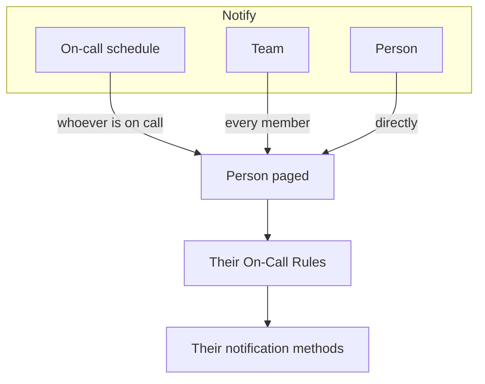

# Escalation Rules

An on-call policy pages people in levels. Each escalation rule is one level: who gets paged, and how long to wait for somebody to acknowledge before the next level is paged. A policy's rules are listed, in order, on its **Escalation Rules** page.

```mermaid title="An on-call policy pages level by level until someone acknowledges"
flowchart TB
    trigger["Incident or alert"] --> level1["Level 1 pages"]
    level1 --> ack1{"Acknowledged<br/>in time?"}
    ack1 -->|Yes| stop["Paging stops"]
    ack1 -->|No| level2["Level 2 pages"]
    level2 --> ack2{"Acknowledged<br/>in time?"}
    ack2 -->|Yes| stop
    ack2 -->|"No, last level"| repeat{"Repeat the policy?"}
    repeat -->|Yes| level1
    repeat -->|No| done["Policy stops"]
```

:::cards
- [Who gets paged first](#who-gets-paged-first): Create a policy with its first level.
- [Adding an escalation rule](#adding-an-escalation-rule): Add the next level, step by step.
- [How the levels page people](#how-the-levels-page-people): Timing, repeats, and how each person is reached.
- [API and Terraform](#creating-rules-with-the-api-or-terraform): Create policies and rules as code.
:::

## Who gets paged first

When you create an on-call policy on the **On-Call Policies** page, the form asks for its **Name** and **Who gets paged first?**. The question uses the same picker as **Notify**: on-call schedules, teams and people, as many as you need. Whoever you pick becomes the policy's first escalation rule, **Level 1**, which waits **30 minutes** for an acknowledgement before the next level is paged.

:::steps
1. Go to **On-Call Duty** > **On-Call Policies** and click **Create On-Call Policy**.
2. Enter a **Name**.
3. Under **Who gets paged first?**, click **Add responder** and pick the on-call schedules, teams and people to page first.
4. Click **Create On-Call Policy**. The new policy then opens on its **Escalation Rules** page, where you can add more levels.
:::

**Who gets paged first?** is optional. Leave it empty and the policy starts without escalation rules: it pages nobody until you add one, and its overview says so. The description and the labels wait under **More fields**. The question is asked only of people who may add escalation rules.

## Adding an escalation rule

:::steps
### Open the policy's escalation rules

Open the on-call policy, choose **Escalation Rules** in its side menu and click **Add Escalation Rule**. The dialog is one short page.

### Choose who to notify

Under **Notify**, click **Add responder**, search, and pick as many on-call schedules, teams and people as this level should page. Add at least one.

| Responder | Who is paged when the level runs |
| --- | --- |
| An **on-call schedule** | Whoever is on call in it when the level runs, not a fixed person. |
| A **team** | Every member of the team. |
| A **person** | That person, directly. |

### Set how long to wait

**Escalate after (in minutes)** is how long to wait for an acknowledgement before the next level is paged. It starts at **30 minutes**; change it to whatever suits the level.

### Name the rule, if you want to

Everything else waits under **More fields**, folded until you open it:

- **Name**: optional. A rule you do not name is called after its level: the first rule of a policy is **Level 1**, the second **Level 2**, and so on. The name field shows the name the rule will get.
- **Description**: optional notes, such as who this level pages and why.

Folded, the header of **More fields** names the two and shows the ones the rule has: a description, or a name of your own.

### Create the rule

Click **Create Rule**. The rule is added below the others, as the policy's next level.
:::

## How the levels page people

When an incident or alert reaches the policy, **Level 1** pages its responders straight away. If nobody acknowledges within its wait, **Level 2** is paged, and so on down the list. Once the last level's wait has passed with no acknowledgement, the policy starts again from **Level 1** if its **Repeat Policy** (below the rules) says to repeat, as many times as it allows, and otherwise stops. Acknowledging or resolving the incident or alert stops the paging at any level.

An incident, alert or episode that is created already acknowledged or resolved — recorded after the fact — runs none of its policies: no one is paged, and its feed says so, naming them. See [Declared already acknowledged or resolved](/docs/incidents/declaring-incidents#declared-already-acknowledged-or-resolved).

To repeat a policy, click **Edit** on the **Repeat Policy** card, turn on **Repeat if no one acknowledges** and set the **Number of times to repeat**.

### The escalation summary

The summary at the top of the **Escalation Rules** page shows the whole ladder: when each level is paged, who it pages, and what happens after the last one. A level whose responders cannot all be paged says so on its card; click the label to see who and why.

### How each person is reached

Each person a level pages is reached the way their own on-call rules say: **User Settings** > **On-Call Rules**, with a tab for incidents, incident episodes, alerts and alert episodes, and a card per severity listing which notification method is tried and after how long. A project admin can see and change a member's rules under **Users** > the member > **On-Call Rules**.



A user override that is in effect for a person sends their pages to the person covering for them instead.

Every message is one its provider takes, so a page always goes out. Each channel carries this much:

| Channel | The longest message it carries |
| --- | --- |
| SMS | 1,600 characters |
| Phone call | What fits in Twilio's 4,000-character call script |
| Push notification | 4 KB, of which its title, text and data take up to 3 KB |
| WhatsApp | 1,024 characters |
| Telegram | 4,096 characters |

A longer message, with a long title or a long description a template placed in it, is cut and ends with a note that the full text is in OneUptime: "… (truncated — see OneUptime for the full text)". A WhatsApp message's wording is a fixed template, so there the longest values are cut instead, each ending with "…". The links in a message are never cut.

### When a page is not sent

A page that is not sent says why in the person's **On-Call Logs** (User Settings): its row shows **Error**, and its status message gives the reason. It no longer stays at **Sending**. The message says one of:

- the project's balance could not pay for it, and who can add balance;
- the channel is off in the project, and who can turn it on.

The project's owners are emailed about it once, until the balance is topped up or the channel is on again.

On OneUptime Cloud each SMS, call, WhatsApp and Telegram message is paid from the project's balance on **Project Settings > Notifications > Notification Settings**: its exact cost comes off the balance when the provider takes it, however many messages go out at once.

- With **Auto Recharge** on there, the message that finds the balance below its threshold adds the amount Auto Recharge is set to first, charging the project's card; messages that find it low at the same moment charge the card once.
- If that charge fails (there is no payment method, or the card was declined), Auto Recharge tries the card again an hour later, and **Notification Settings** says so at the top until then. Adding balance by hand, or saving Auto Recharge again, tries at once.
- Pages keep going out on the balance that is left while Auto Recharge cannot charge the card.

> [!IMPORTANT]
> SMS, phone calls, WhatsApp and Telegram start off in a new project: on OneUptime Cloud every message is paid from the project's balance, and a self-hosted installation needs a Twilio account or a Telegram bot set up first. Until a channel is on, nobody in the project can add a method on it. Only a project owner, a **Billing Admin** or someone with the **Manage Billing** permission can turn one on, in the **Notification Channels** card on **Project Settings > Notifications > Notification Settings** — a project admin cannot. Everyone else is told exactly who can, wherever a channel is off: above their own list of methods on it, on their setup checklist, and in the message they get when something needs it.

## Editing, reordering and deleting rules

Each rule's card has **Edit rule**, and a **⋯** menu with the other actions:

- **Edit rule** opens the same one-page dialog, filled in with the rule as it is: its responders, its wait, and its name and description under **More fields**. Add or remove responders and click **Save Changes**. Clearing the name gives the rule its level's name again.
- **Move up** and **Move down** in a rule's **⋯** menu change its level. A rule named after its level keeps a name that matches its place: when **Level 3** moves up past **Level 2**, the two swap names. A name you chose, such as **Managers**, stays the same wherever the rule goes.
- **Delete rule** asks first and says what the level pages. Deleting a level moves the levels below it up, and rules named after their level are renamed to match.

## Creating rules with the API or Terraform

Escalation rules are the `/api/on-call-duty-policy-escalation-rule` resource; the people, teams and schedules a rule pages are the `/api/on-call-duty-policy-escalation-rule-user`, `-team` and `-schedule` resources.

- A rule created without a `name` is named after its level, as in the dashboard: **Level 3** for a rule that becomes the third level of its policy. Terraform's escalation rule resource still takes a name.
- `escalateAfterInMinutes` has no default outside the dashboard. A rule created without it does not wait: the next level is paged as soon as this one has run. Set it explicitly — 30 is what the dashboard suggests.
- A rule created with `onCallSchedules`, `teams` or `users` (lists of ids) in its `miscDataProps` gets those responders, which is how the dashboard's **Notify** picker sends them. A rule created without them pages nobody until you add responders through the resources above.
- Renaming rules that are named after their level happens when you move or delete rules in the dashboard. Changing `order` through the API or Terraform changes only the order.
- Creating an on-call policy at `/api/on-call-duty-policy` with `onCallSchedules`, `teams` or `users` (lists of ids) in its `miscDataProps` gives it its first escalation rule, as the dashboard does: **Level 1**, paging them, with an `escalateAfterInMinutes` of 30. Every id must belong to the project and the caller must be allowed to create escalation rules, or the policy is not created. A policy created without them has no rules, as before; Terraform's policy resource does not send them.

```bash
curl -X POST https://oneuptime.com/api/on-call-duty-policy \
  -H "apikey: $ONEUPTIME_API_KEY" \
  -H "Content-Type: application/json" \
  -d '{
    "data": {
      "projectId": "<project-id>",
      "name": "Production on-call"
    },
    "miscDataProps": {
      "onCallSchedules": ["<schedule-id>"],
      "users": ["<user-id>"]
    }
  }'
```

## Next steps

:::cards
- [On-Call Schedules](/docs/on-call/schedules): Build the rotations a level pages.
- [Schedule Timeline](/docs/on-call/schedule-timeline): Check who is on call across every schedule, and spot coverage gaps.
- [Incoming Call Policy](/docs/on-call/incoming-call-policy): Let callers reach the on-call engineer by phone.
:::
