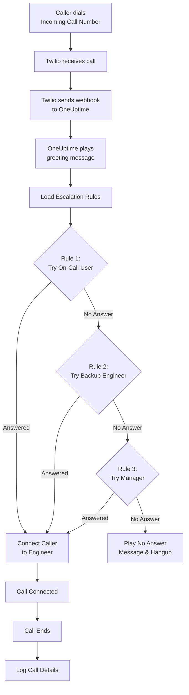
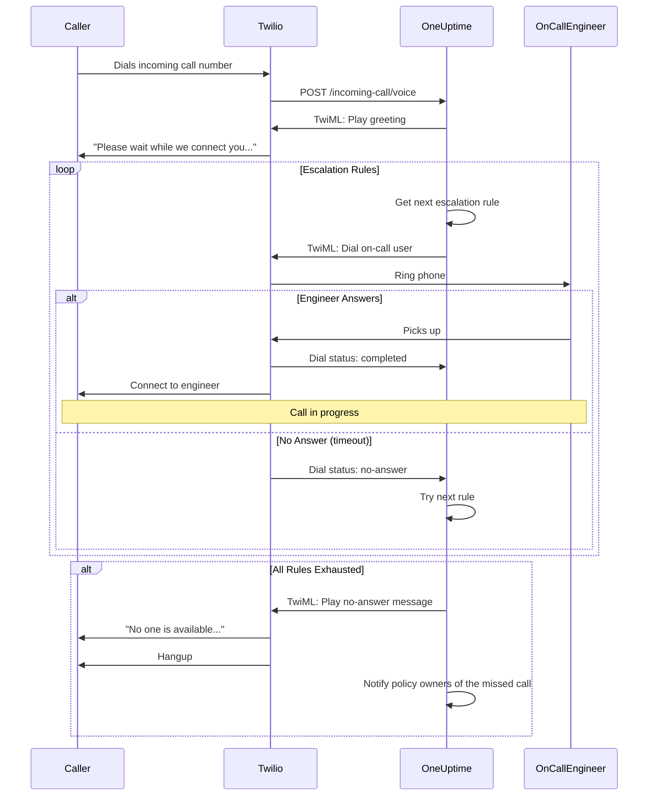
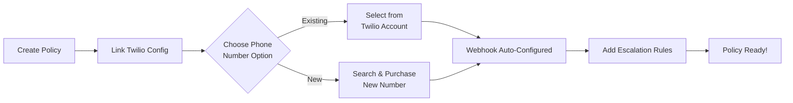
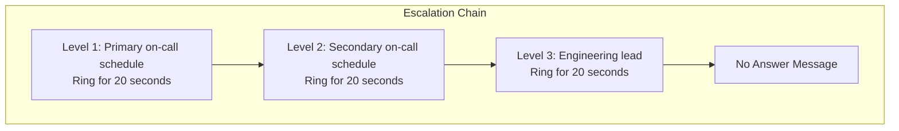
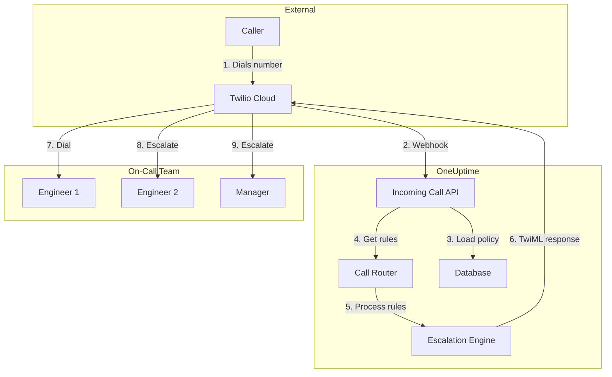

# Incoming Call Policy (Twilio Integration)

Incoming Call Policies allow external callers to reach your on-call engineers by dialing a dedicated phone number. When someone calls, OneUptime routes the call through your configured escalation rules until an engineer answers.

## How It Works

## Call Routing Flow

## Prerequisites

- A Twilio account - Create one at [https://www.twilio.com](https://www.twilio.com)
- Your Twilio Account SID and Auth Token
- Access to your OneUptime self-hosted instance

## Overview

The Incoming Call Policy feature works by:

1. Receiving incoming calls on a Twilio phone number
2. Playing a customizable greeting message
3. Routing the call through escalation rules (on-call schedules or people)
4. Connecting the caller to the first available on-call engineer
5. Escalating to the next rule if no one answers

Since you're self-hosting OneUptime, you'll need to configure your own Twilio account. This gives you full control over your phone numbers and billing.

## Step 1: Create a Twilio Account

1. Go to [https://www.twilio.com](https://www.twilio.com) and sign up for an account
2. Complete the verification process
3. Note down your **Account SID** and **Auth Token** from the Twilio Console dashboard

## Step 2: Configure Call/SMS Config in OneUptime

1. Log in to your OneUptime Dashboard
2. Go to **Project Settings** > **Notifications** > **Notification Settings**
3. In **Twilio Config**, click **Create Twilio Config**
4. Fill in the following fields:
   - **Name**: A friendly name (e.g., "Production Twilio Config")
   - **Description**: Optional description
   - **Twilio Account SID**: Your Twilio Account SID (starts with `AC`)
   - **Twilio Auth Token**: Your Twilio Auth Token
   - **Twilio Primary Phone Number**: A phone number from your Twilio account for outbound calls
   - **Set as Project Default**: on for the project's first Twilio config, so the SMS and calls to the project's members go through this account too. Turn it off if this account is only for incoming calls.
5. Click **Save**

## Step 3: Create an Incoming Call Policy

1. Go to **On-Call Duty** > **Incoming Call Policies**
2. Click **Create Incoming Call Policy**
3. Fill in the following fields:
   - **Name**: A friendly name (e.g., "Support Hotline")
   - **Description**: Optional description
4. Click **Save**

## Step 4: Link Twilio Configuration to Policy

1. Open your newly created Incoming Call Policy
2. In the **Phone Number Routing** card, find **Step 2: Link Twilio Configuration**
3. Click **Select Twilio Config** and choose the configuration you created in Step 2
4. Save the selection

## Step 5: Configure a Phone Number

You have two options for setting up a phone number:

### Option A: Use an Existing Twilio Phone Number

If you already have phone numbers in your Twilio account:

1. In the **Phone Number** card, click **Use Existing Number**
2. OneUptime will fetch all phone numbers from your Twilio account
3. Select the phone number you want to use
4. Click **Use This** to assign it to the policy

> **Note**: If the phone number already has a webhook configured, it will be updated to point to OneUptime.

### Option B: Purchase a New Phone Number

To buy a new phone number directly from OneUptime:

1. In the **Phone Number** card, click **Buy New Number**
2. Select a **Country** from the dropdown
3. Optionally enter an **Area Code** (e.g., 415 for San Francisco)
4. Optionally enter digits the number should **Contain** (e.g., 555)
5. Click **Search** to find available numbers
6. Select a phone number from the results
7. Click **Purchase** to buy the number

The phone number will be purchased from your Twilio account and the webhook will be **automatically configured** - no manual setup required!

## Step 6: Configure Escalation Rules

Escalation rules decide who is rung when someone calls the policy's number, from the top of the list down:

1. Open your Incoming Call Policy
2. Go to the **Escalation Rules** tab
3. Click **Add Escalation Rule**
4. Fill in the rule. It is one step:
   - **Who to call**: an on-call schedule or one person. A schedule rings whoever is on call in it when the call comes in. People are the members of your project.
   - **Ring for (in seconds)**: how long their phone rings before the call moves on to the next rule. It starts at 20 seconds, and Twilio takes 5 to 600.
   - **Name** and **Description** are optional, under **More fields**. A rule without a name is listed after its place in the list: **Level 1**, **Level 2**.
5. Save it, and add a rule for each schedule or person to try next

Rules are called from the top of the list down, and a new rule is added to the end. To change the order, drag a rule by the handle at its top left; from the keyboard, focus the handle, press Space, move it with the arrow keys and press Space again.

> **Mind voicemail**: keep **Ring for** shorter than the time the person's phone takes to send an unanswered call to voicemail. If their voicemail answers first, the caller is connected to it and the call does not move on to the next rule. Twilio adds a few seconds of its own to every ring. A new rule starts at 20 seconds for this reason. Rules added when the default was 30 seconds keep their 30: if their calls end in voicemail, lower **Ring for** on those rules.

### Escalation Rule Example

| Level   | Who to call                 | Ring for   |
| ------- | --------------------------- | ---------- |
| Level 1 | Primary on-call schedule    | 20 seconds |
| Level 2 | Secondary on-call schedule  | 20 seconds |
| Level 3 | Engineering lead (a person) | 20 seconds |

## Step 7: Configure Voice Messages (Optional)

Customize the messages callers hear:

1. Open your Incoming Call Policy
2. Go to **Settings**
3. Configure:
   - **Greeting Message**: Played when the call is answered
   - **No Answer Message**: Played when all escalation rules fail
   - **No One Available Message**: Played when no one is on-call

## Configuration Options

### Policy Settings

| Setting                         | Description                              | Default                                                        |
| ------------------------------- | ---------------------------------------- | -------------------------------------------------------------- |
| Greeting Message                | TTS message played when call is answered | "Please wait while we connect you to the on-call engineer."    |
| No Answer Message               | Message when all escalation rules fail   | "No one is available. Please try again later."                 |
| No One Available Message        | Message when no one is on-call           | "We're sorry, but no on-call engineer is currently available." |
| Repeat Policy If No One Answers | Restart from first rule if all fail      | Disabled                                                       |
| Repeat Policy Times             | Maximum repeat attempts                  | 1                                                              |

### Escalation Rule Settings

| Setting               | Description                                                                                                                                                 |
| --------------------- | ----------------------------------------------------------------------------------------------------------------------------------------------------------- |
| Who to call           | An on-call schedule, which rings whoever is on call in it, or one person. Each rule calls one of them                                                       |
| Ring for (in seconds) | How long the phone rings before the call moves on to the next rule (default: 20; from 5 to 600)                                                             |
| Name and Description  | Optional, under More fields. A rule without a name is listed as Level 1, Level 2 and so on, after its place in the list                                     |
| Order                 | Where the rule sits in the list: rules are called from the top down. Set by dragging the rules; through the API, a new rule without one goes to the end |

Through the API, a rule sets `onCallDutyPolicyScheduleId` or `userId` (one of them, never both) and `escalateAfterSeconds`: the ring time, 20 when left out.

## Viewing Call Logs

To view incoming call history:

1. Go to **On-Call Duty** > **Incoming Call Policies**
2. Click on your policy
3. Go to the **Call Logs** tab

The logs show:

- Caller phone number
- Call status (Completed, No Answer, Caller Hung Up, Failed, etc.)
- Who answered the call
- Call duration
- Timestamp

Click **View Timeline** on a call to see every person who was rung and how each attempt ended.

## Missed Calls

A call is missed when it ends without reaching anyone:

| Call status    | What happened                                                                                                                                                                      |
| -------------- | ---------------------------------------------------------------------------------------------------------------------------------------------------------------------------------- |
| No Answer      | Every escalation rule was tried and nobody answered. The caller heard your **No Answer Message**.                                                                                  |
| Caller Hung Up | The caller hung up while an engineer's phone was ringing.                                                                                                                          |
| Failed         | Nobody could be rung: no escalation rule had an on-call user with a verified incoming call number (the caller heard your **No One Available Message**), or the policy is disabled. |

### Who Is Notified

When a call is missed, OneUptime notifies the policy's owners: the users and the members of the teams added on the policy's **Owners** page. If the policy has no owners, the project owners are notified instead.

The notification says who called, which number they dialled, why nobody answered, and who was rung and how each attempt ended. It links to the call in the call log.

Owners are emailed by default. Each person can choose other channels (SMS, call, push and more) or switch it off in **User Settings** > **Notification Settings**, under **On-Call** > **Incoming Call Policies** > **Missed call**.

### React to Missed Calls in a Workflow

Incoming call logs are available as workflow triggers:

- **On Create Incoming Call Log** runs when a call comes in.
- **On Update Incoming Call Log** runs as the call progresses. The update that sets **Ended At** is the end of the call.

To act on missed calls only, for example to post them to Slack or Microsoft Teams or to open a ticket:

1. Add the **On Update Incoming Call Log** trigger. Set **Listen on** to **Ended At**, and select the fields you want to use, such as **Status**, **Caller Phone Number** and **Routing Phone Number**.
2. Add an **If / Else** step. Check the trigger's **Status**, with the comparison **is not equal to** and `Completed`.
3. Connect your steps to the **Yes** port.

A workflow can read call logs with **Find One** and **Find Many**, but it cannot create or change them.

## User Phone Number Configuration

For users to receive incoming calls, they must have a verified phone number:

1. Users go to **User Settings** > **Notification Methods**
2. Add a phone number under **Incoming Call Numbers**
3. Verify the phone number via SMS code

Only users with verified phone numbers can be called through escalation rules.

## Releasing a Phone Number

If you no longer need a phone number:

1. Open your Incoming Call Policy
2. In the **Phone Number** card, click **Release Number**
3. Confirm the release

> **Warning**: Released numbers are returned to Twilio and may not be available for re-purchase.

## Troubleshooting

### Calls not being received

- Verify the Twilio configuration is correctly linked to the policy
- Check that your OneUptime instance is accessible from the internet
- Verify the Twilio Account SID and Auth Token are correct
- Check the Twilio Console for error logs

### Calls not connecting to engineers

- Verify users have verified phone numbers in their notification settings
- Check that escalation rules are properly configured
- Ensure on-call schedules have users assigned for the current time
- Verify the policy is enabled
- If calls end up in an engineer's voicemail, set the rule's **Ring for** below the time their phone takes to go to voicemail

### Audio quality issues

- Ensure your server has stable internet connectivity
- Check Twilio's status page for any ongoing issues
- Verify phone numbers are in the correct format (E.164 format: +15551234567)

## Security Considerations

- Keep your Twilio Auth Token secure and never expose it publicly
- Use HTTPS for your OneUptime instance
- OneUptime validates webhook signatures to ensure requests come from Twilio
- Consider restricting which phone numbers can call your incoming call policies

## Architecture Overview

## Support

For issues with the Incoming Call Policy feature, please:

1. Check the Twilio Console for error logs
2. Review the OneUptime server logs
3. Contact support at [hello@oneuptime.com](mailto:hello@oneuptime.com)
