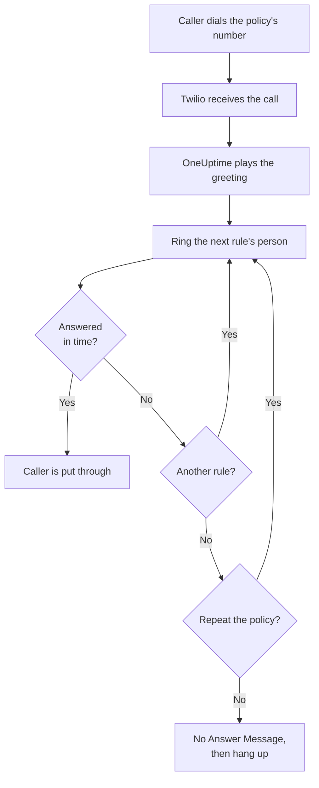
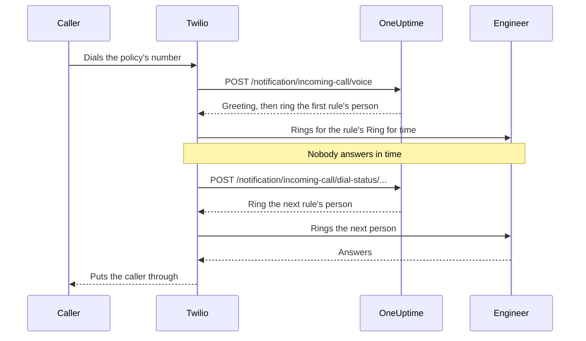

# Incoming Call Policy

An incoming call policy gives your team a phone number that reaches whoever is on call. When someone dials it, OneUptime rings the people in the policy's escalation rules, one after another, until somebody answers, and puts the caller through. The numbers and the calls run on your own Twilio account.

:::cards
- [Set up a policy](#set-up-a-policy): From your Twilio account to a test call, in seven steps.
- [How a call is routed](#how-a-call-is-routed): Who is rung, for how long, and what the caller hears.
- [Missed calls](#missed-calls): Who is told, and how to act on them in a workflow.
- [Troubleshooting](#troubleshooting): Calls that never arrive, or never reach an engineer.
:::

## Before you begin

| You need | Why |
| --- | --- |
| A Twilio account, with its Account SID and Auth Token | The policy's numbers and calls run on it, and Twilio bills them to it. |
| The **Growth** plan, on OneUptime Cloud | A project needs it for its own Twilio configuration. |
| A OneUptime server that Twilio can reach, if you host it yourself | Twilio sends every call to `https://<your host>/notification/incoming-call/voice`. |
| **SMS** on in the project | Each engineer's number is verified with a code sent by SMS. |
| A verified number for each engineer | A rule rings only people who added and verified a number for incoming calls in the project. |

## Set up a policy

:::steps
### Add your Twilio account

Go to **Project Settings** > **Notifications** > **Notification Settings**. In the **Twilio Config** card, click **Create Twilio Config** and fill in the form:

- **Name** and **Description**: what the account is for, such as "Support hotline".
- **Twilio Account SID**: from the Twilio Console. It starts with `AC`.
- **Twilio Auth Token**: from the Twilio Console.
- **Twilio Primary Phone Number**: a number of that account, for the SMS and calls it sends.
- **Twilio Secondary Phone Numbers**: optional. Numbers that send instead of the primary one to recipients in their country.
- **Set as Project Default**: on for the project's first Twilio config, so the SMS and calls to the project's members go through this account too. Turn it off if this account is only for incoming calls.

### Create the policy

Go to **On-Call Duty** > **Incoming Call Policies** and click **Create Incoming Call Policy**. Give it a **Name**, such as "Support Hotline", and optionally a **Description** and **Labels**. Then open it from the list.

### Choose the Twilio account

The policy's **Overview** shows a **Setup** card with three numbered steps. In the first one, click **Select**, pick the account under **Twilio Configuration** and click **Save**.

### Add a phone number

In the second step, click **Add Phone Number**. Choose **Use Existing Phone Number** to bring a number your Twilio account already has, or **Reserve New Phone Number** to get a new one. OneUptime points the number at itself, so there is nothing to set up in Twilio. See [Phone numbers](#phone-numbers).

### Add escalation rules

In the third step, click **Manage Rules**. Add a rule for each on-call schedule or person to ring, in the order to ring them. See [Escalation rules](#escalation-rules).

### Verify each engineer's number

Everyone a rule may ring adds and verifies their own number for incoming calls. See [Engineers' phone numbers](#engineers-phone-numbers).

### Call the number

When all three steps are done, the card becomes **Phone Numbers & Twilio Configuration**. Call the number from any phone, then open the policy's **Call Logs** to see who was rung.
:::

## How a call is routed

1. Twilio sends the call to OneUptime, which reads out the policy's **Greeting Message**.
2. OneUptime rings the person the first escalation rule names: that person, or whoever is on call in the rule's on-call schedule at that moment, user overrides included. Their phone shows the policy's number as the caller.
3. If they answer within the rule's **Ring for** time, the caller is put through, and the call log records who answered.
4. If not, the caller hears "Connecting you to the next available engineer.", and the next rule's person is rung.
5. After the last rule, the policy starts again from the first rule if **Repeat Policy If No One Answers** is on, as many times as **Repeat Policy Times** says. Otherwise the caller hears the **No Answer Message**, and the call ends.

A rule is skipped, without ringing anyone, when nobody can be rung for it right now: its schedule has nobody on call, the person has no verified number for incoming calls in this project, or they are no longer a member of the project. When no rule has anyone to ring, the caller hears the **No One Available Message**. A disabled policy answers every call with "Sorry, this service is currently disabled." and hangs up.

OneUptime checks Twilio's signature on every request with the Twilio config's Auth Token, and refuses a request it cannot verify.

> [!TIP]
> Save the policy's number as a contact on your phone, such as "Support hotline", so that you recognize a routed call when it rings.

## Escalation rules

Escalation rules decide who is rung when someone calls the policy's number, from the top of the list down. Open the policy, choose **Escalation Rules** in its side menu and click **Add Escalation Rule**. A rule is one short step:

- **Who to call**: an on-call schedule or one person. A schedule rings whoever is on call in it when the call comes in. People are the members of your project.
- **Ring for (in seconds)**: how long their phone rings before the call moves on to the next rule. It starts at 20 seconds, and Twilio takes 5 to 600.
- **Name** and **Description** are optional, under **More fields**. A rule without a name is listed after its place in the list: **Level 1**, **Level 2**.

Rules are called from the top of the list down, and a new rule is added to the end. To change the order, drag a rule by the handle at its top left. From the keyboard, focus the handle, press Space, move it with the arrow keys and press Space again.

> [!WARNING]
> **Mind voicemail**: keep **Ring for** shorter than the time the person's phone takes to send an unanswered call to voicemail. If their voicemail answers first, the caller is connected to it and the call does not move on to the next rule. Twilio adds a few seconds of its own to every ring. A new rule starts at 20 seconds for this reason. Rules added when the default was 30 seconds keep their 30: if their calls end in voicemail, lower **Ring for** on those rules.

For example, three rules that try two rotations and then a lead:

| Level | Who to call | Ring for |
| --- | --- | --- |
| Level 1 | Primary on-call schedule | 20 seconds |
| Level 2 | Secondary on-call schedule | 20 seconds |
| Level 3 | Engineering lead (a person) | 20 seconds |

## Phone numbers

A policy can have several numbers, and every one of them rings the same rules. Each number belongs to one policy. Add them with **Add Phone Number** on the policy's **Overview**:

:::tabs
@tab Use a number you have
1. Click **Add Phone Number**, then **Use Existing Phone Number**. OneUptime lists the numbers of the policy's Twilio account.
2. Click **Select** next to the number, then **Assign Number**.

A number that already sends its calls somewhere says "Currently has a webhook configured". Assigning it sends its calls to OneUptime instead.
@tab Reserve a new number
1. Click **Add Phone Number**, then **Reserve New Phone Number** and **Search for Numbers**.
2. Pick a **Country**. Optionally fill in **Area Code (Optional)**, such as 415, or **Contains (Optional)** with digits the number should contain. Click **Search**: up to 10 local numbers are listed.
3. Click **Reserve** next to a number, and confirm with **Reserve**. Twilio charges the number to your Twilio account.
:::

OneUptime sets the number's voice webhook to `https://<your host>/notification/incoming-call/voice`, built from `HOST` and `HTTP_PROTOCOL` on a self-hosted install. To move a policy to another Twilio account, release its numbers first: the account can change only while the policy has none.

To release a number, click **Release** next to it and confirm with **Release Number**.

> [!CAUTION]
> Releasing a number gives it back to Twilio, even a number you brought with **Use Existing Phone Number**, and you may not get it again. Deleting a policy, or the Twilio configuration it uses, releases its numbers too.

## Engineers' phone numbers

A rule rings a person on the number they verified for incoming calls in this project, and skips anyone who has none. Each person adds their own:

:::steps
1. Open **User Settings** > **Incoming Call Policy** > **Incoming Phone Numbers**. **Incoming Call Policy** is a section of the side menu that starts folded.
2. In the **Phone Numbers for Incoming Call Routing** card, click **Add Phone Number for Incoming Call Routing** and enter the number with its country code, such as `+15551234567`.
3. Enter the 6-digit code OneUptime sends to it by SMS under **Verification Code**, and click **Verify**. **Send a new code** sends another one.
:::

Each person can have one verified number per project. To change it, delete the old number first. These numbers are separate from the phone numbers under **Notification Methods**, which on-call pages use.

Incoming call numbers are verified by SMS, so **SMS** has to be on for the project first. A project owner, a **Billing Admin** or someone with **Manage Billing** turns it on in the **Notification Channels** card on **Project Settings > Notifications > Notification Settings**.

## Voice messages and policy settings

Open the policy and choose **Settings** under **Advanced** in its side menu. **Edit Messages** on the **Voice Messages** card changes what callers hear; **Edit Policy Settings** on the **Policy Settings** card changes the rest.

| Setting | What it does | For a new policy |
| --- | --- | --- |
| **Greeting Message** | Read out when the call is answered, before the first person is rung. | "Please wait while we connect you to the on-call engineer." |
| **No Answer Message** | Read out when every rule was tried and nobody answered. | "No one is available. Please try again later." |
| **No One Available Message** | Read out when no rule has anyone to ring. | "We are sorry, but no on-call engineer is currently available. Please try again later or contact support." |
| **Enabled** | A disabled policy turns every call away. | On |
| **Repeat Policy If No One Answers** | After the last rule, start again from the first. | Off |
| **Repeat Policy Times** | How many times to start again. | 1 |

Twilio reads the messages out with a text-to-speech voice, so write them as you want them to sound.

## Call logs

Every call is listed on the policy's **Call Logs** page, under **Logs** in its side menu: the **Caller**, the **Number Called**, its **Status**, who answered it (**Answered By**), the **Duration**, and when it **Started At**. Click **View Timeline** on a call to see its **Call Timeline**: every person who was rung, on which number, and how each attempt ended.

| Status | What happened |
| --- | --- |
| **Initiated**, **Escalated** | The call is still going: it came in and a phone is ringing, or it moved on to a later rule. |
| **Completed** | Somebody answered, and the caller was put through. |
| **No Answer** | Every escalation rule was tried and nobody answered. The caller heard your **No Answer Message**. |
| **Caller Hung Up** | The caller hung up while an engineer's phone was ringing. |
| **Failed** | Nobody could be rung: no escalation rule had an on-call user with a verified incoming call number (the caller heard your **No One Available Message**), or the policy is disabled. |

## Missed calls

A call is missed when it ends without reaching anyone: its status is **No Answer**, **Caller Hung Up** or **Failed**.

### Who is notified

When a call is missed, OneUptime notifies the policy's owners: the users and the members of the teams added on the policy's **Owners** page. If the policy has no owners, the project owners are notified instead.

The notification says who called, which number they dialled, why nobody answered, and who was rung and how each attempt ended. It links to the call in the call log.

Owners are emailed by default. Each person can choose other channels (SMS, call, push and more) or switch it off in **User Settings** > **Notification Settings**, under **On-Call** > **Incoming Call Policies** > **Missed call**.

### React to missed calls in a workflow

Incoming call logs are available as workflow triggers:

- **On Create Incoming Call Log** runs when a call comes in.
- **On Update Incoming Call Log** runs as the call progresses. The update that sets **Ended At** is the end of the call.

To act on missed calls only, for example to post them to Slack or Microsoft Teams or to open a ticket:

:::steps
1. Add the **On Update Incoming Call Log** trigger. Set **Listen on** to **Ended At**, and select the fields you want to use, such as **Status**, **Caller Phone Number** and **Routing Phone Number**.
2. Add an **If / Else** step. Check the trigger's **Status**, with the comparison **is not equal to** and `Completed`.
3. Connect your steps to the **Yes** port.
:::

A workflow can read call logs with **Find One** and **Find Many**, but it cannot create or change them.

## Who can add and release phone numbers

A policy's phone numbers follow the same roles as the policy itself:

- **Looking numbers up** - searching Twilio for a number to reserve, or listing the numbers your Twilio account already has - needs permission to read incoming call policies and to read call and SMS configs, because it reads your Twilio account through one. **Project Owner**, **Project Admin**, **Project Member**, **Viewer**, **Settings Admin**, **Settings Member** and **Settings Viewer** have both. In a custom role, that is **Read Incoming Call Policy** and **Read Call and SMS**.
- **Reserving a number, using an existing one, and releasing one** need permission to edit incoming call policies: **Project Owner**, **Project Admin**, **Project Member**, **Settings Admin** and **Settings Member**, or **Edit Incoming Call Policy** in a custom role. They change the numbers of a policy you may edit: with a role limited to some labels, the policies carrying those labels.

A team's block with no labels on one of these permissions takes it away. For anyone else, **Add Phone Number** and **Release** stay on the page, locked, and their tooltip says what they take. The API refuses their request with a sentence saying what it takes: "Looking up phone numbers needs permission to read incoming call policies and call and SMS settings." or "Adding or releasing a phone number needs permission to edit incoming call policies." Reserving a number charges your own Twilio account, not your OneUptime balance, so it needs no billing permission.

## Creating policies with the API or Terraform

| Resource | API route |
| --- | --- |
| Incoming call policies | `/api/incoming-call-policy` |
| Their escalation rules | `/api/incoming-call-policy-escalation-rule` |
| Their phone numbers, read only | `/api/incoming-call-policy-phone-number` |
| Call logs, read only | `/api/incoming-call-log` |

A rule created through the API without `escalateAfterSeconds` rings for 20 seconds, and so does one Terraform creates without `escalate_after_seconds`.

### Escalation rule settings

| Setting | API field | What it holds |
| --- | --- | --- |
| Who to call | `onCallDutyPolicyScheduleId` or `userId` | One of them, never both: the schedule whose on-call person is rung, or the person. |
| Ring for (in seconds) | `escalateAfterSeconds` | How long the phone rings before the call moves on (default: 20; from 5 to 600). |
| Name and Description | `name`, `description` | Optional. A rule without a name is listed as Level 1, Level 2 and so on, after its place in the list. |
| Order | `order` | Where the rule sits in the list: rules are called from the top down. A new rule without one goes to the end. |

## Troubleshooting

:::details Calls do not reach OneUptime
- In the Twilio Console, open the number: **A call comes in** must be the webhook `https://<your host>/notification/incoming-call/voice`, with HTTP POST. OneUptime sets it when the number is added, from `HOST` and `HTTP_PROTOCOL`. If they have changed since, correct the webhook in Twilio.
- A self-hosted OneUptime must be reachable from the internet over https. The number's call log in the Twilio Console, and Twilio's **Debugger**, show what OneUptime answered.
- An answer of `403` means the request's signature did not check out. Make sure the Twilio config holds the account's current **Twilio Auth Token**, and that a proxy in front of OneUptime passes on the host and the scheme Twilio called (`X-Forwarded-Host` and `X-Forwarded-Proto`).
:::

:::details The call is answered, but nobody is rung
The call log says **Failed**. Check that the policy is **Enabled**, that each rule's on-call schedule has somebody on call right now, and that the people the rules ring have a verified number under **User Settings** > **Incoming Call Policy** > **Incoming Phone Numbers**, in this project. Rules ring members of the project only.
:::

:::details Calls end up in voicemail
If calls end up in an engineer's voicemail, set the rule's **Ring for** below the time their phone takes to go to voicemail. A voicemail that answers counts as an answer, and the call stops there.
:::

:::details A new number cannot be reserved
Twilio needs an approved regulatory bundle before it sells local numbers in many countries, and some numbers need a positive Twilio balance. Set that up in the Twilio Console, or get the number there and add it with **Use Existing Phone Number**.
:::

:::details The policy's Twilio account cannot be changed
The account can change only while the policy has no phone numbers: the page says "Remove all phone numbers to change". Releasing the numbers gives them back to Twilio, so plan the move first.
:::

:::details The code for an engineer's number does not arrive
SMS must be on for the project. On OneUptime Cloud, a project without its own default Twilio config pays for the SMS from its balance, which must be above 1 USD. Codes can take a minute to arrive; click **Send a new code** to send another, and **Project Settings** > **Notifications** > **Notification Logs** shows what happened to it.
:::

## Next steps

:::cards
- [Escalation Rules](/docs/on-call/escalation-rules): How an on-call policy pages people, level by level.
- [On-Call Schedules](/docs/on-call/schedules): Build the rotations your rules ring.
- [Workflows](/docs/workflows/index): Act on missed calls: post them to a channel or open a ticket.
- [Twilio SMS and Voice Integration](/docs/self-hosted/twilio-integration): Set up Twilio for a self-hosted installation.
:::
