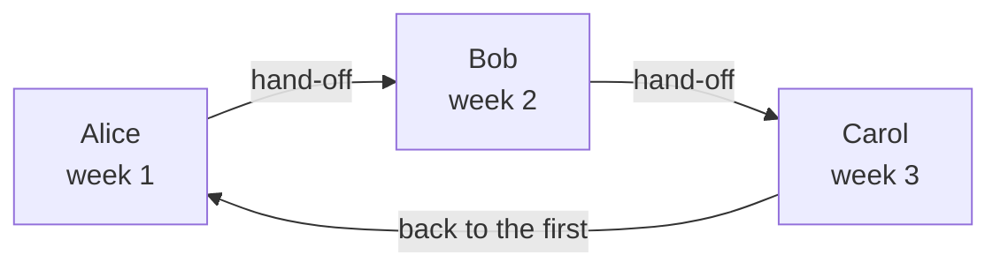

# On-Call Schedules

An on-call schedule decides who is on call at any moment. People take turns in it: each is on call for a while, then the next one takes over. Add a schedule to an on-call policy's escalation rules, and the policy pages whoever is on call in it when that level runs.

> [!NOTE]
> On OneUptime Cloud, on-call schedules are on the **Growth** plan and above. A schedule a project still has keeps paging the people on it, through the escalation rules that name it, after a Growth trial ends or the plan goes down. So below **Growth**, the **On-Call Schedules** page shows the plan note with the schedules still set up under it, where you can delete them. Creating or changing a schedule needs **Growth**.

:::cards
- [Who takes turns](#who-takes-turns): Create a schedule with its first rotation.
- [Layers](#layers): Stack rotations, limit on-call hours and add fall-back cover.
- [API and Terraform](#creating-schedules-with-the-api-or-terraform): Create schedules and their rotations as code.
:::

## Who takes turns

When you create a schedule on the **On-Call Schedules** page, the form asks for its **Name** and **Who takes turns?**. The people you pick become the schedule's first layer, **Layer 1**, on call around the clock.

:::steps
1. Go to **On-Call Duty** > **On-Call Schedules** and click **Create On-Call Schedule**.
2. Enter a **Name**.
3. Under **Who takes turns?**, click **Add user** and pick the people, in the order they take turns.
4. Optionally, open **More fields** to change how long each turn lasts, the time zone, the description or the labels.
5. Click **Create On-Call Schedule**. The new schedule then opens on its **Layers** page, where you can change the rotation or add more layers.
:::

The people take turns one at a time, and the first one is on call as soon as the schedule is created:



**Who takes turns?** is optional. Leave it empty and the schedule starts without layers: it puts nobody on call until you add a layer on its **Layers** page. The question is asked only of people who may add layers.

Everything else waits under **More fields**, folded until you open it:

| Field | What it does |
| --- | --- |
| **Each turn lasts** | **1 day**, **1 week**, **2 weeks** or **1 month**, and **1 week** unless you change it. It is asked once somebody takes turns. Each person is on call that long, then the next one takes over, at the time of day the schedule was created. |
| **Timezone** | The time zone hand-off times and on-call hours are kept in. It starts at yours. |
| **Description** | Notes about the schedule. |
| **Labels** | Labels for finding and grouping the schedule. |

While somebody takes turns and nothing under **More fields** is changed, its folded header says what will happen: each person is on call for a week, then the next one takes over.

## Layers

A schedule's rotation is made of layers, on its **Layers** page. Layers are read from the top down: the highest layer with someone on call is the one that pages, so put the main rotation on top and fall-back cover below it.

```mermaid title="The highest layer with someone on call is the one that pages"
flowchart TB
    start["A level pages the schedule"] --> first{"Someone on call<br/>in the top layer?"}
    first -->|Yes| pageTop["Page that person"]
    first -->|No| next{"Someone on call<br/>in the next layer?"}
    next -->|Yes| pageNext["Page that person"]
    next -->|No| gap["Nobody is paged<br/>a coverage gap"]
```

**Add Layer** adds a layer that starts the way the first one does: on call from now, each person for a week, around the clock. Expand a layer to add people to it, and to change when it starts, how often it hands off, when it first hands off and the hours it is on call:

| Field | What it sets |
| --- | --- |
| **Layer name** | What the layer covers, such as "Weekday primary". |
| **Rotation starts at** | The date and time the layer's rotation begins. |
| **Rotate every** | How often on-call duty passes to the next person in the layer. |
| **First hand-off time** | The first hand-off to the next person, at or after the start. Later hand-offs follow every rotation interval. |
| **Restrictions** | The hours the layer is on call: **No Restrictions**, **Specific Times of the Day** or **Specific Times of the Week**, in the schedule's time zone. Outside them, lower layers take over. |

To change which layer comes first, use **Move layer up (higher priority)** or **Move layer down (lower priority)** in a layer's menu.

Each person keeps one colour everywhere, so you can follow them at a glance: on every layer, in the final schedule and its overrides, and on the **Schedule Timeline**.

## Creating schedules with the API or Terraform

On-call schedules are the `/api/on-call-duty-policy-schedule` resource; their layers and the people in them are the `/api/on-call-duty-schedule-layer` and `/api/on-call-duty-schedule-layer-user` resources.

- Creating a schedule with `firstLayerUsers` (a list of user ids, in the order they take turns) in its `miscDataProps` gives it its first layer, as the dashboard does: **Layer 1**, on call from now, around the clock. `firstLayerRotation` says how long each turn lasts, as a rotation such as `{"_type": "Recurring", "value": {"intervalType": "Week", "intervalCount": 1}}`; without it, a week. Every user must be a member of the project and the caller must be allowed to create layers, or the schedule is not created.
- A schedule created without them has no layers, as before; Terraform's schedule resource does not send them.
- A layer created without a `rotation` hands off daily, as it always has.

```bash
curl -X POST https://oneuptime.com/api/on-call-duty-policy-schedule \
  -H "apikey: $ONEUPTIME_API_KEY" \
  -H "Content-Type: application/json" \
  -d '{
    "data": {
      "projectId": "<project-id>",
      "name": "Primary on-call",
      "timezone": "Europe/Berlin"
    },
    "miscDataProps": {
      "firstLayerUsers": ["<user-id-1>", "<user-id-2>", "<user-id-3>"],
      "firstLayerRotation": {"_type": "Recurring", "value": {"intervalType": "Week", "intervalCount": 1}}
    }
  }'
```

## Next steps

:::cards
- [Escalation Rules](/docs/on-call/escalation-rules): Page this schedule from a level of an on-call policy.
- [Schedule Timeline](/docs/on-call/schedule-timeline): See every schedule side by side, with coverage gaps.
- [Calendar Feeds](/docs/on-call/calendar-feeds): Put shifts in Google Calendar, Outlook or Apple Calendar.
:::
